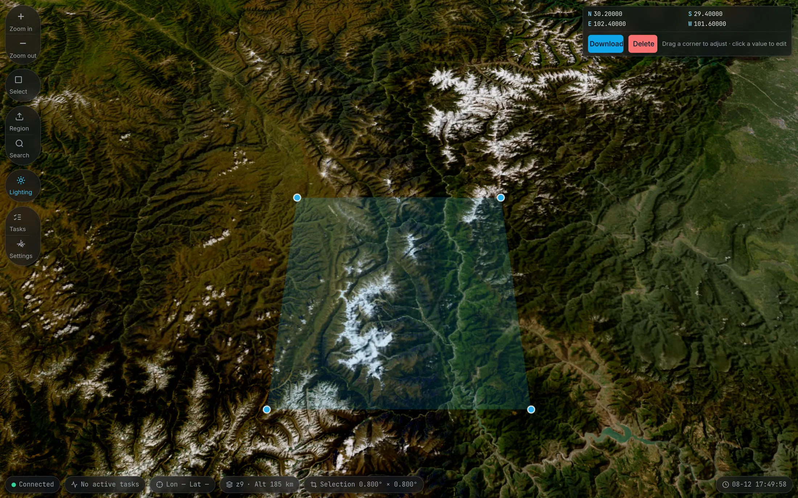
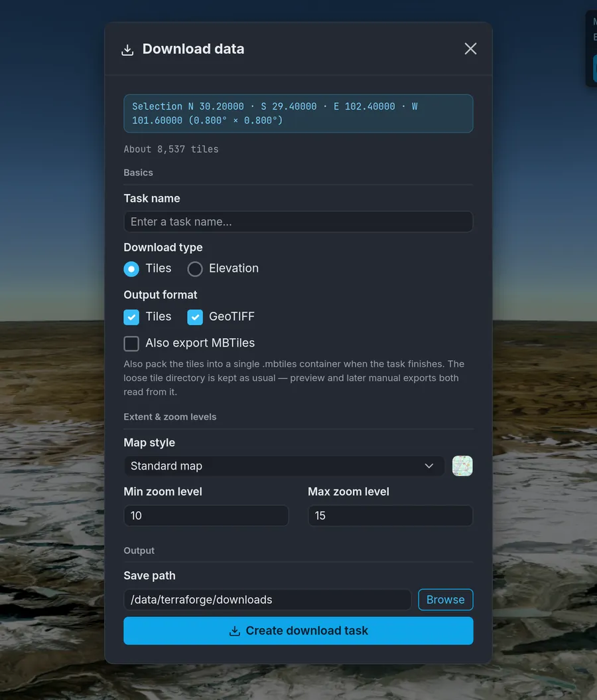
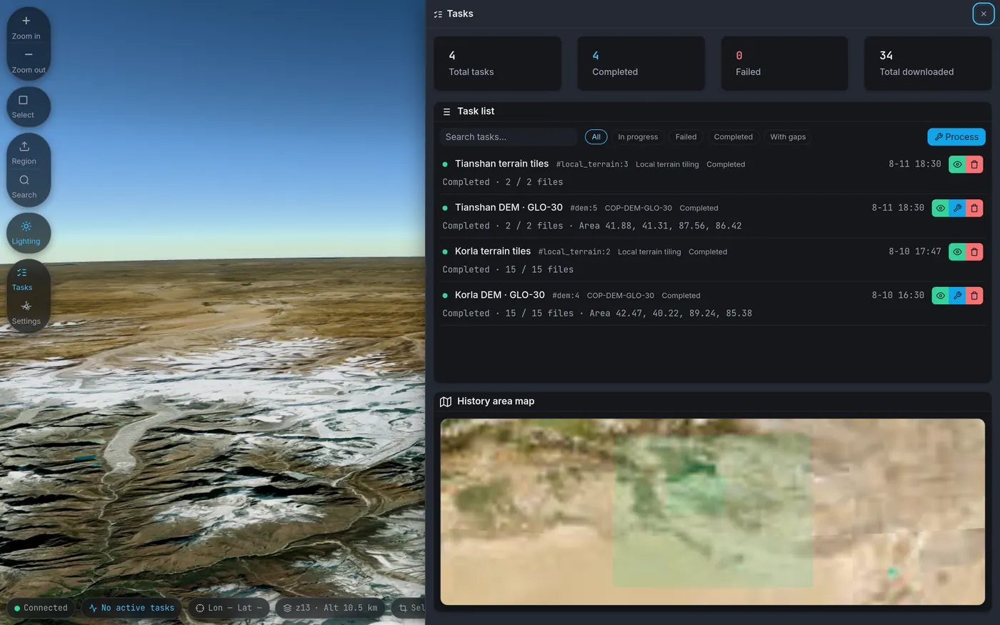
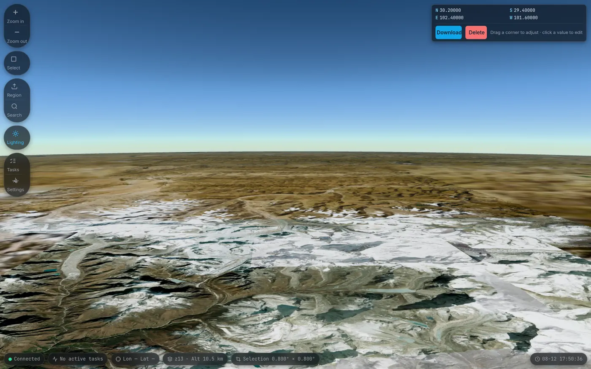
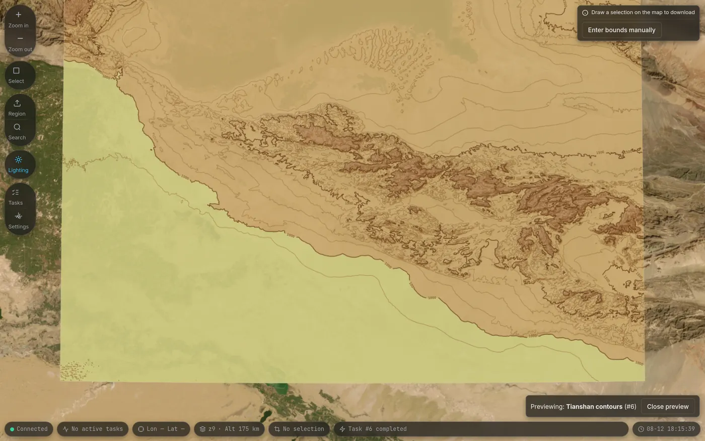
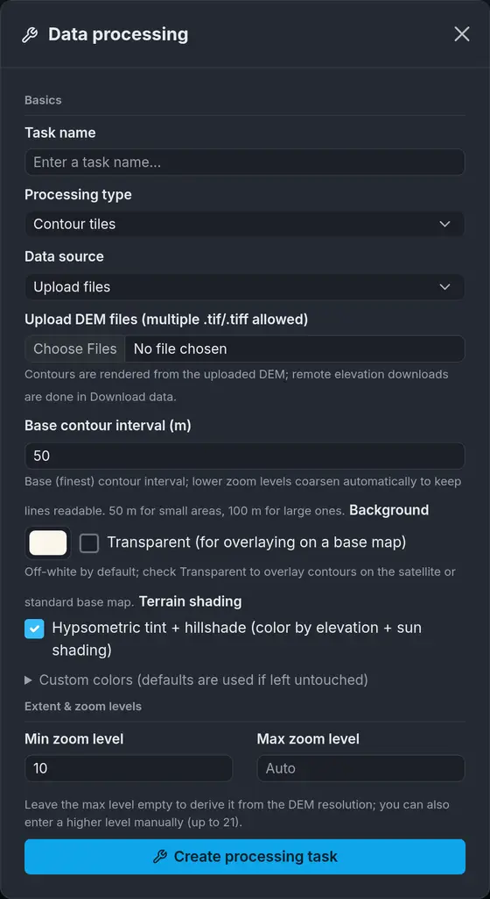
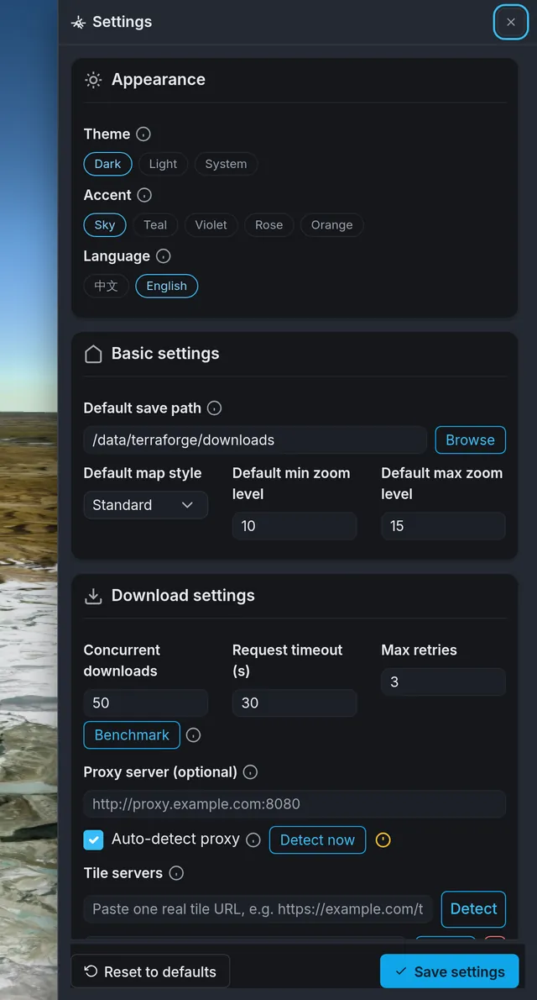
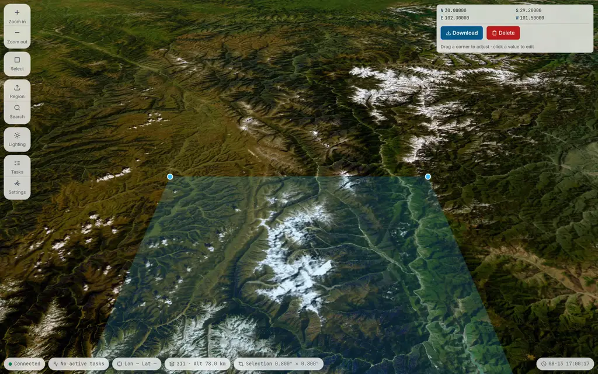

# TerraForge

[中文](README.md) · **English**

[](https://terraforge-gis.pages.dev/en/)
[](https://github.com/JungleZy/TerraForge/releases)
[](https://github.com/JungleZy/TerraForge/actions/workflows/test-build.yml)
[](https://www.python.org/)
[](#-license)

A web-based GIS data acquisition and processing system. Four kinds of geospatial work in a single interface: **Google Maps tile download**, **DEM elevation data acquisition**, **Cesium 3D terrain tiling** and **contour map generation**, with interactive selection on the map, live progress monitoring, visualized history and thorough configuration management.

🖥 Prebuilt executables are provided for Windows / macOS / Linux — unzip and run, with no Python environment to install.



<sub>📸 Every screenshot here is taken from the running v0.3.5 interface.</sub>

## Contents

- [✨ Features](#-features)
- [🖼 Screenshots](#-screenshots)
- [🧰 Tech stack](#-tech-stack)
- [🚀 Quick start](#-quick-start)
- [📖 User guide](#-user-guide)
- [🧱 Project structure](#-project-structure)
- [🔌 API endpoints](#-api-endpoints)
- [🛠 Development](#-development)
- [⚡ Performance design](#-performance-design)
- [📦 Building an executable](#-building-an-executable)
- [🩺 Troubleshooting](#-troubleshooting)
- [❗ Notes](#-notes)
- [📄 License](#-license)

## ✨ Features

### Four data pipelines

- 🗺 **Map tile download** — draw a box over an area interactively, download the tiles from Google Maps, and optionally mosaic them into a georeferenced GeoTIFF (GDAL) or package them into a single-file MBTiles
- ⛰ **DEM elevation download** — work out and download the 1°×1° elevation tiles an area needs, automatically: Copernicus GLO-30 by default (public S3 bucket, no authentication), with ASTER GDEM v3 (ASTGTM.003, requires an Earthdata account) as an option
- 🏔 **3D terrain tiling** — slice a downloaded DEM or a locally uploaded GeoTIFF into Cesium quantized-mesh terrain; a global low-zoom base terrain is built in (derived from GEBCO 2024, bathymetry included, hole-free worldwide) and CesiumJS cascades to it automatically
- 〰️ **Contour generation** — render contour XYZ tiles from an uploaded DEM: contour interval, colors, hypsometric tint and hillshading are all configurable, with style preview

### Selection and outputs

- 🖱 **Three ways to define an area** — drag a box on the map, type the bounds by hand, or import a region file (GeoJSON / KML / KMZ / a Shapefile .zip); polygons, multi-part geometries and **holes** are supported (the punched-out parts are not downloaded)
- 🌏 **Across the 180° meridian** — such an area is split into two parts automatically, instead of being rejected or computed as a trip around the globe
- 📐 **Counted before the task is created** — as soon as you draw a box you get the tile count and a disk usage estimate ("about X needed, Y available"); the estimate uses the tiles actually on your disk, not a fixed average
- 📦 **MBTiles export** — pack the whole tile pyramid into a single `.mbtiles`, either by ticking it when creating the task or by exporting afterwards. This is **one more artifact**; not a single tile of the original directory is removed

### Tasks and progress

- 📊 **Live WebSocket progress** — download speed, time remaining, and the per-zoom mosaic and copy stages are visible from beginning to end, so a big task no longer "hangs at 100%"
- ⏸️ **Task scheduling** — pause / resume, resumable download, and tiles already downloaded are never fetched twice
- 🚦 **Global resource budget** — the four pipelines share one concurrency budget: simultaneous task count, global network connection cap, CPU worker threads, GDAL concurrency slots. One task can no longer drag the others down
- 🗂 **Visualized download history** — past areas are overlaid on the map, and a completed task can preview its tiles / terrain / hillshade directly
- 💾 **Any save path on any disk** — an arbitrary absolute path plus a directory-browsing dialog; deleting a task lets you choose whether to clean up the on-disk outputs (with safety guardrails), and a running task can be deleted directly too

### When something goes wrong

- 🧾 **Missing tiles are not silent** — tile results are accounted for in five categories: success, no data at the source, retryable failure, permanent failure, cache write failure. Only "no data at the source" completes automatically; a real failure stops in a **pending-decision** state and waits for your call, and a result whose gaps you accepted is **permanently marked as having missing tiles**
- 🩹 **Refill re-runs only what needs re-running** — only the cells that are on record and fall into a retryable category; idempotent, so clicking it again downloads nothing twice
- 📝 **One log per task** — `logs/tasks/<pipeline>_<task-id>.log`, readable in the UI and exportable as a diagnostic text you can paste straight into an issue; **passwords and tokens are stripped before anything hits the disk**
- 🔍 **Scheduler snapshot** — `/api/scheduler/status` answers "why has the third task not started"

### Platform capabilities

- 🎨 Dark / light / follow-system theme
- 🌐 Bilingual interface, Chinese and English (the language lives in the `tf-lang` cookie and is server-rendered, so a refresh never flashes the other language)
- ⚙️ A thorough settings page: concurrency (with a measured-bandwidth recommendation), proxy (leave it blank and a usable proxy is auto-detected), cache management, GDAL parameters, Earthdata account and more
- 🧹 Cache management: view usage by category or by source namespace, clear it by hand, sweep orphan namespaces in one click; the cache is never silently deleted
- 🔒 It does not phone home: no telemetry, tracking points or usage statistics; all third-party front-end libraries are vendored locally and no CDN is touched at runtime
- 🏠 LAN access support, suitable for intranet deployment
- 📦 Packaged into a standalone executable by Nuitka, with zero dependencies on the target machine

## 🖼 Screenshots

<table>
  <tr>
    <td width="50%">
      
      <sub>The tile count is worked out before the task is created</sub>
    </td>
    <td width="50%">
      
      <sub>Task center · past areas laid straight onto the map</sub>
    </td>
  </tr>
  <tr>
    <td width="50%">
      
      <sub>Himalayan ridge · terrain lighting enabled</sub>
    </td>
    <td width="50%">
      
      <sub>Tianshan selection · 50 m contour interval · hypsometric tint + hillshade</sub>
    </td>
  </tr>
</table>

## 🧰 Tech stack

| Layer | Technology |
| --- | --- |
| 🐍 Backend | Flask · Flask-SocketIO · aiohttp · GDAL · SQLite |
| 🌍 Frontend | CesiumJS 1.143 · Bootstrap 5.3 · Socket.IO (all third-party libraries are vendored locally under `static/vendor/`, no CDN) |
| 📦 Packaging | Nuitka (standalone, collecting the GDAL/PROJ data and the system library closure automatically) |
| 🧪 Testing | pytest (API contracts, task lifecycle, path safety, plus source-contract tests over the JS/CSS/templates) |
| 🧰 Environment management | uv |

## 🚀 Quick start

### Option 1: prebuilt executable (recommended)

1. Download the archive for your platform from [Releases](https://github.com/JungleZy/TerraForge/releases)
2. Unzip it and run:
   - 🪟 **Windows**: double-click `terraforge.exe`
   - 🍎 **macOS** / 🐧 **Linux**: `./terraforge`
3. Open `http://localhost:5000` in a browser

See [docs/guides/DISTRIBUTION.md](docs/guides/DISTRIBUTION.md) (Chinese) for details.

### Option 2: run from source

**Prerequisites**: Python 3.12+, the GDAL system library, [uv](https://docs.astral.sh/uv/)

```bash
# 1. Install the GDAL system library (Ubuntu/Debian)
sudo apt-get install -y gdal-bin libgdal-dev

# 2. Install the Python dependencies — these four lines cannot be reordered
uv venv                                                          # when .venv does not exist
uv pip install setuptools wheel
uv pip install numpy==1.26.4
uv pip install --no-build-isolation "GDAL==$(gdal-config --version)"
uv pip install -r requirements.txt

# 3. Start it (the database initializes itself on first launch)
uv run python app.py
```

The app listens on `http://0.0.0.0:5000` (tiles are also served on 5001; it works without opening that port). ⚠️ **Windows and Apple Silicon Macs take the conda-forge route, not the one above**; why the order cannot be changed, and how to rebuild an installation that has gone wrong, are all in [docs/guides/INSTALL.md](docs/guides/INSTALL.md) (Chinese).

To confirm the bindings are healthy afterwards, this is the only check that actually matters:

```bash
uv run python -c "from osgeo import gdal_array; print(gdal_array.__file__)"
```

## 📖 User guide

### 🗺 Downloading map tiles

1. Draw the download area with the rectangle tool on the home page map (you can also type the bounds under "Manual bounds", or use "Region" to import GeoJSON / KML / KMZ / Shapefile)
2. Set the task name, map style, zoom level range and output format
3. The save path must be absolute; click "Browse" to pick it in a dialog (any disk, since 0.2.4)
4. Create the task, click "Start", and watch the progress live

**Map styles**:

| Style | Code | Description |
| --- | --- | --- |
| 🗺 Standard map | `m` | Standard road map |
| 🛰 Satellite | `s` | Satellite imagery only |
| 🏷 Satellite + labels | `y` | Satellite imagery with road labels |
| 🛣 Road map | `h` | Road network only |
| ⛰ Terrain map | `t` | Terrain contour lines |

**Output format**: a combination of the "Tiles" and "GeoTIFF" checkboxes — both ticked (the default) = tiles + a mosaicked GeoTIFF; only one ticked = that output alone. Tiles are mirrored into the output directory live during the download (copying while downloading), and once the download finishes the mosaic stage reports its progress just as visibly. Next to them sits an independent "Also export MBTiles" — orthogonal to the output format, and ticking it never removes the tile directory.

**Output structure**:

```
<save-path>/task_<task-id>/
├── <zoom>/<x>/<y>.png             # raw tiles
└── <task-name>_zoom_<zoom>.tif    # mosaicked GeoTIFF (one file per zoom level)
```

**Missing tiles**: if some cells could not be fetched, the UI shows the counts by the five categories plus up to 20 sample cells. Only "no data at the source" completes on its own; a real failure stops in "pending decision", where you can click "Refill" to re-run those cells or "Accept gaps" to produce the output as it stands (the result and its history entry are permanently marked as having missing tiles).

### ⛰ DEM elevation and 3D terrain

1. Switch the download type to DEM, pick a data source, then draw a box and create the task (Copernicus GLO-30 is the default and needs no authentication; choosing ASTER GDEM v3 requires an Earthdata account filled in on the settings page first)
2. Once a DEM task has finished downloading you can start "Terrain tiling" on it to produce Cesium quantized-mesh terrain — there are two entry points: "Terrain tiling" in the task detail dialog, or the "Data processing" dialog with **processing type** set to "Local elevation tiling" and **data source** set to "A downloaded elevation task" (the latter lets you change the maximum tiling zoom level on the way)
3. An existing GeoTIFF can be uploaded directly as a **local terrain task**, skipping the download and going straight to tiling
4. The history page can preview the terrain (rendering a hillshade on demand when no tiling exists)

💡 Each step of the tiling quality setting (precision / balanced / speed) trades about 3.3× the size for 2.8× the accuracy. **Terrain lighting normals** are baked into the tiles, so enabling them after the fact means tiling again; ticking them costs 35%–100% more size and roughly twice the tiling time.

### 〰️ Contour maps

<table>
  <tr>
    <td width="58%">

1. In the "Data processing" dialog switch **processing type** to "Contour tiles" and set the contour interval, colors, hillshading and the other style options (style preview supported)
2. Pick one of two **data sources**:
   - "Upload files" — upload the elevation files directly (.tif/.tiff, multiple allowed)
   - "A downloaded elevation task" — reuse the DEM that a completed DEM task has already downloaded, with no second upload; the source files are not copied, and deleting the contour task leaves the source DEM alone
3. The output is organized as standard XYZ tiles, ready to serve Leaflet / OpenLayers / CesiumJS directly

💡 The base contour interval is the **finest** one; lower zoom levels coarsen automatically to keep the lines readable — 50 m for small areas, 100 m for large ones. Tick "Transparent" to lay the contours straight over the satellite or standard basemap.

</td>
    <td width="42%">
      
    </td>
  </tr>
</table>

### 🗂 History

Visit `/history` to see every task: a statistics overview, area overlays on the map, task search and preview. When deleting a task, the `delete_files` option controls whether the on-disk outputs are cleaned up at the same time.

### ⚙️ Settings

<table>
  <tr>
    <td width="58%">

Visit the `/config` page:

- **Appearance** — dark / light / follow system
- **Basic settings** — default save path (absolute, with "Browse"), default style and zoom levels
- **Download settings** — concurrency (the "Speed-test recommendation" button suggests a value from a live measurement of your current network), timeout, retries, proxy, tile server list (each entry's connectivity is verified individually)
- **Resources and disk** — simultaneous task count, global network connection cap, CPU worker threads, GDAL concurrency slots, total cache size cap; the disk estimate only informs and never blocks (since 0.3.5)
- **Cache settings** — enable/disable the tile cache; cache management shows usage by category and clears it by hand (with a confirmation), and the cache is never deleted automatically
- **GDAL settings** — compression method, resampling algorithm
- **Other settings** — how many days of history to keep, initial map position
- **Earthdata settings** — a NASA Earthdata Login account (needed only for ASTER GDEM v3 and the water-body mask data; the default Copernicus GLO-30 needs no authentication)

</td>
    <td width="42%">
      
    </td>
  </tr>
</table>

**🕵️ Proxy auto-detection (on by default)**: when the proxy server field is left blank, the program looks for a usable proxy itself — environment variables and system proxy settings, the Windows PAC auto-configuration script, and the common proxy ports of Clash / v2rayN and the like on this machine (including the Windows host under WSL). Every candidate is measured against a real tile and only adopted once it passes; if none work, it goes direct. A manually entered proxy address always wins, and auto-detection stays out of it. The settings page has a "Detect now" button and shows the current status.

> ⚠️ To use a proxy running on the host machine from WSL, you also need to enable "Allow LAN connections" in the proxy client and let it through the Windows firewall; otherwise WSL cannot reach the host's proxy port (and auto-detection cannot find it either).

### 🎨 Appearance and interface language

The theme is switched under "Appearance" on the settings page: **dark / light / follow system**, with the choice stored in `localStorage` under `tf-theme`. The interface is bilingual (Chinese and English); the language lives in the `tf-lang` cookie and is applied server-side, so a refresh never flashes a frame of the other language.



## 🧱 Project structure

Listed by **directory**, not by file: the previous version was a file-by-file snapshot taken on 2026-08-04, and four days were enough for it to miss the whole of `src/i18n/`, `src/app_factory.py` and half the files in `src/core/` — a file-by-file tree only ever keeps rotting. The one exception is `src/contracts/`: it is a **small closed set of contracts** (six files, and that is all of them), and listing them one by one is the only way to make clear "where the source of truth for which rule lives", which is exactly the point of including it. For the module-level division of labor and call relationships everywhere else, see [CLAUDE.md](CLAUDE.md) (Chinese).

```
map-download/
├── app.py                  # Entry point: sequences startup only (process guard → GDAL environment → banner → create_app → run_server)
├── src/
│   ├── app_factory.py      # The one composition root: create_app() builds the four managers, injects them into the blueprints, then registers the blueprints
│   ├── contracts/          # The contract layer shared by the four pipelines, with zero Flask / GDAL / SQLite dependencies; every one of them is the **single source of truth**
│   │   ├── region.py           # RegionSpec: the single representation of an area (rectangle / polygon / multi-part / holes / antimeridian splitting)
│   │   ├── region_tiles.py     # The only lon/lat ↔ tile conversion in the repo: shared by estimation, download, mosaicking, MBTiles bounds and the UI preview
│   │   ├── source.py           # SourceSnapshot: freezes the download source identity, producing an 8-character fingerprint and a cache namespace (credentials never enter the digest)
│   │   ├── outcome.py          # The five TileOutcome categories + the task status vocabulary (SQL always uses the **allow-list** from it)
│   │   ├── artifact.py         # Artifact / ArtifactKind and the PIPELINES tuple
│   │   └── reservation.py      # ResourceKind / ResourceRequest / ResourceReservation (a context manager; leaving it releases)
│   ├── core/               # Infrastructure: configuration, SQLite with inline migrations, logging, the single-instance lock, packaging and process identity detection
│   ├── models/             # Task / tile data models and status enums
│   ├── services/           # Business logic: the manager and engine of each of the four pipelines, terrain tiling, and shared services such as configuration / proxy / cleanup; since 0.3.3 also global scheduling (resource_scheduler), disk budgeting (disk_budget), per-task logging (task_logging), cache governance (cache_exclusive, source_registry), MBTiles writing and packaging (mbtiles, artifact_export, artifact_store), and regions, map sources and place names (region_import, source_wizard, geocoding, url_guard)
│   ├── routes/             # Flask blueprints: four groups of REST APIs, three groups of static tile services, the /basemap forwarder, pages and WebSocket
│   └── i18n/               # Interface language (zh / en): catalog/<domain>.py message tables + injection on the Jinja and JS sides
├── templates/              # Server-rendered templates (home / history / settings)
├── static/                 # CSS, JS, and the locally vendored third-party libraries (CesiumJS / Bootstrap / Socket.IO / Vue / fonts, no CDN)
├── tests/                  # The pytest suite (conftest.py provides the isolation facilities and the sandbox)
├── scripts/                # Helper scripts: the check_gdal.py GDAL build gate, release pushing, global base terrain building
├── assets/terrain/         # The bundled global base terrain volumes (base_z8.tar.gz.part{aa,ab}, 167 MB)
├── site/                   # The static marketing site (Cloudflare Pages); the screenshots used here live in site/assets/img/
├── docs/                   # Project documentation; for the layering and trustworthiness see docs/README.md
├── nuitka_build.py         # Nuitka packaging configuration (the GDAL/PROJ environment is set in src/core/bundle.py)
├── build.sh / build.bat    # Local build scripts (run scripts/check_gdal.py before calling them)
├── requirements.txt        # Python dependencies
└── data/ downloads/ cache/ logs/   # Generated at runtime: the SQLite database, download outputs, the tile cache, and daily-rotated logs
```

## 🔌 API endpoints

### Pages

- `GET /` - home page: map selection, task panel, data processing dialog
- `GET /history` - history page
- `GET /config` - settings page

### Tile tasks (Google Maps download)

- `POST /api/tasks` - create a new task. Optional `export_mbtiles` (truthy = also produce a `.mbtiles` once the run finishes; orthogonal to `output_format`, see "Artifact export")
- `GET /api/tasks` - get every task
- `GET /api/tasks/<id>` - get the task details
- `POST /api/tasks/<id>/start` - start the task
- `POST /api/tasks/<id>/pause` - pause the task
- `POST /api/tasks/<id>/resume` - resume the task
- `DELETE /api/tasks/<id>` - delete the task (`?delete_files=true` also cleans up the on-disk outputs; `?clear_cache=1` additionally clears the shared cache tiles **referenced only by this task** — the ones that overlap with another task are left untouched). With `clear_cache` the response carries three extra fields: `cache_removed_bytes` / `cache_removed_files`, plus `cache_deferred` (the task is still running, so the cleanup is deferred until the worker thread exits)
- `GET /api/tasks/<id>/gaps` - missing-tile summary: the total, the counts by `TileOutcome` category, `explained` (whether `no_data` is the **only** category present), the current decision and up to 20 sample cells
- `POST /api/tasks/<id>/refill` - fill the gaps: re-run only the cells that are on record and whose outcome falls into a retryable category. The allowed starting states are `completed_with_gaps` / `pending_decision` / `failed`; idempotent, so clicking it again downloads nothing twice
- `POST /api/tasks/<id>/accept_gaps` - explicitly accept the missing tiles: `pending_decision` → `completed_with_gaps`, plus a catch-up run of the mosaic / copy stages that strict mode had refused to perform. The output and its history entry are **permanently marked as having missing tiles** and are never treated as a complete product
- `GET /api/tasks/<id>/artifacts?pipeline=<pipeline>` - the artifacts registered for this task (XYZ directory / GeoTIFF / MBTiles and so on; one task can have several at once). `pipeline` defaults to `map`

### DEM tasks (elevation download)

- `POST /api/dem/tasks` - create a DEM task. Two ways to write the area, pick one: the old `north`/`south`/`east`/`west` bounds, or the new `region` (a `RegionSpec`). **When `region` is given the bounds become optional** — and a DEM task crossing the 180° meridian can **only** be created with `region`: the bare-bounds route returns 400 for `east <= west` without exception, and that check is kept deliberately
- `GET /api/dem/tasks` - get every DEM task
- `GET /api/dem/tasks/<id>` - get the DEM task details
- `POST /api/dem/tasks/<id>/start` - start
- `POST /api/dem/tasks/<id>/pause` - pause
- `POST /api/dem/tasks/<id>/resume` - resume
- `DELETE /api/dem/tasks/<id>` - delete (`?delete_files=true` also cleans up the on-disk outputs)

### Terrain tiling (Cesium quantized-mesh)

- `POST /api/terrain/dem/<id>/start` - start terrain tiling for a downloaded DEM task (an optional `maxzoom` overrides the configured default zoom level; JSON or form both accepted)
- `GET /api/terrain/dem/<id>` - query the tiling task status
- `POST /api/terrain/local/tasks` - upload a GeoTIFF to create a local terrain task
- `GET /api/terrain/local/tasks` - get every local terrain task
- `GET /api/terrain/local/tasks/<id>` - get the local terrain task details
- `DELETE /api/terrain/local/tasks/<id>` - delete (`?delete_files=true` also cleans up the on-disk outputs). **Since 0.3.3 the default is not to delete them**: this used to be the only one of the four pipelines that deleted the files along with the task by default, and now all four agree. The UI is unaffected — the delete dialog has always passed this parameter explicitly

### Contour tasks

- `GET /api/contour/style_preview` - contour style preview
- `POST /api/contour/tasks` - create a contour task (multipart: `files` uploads a DEM, or `dem_task_id` reuses the directory of a completed DEM task; the two are mutually exclusive)
- `GET /api/contour/tasks` - get every contour task
- `GET /api/contour/tasks/<id>` - get the contour task details
- `POST /api/contour/tasks/<id>/start` - start
- `POST /api/contour/tasks/<id>/pause` - pause
- `POST /api/contour/tasks/<id>/resume` - resume
- `DELETE /api/contour/tasks/<id>` - delete (`?delete_files=true` also cleans up the on-disk outputs)

### Static tile serving

- `GET /tiles/<task_id>/<path>` - map tile files
- `GET /terrain/base/<path>` - the global base terrain (base_z8)
- `GET /terrain/dem/<task_id>/<path>` - DEM terrain tiles
- `GET /terrain/local/<task_id>/<path>` - local terrain tiles
- `GET /contour/<task_id>/<path>` - contour tiles
- `GET /terrain/dem/<task_id>/hillshade` - hillshade preview metadata for the source elevation of a DEM task (PNG address + geographic bounds), rendered on demand when no terrain tiling has been done
- `GET /terrain/dem/<task_id>/hillshade.png` - the PNG itself for the entry above
- `GET /terrain/local/<task_id>/hillshade` - hillshade preview metadata for the file uploaded to a local terrain task
- `GET /terrain/local/<task_id>/hillshade.png` - the PNG itself for the entry above
- `GET /mbtiles/<pipeline>/<id>/<z>/<x>/<y>.<ext>` - read a single tile out of an exported MBTiles database. **Imagery, contours and the vector data to come all share this one route** — deliberately not one route per data type (`docs/notes/external-projects-takeaways.md` §5.3 forbids it explicitly). The values of `<pipeline>` come from `PIPELINES` in `src/contracts/artifact.py`; the database stores TMS row numbers, so this route takes XYZ and flips them internally

### Artifact export

- `POST /api/export/<pipeline>/<id>` - package a task's tile pyramid into a single `.mbtiles`, body `{"format": "mbtiles"}`. **This is "one more artifact", not a different output format**: not a single `output_format` value was added, and the original tile directory is left completely untouched (it is the raw material for the packaging, and the data source behind the `/tiles/<id>/` preview). Idempotent. `<pipeline>` is validated against `PIPELINES`, and pipelines the packager does not support (`dem` / `local_terrain` have no tile pyramid) return 400 with `supported_pipelines` in the body. Ticking `export_mbtiles` when creating the task makes it run once automatically after the task finishes
- `GET /api/export/<pipeline>/<id>/formats` - the formats this task can **actually** be exported to (`{formats: ["mbtiles", "gpkg"]}`). Not the same list as the `supported_formats` the POST above returns: that one is the global format table ("which formats this deployment knows"), this one has already checked every exporter's `accepts()` against this task's registered `artifacts` rows ("which formats this task can produce"). The format picker in the UI reads it — without this endpoint the format table only ever appears in a 400 response body, so the frontend can either hardcode one format or make the user hit a 400 first. The `mbtiles` half only looks at the pipeline and **does not stat the tile directory** (tens of thousands to millions of files; scanning it for a dropdown is out of proportion), so "right pipeline but the directory is empty" is still caught by the POST's 400. The list can be empty: `dem` / `local_terrain` have neither a tile pyramid nor any registered artifacts

### Basemap

- `GET /basemap/<z>/<x>/<y>` - **a same-origin forward for basemap tiles, and this hop is mandatory**: the browser only ever gets this path, and the real upstream address never leaves the server. Going to the upstream directly lets CORS bury the real status code under a single CORS error, and the browser does not honor the `proxy_url` from the settings — the basemap and the download would take two different routes out, and with the proxy configured correctly the basemap would still be a blue ball
- When a tile cannot be fetched it **falls back automatically** to the next one in the chain (Esri satellite → Google satellite → OpenStreetMap roads), and says so in the UI when it switches. Only WGS-84 sources go into the chain: the basemap is what you draw the download extent on, and silently swapping in a GCJ-02 map is the same as letting people draw the wrong place. Google roads (`lyrs=m`) is therefore not in the chain — it is GCJ-02 inside China, and it shares a host with Google satellite, so when satellite cannot be fetched neither can it
- `GET /api/basemap` - the basemap layer descriptor (same-origin url, maximum zoom level, attribution, source identifier). The standalone `/history` page fetches it; the home page has it inlined by the template and does not go through this endpoint

### History

- `GET /api/history` - get the history (paginated)
- `GET /api/history_all` - get the entire history
- `GET /api/history_stats` - history statistics

### Settings management

- `GET /api/config` - get every setting
- `PUT /api/config` - update settings
- `POST /api/config/reset` - reset to the defaults
- `POST /api/config/recommend_concurrency` - measure the current network throughput and recommend a concurrency value (about 30 seconds)
- `POST /api/config/verify_tile_url` - verify the connectivity of a single tile server entry
- `GET|POST /api/config/proxy_status` - proxy auto-detection: GET reads the current status, POST forces a re-probe (synchronous, twenty-odd seconds in the worst case)
- `POST /api/config/analyze_tile_url` - map source wizard: paste a tile service address and it recognizes the template shape (`{z}/{x}/{y}` placeholders, the `{s}` subdomain list, the row-numbering scheme, query parameters) and lists anything suspicious. Body `{"url": "..."}`

### Cache management

- `GET /api/cache/stats` - cache usage and file counts by category (each tile style / the DEM cache)
- `POST /api/cache/clear` - clear one cache category by hand; `{"category": "__all__"}` clears everything
- `GET /api/cache/namespaces` - cache usage by **source namespace** (`<style-code>-<source-fingerprint>`). How this differs from the by-category figures above: one style that has changed servers ends up with several namespaces, and only this endpoint can tell them apart
- `POST /api/cache/sweep_orphans` - clear the orphan namespaces that no existing task claims. The ones in use are left untouched

### Directory browsing

- `GET /api/fs/browse?path=<absolute-path>` - list the non-hidden subdirectories of a directory (the data source behind the save path "Browse" dialog; every disk is browsable since 0.2.4, and on Windows the root level returns the drive letter list). The response's `parent` has three possible values: an absolute path = the parent directory; `""` = the drive-list level (above a Windows drive root; the client requests it by omitting `path`); `null` = genuinely the top (POSIX `/`)

### Raster header inspection

- `POST /api/raster/inspect` - interpret the GeoTIFF header tags the browser has read and return the coordinate system, the WGS84 extent, the resolution, the data type and a suggested maximum zoom level. **It does not receive the file itself**: the front-end `static/js/geotiff_meta.js` uses `File.slice` to read only a few KB of the IFD, so a several-hundred-MB DEM is not uploaded whole just to glance at its metadata. Body `{"files": [...], "mode": "terrain"|"contour"}`, where `mode` decides which tiling pipeline the suggested zoom level is computed for

### Regions and places

- `POST /api/region/import` - multipart-upload one region file (the `file` field; GeoJSON / KML / KMZ / a Shapefile .zip) and parse it into a `RegionSpec`. Returns `{region, summary, warnings}`. Polygons, multi-part geometries and holes are supported; the coordinate system must be WGS-84 longitude/latitude
- `POST /api/region/estimate` - estimate the tile count and disk usage for a region + zoom level range, and give the disk budget verdict. The body takes either `region` or `bbox`, plus `zoom_min` / `zoom_max` / `style` / `output_format` / `output_path`. Returns `{tile_count, estimate, verdict}`
- `GET /api/places/search?q=<keyword>&limit=<count>` - place name search. **With no `geocoder_url` configured it returns HTTP 200 and `{"enabled": false, "results": []}`, which is not an error** — the program bundles no place name service at all (the reasons are in `docs/notes/external-projects-takeaways.md` §11 and the pending-decision list at the end of §13), and the UI hides this field accordingly instead of showing it as a broken feature. The URL is set under "Place search" on the config page and must contain the `{q}` placeholder. Two response shapes are accepted: a GeoJSON FeatureCollection (including Photon's non-standard `properties.extent`) and a Nominatim-style array

### Task logs and diagnostics

- `GET /api/logs/<pipeline>/<id>?limit=<line-count>&errors_only=<bool>` - read one task's own log. The values of `<pipeline>` come from `PIPELINES`; credentials are stripped **before** anything hits the disk
- `GET /api/logs/<pipeline>/<id>/diagnostics` - the same log as a `text/plain` attachment, designed from the start to be pasted straight into an issue

**Why the logs do not go over WebSocket**: this app has no rooms or namespaces, so any single emit goes to every connected client — line-by-line log events would broadcast one task's log to everybody with the page open. Log tailing therefore goes over the two REST endpoints above only, polled by the front end.

### Runtime status

- `GET /api/scheduler/status` - a snapshot of the global resource scheduler: the limit and current usage of each resource class (network connections / CPU / GDAL slots / disk bytes), plus the tasks that are waiting. This is the one to look at when working out "why the third task has not started"

### WebSocket events

- `task_progress` - live task progress updates (tiles / DEM / contours / local terrain)
- `task_completed` / `task_failed` - task completion / failure notifications
- `task_stitch_progress` / `task_stitch_failed` / `task_copy_progress` - tile mosaicking and file copying progress
- `task_gap_decision` - emitted once when a task enters "pending-decision", and once when the decision is applied. Payload `{task_id, task_type, status, gap_tiles, by_outcome}`
- `task_delete_progress` - progress of the on-disk cleanup while a task is being deleted (only emitted with `delete_files=true`). Payload `{task_id, task_type, phase, removed, total, done}`: `phase` is `scan` (counting entries, `total` is `null` here) or `delete` (removing them one by one); `removed`/`total` count **files plus directories**; `done=true` marks the final frame. Throttled to 5 per second

## 🛠 Development

### Running tests

```bash
uv run pytest                                   # all tests
uv run pytest tests/test_config_manager.py      # a single test file
```

### Code organization conventions

- All four task pipelines (tiles / DEM / terrain / contours) follow the same layering: `routes/*_api.py` (the HTTP layer) → `services/*_task_manager.py` (state and scheduling) → `services/*_engine.py` (the actual execution)
- The shared validation logic is concentrated in `src/services/geo_validation.py`; do not reimplement it in each pipeline
- Task deletion convention: the `DELETE` of all four pipelines is accepted in **any state**, with no prior stop action required. A task that is not running is deleted synchronously; a running one gets a stop flag set and its row disappears immediately, leaving the output cleanup for a background thread to finish off. Output cleanup is controlled by `?delete_files` (with path safety guardrails); **only the "running + asked to delete the outputs" combination** carries `files_deferred: true` in the response, and in that case neither `files_removed` nor `files_message` is sent, while in every other case the field does not appear at all. A row that does not exist is always a 404

### More documentation

📚 **[docs/README.md](docs/README.md) — the master documentation index** (Chinese): what each directory is responsible for, which content can be taken as evidence of the current state, and quick navigation by need. Start here when you are not sure which document to read.

- [docs/guides/BUILD.md](docs/guides/BUILD.md) (Chinese) — detailed build instructions
- [docs/guides/QUICKSTART.md](docs/guides/QUICKSTART.md) / [docs/guides/INSTALL.md](docs/guides/INSTALL.md) (Chinese) — quickstart and installation guides
- docs/ is split into directories by purpose: [guides/](docs/guides/) hands-on getting-started and build documents (including `DISTRIBUTION.md` for end users), [reference/](docs/reference/) descriptions of the current implementation, [notes/](docs/notes/) research and unimplemented plans, [reviews/](docs/reviews/) dated point-in-time reviews, [archive/](docs/archive/) historical archives (the text is kept as it was and is no longer maintained) — all Chinese
- [RELEASE_NOTES.md](RELEASE_NOTES.md) (Chinese) — the release notes for the current version (published as the body of the GitHub Release); [CHANGELOG.md](CHANGELOG.md) (Chinese) — the full version history
- [CLAUDE.md](CLAUDE.md) (Chinese) — architecture and development conventions (aimed at AI collaborators, but just as useful for human developers)

## ⚡ Performance design

- 🔀 **Asynchronous concurrent downloads** — asyncio + aiohttp, with configurable concurrency that can be recommended from a live speed measurement
- 🔁 **Multi-server rotation** — requests are spread across several tile servers automatically
- 🗃 **Shared tile cache** — the cache is keyed by style + coordinates and shared across tasks, so a repeated selection or a resumed run downloads nothing
- 📤 **Copying while downloading** — a tile is mirrored into the output directory the moment it lands in the cache, so the end of the download ≈ the outputs being ready
- ⏭ **Resumable download** — pausing / resuming / retrying never re-downloads tiles that are already there; the mosaic and copy stages can both skip what is done and carry on
- 🧷 **Atomic writes** — tiles land through a `.part` temporary file plus a rename, so an interruption never produces a corrupt cache

## 📦 Building an executable

```bash
# Linux/macOS
./build.sh

# Windows
build.bat
```

The output goes to `dist/terraforge/`. For the details (CI builds, distribution packaging, Nuitka configuration) see [docs/guides/BUILD.md](docs/guides/BUILD.md) (Chinese).

## 🩺 Troubleshooting

### 📋 Viewing logs

Runtime logs land in `logs/terraforge.log` under the program directory (next to the executable in the packaged version). They rotate once a day at midnight, the old file is named `terraforge.log.2026-08-07`, and 7 days are kept. Each task additionally writes its own `logs/tasks/<pipeline>_<task-id>.log`, readable in the task details and exportable as a diagnostic text.

**The console and the log file deliberately do not carry the same thing**: the console does not print **successful** tile requests (one pass over the map is dozens or hundreds of `GET /basemap/3/4/4 200` lines, which would push the useful information out), while the log file keeps all of them. Failed tile requests (403 / 404 / 504) are printed on both sides — when the basemap turns into a blue ball or the terrain does not show up, that line is often the only clue.

- To make the console print tile requests too: start with `LOG_LEVEL=DEBUG`.
- `LOG_LEVEL` accepts `CRITICAL/ERROR/WARNING/INFO/DEBUG` and defaults to `INFO`; a wrong value warns and falls back to the default rather than failing to start.
- When the log directory is not writable (installed into a read-only directory) it prints a warning and carries on running, just without anything hitting the disk.

### 🧩 GDAL import errors

`ImportError: No module named 'osgeo'` (the bindings are not installed) and `ImportError: cannot import name '_gdal_array' from 'osgeo'` (the bindings are installed but numpy was not visible at compile time, so mosaicking / tiling / contours all blow up) are both handled in [docs/guides/INSTALL.md](docs/guides/INSTALL.md) (Chinese): the former under "2. 克隆代码并安装 Python 依赖" ("2. Clone the code and install the Python dependencies"), the latter under "故障排除" ("Troubleshooting"). **Do not type out a `uv pip install gdal==...` here from memory** — installing without `--no-build-isolation` produces exactly the second kind of broken binding.

### 🔒 Database locked errors

`database is locked` — make sure several instances of the app are not running and reaching the same `data/map_downloader.db` at once.

### 🐌 Slow downloads

- Use "Speed-test recommendation" on the settings page, or raise the concurrency by hand
- Check the network connection. The proxy is auto-detected by default ("Detect now" on the settings page shows the result); only fill in a proxy address by hand when nothing is detected
- Confirm that the entries in the tile server list are reachable ("Verify" each one on the settings page)

### 🧯 The third task never seems to start

It is queued, not stuck. `GET /api/scheduler/status` reports the limit and the current usage of each resource class (network connections / CPU / GDAL slots / disk bytes) along with the tasks waiting at the door; raise "simultaneous task count" and "global network connection cap" on the settings page.

## ❗ Notes

- 📜 The Google Maps Terms of Service may prohibit bulk downloading; **this tool is for personal study and research only**
- ⏳ Downloading a large area at high zoom levels can take hours or even days and produce several GB of data, so make sure there is enough disk space
- 🤝 Set the concurrency sensibly to avoid putting too much pressure on the tile servers
- 🔑 Using the ASTER GDEM v3 data source requires a valid NASA Earthdata Login account; the default Copernicus GLO-30 goes to a public S3 bucket and needs no account

## 📄 License

This project uses the **MIT** license; the full text is in [LICENSE](LICENSE).

The third-party components distributed with this project (CesiumJS, Bootstrap, Vue, Socket.IO, the Inter / JetBrains Mono fonts, the bundled terrain data derived from GEBCO 2024, and the Python dependencies and native libraries in the binary distributions) each carry their own license and attribution obligations, listed one by one in [THIRD_PARTY_NOTICES.md](THIRD_PARTY_NOTICES.md) (Chinese).

⚠️ MIT covers only this project's **software code**; it **does not grant** any right to use data or online services. The attribution, bulk-download policies, tokens and quotas of map sources such as Google, Esri, Tianditu, OSM and Cesium Ion have to be handled by you, each on its own — see the disclaimer below.

## 🤝 Contributing

Issues and pull requests are welcome.

## 🚫 Disclaimer

This tool is for study and research use only. Users must comply with the Google Maps Terms of Service and the relevant laws and regulations. The author is not responsible for any consequences arising from the use of this tool.
