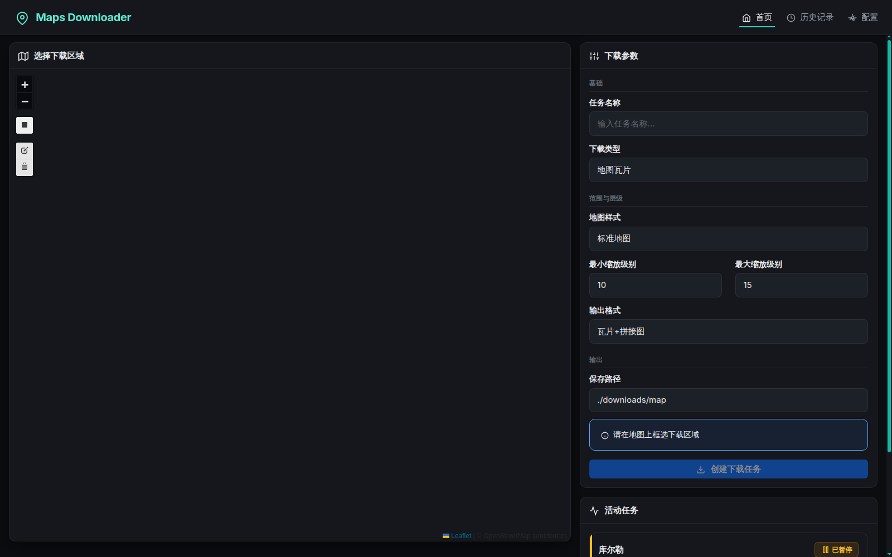
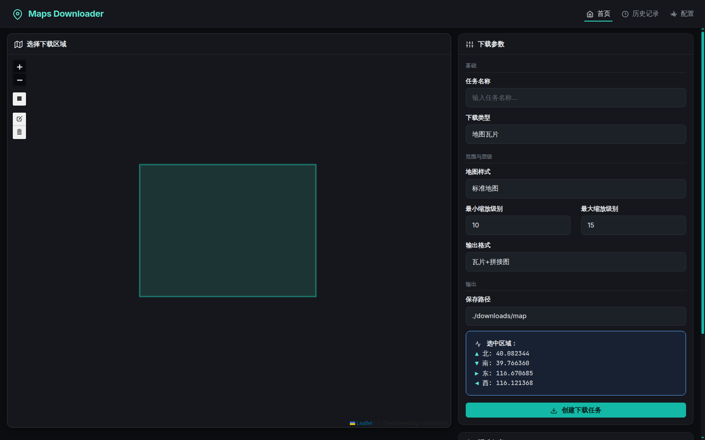
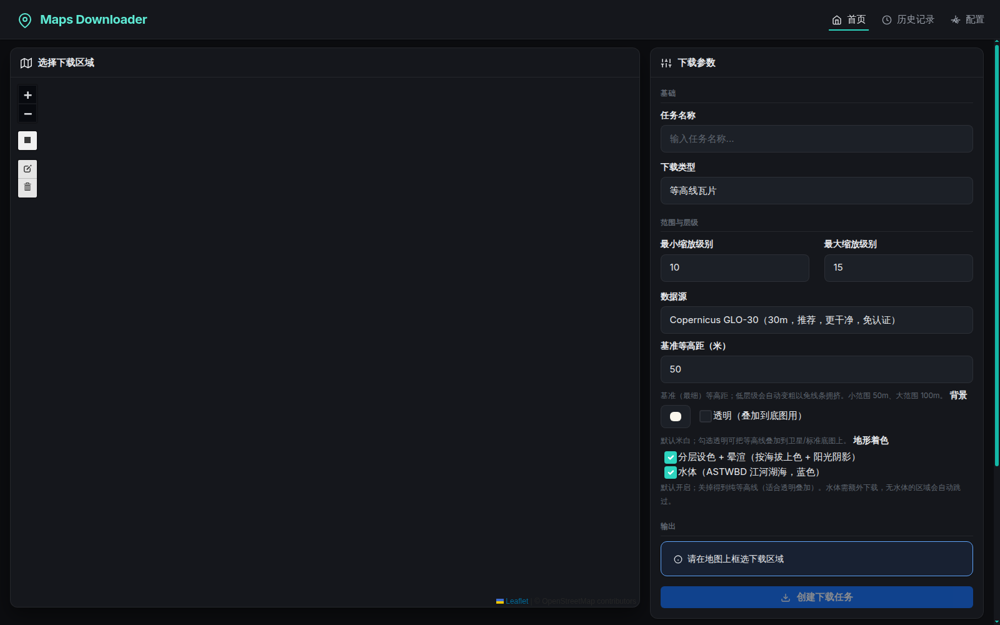
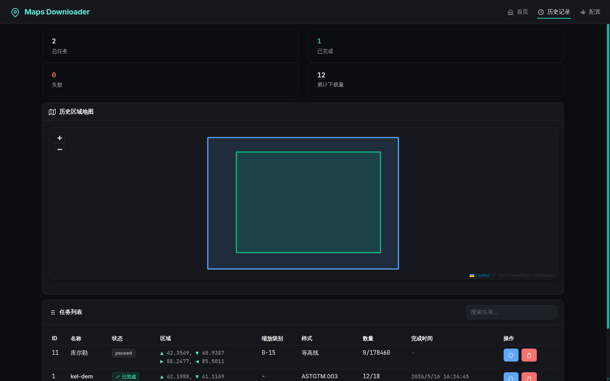
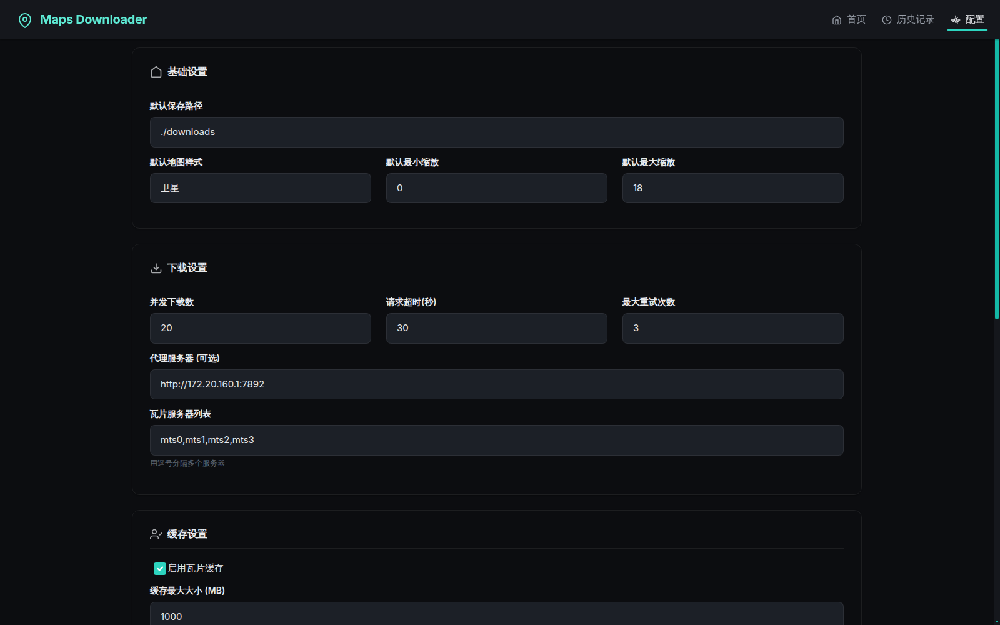

# map-download 界面与操作专业度评审

> **从「网页表单」到「GIS 工具」的改造方案**
>
> | | |
> |---|---|
> | 评审日期 | 2026-07-27 |
> | 评审版本 | `master` @ `9a3b7fd95`（v0.0.9） |
> | 评审范围 | `templates/`、`static/` 全部前端，以及与界面契约相关的 `routes/`、`services/` |
> | 触发原因 | 「感觉现在的界面和操作不够专业，不像是一个专业的 GIS 处理工具」 |
> | 评审方法 | 6 路分维静态评审 + 竞品对标 + 24 路对抗性验证 + 真实运行实测，详见 [附录 A](#附录-a评审方法与可信度) |
> | 发现总数 | 90 条（52 条初判 high，24 条通过对抗性验证） |

---

## 0. 结论摘要

**不专业不是因为功能少，是因为这个工具把空间数据处理当成网页表单在做——地图只是一张能拖的图片，参数只是一堆输入框，任务只是一条进度条。**

三条根因：

| | 根因 | 一句话 |
|---|---|---|
| **A** | 无空间上下文 | 界面不回答「我在哪 / 多大 / 什么基准 / 要付多大代价」，用户全程盲操作 |
| **B** | 空间数据正确性有硬伤且被藏起来 | 配准错误、必崩选项、坐标偏移零说明——GIS 从业者撞见一条，可信度即归零 |
| **C** | 视觉是落地页默认值 + 打了一半的深色补丁 | 密度只有专业工具一半、状态色语义反转、原生控件漏白、92 处 `!important` |

### 最要命的五条

按「会不会让专业用户直接弃用」排序：

| # | 问题 | 位置 | 后果 |
|---|---|---|---|
| 1 | **拼接 GeoTIFF 地理配准是错的** | `download_engine.py:799` | 图拖进 QGIS 和任何正确数据叠加都错位，用户不会怀疑 |
| 2 | **「仅拼接图」选项 100% 报错** | `index.html:91` vs `models/task.py:69-74` | 选中必抛 ValueError |
| 3 | **拖拽改框，参数不跟着变** | `map.js:34-37` 无 `EDITED` 监听 | 静默用旧 bbox 下载 |
| 4 | **进度条颜色语义反转** | `tasks.js:504-510` | 健康任务显示红色；绿色永远不出现 |
| 5 | **任务失败卡片直接消失** | `tasks.js:481-488` | 跑了 40 分钟的任务死了，零提示 |

第 1、2 条已由人工复核代码确认属实（见 [附录 B](#附录-b已人工复核的关键结论)）。

### 建议起手式

三个改起来最快、观感提升最扎眼的：

1. **A1 状态色语义（2h）** —— 删掉 `getProgressColor`，改用同文件已有的 `getStatusColor`
2. **A3 深色主题补完（1.5h）** —— `base.html` 加一个 `data-bs-theme="dark"` 属性，同时修掉原生控件漏白和 select 弹层
3. **A8 补 `EDITED` 监听** —— 消除静默用旧 bbox

**顺序提示**：第一档有 5 项要动 CSS，建议先做 C1（CSS 清理）再做第一档。在 92 处 `!important` 和一个自我覆盖的字号块上动手会反复踩空——A5 的 `font-size` 改了不生效就是典型（真正生效的是 `style.css:1342` 那条 `!important`，不是 `:877-887`）。

---

## 1. 根因：三条，不是三十条

**一句话：这个界面不专业，不是因为功能少，而是因为它把一个空间数据处理工具当成一个网页表单在做——地图只是一张能拖动的图片，参数只是一堆输入框，任务只是一条进度条。**

拆成三个可独立开工的根本原因：

### 根因 A：界面不提供任何空间上下文，用户全程在盲操作

GIS 软件和普通网页表单的分界线，是它必须随时回答四个问题：**我在哪（坐标）、多大（比例尺/面积）、什么基准（坐标系）、这一步要付多大代价（瓦片数/体积/耗时）**。本项目一个都不答。用户画个框，界面只回给他四行度数，然后就没了。

### 根因 B：空间数据的正确性有硬伤，而界面把这些错误藏起来了

拼接出来的 GeoTIFF 地理配准是错的、下拉框里有个必崩的选项、中国区的坐标偏移一字未提、任务失败时卡片直接消失。这类问题的杀伤力和 UI 无关——**GIS 从业者只要撞见一条，整个工具的可信度归零**，后面做得再好看也没用。

### 根因 C：视觉是 Bootstrap 落地页默认值，外加一层只打了一半的深色补丁

控件密度只有专业工具的一半（1366×768 笔记本上提交按钮在折叠线以下）；状态色语义是反的（跑到 10% 的健康任务显示红色进度条）；第三方控件（Leaflet 绘制工具条）和浏览器原生控件（文件选择按钮、数字微调箭头）在深色背景上漏出白底；字号系统在同一个文件里自己覆盖自己，92 处 `!important`。

---

## 2. 实测记录

以下是实际启动服务（`DEBUG=0 uv run python app.py`）、用浏览器逐页操作的记录。视口 1600×1000。截图存于 `docs/assets/images/ui-review-2026-07/`。

### 2.1 首页：地图区域完全空白



左侧地图占据 65% 屏幕，**全黑**，只有 Leaflet 控件和右下角 attribution。

三层原因叠加：

1. **前端底图硬编码 OSM**（`static/js/map.js:12`、`history.js:18`），请求 `https://{s}.tile.openstreetmap.org/...`
2. **配置页的代理对它无效** —— 配置里填的 `proxy_url` 只注入后端 aiohttp 会话，浏览器发的请求读不到这个配置。实测网络面板：9 个 CDN 资源全部 200，20 个 OSM 瓦片请求**全部挂起无响应**
3. **失败完全静默** —— `map.js` 没挂 `tileerror` 事件，控制台 **0 错误 0 警告**

用户看到一个纯黑的框，无从判断是没数据、是坏了、还是要等。

> 顺带：底图是 OSM，下载的却是 Google（`download_engine.py:258` → `mts{n}.googleapis.com`）。选「卫星图」，地图上显示的是 OSM 街道线划——**所见非所得**。

同时可见的缺失：无比例尺、无鼠标坐标、无 zoom 级别指示、无坐标系标注、无底图切换、无图层控制。Leaflet.draw 工具条是出厂白盒，在深色背景上刺眼。

### 2.2 框选之后：只有四行度数



实测在地图上拖出矩形，`#boundsInfo` 的全部内容：

```
选中区域：
▲ 北: 40.082344
▼ 南: 39.766360
▶ 东: 116.670685
◀ 西: 116.121368
```

然后按钮就变绿可点了。**没有瓦片数、没有体积、没有面积、没有耗时预估。**

历史记录里那个 `0/178460` 的等高线任务就是这么下单的——用户创建时根本不知道自己要下 17 万个瓦片。

**关键发现：这个能力后端已经写好了，只是没接线。**

- `download_engine.py:165-180` 的 `expected_tile_count` 是**纯数学循环**，不发一个网络请求就能算出瓦片总数，而且是在生成瓦片列表**之前**就算好的
- `:183-188` 连预计耗时都算了（`expected_tile_count / 10 / 3600` 小时），然后 `logger.warning` 打进服务端日志就没了
- `CLAUDE.md:85` 写着「`WARN_TILES_THRESHOLD = 100000` triggers a UI warning」——**这句是假的**，从来没有 UI 警告

加一个 `POST /api/estimate` 复用这段循环，是 1 小时的活。

### 2.3 切换到「等高线瓦片」：布局错乱 + 丢字段



两个问题：

1. **「背景」和「地形着色」两个标签跑到了右侧**，和上一条说明文字挤在同一行右端。原因是这两个 `<label>`（`index.html:129`、`:139`）是 inline 元素，前面的 `<small class="form-text">` 没有独占一行。
2. **「保存路径」输入框整个消失了** —— 「输出」分组标题下面直接是提示框和按钮。选「地图瓦片」时它在，选「等高线」时没了，用户不知道产物存哪。

这印证了信息架构的问题：四种任务类型挤在一个 `<form>` 里靠 `display:none` 切换，而 `map.js:94-124` 的 `apply()` 只 toggle 了 6 个块，两个分组标题（`index.html:63`「范围与层级」、`:151`「输出」）从不隐藏，于是标题和它下面的内容对不上。

### 2.4 历史页：状态列中英混杂



| 问题 | 说明 |
|---|---|
| **状态中英混杂** | `paused` 和 `✓ 已完成` 出现在同一列。根源：`history.js:209` 的 `getStatusText` 只映射三态，其余 fallback 回原始英文；而 `tasks.js:512` 那份映射了六态——**同名函数两份实现，行为不同** |
| 4 个数字占掉 1/4 屏 | 总任务 2 / 已完成 1 / 失败 0 / 累计 12，用 2×2 卡片网格铺满。专业工具这是状态栏一行 |
| 区域地图无图例 | 蓝框和绿框各代表什么？没有说明 |
| 列语义混乱 | 「样式」列里同时出现 `等高线`（任务类型）和 `ASTGTM.003`（数据集 ID） |
| 数量无单位 | `0/178460` 是瓦片？文件？没有标注 |
| 四至符号非常规 | `▲▼►◄` 表示北南东西，GIS 惯例是 N/S/E/W 或 minX/minY/maxX/maxY，且未标注坐标系 |
| 操作过少 | 只有详情/删除，没有重试、继续、打开目录、导出 |

### 2.5 配置页



| 问题 | 说明 |
|---|---|
| 密度极低 | 「并发下载数」这种填 2 位数的输入框宽 350px；3 个字段铺满 1600px |
| 图标语义错误 | 「缓存设置」用的是 feather **user-check**（人像+对勾）；「GDAL 设置」用的是 **x-square**（方框打叉，读作删除） |
| 等高线配置全缺失 | `database.py:40-59` 定义了 18 个 `contour_*` 键（等高距、线宽、分层设色断点与色带、晕渲三参数），`config.html` 里**一个都没有**，而 `contour_engine.py:151-171` 每渲染一张瓦片都在读它们 |
| 措辞拗口 | 「缓存最大大小 (MB)」不是错别字，但专业软件会写「缓存上限 (MB)」 |
| 配置值不生效 | `routes/main.py:36-41` 已经把 `default_style`/`default_zoom_*`/`default_save_path` 传给模板，但 `index.html:78/82/154` 全是写死的值，`map.js:118` 还硬编码路径 |

---

## 3. 证据

### 根因 A 的证据

| 缺失项 | 证据 |
|---|---|
| 无状态栏（坐标/比例尺/层级/坐标系） | `static/js/map.js:5-77` `initMap` 全部内容 = `L.map().setView()` + 一个 OSM 图层 + `L.Control.Draw`。全项目 grep `L.control.scale`、`mousemove` 零命中 |
| 无量级预估 | `services/download_engine.py:27` `WARN_TILES_THRESHOLD = 100000` 只在 `:183-188` 写 `logger.warning` —— 进服务端日志，用户永远看不到。`routes/api.py:37-93` 没有 estimate 端点。前端唯一的估算 `static/js/map.js:295-308 estimateContourTiles` 只服务等高线，且是点了提交才弹确认框 |
| 全库无 CRS 字样 | `grep -rn "EPSG\|CRS\|坐标系\|WGS\|GCJ" templates/ static/js/` 结果为空。后端实际用了三套：`download_engine.py:836` 输出标 EPSG:4326、`contour_engine.py:461` warp 到 EPSG:3857、`cesiumlab_terrain.py` 输出 WGS84 椭球 |
| 底图不是要下载的那份数据 | `static/js/map.js:12` 硬编码 OSM，而 `services/download_engine.py:258` 实际下 `mts{n}.googleapis.com`。选"卫星图"，地图上是街道线划 |
| 拖拽改框，参数不跟着变 | `map.js:34-37` 开了编辑工具栏，但全项目 grep `L.Draw.Event.EDITED` **零命中**（我实测确认：`map.js` 只监听 `:41 CREATED` 和 `:72 DELETED`）。用户拖顶点改小框，右侧数字纹丝不动，提交的还是旧 bbox |
| 范围只能画，不能输 | `index.html:46-176` 整个表单没有 north/south/east/west 输入框；`boundsInfo`（`index.html:157-166`）是只读 innerHTML |

### 根因 B 的证据

| 问题 | 证据 |
|---|---|
| **拼接影像地理配准错误** | `services/download_engine.py:795-796`（我已实读确认）：`pixel_height = -(lat_max - lat_min) / height` —— 按等纬度间隔算，但瓦片像素在纵向是 Web Mercator 等间隔。`:837` 又声明 `ImportFromEPSG(4326)`。实测偏差：z10 在 40°N 瓦片内峰值 14.8m，z6 达 3.7km；且 `pixel_height` 随纬度变化（z10 时 20°N 与 50°N 相差 46%），`:663 gdal.BuildVRT` 会按平均分辨率重采样，接缝再叠一层错位 |
| **「仅拼接图」100% 报错** | `templates/index.html:91` `<option value="image_only">`，而 `models/task.py` 的 `OutputFormat` 枚举只有 `PNG/JPG/BOTH/TILES_ONLY`（我已实读确认），`shorthand_map` 也没有 `image_only`。`Task.__post_init__` 调 `from_shorthand()` 直接抛 ValueError。附带：`task_manager.py:874` 拼接分支条件是 `['png','jpg','both']`，即使绕过校验也什么都不产出 |
| **GCJ-02 偏移零说明** | `index.html:66-72` 提供 `lyrs=m/h/t` 三种含矢量路网的样式，它们在中国大陆是 GCJ-02 加密坐标，与 WGS-84 的 DEM/等高线叠加会错开 100~700m。全项目 grep `GCJ|偏移|纠偏` 零命中。注意：`y`（卫星+标注）只有标注层偏，`s`（纯卫星）不偏 |
| 任务失败卡片直接消失 | `tasks.js:481-483 card.remove()`，`:486-488` 错误信息只 `console.error`。用户盯着 63% 突然什么都没了 |
| 历史搜索只搜当前页 | `history.js:192-198` 过滤的是 `allTasks`，而它来自 `:41 fetch('/api/history_all?page=X&per_page=20')` —— 只有 20 条。搜不到的任务用户会以为不存在 |
| 任务名未转义直接拼 innerHTML | `tasks.js:194`、`history.js:88/175`、`map.js:452` 四处。对照组 `ui.js:51/109` 明确用了 `textContent` 并写了"防 XSS"注释——作者知道怎么做，渲染卡片时漏了 |

### 根因 C 的证据

| 问题 | 证据 |
|---|---|
| 密度 | `style.css:877-887` `.form-control{padding:.6rem .85rem}` + `:1342-1345` `font-size:var(--font-size-base)!important`(15px) → 实测控件高 **43.7px**（QGIS/ArcGIS Pro 是 22-26px，VS Code 输入框 26px）。`.card-header` 实测 47.1px，`.card-body{padding:1rem}`。右栏卡片实测 **800.3px**，而 1366×768 的可用高度只有 **676px** —— 提交按钮在折叠线以下 |
| 状态色反转 | `tasks.js:504-510 getProgressColor(progress)`：`>=25→'warning'`，其余 **`return 'danger'`**。刚启动的任务立刻红色。调用点有三处：`tasks.js:244`（创建卡片）、**`tasks.js:432`（socket 增量刷新，实际主路径）**、`history.js:296`。更荒谬的是任务页上绿色永远不会出现——`handleTaskCompleted` 在 100% 前就 `card.remove()` 了 |
| 进度数字不可读 | `style.css:429-439` 百分比是 bar **自身**的子元素并 `overflow:hidden` → progress=0 时数字完全消失、0-3% 被裁。文字色 #fff（来自 Bootstrap `--bs-progress-bar-color`），实测对比度：warning **1.67:1**、success 1.92、info 2.54、danger 2.77（AA 要求 4.5） |
| 原生控件漏白 | `grep -rn "color-scheme" static/ templates/` = NONE，且 `templates/base.html:2` 的 `<html lang="zh-CN">` 没有 `data-bs-theme="dark"` —— 实测 `--bs-body-bg:#fff`、`--bs-tertiary-bg:#f8f9fa` 全是亮色。表现：文件选择按钮灰白、数字微调箭头白色、取色器色块只剩 18.8×15.3px |
| 第三方控件没主题化 | `style.css:1266-1289` 只覆盖了 4 个 Leaflet 选择器，`.leaflet-draw-toolbar`、`.leaflet-bar`、`.leaflet-control-attribution` 一条没有。首页最核心的交互入口（矩形绘制按钮）是 Leaflet 出厂白盒，提示条还是英文 |
| 按钮 hover 是空操作 | `style.css:643-652` `.btn-success` 和 `.btn-success:hover` **两条规则值完全相同**。`.btn-warning`(654-663)、`.btn-danger`(665-674)、`.btn-info`(706-715) 同样。这四个类正是任务卡上的启动/暂停/取消按钮 |
| outline 按钮变裸文字 | `grep "btn-outline" static/css/style.css` = NONE，且 `style.css:622` 有 `.btn{border:none}` 压掉 Bootstrap 的边框简写 → `history.html:159` 的"刷新"按钮渲染成**无边框的灰色纯文字**，紧挨着实心青绿的"启动"按钮 |
| 字号系统自我覆盖 | `style.css:1318-1434` 一整块（我已实读确认）用 `!important` 重新声明前面已定义的选择器：`.form-label` 在 902 行是 `.9rem`、在 1338 行变 `.875rem!important`；`.nav-link` 在 148 行是 `.95rem`、在 1327 行变 `.9375rem!important`。全文件 **92 处 `!important`**（我已实测）。字阶 12/14/15/16/18/20px，`.form-label` 和 `.card-header h5` 同字重同颜色只差 1px，字段标签和区块标题长得一模一样 |
| 辅助文字对比度不达标 | `style.css:18 --color-text-muted:#5f6670` 对 `#15171c` 实测 **3.09:1**。它被用在 `.form-group-label`（首页三个分组标题）和 `.detail-k`（详情弹窗**全部**字段名）上 |
| 全局 300ms 过渡 + 卡片入场动画 | `style.css:1243-1247` `*{transition-duration:.3s}` 给每个 td、每个 span 都挂了色彩过渡；`:1303-1316 .task-card{animation:fadeInUp .5s}` + nth-child 递延，而 `tasks.js:171` 每次进度更新都 `container.innerHTML = ...` 全量重建 → 所有卡片集体重放一遍上浮动画 |

---

## 4. 改造路线图

工时按单人开发估算，含自测。

### 第一档：立竿见影（合计约 16 小时）

改动小、风险低、观感提升最大。建议一次做完再发一个版本。

---

**A1. 修掉状态语义反转 —— 2h**

进度条颜色只由任务状态决定，不由百分比决定。

- `static/js/tasks.js:504-510`：**直接删掉 `getProgressColor`**，改用同文件 `:492` 已有的 `getStatusColor(status)`（它已经实现了全部映射，是 drop-in 替换）。
- 三个调用点全改：`tasks.js:244`、**`tasks.js:432`**（这是 socket 增量刷新路径，实际运行时主要走这条，评审最初漏了它）、`history.js:296`。三处作用域都已持有 `task` 对象，签名从 `(progress)` 改 `(task)` 无需额外传参。
- 运行中用 `info`（`--color-info` 浅蓝）或品牌 `--color-accent`。**别用 `primary`**——`style.css` 里没有 `.progress-bar.bg-primary` 覆盖，会回落到 Bootstrap 默认 #0d6efd。
- `tasks.js:471-490 handleTaskFailed`：**不再 `card.remove()`**，把卡片切成失败态、展开 `error_message`，并 `showToast(..., 'danger', {duration: 0})` 让提示常驻（`ui.js:81` 原生支持 duration=0 不自动消失）。
- **注意**：失败卡片上先只放"移除"按钮，**"重试"要等第二档**——三个 manager 的 `start_task` 都硬性要求 `status in ('pending','paused')`（`task_manager.py:356`、`dem_task_manager.py:160`、`contour_task_manager.py:154`），对 failed 调用会抛 ValueError。

---

**A2. 进度条百分比改成覆盖层 —— 1h**

- `style.css:415-439`：`.progress{position:relative}`，新增 `.progress__label{position:absolute;inset:0;display:flex;align-items:center;justify-content:center;font-family:var(--font-mono);font-variant-numeric:tabular-nums;color:#0b1220;z-index:1}`。
- **不要用 `mix-blend-mode:difference`**（原评审建议）。实测是负优化：over `bg-primary` 对比度从 4.50 掉到 1.48。用显式深色文字 `#0b1220`，在全部五档饱和填充上都过 4.5:1。
- `font-variant-numeric:tabular-nums` 是"等宽数字"，让 3% → 13% 时数字不左右抖。
- 三处渲染点要一起改：`tasks.js:243-250`、`history.js:301-307`，以及**漏改就会出重复标签的 `tasks.js:431` `progressBar.textContent = ...`**（Socket.IO 实时路径，每次推送都会把数字重新塞回 bar 里）。

---

**A3. 深色主题补完 —— 1.5h**

- `templates/base.html:2`：`<html lang="zh-CN">` 改成 `<html lang="zh-CN" data-bs-theme="dark">`。**这一个属性同时解决两件事**——Bootstrap 5.3 的 `[data-bs-theme=dark]` 自带 `color-scheme: dark`（浏览器立刻把 select 弹层、number 微调箭头切成深色原生渲染），并把 `--bs-tertiary-bg` 翻深（修掉文件选择按钮的灰白底）。比手写 CSS 补丁更顺技术栈。
- `style.css` 补 `.form-control-color{padding:2px;width:36px}`（现在色块只有 18.8×15.3px，是被 `.form-control` 的 padding 挤的）。
- **顺手修一个真 bug**：`style.css` 用 `background:` 简写覆盖 `.form-select`，连带清掉了 Bootstrap 的下拉箭头 SVG（实测 `backgroundImage` 为 `none`）——**目前所有 select 没有三角指示符**。改成 `background-color:`。

---

**A4. Leaflet 控件主题化 —— 1h**

在 `style.css:1289` 后追加。加载顺序天然生效（`base.html:17/22` 先加载 leaflet 样式，`:25` 才是 style.css），引用的 6 个变量在 `style.css:8-18` 都已定义。

```css
.leaflet-draw-toolbar{background:var(--color-bg-secondary)!important;border:1px solid var(--color-border)!important}
.leaflet-draw-toolbar a{background-color:transparent!important;border-bottom-color:var(--color-border)!important;filter:invert(1) brightness(1.4)}
.leaflet-draw-toolbar a:hover{background-color:rgba(255,255,255,.08)!important}
.leaflet-draw-actions a{background-color:var(--color-bg-tertiary)!important;border-left-color:var(--color-border)!important;color:var(--color-text-primary)!important}
.leaflet-control-attribution{background:rgba(12,13,16,.75)!important;color:var(--color-text-muted)!important}
```

**两个必须避开的坑**（照抄原评审的写法会把界面搞坏）：
1. 必须用 `background-color` 而不是 `background` 简写——简写会把 `leaflet.draw.css` 的 `background-image:url(spritesheet.png)` 一并重置，结果是**几个没有图标的空白按钮**。
2. 深色底放在 `.leaflet-draw-toolbar` 容器上，`<a>` 背景设 transparent 再反色。如果给 `<a>` 同时设深色背景和 `filter:invert(1)`，两条规则互相抵消，净效果等于什么都没改。

再加一行汉化：`L.drawLocal.draw.handlers.rectangle.tooltip.start = '点击并拖动绘制矩形'`（页面 `lang="zh-CN"` 但提示条是英文）。同时删掉 `style.css:1268` 的 `.leaflet-control-layers-toggle` 死规则（`map.js` 从未调用 `L.control.layers`）。

---

**A5. 密度令牌落地 —— 3h**

目标：1366×768 上一屏放下全部参数，不滚动。

- `:root` 加 `--ctl-h:28px`。**这个 token 目前全仓 0 次命中，必须先定义再引用**（未定义的自定义属性会让 `width/height` 声明失效退回 auto）。
- `style.css:877-887`：`padding:4px 8px;line-height:20px` → 28px 高。
- **`font-size` 必须同时改 `:1342-1345` 那条 `!important`**，否则光改 877-887 不生效（实测 computed 就是 1342 行的 15px）。
- 删掉 `style.css:537-546` 的 `.config-section .form-control` padding 覆盖（同一控件在首页和配置页现在差 5px）。
- `.card-body` `1rem`→`10px`，`.card-header` `.85rem 1rem`→`6px 10px`。
- **最值钱的单项：把框选后的四至从 5 行压成 1-2 行**（`map.js:141-152` + `index.html:157-166`），这一项单独就值 90px。
- **不要改 `.history-table td`**（原评审建议）——DOM 里根本不存在 `.history-table`（`history.html:52` 用的是 `table table-hover`），那是死代码，改了没有任何视觉变化。历史表行高 62px 是"区域"列经纬度换行造成的，要压缩得让 bbox 单元格 `white-space:nowrap`。

---

**A6. 按钮状态补齐 —— 1.5h**

- `style.css:643-715`：四条空 hover 改成真实提亮——`.btn-success:hover{background:#4ade80}`、`.btn-warning:hover{background:#fcd34d}`、`.btn-danger:hover{background:#fca5a5}`、`.btn-info:hover{background:#93c5fd}`，加 `:active{filter:brightness(.9)}`。
- 补 outline 变体：`.btn-outline-primary{background:transparent;border:1px solid var(--color-accent-strong);color:var(--color-accent)}`、`.btn-outline-secondary{background:transparent;border:1px solid var(--color-border-strong);color:var(--color-text-secondary)}`。**必须显式写 `border`**——`style.css:622` 的 `.btn{border:none}` 会吃掉 Bootstrap 的边框（`.btn-secondary` 在 676-687 行已经这么补过一次了，作者知道这个坑，只是漏了 outline）。
- 图标按钮定规格：`.btn.btn-icon{width:28px;height:28px;padding:0;display:inline-flex;align-items:center;justify-content:center}`。**选择器必须写 `.btn.btn-icon` 或 `.btn-group-sm .btn-icon`**——`tasks.js:200` 的容器是 `<div class="btn-group btn-group-sm">`，而 `style.css:695` 的 `.btn-group-sm .btn{padding:.4rem .9rem}` 特异度 (0,2,0) 会压掉裸 `.btn-icon` (0,1,0)。
- `title="X"` 全部补成 `title="X" aria-label="X"`（6 个按钮：`tasks.js:203/210/218/224`、`history.js:110/117`）。

---

**A7. 文字对比度 —— 0.5h**

- `style.css:1440 .form-group-label` 的 color 从 `--color-text-muted` 改成 `--color-text-secondary`（3.09:1 → 6.82:1），配 `font-weight:600` + 字号断层。
- `style.css:1455 .detail-k` 同样改 secondary。
- **不要加 `text-transform:uppercase`**（原评审建议）——"基础""范围与层级""输出"是中文，没有大小写形态，这是空操作。中文界面只有 color、font-weight、font-size 三个杠杆。

---

**A8. 三处硬 bug —— 2h**

- **`image_only`**：`models/task.py` 的 `OutputFormat` 加 `IMAGE_ONLY = "image_only"`，`shorthand_map` 加 `'i'`；`task_manager.py:875` 分支改成 `in ['png','jpg','both','image_only']`。**但光这样改语义仍然错**——当前 `both` 只拼接、不复制瓦片（复制逻辑只在 `:936` 的 `tiles_only` 分支里），改完 `both` 和 `image_only` 产出物完全一样。正确做法：`both` 同时拼接+复制，`image_only` 只拼接，`tiles_only` 只复制。如果产品上不需要这个模式，**直接删掉 `index.html:91` 这个 option 是更省事的合法选项**。
- **`L.Draw.Event.EDITED`**：在 `map.js` 的 `initMap()` 函数体内（第 77 行 `}` 之前，插在 70 或 76 行后都行）补监听，重算 `currentBounds` + 调 `updateBoundsInfo()`。不需要动 `createTaskBtn.disabled`（能进编辑说明图层已存在，按钮本来就是启用的）。
- **`resetForm()`**：把 `map.js:247/376/525` 三处 reset 抽成 `resetForm()`，内含 `form.reset(); delete outputPath.dataset.userEdited; typeEl.dispatchEvent(new Event('change'))`。**同时必须修一个既存 bug**：三处 `finally`（259/387/533 行）都在 reset 之后无条件 `btn.disabled = false`，会覆盖 resetForm 里的 disabled 设置，导致 resetForm 无效。另注意本地高程分支（525）原本刻意不清 `drawnItems`（该模式无 bbox），给 resetForm 加个 `clearBounds` 参数。

---

### 第二档：专业能力补齐

按优先级排。B1 是唯一一条"不做就不能称为 GIS 工具"的。

---

**B1. 修正拼接影像的地理配准 —— 6h（最高优先级）**

改 `services/download_engine.py:_add_georeference`（我已实读 780-844 行确认现状）：

```python
ORIGIN = 20037508.342789244
tile_span = 2 * ORIGIN / (2 ** tile.zoom)
x0 = -ORIGIN + tile.x * tile_span
y0 = ORIGIN - tile.y * tile_span
geotransform = [x0, tile_span / width, 0, y0, 0, -tile_span / height]
srs.ImportFromEPSG(3857)
```

（`width`/`height` 用代码里已从 `src_ds.RasterXSize` 读到的变量，别硬编码 256。）

这样全 zoom 内所有瓦片像素大小恒定，`gdal.BuildVRT` 无损。若用户要 4326 输出，在 `stitch_tiles_with_gdal` 末尾追加 `gdal.Warp(dstSRS='EPSG:4326')` 做真正的重投影。`services/contour_engine.py:460` 已经是正确做法（warp 到 3857），照抄即可。

配套 UI：`index.html` 的「输出」分组加「输出坐标系」下拉（EPSG:3857 原生投影无重采样 / EPSG:4326 WGS 84），值存 DB 传给拼接函数。**默认保持 4326**——存量用户的输出坐标系不能静默改变。

**这条为什么排第一**：现在这份 GeoTIFF 拖进 QGIS，元数据写着 EPSG:4326，但和任何正确数据叠加都会错位十几米到几公里，用户完全不会怀疑。这是 GIS 工具最不能错的一件事。

---

**B2. 地图状态栏 HUD —— 4h**

`#map` 底部加一条常驻窄条，内容：`经度 纬度(6位小数)` · `高程 xxx m` · `z=14` · `1:36112` · `EPSG:3857`。

三个实现约束（都是踩过的坑）：
- **状态栏不能作为 `#map` 的子元素**——`style.css:251-255` 的 `#map{filter:brightness(0.9) contrast(1.1)}` 会把它一起压暗。挂在 `.index-left .card` 下（该元素 `style.css:213` 已有 `position:relative`）。
- **`z-index` 不能用 500**——Leaflet 控件容器是 800、zoom 控件 1000，`L.control.scale` 会压在状态栏上。要么把比例尺直接画进状态栏，要么给它换位置。
- 鼠标高程读数（抄 SAS.Planet）需要后端一个点查接口，可以放到最后做；坐标/zoom/比例尺/EPSG 四项是纯前端，`L.control.scale` 是 Leaflet 1.9.4 核心 API（`base.html:17` 已 CDN 引入），无需插件。

竞品对标里 6 个产品**全部**有状态栏，QGIS 和 Global Mapper 官方文档各用了一整节描述它。这是"是不是专业工具"的第一眼判断依据。

---

**B3. 框选实时预估条 —— 4h**

把 `map.js:295-308 estimateContourTiles` 提成通用 `estimateTiles()`，在 `L.Draw.Event.CREATED/EDITED` 和 zoomMin/zoomMax 的 input 事件里都调（防抖 250ms），结果实时渲进 boundsInfo：

```
范围 1.24° × 0.87° (138 km × 97 km)  ·  瓦片 48,392  ·  约 1.2 GB  ·  预计 1h20m
```

超过 `WARN_TILES_THRESHOLD`(100000) 时这一行变黄、创建按钮变橙并要求二次确认。

四个数据来源问题：
- **提取通用函数时必须保留 `coverageBounds`（`map.js:313-321`，按 1° DEM 粒度外扩）只作用于等高线路径**，地图瓦片套这个外扩会高估。
- **体积估算没有现成数据源**：`tasks` 表只有 `total_tiles/downloaded_tiles`，没有字节数字段。只能硬编码经验值（卫星图约 25KB/瓦片、路网约 12KB），并在 UI 上标"约"。
- **耗时可以算真实均值**：`total_running_seconds / downloaded_tiles` 比 `download_engine.py:188` 里硬编码的 10 tiles/sec 准。
- 若要读 `concurrent_downloads`，注意它虽在 `database.py:18` 定义，但**没进 `routes/main.py` 的 `template_config` 白名单**，前端拿不到，得加白名单或改调 `/api/config`。

顺手把 `CLAUDE.md:85` 那句"WARN_TILES_THRESHOLD = 100000 triggers a UI warning"改成实话——现在只进日志。

---

**B4. 范围输入的多种方式 —— 5h**

`boundsInfo` 位置换成可编辑的四至网格（4 个 `number`，`step=0.000001`），加一排按钮：**用当前视野**（`map.getBounds()`）、**粘贴坐标**（解析 `N,S,E,W` 和 `minx,miny,maxx,maxy` 两种格式）、**导入范围文件**（`.geojson/.json` → `L.geoJSON(...).getBounds()`）。

所有入口统一走一个 `setBounds(b)`：重画矩形 → 赋 `currentBounds` → `updateBoundsInfo()` → 刷新预估 → 解禁按钮。A8 里补的 `EDITED` 监听也接到这个通路上。

**KML 和 shp 明确后置**：KML 不在核心 Leaflet 内（需 togeojson/leaflet-omnivore 的 CDN），shp 必须走后端。GeoJSON 那条零新依赖。

---

**B5. 底图换成真实下载源 + GCJ-02 说明 —— 4h**

- 加一条 Flask 瓦片代理路由 `/api/preview/<style>/<z>/<x>/<y>.png`，复用 `download_engine` 的下载和 `cache/<style>/<z>/<x>/<y>.png` 缓存（`routes/contour_static.py`、`terrain_static.py` 已是现成范式）。前端 `L.tileLayer` 指向本地路由，跟 `mapStyle` 下拉联动切换。
- **不能让浏览器直连 Google 并"走配置里的 proxy_url"**——`proxy_url` 是喂给 aiohttp 的服务端代理，浏览器读不到这个配置，纯 config 填代理的部署场景会直接白屏。走本地代理路由才对所有环境成立，且顺带让预览命中的瓦片直接进缓存。
- `mapStyle` 字段下加常驻提示：「Google 路网/标注图层（m/h/t）在中国大陆为 GCJ-02 坐标，与 WGS-84 的 DEM/等高线叠加会有 100~700m 偏移；卫星影像（s）为 WGS-84，可直接叠加；y（卫星+标注）底图不偏、标注偏。」
- **做这条会暴露一个既存不一致**：`index.html` 里 `h` 标的是"道路图"，而 `models/task.py:46` 把 `h` 映射成 hybrid、`STYLE_MAP` 再转回 `y` —— 选"道路图"实际下的是 hybrid。一并对齐。

---

**B6. 任务日志面板 + 三态结束 —— 5h**

后端**已经在推这些事件了**，现在全部只进了 `tasks.js:18/23/28/33` 的 `console.log`——数据已有，只差一个容器。

- 任务详情改成 `参数 | 日志` 两个标签（抄 QGIS 算法对话框）。日志是 SocketIO 事件流落成时间戳文本行 + 失败瓦片的 URL 和错误。底部三个按钮：保存到文件 / 复制到剪贴板 / 清空。
- **结束态从二态改三态**（抄 ArcGIS Pro）：`failed_items > 0` 时标记为"带警告完成"（黄色 ⚠），点开看失败清单。现在 `failed_items` 只在进度行里显示"| 失败: N"，任务仍标 completed —— "任务显示成功但拼接图有洞"是最容易让用户失去信任的场景。

---

**B7. 空/加载/错误态统一 + 全局错误边界 —— 3h**

现在活动任务面板有**三套**不同的空态（`index.html:189-191` 硬编码、`tasks.js:159-167`、`history.js:64-75`），而且加载中显示的是"暂无活动任务"——**接口挂了也显示"暂无活动任务"**，用户会以为任务丢了去重建。

- `ui.js` 加 `renderState(el, {kind:'empty'|'loading'|'error', ...})`。**项目已经有共享 UI 反馈层**（`ui.js` 的 showToast/showConfirm，`config.js:45-47`、`map.js:254/385/531` 都在用），只是状态块没进去，成本比看起来低。
- `tasks.js:72-74` 的 catch 必须渲染错误态 + 重试按钮。`history.js:27` 的 `if (!j.success) return;` 也要一并处理（后端返回 success=false 时统计卡同样静默停在 `-`）。
- `base.html` 加全局兜底：`window.addEventListener('error', ...)` 和 `unhandledrejection` → 常驻 toast。`index.html:200-206` 四个 init 用 try/catch 分别包住（现在 `initMap` 失败会连带干掉任务列表）。
- `tasks.js:13-15` 的 disconnect 加常驻 toast + 导航栏右侧绿/红小圆点。

---

**B8. 表单校验就地化 —— 3h**

- **复用 Bootstrap 已有的 `.is-invalid` + `.invalid-feedback`**，别新造 `.field-error`（`base.html:14` 的 Bootstrap 5.3 完整 CSS 里这些类本来就有）。只需为暗色主题补覆盖：`.form-control.is-invalid{border-color:var(--color-danger)}`。
- 同时补 `.form-control:disabled` 的暗色覆盖——Bootstrap 的 `.form-control:disabled{background-color:var(--bs-secondary-bg)}` 特异性 (0,2,0) 压过项目的 (0,1,0)，一旦用起来会在暗色界面出现浅灰输入框。
- `map.js:171` 的 submit 处理器加前端校验：zoomMin > zoomMax、contourInterval <= 0 时打 `.is-invalid`。**注意 `map.js:323` 的 `parseFloat(...) || 50` 会把 0 静默改成 50**，这是真坑。
- 后端错误加中文映射表兜底：现在 zoomMin > zoomMax 会弹出英文 toast「创建任务失败: zoom_min (15) must be less than or equal to zoom_max (10)」。
- `#createTaskBtn` 的 disabled 态在按钮内直接写原因（"请先框选区域"），别维持一个半透明的哑按钮。

---

**B9. 启动语义统一 —— 2h**

四种任务类型**两种**行为：地图/DEM 只创建不启动（要再去卡片点 ▶），等高线（`map.js:374`）和本地地形（`local_terrain_task_manager`）创建即跑。同一个按钮、同一句文案。

统一为"创建即开始"。**服务端写法有坑**：在 `routes/api.py:77` 后紧接 `start_task`，若 start 抛异常会落入外层 except 返回 500，已创建的 task_id 丢失变成孤儿任务。要么 try/except 单独包住 start，要么**照抄 `map.js` 里 contour 已有的范式在前端做两次 fetch（create → start）**——后者与现有风格一致、改动更小。

按钮文案按类型动态改：「开始下载瓦片」/「开始下载 DEM」/「上传并切片」/「渲染等高线」。

`tests/` 下无任何用例 POST `/api/tasks`，改行为不破测试。

---

**B10. 历史参数快照 + 一键重跑 —— 4h**

- `tasks`/`dem_tasks` 表补一个 `params` JSON 列（按 `CLAUDE.md` 约定写进 `init_database()` 的 `ALTER TABLE ADD COLUMN` 段）。
- `history.html` 表格加"耗时"列 + 状态筛选/排序；详情弹窗展示完整参数快照。
- 加「用相同参数重跑」和「改参数重跑」两个按钮（后者跳 `/?from=<type>:<id>` 预填表单 + `setBounds()`）。
- **顺带修历史搜索只搜当前页**：`/api/history_all` 加 `q` 参数走 SQL `WHERE name LIKE ?`，`history.js:10-12` 的 input 加 250ms 防抖调 `loadHistory(1, q)`。

---

**B11. 产物入口 —— 3h**

- 新增 `GET /api/tasks/<id>/artifacts`：返回产物列表（路径、大小、像素宽高、CRS，用 `gdal.Info` 取），详情弹窗加一张产物表。
- 新增 `POST /api/tasks/<id>/reveal`：服务端调 `os.startfile` / `xdg-open` 打开输出目录。**路径必须经 `Config.DOWNLOADS_DIR` 白名单校验**，参照 `routes/terrain_static.py:_resolve_safe_file`。
- `index.html:154` 的保存路径框旁显示解析后的绝对路径，别让用户猜 `./` 是哪。
- `DELETE /api/tasks/<id>`（`routes/api.py:330-331`）现在只 `DELETE FROM tasks`，磁盘目录成永久孤儿——补目录清理（照抄 `local_terrain_task_manager.py:362-371` 已有的边界校验写法），删除确认框里明说"同时删除磁盘文件"。

---

**B12. 其余（各 1-3h，可零散做）**

- **任务并发上限 + 队列**：`config` 加 `max_concurrent_tasks`（默认 2），`TaskManager.start_task` 超限则保持 pending 入队。现在 `active_tasks` 是无限并发，多开几个把带宽打满还互相拖慢。
- **DEM/等高线/本地地形的计时字段**：`dem_tasks`/`contour_tasks`/`local_terrain_tasks` 都没有 `total_running_seconds` 列，导致暂停中的 DEM 任务永远显示"已运行 0 秒"、恢复后从零重计。把 `task_manager.py:120-180` 的计时逻辑提到 `services/task_timing.py` 共用。
- **术语统一**：「最大缩放级别」vs「最大切片层级」是同一概念两个叫法；「默认最小缩放」vs「最小缩放级别」同理。建 `static/js/terms.js` 集中维护。
- **数据源元数据卡**：`index.html:98-99` 的「更干净」「推荐」改成规范格式，加覆盖范围/时相/高程基准/许可条款。两个产品都是 1 弧秒格网，"30m"只在赤道成立。
- **取消/删除的语义说清**：确认文案改成"取消后任务终止且无法恢复，已下载的 N/M 项保留在 `<path>`"，并把"暂停"作为推荐操作强调出来。
- **配置页重排**：`database.py:40-59` 的 18 个 `contour_*` 键（等高距、线宽、分层设色断点与色带、晕渲三参数）在 `config.html` 里一个都没有，而 `contour_engine.py:151-171` 每渲染一张瓦片都在读它们。`config.js:7-28` 的手写字段清单改成遍历 `[data-config-key]` 自动收集。`contour_workers` 补进 `DEFAULT_CONFIGS`（现在是纯隐藏键）。
- **配置默认值生效**：`routes/main.py:36-41` 已经把 `default_style/default_zoom_*/default_save_path` 塞进 `template_config`，但 `index.html:78/82/154` 全是写死的值，`map.js:118` 还硬编码路径。改成 Jinja 变量即可。
- **XSS**：加 `esc()` 函数，修 `tasks.js:194`、`history.js:88/175`、`map.js:452` 四处。
- **动画降噪**：删 `style.css:1243-1247` 的全局 `*` 过渡改按需，删 `:1303-1316` 的 fadeInUp 整块，`:436` 进度条 `.6s` → `.2s linear`，加 `@media (prefers-reduced-motion:reduce)`。

---

### 第三档：架构级重构（做不做由你定）

这一档不改变功能，只降低后续每一次修改的成本。**建议只做 C1 和 C2，其余按需。**

**C1. CSS 一次性清理 —— 6h（建议在第一档之前或之后立刻做）**

- 删掉 `style.css:1318-1434` 整块「统一字体大小系统」，把最终值合并回各自原始规则（148、342、779、902 行等）。`!important` 从 92 降到约 68。
- 字阶收敛到四级并制造断层：`--fs-label:11px` / `--fs-body:13px` / `--fs-num:13px(mono)` / `--fs-title:15px`。让 `.form-label` 和 `.card-header h5` 走**不同的字重+颜色+字号**，而不是差 1px。（**注意 rem→px 会丢失用户字体缩放能力**，桌面工具类应用可接受但要有意识。）
- 删死代码：`:1168-1170 .mb-3`（被 915 行的 `!important` 完全压死）、`:1185-1190 .row` 重复、`:50 --shadow-glow` 零引用。
- `:795-797 .text-center{color:...!important}` 的颜色强制删掉——一个纯布局类不该管颜色。现在 `history.js:56` 的 `class="text-center text-danger"` 靠 `.text-danger`(799) 排在 `.text-center`(795) 之后才侥幸生效，调一下顺序就静默变色。
- `:106-111` 那条打了 9 个 `:not()` 的 `div{background:transparent}` 用显式类替代，消掉这个特异性炸弹。
- 别名清理：`--color-accent-amber/-warm/-copper` 三个假名全部指向青绿，做一次 sed 换成真实语义名再删掉。
- 三条独立的 `*{}` 规则（67/1217/1243）合并。

**注：`--shadow-glow:none` 定义在 50 行、注释写"去发光"，但 `:345-354` 的 `pulse` 关键帧还硬编码着 `box-shadow:0 0 20px 5px rgba(59,130,246,.3)` —— 发光只删了一半。**

**C2. JS 去重与模块化 —— 5h**

- 建 `static/js/common.js`：`getStatusColor`/`getStatusText`/`formatDate`/`formatDuration`/`esc`。现在 `getStatusText` 在 `tasks.js:512` 和 `history.js:209` 各有一份**且行为不同**（tasks 版六态，history 版只有三态，其余 fallback 到原始英文字符串）。
- 五个文件各套 IIFE。现在 `map.js:272` 有个叫 `style` 的顶层 const、`map.js:1` 有个叫 `map` 的顶层 let、`index.html:201` 有个叫 `config` 的顶层 const——三个极易撞名的通用词占据全局。
- `style.css` 加 `.icon{display:inline-block;vertical-align:middle;margin-right:.25em;flex:none}`，把 30 处重复内联样式换掉（全库 `style="` 内联属性共 91 处）。

**C3. 图标 sprite 化 —— 4h**

47 个内联 SVG、7 种尺寸、线宽一律 2 不随尺寸补偿（14px 时实际描边 1.17px、24px 时 2px，粗细差近一倍）。同一个时钟图标在 `base.html:56`、`tasks.js:182/256/589` 各粘了一份。

建 `templates/_icons.svg` sprite，用 `<svg class="ic ic--16"><use href="#i-clock"/></svg>`。**线宽补偿的方向别搞反**：要让光学描边一致，大尺寸必须用**更小**的 viewBox 线宽——统一到 1.25px 光学描边则 16px 用 `stroke-width:1.875`、20px 用 `1.5`。

必须修的语义错误：
- `config.html:97-99`（缓存设置）用的是 feather **user-check**（人像+对勾）→ 改 `database`
- `config.html:124-126`（GDAL 设置）用的是 **x-square**（方框打叉，读作删除）→ 改 `layers` 或 `image`
- `base.html:66-68`（导航「配置」）是圆心 + 8 根辐条，读作太阳/星芒，不是齿轮 → 改 feather `settings`
- 同一个 layers 图标出现在 `index.html:13`、`history.html:21`、`config.html:157` 三处三义 → 把 layers 留给地图相关，其他改 `more-horizontal`

**C4. 可拖拽分栏 —— 3h**

`.index-left{flex:0 0 65%}` / `.index-right{flex:0 0 35%}` 写死不可伸缩。改成 `.index-right{flex:0 0 var(--panel-w,420px);min-width:340px;max-width:720px}` + 6px 拖拽条 + localStorage 记忆，约 40 行 JS。**顺带修一个真 bug**：`:1094` 的 768px 断点把 `.index-layout` 改成 column 但没覆盖 `:189-194` 的 `height:calc(100vh - 60px)`，配合 `body{overflow:hidden}` 和 `.index-left{overflow:hidden}`，竖排后 400px 高的 `#map` 会被裁切。

**C5. 任务列表增量渲染 —— 2h**

`tasks.js:171` 每次更新全量 `innerHTML` 重建，配合 fadeInUp 让所有卡片集体闪一下。改成只 append 新卡片；`:467/484/668` 三处 `card.remove()` 后面的 `renderActiveTasks` 调用直接删掉，只保留 `if (activeTasks.size === 0) renderActiveTasks([])`。`updateTimeDisplay`（每秒执行）改成只写 `<span class="time-text">` 的 `textContent`，别整段重写 innerHTML（现在每秒重新解析一个内联 SVG）。

---

## 5. 我不推荐做的（以及为什么）

**1. 五页导航重构（工具箱/任务队列/成果库/查看器/设置）** —— 除非先做出"成果库"（产物浏览+预览+定位），否则这只是把 `index.html:180-192` 的卡片搬个家，用户点击路径反而变长。建议等 B11 产物入口做完、确实积累了足够内容再考虑。

**2. `projects` 工程表（多任务归属同一次作业）** —— 要给 4 张表加 `project_id`、改所有查询、加工程页面。收益完全取决于你的用户是否真的在做"下 DEM → 切地形 → 渲等高线 → 下卫星底图"的多步链路。如果 80% 的使用是单次下载，这是纯负担。**先做 B10 的"一键重跑"**，它用十分之一的成本解决了同一个痛点的主要部分。

**3. 全局快捷键体系（ESC/Ctrl+Z/D + 速查表）** —— `drawnItems` 只保留一个图层，"撤销栈"对单矩形选区几乎没有意义；一个桌面工具用户一次会话只画一两次框。ESC 取消绘制可以顺手加（3 行），但整套快捷键 + 速查表面板是过度设计。

**4. 批处理模式 / "复制为 curl / JSON"** —— QGIS 和 ArcGIS Pro 有这些是因为它们服务于脚本化工作流。本项目是 PyInstaller 打包的单机离线工具，用户不会写脚本调它。**如果真有批量需求，做"一键重跑"+ 范围文件导入（B4）就够了。**

**5. GCJ-02 栅格纠偏（把已下载的影像 warp 回 WGS-84）** —— 偏移量在一张瓦片内不是常量，纠正栅格必须逐像素 warp（GDAL GCP/RPC 重采样），工作量比"约 60 行"高一个数量级，且精度取决于逆向出来的多项式，出了问题很难解释。**只做 B5 的文字说明**——把风险明确告诉用户，比给一个精度不明的纠偏开关负责任得多。（顺带：网上说的"七参数"是错误定名，GCJ-02 用的是多项式混淆+迭代反解，不是大地测量的基准转换。）

**6. 用 `mix-blend-mode: difference` 解决进度条文字对比度** —— 已实测验证是负优化：over `bg-primary` 从 4.50 掉到 1.48，over `bg-danger` 从 2.77 掉到 1.88，五档里只有一档过 AA。用显式深色文字。

**7. 压缩 `.history-table td` 的 padding** —— 这个类在 DOM 里根本不存在（`history.html:52` 用的是 Bootstrap 原生 `table table-hover`），改了零效果。

**8. 通知中心 / 完成音效 / 标题闪烁** —— 系统通知（`Notification` API）值得做（1h），但"通知中心"（保留所有历史提示的面板）在 B6 的日志面板做完之后是重复建设。

**9. 覆盖度自检（拼接前统计缺失瓦片）** —— 概念上正确（SAS.Planet 把它列为拼接流程第 3 步并标注"这很重要"），但只有在 B1 的配准修好、B6 的三态结束做完之后才有意义。现在的失败瓦片信息已经在 `task_tiles` 表里，B6 的失败清单能覆盖 80% 的场景。排到最后。

---

## 6. 建议的发版节奏

> **⚠️ 本节已被实际执行决策覆盖（2026-07-27）。** 下表是评审当时的建议（分四次发版）。实际执行时用户决定**全部改造完成后统一发一个版本**，各阶段只合并不发版。以实施计划 [`superpowers/plans/2026-07-27-master-plan.md`](../superpowers/plans/2026-07-27-master-plan.md) 的发版策略为准。下表保留作为工作量与收益的分档参考。

| 版本 | 内容 | 工时 | 用户能感知到什么 |
|---|---|---|---|
| 0.1.0 | 第一档 A1-A8 | ~16h | 界面不再漏白、进度条不再骗人、笔记本上一屏放得下、拖框改范围不再静默用旧值 |
| 0.2.0 | B1 + B2 + B3 | ~14h | 拼出来的图能和别人的数据叠上；地图有了坐标/比例尺/坐标系；点创建之前就知道要下多少 |
| 0.3.0 | B4 + B5 + B6 + B7 | ~16h | 范围可手输可导入；底图就是要下的那份数据 + 明说 GCJ-02；任务失败看得到原因 |
| 0.4.0 | B8-B12 | ~18h | 参数校验、启动语义统一、历史重跑、产物可打开 |
| 随时 | C1 + C2 | ~11h | 用户无感知，但后续每次改样式和加功能的成本降一半 |

**先做 C1 再做第一档也可以**——第一档有 5 项要改 CSS，在 92 处 `!important` 和自我覆盖的字号块上动手会反复踩空（A5 里的 `font-size` 不生效就是典型），先清干净再改会更快。这个顺序由你定。

---

## 附录 A：评审方法与可信度

### 方法

| 阶段 | 做法 |
|---|---|
| 1. 分维静态评审 | 6 个独立视角并行通读代码：视觉密度、交互流程、GIS 专业能力、信息架构、进度反馈、前端工程质量。每条发现强制携带 `file:line` 证据 |
| 2. 竞品对标 | 检索 SAS.Planet、水经注、QGIS、Global Mapper、CesiumLab、ArcGIS Pro 的界面惯例，提取共性要素清单 |
| 3. 对抗性验证 | 对 24 条 high 发现各起一个验证者，默认立场「这条可能是错的」，要求实读代码复核证据、主动 grep 反证、评估改法在现技术栈下是否可行 |
| 4. 真实运行实测 | 启动服务，浏览器逐页操作并截图，见 [第 2 节](#2-实测记录) |
| 5. 人工复核 | 对导向最大改动的两条支柱结论亲自读代码确认，见附录 B |

### 可信度说明（请读这段）

**24 条 high 发现全部通过验证，驳回 0 条。** 这个数字本身值得警惕——一轮对抗性验证驳回率为零，通常意味着验证不够严格。

实际情况是：验证者的产出落在**建议修正层**而非驳回层。它确认了原始证据属实，但推翻了多条原始**改法**。例如：

- 原评审只指出 `tasks.js:244` 一处调用点，验证者补出 **`tasks.js:432` 才是 Socket.IO 增量刷新的主路径**——漏改这处等于没改
- 原评审建议用 `mix-blend-mode: difference` 解决进度条文字对比度，验证者实测后判定为**负优化**（over `bg-primary` 从 4.50:1 掉到 1.48:1），改为显式深色文字
- 原评审建议压缩 `.history-table td` 的 padding，验证者发现**该类在 DOM 里根本不存在**（`history.html:52` 用的是 Bootstrap 原生 `table table-hover`），改了零效果
- 原评审的 Leaflet 主题化 CSS 用了 `background` 简写，验证者指出这会连带重置 `leaflet.draw.css` 的 `background-image`，**结果是几个没有图标的空白按钮**

这些修正都已写进第 4 节的改法里。**建议把本文档的「证据」当作可信度较高、「改法」当作需要边做边验证的方案**，尤其是 CSS 部分——该文件的特异性冲突比看起来严重。

### 尚未验证的部分

- 28 条 medium/low 发现**未经过对抗性验证**，证据可能存在行号偏差
- 第 4 节中标注具体数值的对比度、像素高度等，来自子代理的浏览器实测，未逐条人工复算
- 竞品对标结论基于公开文档检索，未逐个安装竞品软件核对

---

## 附录 B：已人工复核的关键结论

以下两条导向最大改动量（B1 为 6h 且排第一优先级），已亲自读代码确认。

### B-1. 拼接影像地理配准错误 —— 属实

`services/download_engine.py:789-799`：

```python
lat_max_rad = math.atan(math.sinh(math.pi * (1.0 - 2.0 * tile.y / n)))
lat_max = math.degrees(lat_max_rad)
lat_min_rad = math.atan(math.sinh(math.pi * (1.0 - 2.0 * (tile.y + 1) / n)))
lat_min = math.degrees(lat_min_rad)

pixel_width  = (lon_max - lon_min) / width
pixel_height = -(lat_max - lat_min) / height   # ← 问题在这里
```

上下边界纬度用逆墨卡托算得**正确**，但 `pixel_height` 把这段纬度差**均分给 256 行像素**。瓦片内像素在纵向是 Web Mercator y 等间隔，对应纬度是 `arctan(sinh(...))` 曲线，非线性。

结果：**四个角坐标对，中间像素全错**，误差在瓦片中部最大、边界为 0。然后 `:836` 声明 `ImportFromEPSG(4326)`。

第二层问题：`pixel_height` 随纬度变化（同 zoom 下不同 y 的瓦片纬度跨度不同），`:663` 的 `gdal.BuildVRT` 拼接时按统一分辨率重采样，接缝处再叠一层错位。

### B-2. `image_only` 选项必崩 —— 属实

`templates/index.html:91` 提供 `<option value="image_only">仅拼接图</option>`。

`models/task.py:69-74` 的 `OutputFormat` 枚举只有 `PNG`/`JPG`/`BOTH`/`TILES_ONLY`；`:90-95` 的 `shorthand_map` 只有 `p`/`j`/`b`/`t`；`:98-109` 对未知值直接 `raise ValueError`，**无 fallback**。

> 注：项目记忆中 2026-06-11 已记录过此问题（"Map output format UI offers unsupported image_only value"），至今未修。
>
> 修复时注意语义：当前 `both` 只拼接不复制瓦片（复制逻辑只在 `task_manager.py:936` 的 `tiles_only` 分支里）。若只是补枚举，`both` 和 `image_only` 产出物会完全一样。**若产品上不需要这个模式，直接删掉 `index.html:91` 是更省事的合法选项。**