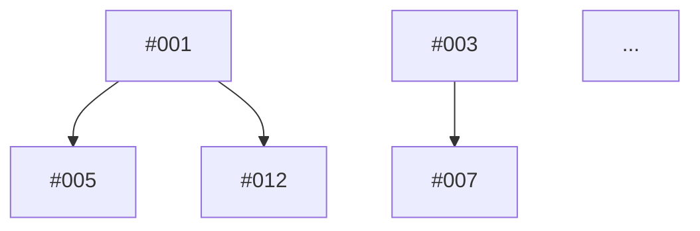

# Agent Team 全面项目审查实施计划

> **For agentic workers:** REQUIRED SUB-SKILL: Use superpowers:subagent-driven-development (recommended) or superpowers:executing-plans to implement this plan task-by-task. Steps use checkbox (`- [ ]`) syntax for tracking.

**Goal:** 使用7人精英团队对 Google Maps 瓦片下载器项目进行全方位质量审查，生成评分卡、详细报告和可执行的修复计划。

**Architecture:** 采用三阶段并行审查流程：阶段一由4个纵向专家并行审查各自模块（后端、前端、运维、测试），阶段二由3个横向专家并行审查全局问题（安全、性能、代码质量），阶段三整合所有结果生成统一报告和修复计划。

**Tech Stack:** Python (Flask), JavaScript (Leaflet.js), SQLite, GDAL, aiohttp, Flask-SocketIO

---

## 文件结构

### 创建的文件

**审查报告目录:**
```
docs/reviews/2026-05-08-comprehensive-review/
├── 00-executive-summary.md          # 执行摘要（评分卡 + 关键发现）
├── 01-security-audit.md             # 安全审计报告
├── 02-performance-analysis.md       # 性能分析报告
├── 03-code-quality-review.md        # 代码质量报告
├── 04-backend-architecture.md       # 后端架构评估
├── 05-frontend-review.md            # 前端审查报告
├── 06-devops-assessment.md          # 运维评估报告
├── 07-qa-testing-review.md          # 测试质量报告
├── 08-remediation-plan.md           # 修复实施计划
└── issues.json                      # 问题追踪清单（结构化数据）
```

### 审查的文件

**后端模块:**
- `app.py` - Flask 应用入口
- `config.py` - 配置类
- `database.py` - 数据库初始化
- `models/task.py` - Task 和 Tile 模型
- `models/config.py` - Config 模型
- `services/download_engine.py` - 下载引擎
- `services/task_manager.py` - 任务管理器
- `services/config_manager.py` - 配置管理器
- `routes/main.py` - 页面路由
- `routes/api.py` - API 路由
- `routes/socketio_events.py` - WebSocket 事件

**前端模块:**
- `templates/base.html` - 基础模板
- `templates/index.html` - 主页
- `templates/history.html` - 历史记录页
- `templates/config.html` - 配置页
- `static/js/map.js` - 地图交互
- `static/js/tasks.js` - 任务管理
- `static/js/history.js` - 历史记录
- `static/js/config.js` - 配置管理
- `static/css/style.css` - 自定义样式

**运维和测试:**
- `requirements.txt` - Python 依赖
- `tests/test_download_engine.py` - 下载引擎测试
- `tests/test_config_manager.py` - 配置管理器测试

---

## 任务分解

### 阶段一：准备和环境设置

### Task 1: 创建审查报告目录结构

**Files:**
- Create: `docs/reviews/2026-05-08-comprehensive-review/`

- [ ] **Step 1: 创建报告目录**

```bash
mkdir -p docs/reviews/2026-05-08-comprehensive-review
```

- [ ] **Step 2: 验证目录创建**

```bash
ls -la docs/reviews/2026-05-08-comprehensive-review
```

Expected: 目录存在且为空

- [ ] **Step 3: 创建 .gitkeep 文件**

```bash
touch docs/reviews/2026-05-08-comprehensive-review/.gitkeep
```

- [ ] **Step 4: 提交目录结构**

```bash
git add docs/reviews/2026-05-08-comprehensive-review/.gitkeep
git commit -m "chore: create review reports directory structure"
```

---

### 阶段二：纵向专家并行审查（模块深度审查）

### Task 2: Backend Architect - 后端架构审查

**Files:**
- Review: `app.py`, `config.py`, `database.py`, `models/`, `services/`, `routes/`
- Create: `docs/reviews/2026-05-08-comprehensive-review/04-backend-architecture.md`

- [ ] **Step 1: 启动 Backend Architect agent**

使用 Agent tool 启动后端架构师 agent:

```
Agent type: Backend Architect
Description: Review backend architecture
Prompt: 
你是一位资深后端架构师。请对 Google Maps 瓦片下载器项目的后端架构进行深度审查。

审查范围：
- app.py - Flask 应用入口
- config.py - 配置类
- database.py - 数据库初始化
- models/ - 数据模型
- services/ - 业务逻辑
- routes/ - 路由处理

检查清单：
1. 模块划分是否清晰
2. 层次结构是否合理
3. API 设计是否 RESTful
4. 错误处理是否统一
5. 数据库设计是否规范化
6. 模型关系是否合理
7. 配置管理策略
8. 日志记录完整性

输出要求：
生成详细的后端架构评估报告，保存到：
docs/reviews/2026-05-08-comprehensive-review/04-backend-architecture.md

报告格式：
# 后端架构评估报告

## 审查范围
[列出审查的文件和模块]

## 架构概览
[总体架构评价]

## 关键发现
[按严重程度排序的问题列表]

### Critical Issues
[严重问题]

### High Priority Issues
[高优先级问题]

### Medium Priority Issues
[中优先级问题]

### Low Priority Issues
[低优先级问题]

## 详细分析

### 模块划分
[分析]

### API 设计
[分析]

### 数据模型
[分析]

### 错误处理
[分析]

### 配置管理
[分析]

## 改进建议
[具体的改进建议]

## 最佳实践参考
[相关的最佳实践链接]
```

- [ ] **Step 2: 等待 Backend Architect 完成审查**

预计时间：3-4小时

- [ ] **Step 3: 验证报告生成**

```bash
ls -la docs/reviews/2026-05-08-comprehensive-review/04-backend-architecture.md
```

Expected: 文件存在且包含完整的审查内容

- [ ] **Step 4: 提交后端架构报告**

```bash
git add docs/reviews/2026-05-08-comprehensive-review/04-backend-architecture.md
git commit -m "docs: add backend architecture review report"
```

---

### Task 3: Frontend Specialist - 前端审查

**Files:**
- Review: `templates/`, `static/js/`, `static/css/`
- Create: `docs/reviews/2026-05-08-comprehensive-review/05-frontend-review.md`

- [ ] **Step 1: 启动 Frontend Specialist agent**

使用 Agent tool 启动前端专家 agent:

```
Agent type: Frontend Specialist
Description: Review frontend code
Prompt:
你是一位前端专家。请对 Google Maps 瓦片下载器项目的前端代码进行深度审查。

审查范围：
- templates/base.html - 基础模板
- templates/index.html - 主页
- templates/history.html - 历史记录页
- templates/config.html - 配置页
- static/js/map.js - 地图交互
- static/js/tasks.js - 任务管理
- static/js/history.js - 历史记录
- static/js/config.js - 配置管理
- static/css/style.css - 自定义样式

检查清单：
1. JavaScript 最佳实践
2. 事件处理合理性
3. DOM 操作效率
4. 错误处理完善性
5. 响应式设计
6. 加载状态提示
7. 交互流畅性
8. 可访问性（ARIA、键盘导航）
9. 浏览器兼容性
10. 移动端适配

输出要求：
生成详细的前端审查报告，保存到：
docs/reviews/2026-05-08-comprehensive-review/05-frontend-review.md

报告格式：
# 前端审查报告

## 审查范围
[列出审查的文件]

## 前端概览
[总体前端质量评价]

## 关键发现
[按严重程度排序的问题列表]

### Critical Issues
[严重问题]

### High Priority Issues
[高优先级问题]

### Medium Priority Issues
[中优先级问题]

### Low Priority Issues
[低优先级问题]

## 详细分析

### JavaScript 代码质量
[分析]

### 用户体验
[分析]

### 可访问性
[分析]

### 性能
[分析]

### 兼容性
[分析]

## 改进建议
[具体的改进建议]

## 最佳实践参考
[相关的最佳实践链接]
```

- [ ] **Step 2: 等待 Frontend Specialist 完成审查**

预计时间：2-3小时

- [ ] **Step 3: 验证报告生成**

```bash
ls -la docs/reviews/2026-05-08-comprehensive-review/05-frontend-review.md
```

Expected: 文件存在且包含完整的审查内容

- [ ] **Step 4: 提交前端审查报告**

```bash
git add docs/reviews/2026-05-08-comprehensive-review/05-frontend-review.md
git commit -m "docs: add frontend review report"
```

---

### Task 4: DevOps Engineer - 运维评估

**Files:**
- Review: `requirements.txt`, 配置文件, 部署相关代码
- Create: `docs/reviews/2026-05-08-comprehensive-review/06-devops-assessment.md`

- [ ] **Step 1: 启动 DevOps Engineer agent**

使用 Agent tool 启动运维工程师 agent:

```
Agent type: DevOps Engineer
Description: Assess production readiness
Prompt:
你是一位运维工程师。请对 Google Maps 瓦片下载器项目的生产就绪度进行评估。

审查范围：
- requirements.txt - Python 依赖
- app.py - 应用配置
- config.py - 配置管理
- 部署文档（README.md, INSTALL.md, QUICKSTART.md）

检查清单：
1. 生产环境配置
2. 环境变量管理
3. 日志和监控配置
4. 依赖版本锁定
5. 系统依赖文档
6. 容器化配置（Dockerfile, docker-compose.yml）
7. 部署自动化
8. 备份和恢复策略
9. 健康检查端点
10. 资源限制和扩展性

输出要求：
生成详细的运维评估报告，保存到：
docs/reviews/2026-05-08-comprehensive-review/06-devops-assessment.md

报告格式：
# 运维评估报告

## 审查范围
[列出审查的文件和配置]

## 生产就绪度概览
[总体评价]

## 关键发现
[按严重程度排序的问题列表]

### Critical Issues
[严重问题]

### High Priority Issues
[高优先级问题]

### Medium Priority Issues
[中优先级问题]

### Low Priority Issues
[低优先级问题]

## 详细分析

### 部署配置
[分析]

### 依赖管理
[分析]

### 容器化
[分析]

### CI/CD
[分析]

### 监控和日志
[分析]

## 改进建议
[具体的改进建议]

## 最佳实践参考
[相关的最佳实践链接]
```

- [ ] **Step 2: 等待 DevOps Engineer 完成评估**

预计时间：2小时

- [ ] **Step 3: 验证报告生成**

```bash
ls -la docs/reviews/2026-05-08-comprehensive-review/06-devops-assessment.md
```

Expected: 文件存在且包含完整的评估内容

- [ ] **Step 4: 提交运维评估报告**

```bash
git add docs/reviews/2026-05-08-comprehensive-review/06-devops-assessment.md
git commit -m "docs: add devops assessment report"
```

---

### Task 5: QA Engineer - 测试质量审查

**Files:**
- Review: `tests/`, 所有模块的测试场景
- Create: `docs/reviews/2026-05-08-comprehensive-review/07-qa-testing-review.md`

- [ ] **Step 1: 启动 QA Engineer agent**

使用 Agent tool 启动质量保证工程师 agent:

```
Agent type: QA Engineer
Description: Review testing quality
Prompt:
你是一位质量保证工程师。请对 Google Maps 瓦片下载器项目的测试质量进行审查。

审查范围：
- tests/test_download_engine.py - 下载引擎测试
- tests/test_config_manager.py - 配置管理器测试
- 所有模块的测试覆盖情况

检查清单：
1. 单元测试覆盖率（目标 > 80%）
2. 集成测试完整性
3. 端到端测试场景
4. 边界情况测试
5. 测试独立性
6. 测试可重复性
7. Mock 使用合理性
8. 异常场景覆盖
9. 测试金字塔是否合理
10. 测试数据管理

输出要求：
生成详细的测试质量报告，保存到：
docs/reviews/2026-05-08-comprehensive-review/07-qa-testing-review.md

报告格式：
# 测试质量报告

## 审查范围
[列出审查的测试文件和模块]

## 测试质量概览
[总体测试质量评价]

## 测试覆盖率统计
[覆盖率数据]

## 关键发现
[按严重程度排序的问题列表]

### Critical Issues
[严重问题]

### High Priority Issues
[高优先级问题]

### Medium Priority Issues
[中优先级问题]

### Low Priority Issues
[低优先级问题]

## 详细分析

### 测试覆盖
[分析]

### 测试质量
[分析]

### 错误处理测试
[分析]

### 测试策略
[分析]

## 测试缺口识别
[列出缺少测试的模块和场景]

## 改进建议
[具体的改进建议]

## 最佳实践参考
[相关的最佳实践链接]
```

- [ ] **Step 2: 等待 QA Engineer 完成审查**

预计时间：2-3小时

- [ ] **Step 3: 验证报告生成**

```bash
ls -la docs/reviews/2026-05-08-comprehensive-review/07-qa-testing-review.md
```

Expected: 文件存在且包含完整的审查内容

- [ ] **Step 4: 提交测试质量报告**

```bash
git add docs/reviews/2026-05-08-comprehensive-review/07-qa-testing-review.md
git commit -m "docs: add QA testing review report"
```

---

### 阶段三：横向专家并行审查（全局问题扫描）

### Task 6: Security Auditor - 安全审计

**Files:**
- Review: 全部 Python 和 JavaScript 代码
- Create: `docs/reviews/2026-05-08-comprehensive-review/01-security-audit.md`

- [ ] **Step 1: 启动 Security Auditor agent**

使用 Agent tool 启动安全审计师 agent:

```
Agent type: Security Auditor
Description: Conduct security audit
Prompt:
你是一位安全审计师。请对 Google Maps 瓦片下载器项目进行全面的安全审计。

审查范围：
- 全部 Python 代码（app.py, config.py, database.py, models/, services/, routes/）
- 全部 JavaScript 代码（static/js/*.js）
- 全部 HTML 模板（templates/*.html）

检查清单：

**输入验证：**
- 所有用户输入是否经过验证和清理
- 文件上传是否有类型和大小限制
- 路径遍历漏洞检查
- SQL 注入风险评估
- 命令注入风险评估

**认证授权：**
- 是否有认证机制（当前项目无认证）
- API 端点是否需要保护
- CSRF 保护是否启用
- 会话管理是否安全
- 权限控制是否完善

**数据安全：**
- 敏感数据是否加密存储
- 日志中是否泄露敏感信息
- 数据库连接是否安全
- 文件存储权限是否正确
- 数据传输是否加密（HTTPS）

**依赖安全：**
- 第三方库是否有已知漏洞
- 依赖版本是否过时
- 是否使用了不安全的函数

**前端安全：**
- XSS 防护是否完善
- CSRF token 是否正确使用
- 敏感操作是否有二次确认
- 客户端验证是否有服务端验证配合

输出要求：
生成详细的安全审计报告，保存到：
docs/reviews/2026-05-08-comprehensive-review/01-security-audit.md

报告格式：
# 安全审计报告

## 审查范围
[列出审查的文件和模块]

## 安全概览
[总体安全状况评价]

## 关键发现
[按严重程度排序的安全问题]

### Critical Security Issues
[严重安全漏洞 - 必须立即修复]

### High Priority Security Issues
[高优先级安全问题]

### Medium Priority Security Issues
[中优先级安全问题]

### Low Priority Security Issues
[低优先级安全问题]

## 详细分析

### 输入验证
[分析]

### 认证授权
[分析]

### 数据安全
[分析]

### 依赖安全
[分析]

### 前端安全
[分析]

## 风险评级
[每个问题的风险评级和影响范围]

## 修复建议
[具体的修复建议和代码示例]

## 安全最佳实践参考
[相关的安全最佳实践链接]
```

- [ ] **Step 2: 等待 Security Auditor 完成审计**

预计时间：2-3小时

- [ ] **Step 3: 验证报告生成**

```bash
ls -la docs/reviews/2026-05-08-comprehensive-review/01-security-audit.md
```

Expected: 文件存在且包含完整的安全审计内容

- [ ] **Step 4: 提交安全审计报告**

```bash
git add docs/reviews/2026-05-08-comprehensive-review/01-security-audit.md
git commit -m "docs: add security audit report"
```

---

### Task 7: Performance Analyst - 性能分析

**Files:**
- Review: 下载引擎、任务管理器、数据库操作、前端性能
- Create: `docs/reviews/2026-05-08-comprehensive-review/02-performance-analysis.md`

- [ ] **Step 1: 启动 Performance Analyst agent**

使用 Agent tool 启动性能分析师 agent:

```
Agent type: Performance Analyst
Description: Analyze performance
Prompt:
你是一位性能分析师。请对 Google Maps 瓦片下载器项目进行全面的性能分析。

审查范围：
- services/download_engine.py - 下载引擎
- services/task_manager.py - 任务管理器
- database.py, models/ - 数据库操作
- routes/api.py, routes/socketio_events.py - API 和 WebSocket
- static/js/*.js - 前端性能

检查清单：

**并发性能：**
- 异步下载实现是否高效
- 并发控制是否合理
- 资源池管理是否优化
- 线程/协程使用是否恰当
- 锁竞争是否存在

**数据库性能：**
- 查询是否有索引
- N+1 查询问题
- 数据库连接池配置
- 事务使用是否合理
- 批量操作是否优化

**前端性能：**
- 静态资源是否压缩
- 是否有不必要的重绘
- WebSocket 消息频率是否合理
- 图片是否优化
- 是否使用 CDN

**内存和资源：**
- 是否有内存泄漏
- 大文件处理是否流式
- 缓存策略是否合理
- 临时文件是否清理
- 资源释放是否及时

**网络性能：**
- HTTP 请求是否优化
- 是否有请求合并
- 超时设置是否合理
- 重试机制是否完善

输出要求：
生成详细的性能分析报告，保存到：
docs/reviews/2026-05-08-comprehensive-review/02-performance-analysis.md

报告格式：
# 性能分析报告

## 审查范围
[列出审查的文件和模块]

## 性能概览
[总体性能状况评价]

## 关键发现
[按严重程度排序的性能问题]

### Critical Performance Issues
[严重性能瓶颈]

### High Priority Performance Issues
[高优先级性能问题]

### Medium Priority Performance Issues
[中优先级性能问题]

### Low Priority Performance Issues
[低优先级性能问题]

## 详细分析

### 并发性能
[分析]

### 数据库性能
[分析]

### 前端性能
[分析]

### 内存和资源
[分析]

### 网络性能
[分析]

## 性能基准测试建议
[建议的性能测试场景和指标]

## 优化建议
[具体的优化建议和代码示例]

## 性能最佳实践参考
[相关的性能优化最佳实践链接]
```

- [ ] **Step 2: 等待 Performance Analyst 完成分析**

预计时间：2-3小时

- [ ] **Step 3: 验证报告生成**

```bash
ls -la docs/reviews/2026-05-08-comprehensive-review/02-performance-analysis.md
```

Expected: 文件存在且包含完整的性能分析内容

- [ ] **Step 4: 提交性能分析报告**

```bash
git add docs/reviews/2026-05-08-comprehensive-review/02-performance-analysis.md
git commit -m "docs: add performance analysis report"
```

---

### Task 8: Code Quality Reviewer - 代码质量审查

**Files:**
- Review: 全部代码文件
- Create: `docs/reviews/2026-05-08-comprehensive-review/03-code-quality-review.md`

- [ ] **Step 1: 启动 Code Quality Reviewer agent**

使用 Agent tool 启动代码质量审查员 agent:

```
Agent type: Code Reviewer
Description: Review code quality
Prompt:
你是一位代码质量审查员。请对 Google Maps 瓦片下载器项目进行全面的代码质量审查。

审查范围：
- 全部 Python 代码（*.py）
- 全部 JavaScript 代码（*.js）
- 全部 HTML 模板（*.html）
- 全部 CSS 样式（*.css）

检查清单：

**代码规范：**
- PEP 8 合规性（Python）
- ESLint 规范（JavaScript）
- 命名规范一致性
- 代码格式统一性
- 导入顺序规范

**设计模式：**
- 是否遵循 SOLID 原则
- 是否有适当的抽象
- 依赖注入使用情况
- 设计模式应用是否恰当
- 是否过度设计

**可维护性：**
- 函数复杂度（圈复杂度 < 10）
- 代码重复率（DRY 原则）
- 模块耦合度
- 注释和文档完整性
- 函数长度是否合理（< 50行）
- 类职责是否单一

**代码异味：**
- 神类（God Class）
- 长参数列表
- 魔法数字
- 死代码
- 注释掉的代码

输出要求：
生成详细的代码质量报告，保存到：
docs/reviews/2026-05-08-comprehensive-review/03-code-quality-review.md

报告格式：
# 代码质量报告

## 审查范围
[列出审查的文件]

## 代码质量概览
[总体代码质量评价]

## 关键发现
[按严重程度排序的代码质量问题]

### Critical Code Quality Issues
[严重代码质量问题]

### High Priority Code Quality Issues
[高优先级代码质量问题]

### Medium Priority Code Quality Issues
[中优先级代码质量问题]

### Low Priority Code Quality Issues
[低优先级代码质量问题]

## 详细分析

### 代码规范
[分析]

### 设计模式
[分析]

### 可维护性
[分析]

### 代码异味
[分析]

## 技术债务清单
[识别的技术债务]

## 重构建议
[具体的重构建议和代码示例]

## 代码质量最佳实践参考
[相关的代码质量最佳实践链接]
```

- [ ] **Step 2: 等待 Code Quality Reviewer 完成审查**

预计时间：2-3小时

- [ ] **Step 3: 验证报告生成**

```bash
ls -la docs/reviews/2026-05-08-comprehensive-review/03-code-quality-review.md
```

Expected: 文件存在且包含完整的代码质量审查内容

- [ ] **Step 4: 提交代码质量报告**

```bash
git add docs/reviews/2026-05-08-comprehensive-review/03-code-quality-review.md
git commit -m "docs: add code quality review report"
```

---

### 阶段四：报告整合和修复计划生成

### Task 9: 汇总所有审查结果

**Files:**
- Read: `docs/reviews/2026-05-08-comprehensive-review/01-security-audit.md`
- Read: `docs/reviews/2026-05-08-comprehensive-review/02-performance-analysis.md`
- Read: `docs/reviews/2026-05-08-comprehensive-review/03-code-quality-review.md`
- Read: `docs/reviews/2026-05-08-comprehensive-review/04-backend-architecture.md`
- Read: `docs/reviews/2026-05-08-comprehensive-review/05-frontend-review.md`
- Read: `docs/reviews/2026-05-08-comprehensive-review/06-devops-assessment.md`
- Read: `docs/reviews/2026-05-08-comprehensive-review/07-qa-testing-review.md`

- [ ] **Step 1: 读取所有审查报告**

```bash
ls -la docs/reviews/2026-05-08-comprehensive-review/*.md
```

Expected: 7份报告文件都存在

- [ ] **Step 2: 提取所有问题**

从每份报告中提取所有问题，按以下格式整理：

```json
{
  "issue_id": "001",
  "title": "问题标题",
  "severity": "Critical|High|Medium|Low",
  "category": "Security|Performance|CodeQuality|Architecture|Frontend|DevOps|Testing",
  "source": "报告来源",
  "affected_files": ["文件列表"],
  "description": "问题描述",
  "impact": "影响分析",
  "root_cause": "根本原因"
}
```

- [ ] **Step 3: 问题去重**

检查是否有多个 agent 报告了相同的问题，合并重复问题，保留最详细的分析。

- [ ] **Step 4: 问题优先级排序**

按严重程度排序：Critical > High > Medium > Low

在同一严重程度内，按影响范围排序。

---

### Task 10: 生成评分卡

**Files:**
- Create: `docs/reviews/2026-05-08-comprehensive-review/00-executive-summary.md` (第一部分)

- [ ] **Step 1: 计算各维度评分**

根据每个维度发现的问题数量和严重程度，计算评分：

评分公式：
```
基础分 = 100
Critical 问题：-15分/个
High 问题：-8分/个
Medium 问题：-3分/个
Low 问题：-1分/个
最低分 = 0
```

计算8个维度的评分：
1. 安全性（Security） - 权重 20%
2. 性能（Performance） - 权重 15%
3. 代码质量（Code Quality） - 权重 15%
4. 架构设计（Architecture） - 权重 15%
5. 用户体验（UX/Frontend） - 权重 10%
6. 测试覆盖（Testing） - 权重 10%
7. 生产就绪度（Production Readiness） - 权重 10%
8. 文档完整性（Documentation） - 权重 5%

- [ ] **Step 2: 计算总体评分**

```
总体评分 = Σ(维度评分 × 权重)
```

- [ ] **Step 3: 生成评分卡**

创建评分卡表格：

```markdown
# 执行摘要

## 评分卡

| 维度 | 评分 | 等级 | 权重 | 加权得分 |
|------|------|------|------|---------|
| 安全性 | XX | Good/Acceptable/... | 20% | XX.X |
| 性能 | XX | Good/Acceptable/... | 15% | XX.X |
| 代码质量 | XX | Good/Acceptable/... | 15% | XX.X |
| 架构设计 | XX | Good/Acceptable/... | 15% | XX.X |
| 用户体验 | XX | Good/Acceptable/... | 10% | XX.X |
| 测试覆盖 | XX | Good/Acceptable/... | 10% | XX.X |
| 生产就绪度 | XX | Good/Acceptable/... | 10% | XX.X |
| 文档完整性 | XX | Good/Acceptable/... | 5% | XX.X |
| **总体评分** | **XX** | **Good/Acceptable/...** | **100%** | **XX.X** |

### 评分标准
- 90-100: 优秀（Excellent）
- 75-89: 良好（Good）
- 60-74: 合格（Acceptable）
- 40-59: 需改进（Needs Improvement）
- 0-39: 严重问题（Critical Issues）
```

- [ ] **Step 4: 验证评分计算**

检查评分计算是否正确，权重总和是否为 100%。

---

### Task 11: 生成关键发现和总体建议

**Files:**
- Modify: `docs/reviews/2026-05-08-comprehensive-review/00-executive-summary.md`

- [ ] **Step 1: 识别 Top 10 问题**

从所有问题中选出最严重的10个问题：
- 优先选择 Critical 级别
- 其次选择 High 级别且影响范围广的
- 考虑跨多个维度的问题

- [ ] **Step 2: 编写关键发现**

```markdown
## 关键发现（Top 10 问题）

### 1. [问题标题]
- **严重程度**: Critical
- **类别**: Security/Performance/...
- **影响**: [简要描述影响]
- **建议**: [简要修复建议]

### 2. [问题标题]
...

### 10. [问题标题]
...
```

- [ ] **Step 3: 编写总体建议**

```markdown
## 总体建议

### 立即行动（Critical）
[必须立即修复的问题列表]

### 短期改进（1-2周）
[高优先级问题列表]

### 中期改进（1-2月）
[中优先级问题列表]

### 长期优化（3月+）
[低优先级问题和优化建议]
```

- [ ] **Step 4: 编写优势和劣势分析**

```markdown
## 项目优势

[列出项目做得好的地方]

## 需要改进的领域

[列出主要的改进领域]
```

- [ ] **Step 5: 提交执行摘要**

```bash
git add docs/reviews/2026-05-08-comprehensive-review/00-executive-summary.md
git commit -m "docs: add executive summary with scorecard"
```

---

### Task 12: 生成修复实施计划

**Files:**
- Create: `docs/reviews/2026-05-08-comprehensive-review/08-remediation-plan.md`

- [ ] **Step 1: 创建修复计划文档头部**

```markdown
# 修复实施计划

## 概述

本文档包含所有发现问题的详细修复方案，按优先级排序。

## 问题统计

- Critical: X个
- High: X个
- Medium: X个
- Low: X个
- 总计: X个

## 预计总工作量

- Critical 问题修复: X小时
- High 问题修复: X小时
- Medium 问题修复: X小时
- Low 问题修复: X小时
- 总计: X小时

---
```

- [ ] **Step 2: 为每个问题生成修复方案**

按优先级顺序，为每个问题生成详细的修复方案：

```markdown
## 问题 #001: [问题标题]

**严重程度**: Critical
**发现者**: Security Auditor
**影响模块**: app.py, routes/api.py
**影响范围**: 安全

### 问题描述
[详细描述问题是什么]

### 根本原因
[分析问题的根本原因]

### 影响分析
- 当前影响: [现在的影响]
- 潜在风险: [未来可能的风险]
- 受影响用户: [哪些用户会受影响]

### 修复方案

#### 步骤1: [步骤描述]
[详细说明]

```python
# 修复前
[原代码]

# 修复后
[新代码]
```

#### 步骤2: [步骤描述]
[详细说明]

#### 步骤3: [步骤描述]
[详细说明]

### 预计工作量
- 开发时间: 2小时
- 测试时间: 1小时
- 总计: 3小时

### 依赖关系
- 依赖问题: 无
- 阻塞问题: #005, #012

### 验证方法
1. 运行安全扫描工具
2. 手动测试攻击场景
3. 验证修复后的行为

### 参考资料
- [OWASP Top 10](https://owasp.org/www-project-top-ten/)
- [Flask Security Best Practices](https://flask.palletsprojects.com/en/2.3.x/security/)

---
```

重复此格式为所有问题生成修复方案。

- [ ] **Step 3: 生成依赖关系图**

```markdown
## 问题依赖关系图


```

- [ ] **Step 4: 生成实施时间表**

```markdown
## 实施时间表

### 第1周：Critical 问题修复
- [ ] #001: [问题标题] (3小时)
- [ ] #002: [问题标题] (2小时)
- [ ] #003: [问题标题] (4小时)

### 第2周：High 问题修复
- [ ] #010: [问题标题] (3小时)
- [ ] #011: [问题标题] (2小时)
...

### 第3-4周：Medium 问题修复
...

### 第5-8周：Low 问题修复和优化
...
```

- [ ] **Step 5: 提交修复实施计划**

```bash
git add docs/reviews/2026-05-08-comprehensive-review/08-remediation-plan.md
git commit -m "docs: add remediation plan with detailed fix proposals"
```

---

### Task 13: 生成问题追踪清单（结构化数据）

**Files:**
- Create: `docs/reviews/2026-05-08-comprehensive-review/issues.json`

- [ ] **Step 1: 创建 JSON 结构**

```json
{
  "metadata": {
    "project": "Google Maps Tile Downloader",
    "review_date": "2026-05-08",
    "total_issues": 0,
    "critical": 0,
    "high": 0,
    "medium": 0,
    "low": 0
  },
  "issues": []
}
```

- [ ] **Step 2: 添加所有问题到 JSON**

为每个问题添加结构化数据：

```json
{
  "id": "001",
  "title": "问题标题",
  "severity": "Critical",
  "category": "Security",
  "source": "Security Auditor",
  "affected_files": [
    "app.py",
    "routes/api.py"
  ],
  "description": "问题描述",
  "impact": "影响分析",
  "root_cause": "根本原因",
  "fix_steps": [
    "步骤1",
    "步骤2",
    "步骤3"
  ],
  "estimated_hours": 3,
  "dependencies": [],
  "blocks": ["005", "012"],
  "verification": [
    "验证步骤1",
    "验证步骤2"
  ],
  "references": [
    "https://..."
  ]
}
```

- [ ] **Step 3: 更新元数据统计**

更新 metadata 中的问题统计数据。

- [ ] **Step 4: 验证 JSON 格式**

```bash
python3 -m json.tool docs/reviews/2026-05-08-comprehensive-review/issues.json
```

Expected: JSON 格式正确，无语法错误

- [ ] **Step 5: 提交问题追踪清单**

```bash
git add docs/reviews/2026-05-08-comprehensive-review/issues.json
git commit -m "docs: add structured issues tracking data"
```

---

### Task 14: 最终验证和提交

**Files:**
- Verify: 所有报告文件

- [ ] **Step 1: 验证所有报告文件存在**

```bash
ls -la docs/reviews/2026-05-08-comprehensive-review/
```

Expected: 9个文件（8个 .md + 1个 .json）

- [ ] **Step 2: 验证报告完整性**

检查每份报告是否包含所有必需的章节：
- 审查范围
- 概览
- 关键发现
- 详细分析
- 改进建议
- 参考资料

- [ ] **Step 3: 验证评分卡计算**

重新检查评分卡的计算是否正确。

- [ ] **Step 4: 验证修复计划完整性**

检查修复计划是否覆盖了所有发现的问题。

- [ ] **Step 5: 生成最终提交**

```bash
git add docs/reviews/2026-05-08-comprehensive-review/
git commit -m "docs: complete comprehensive project review

- 7 detailed review reports from specialized agents
- Executive summary with scorecard
- Remediation plan with fix proposals
- Structured issues tracking data

Total issues found: X (Critical: X, High: X, Medium: X, Low: X)
Overall score: XX/100 (Good/Acceptable/...)
"
```

- [ ] **Step 6: 推送到远程仓库（可选）**

```bash
git push origin master
```

---

## 自审检查清单

### 规格覆盖检查

- [x] 7人团队配置 - Task 2-8 分别对应7个 agent
- [x] 三阶段审查流程 - 阶段一（Task 2-5）、阶段二（Task 6-8）、阶段三（Task 9-14）
- [x] 评分卡生成 - Task 10
- [x] 详细报告 - Task 2-8 生成7份报告
- [x] 修复计划 - Task 12
- [x] 问题追踪清单 - Task 13
- [x] 所有检查清单项 - 每个 agent 的 prompt 中包含完整检查清单

### 占位符检查

- [x] 无 TBD 或 TODO
- [x] 所有 agent prompt 都包含完整的检查清单
- [x] 所有报告格式都有详细定义
- [x] 所有命令都有具体的内容

### 类型一致性检查

- [x] 文件路径一致
- [x] 报告文件名一致
- [x] 问题严重程度分级一致（Critical/High/Medium/Low）
- [x] 评分维度名称一致

---

## 执行说明

本计划使用 Agent tool 并行启动7个专业 agent 进行审查。每个 agent 独立完成自己的审查任务并生成报告，最后由主 agent 整合所有结果。

**预计总时间**: 6-9小时
- 阶段一（纵向审查）: 3-4小时（并行）
- 阶段二（横向审查）: 2-3小时（并行）
- 阶段三（报告整合）: 1-2小时

**并行执行策略**:
- Task 2-5 可以并行执行（4个 agent 同时工作）
- Task 6-8 可以并行执行（3个 agent 同时工作）
- Task 9-14 必须顺序执行（依赖前面的报告）

