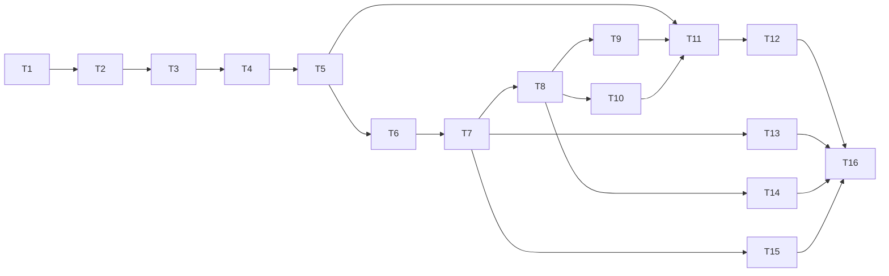

# 插件系统实施计划

> **For agentic workers:** REQUIRED SUB-SKILL: Use superpowers:subagent-driven-development (recommended) or superpowers:executing-plans to implement this plan task-by-task. Steps use checkbox (`- [ ]`) syntax for tracking.

**Goal:** 落地 `docs/superpowers/specs/2026-08-12-plugin-system-design.md`：通用插件框架（数据源/管线/导出器/钩子四类扩展点）+ 宿主先行协议 + in-tree 与外部加载两条腿 + 四个首发插件（天地图源/MVT 管线/GeoPackage 导出/产物元数据钩子）。

**Architecture:** 新代码集中在 `src/plugins/`（宿主）与 `src/plugins/builtin/`（四个首发插件）。插件只跟宿主给的 `TaskContext` 门面说话，拿不到任何现有 manager；四条现有管线不重构，只开两道通用缝（`create_task` 的 source_snapshot 覆盖、`get_tile_url` 的 `{credential}` 占位符）。插件任务存宿主提供的 `plugin_tasks` 一张表，经 `history_all` 第五段 UNION 进统一任务中心。

**Tech Stack:** Python 3.12（`tomllib` 标准库）、Flask + SocketIO、SQLite（user_version 迁移）、aiohttp、GDAL/osgeo、Nuitka standalone。**零新增第三方依赖。**

**Spec:** `docs/superpowers/specs/2026-08-12-plugin-system-design.md`。本计划对规格的三处细化：① `plugin_tasks` 表增加进度/耗时列以对齐 UNION 列序；② `TaskContext` 不暴露 `reserve()`，资源由宿主在启动时一次性预留，插件只读 `granted()`——单预留比逐次申请更难泄漏；③ 插件 `i18n.toml` 运行时合并（规格 §16 风险 2）**推迟**——四个首发插件都没有自定义 UI 文案需求（参数 label 直接用纯字符串），等第一个带自定义资产的插件落地时再做。

## Global Constraints

- 所有 Python 命令走 `uv run`；测试 `uv run pytest tests/ -x -q`，单文件 `uv run pytest tests/test_x.py -q`。
- **osgeo import 先例**：任何新模块 import osgeo 之前必须先 `from src.core.gdal_mode import pin_gdal_exception_mode; pin_gdal_exception_mode()`（见 `src/services/download_engine.py:40`）。
- **i18n**：宿主 UI 文案必须进 `src/i18n/catalog/` 新域并在 `_DOMAINS` 登记（`src/i18n/catalog/__init__.py:19`）；模板/JS 不许有裸中文，`tests/test_i18n.py` 双向钉死。
- **Nuitka 可达性**：`src/plugins/` 下每个新模块都要在 `src/app_factory.py:27-40` 的预热清单加一行（`import src.plugins.xxx  # noqa: F401`）。
- **离线不变量**：插件资产只从本地目录服务，禁止任何 CDN/远程引用。
- **数据库迁移**：`PRAGMA user_version` 当前为 6，本计划用 **7**；迁移函数模式照抄 `migrate_cache_to_source_namespace`（`src/core/database.py:528-558`）。
- **测试约定**：用 `tests/conftest.py` 的 `db` fixture 与 `fresh_import()`/`isolated_app`；**禁止**手写 `sys.modules.pop` 清单（`tests/test_conftest_isolation_contract.py` 钉死）。
- **提交**：中文 + conventional 前缀，`git commit -F - <<'EOF'` 形式。
- 新增路由必须同步 README「## API 端点」一节（`tests/test_docs_claims.py:70-137` 用 AST 对账）。
- 插件任务的 `task_type` 字面量统一为 **`'plugin'`**（一个值，不是 `plugin:<id>`）；`plugin_id` 走独立字段/列。

---

### Task 1: 数据库 — plugin_tasks / plugin_task_tiles / plugins 三表 + user_version 7

**Files:**
- Modify: `src/core/database.py`（init_database 建表区 + 新迁移函数）
- Modify: `src/contracts/artifact.py:33-38`（PIPELINES + _PIPELINE_TABLES）
- Modify: `src/services/task_deletion.py:78-79`（_DELETABLE_TASK_TABLES）
- Test: `tests/test_plugin_db_schema.py`

**Interfaces:**
- Produces: 三张表（schema 见 Step 3）；`PIPELINES` 含 `'plugin'`；`_PIPELINE_TABLES['plugin'] == 'plugin_tasks'`；`delete_task_row(table='plugin_tasks')` 不再 ValueError。

**背景**：`plugin_task_tiles` 仿 `task_tiles` 的稀疏缺块表语义（有行即有洞），但**不加外键**——插件任务删除走「先停线程、批次缓冲随 stop 丢弃、启动时清孤儿行」，不引入 map 管线的 tombstone 机制（理由：插件管理器是单写入者，启动清理 `DELETE FROM plugin_task_tiles WHERE task_id NOT IN (SELECT id FROM plugin_tasks)` 足够）。

- [ ] **Step 1: 写失败测试**

```python
# tests/test_plugin_db_schema.py
"""插件系统三张表的建表与迁移契约。"""

import sqlite3


def _columns(db, table):
    conn = sqlite3.connect(db)
    try:
        return {row[1] for row in conn.execute(f'PRAGMA table_info({table})')}
    finally:
        conn.close()


def test_plugin_tables_exist_with_expected_columns(db):
    for table in ('plugin_tasks', 'plugin_task_tiles', 'plugins'):
        assert _columns(db, table), f'{table} 未建'
    assert {'id', 'plugin_id', 'name', 'status', 'params_json', 'region_json',
            'output_path', 'total_items', 'downloaded_items', 'failed_items',
            'gap_tiles', 'gap_decision', 'total_running_seconds',
            'north', 'south', 'east', 'west', 'zoom_min', 'zoom_max',
            'created_at', 'started_at', 'completed_at', 'error_message'
            } <= _columns(db, 'plugin_tasks')
    assert {'task_id', 'zoom', 'x', 'y', 'status', 'retry_count',
            'error_message'} <= _columns(db, 'plugin_task_tiles')
    assert {'id', 'enabled', 'version', 'origin', 'config_json',
            'load_error', 'installed_at'} <= _columns(db, 'plugins')


def test_user_version_is_7(db):
    conn = sqlite3.connect(db)
    try:
        assert conn.execute('PRAGMA user_version').fetchone()[0] >= 7
    finally:
        conn.close()


def test_plugin_pipeline_registered_in_contracts(db):
    from src.contracts.artifact import PIPELINES, _PIPELINE_TABLES
    from src.contracts.artifact import Artifact, ArtifactKind
    assert 'plugin' in PIPELINES
    assert _PIPELINE_TABLES['plugin'] == 'plugin_tasks'
    a = Artifact(pipeline='plugin', task_id=1,
                 kind=ArtifactKind.MBTILES, path='/tmp/x.mbtiles')
    assert a.task_table == 'plugin_tasks'


def test_plugin_tasks_deletable(db):
    from src.services.task_deletion import _DELETABLE_TASK_TABLES
    assert 'plugin_tasks' in _DELETABLE_TASK_TABLES
```

注：`db` fixture 由 `tests/conftest.py` 提供（参照 `tests/test_fix_stranded_tiling_jobs.py:137` 的用法；先读 conftest 确认该 fixture 的形参名与返回值——若它返回路径以外的形态，按现状适配）。

- [ ] **Step 2: 跑测试确认失败**

Run: `uv run pytest tests/test_plugin_db_schema.py -q`
Expected: FAIL（表不存在 / 'plugin' not in PIPELINES）

- [ ] **Step 3: init_database 建表 + 迁移函数**

在 `src/core/database.py` 的 `init_database()` 建表区（artifacts 表之后，`:1099` 附近）追加：

```python
        # ---- 插件系统（§13-4，规格 docs/superpowers/specs/2026-08-12-plugin-system-design.md）
        # plugin_tasks：全部插件管线共用的一张任务表——契约第 2 条「不允许自带
        # 任务表」的落法，宿主给一张通用的，plugin_id 区分来源。缺块/耗时/进度
        # 列与 tasks 表对齐，是为了 history_all 的 UNION 列序逐位对上。
        cursor.execute('''
            CREATE TABLE IF NOT EXISTS plugin_tasks (
                id INTEGER PRIMARY KEY AUTOINCREMENT,
                plugin_id TEXT NOT NULL,
                name TEXT DEFAULT '',
                status TEXT NOT NULL DEFAULT 'pending',
                north REAL, south REAL, east REAL, west REAL,
                zoom_min INTEGER, zoom_max INTEGER,
                region_json TEXT DEFAULT '',
                params_json TEXT DEFAULT '{}',
                output_path TEXT DEFAULT '',
                total_items INTEGER DEFAULT 0,
                downloaded_items INTEGER DEFAULT 0,
                failed_items INTEGER DEFAULT 0,
                gap_tiles INTEGER DEFAULT 0,
                gap_decision TEXT DEFAULT '',
                total_running_seconds INTEGER DEFAULT 0,
                created_at TIMESTAMP DEFAULT CURRENT_TIMESTAMP,
                started_at TIMESTAMP,
                completed_at TIMESTAMP,
                error_message TEXT DEFAULT ''
            )
        ''')
        cursor.execute('''
            CREATE INDEX IF NOT EXISTS idx_plugin_tasks_status
            ON plugin_tasks(status)
        ''')
        # 稀疏缺块表，语义同 task_tiles（有行即有洞，status 是 TileOutcome 值）。
        # 刻意不加外键：删除路径是「先停线程再删行」，孤儿行由启动清理兜底，
        # 不引入 map 管线的 tombstone 机制。
        cursor.execute('''
            CREATE TABLE IF NOT EXISTS plugin_task_tiles (
                task_id INTEGER NOT NULL,
                zoom INTEGER NOT NULL,
                x INTEGER NOT NULL,
                y INTEGER NOT NULL,
                status TEXT NOT NULL,
                retry_count INTEGER DEFAULT 0,
                error_message TEXT,
                PRIMARY KEY (task_id, zoom, x, y)
            )
        ''')
        # 插件注册表：enabled 缺省 0（§13-4 契约第 1 条「缺省关闭」）。
        # config_json 存插件自己的配置——不进 DEFAULT_CONFIGS，理由见规格 §9。
        cursor.execute('''
            CREATE TABLE IF NOT EXISTS plugins (
                id TEXT PRIMARY KEY,
                enabled INTEGER NOT NULL DEFAULT 0,
                version TEXT DEFAULT '',
                origin TEXT DEFAULT 'external',
                config_json TEXT DEFAULT '{}',
                load_error TEXT DEFAULT '',
                installed_at TIMESTAMP DEFAULT CURRENT_TIMESTAMP
            )
        ''')
```

再加迁移函数（放在 `migrate_cache_to_source_namespace` 之后）：

```python
def migrate_plugin_schema(cursor) -> int:
    """插件系统三表（user_version 6 → 7）。

    建表本身是 CREATE TABLE IF NOT EXISTS，新库老库同一条路径；这个函数
    只做一件事：把 user_version 推到 7，让「跑没跑过」可判。
    """
    if cursor.execute('PRAGMA user_version').fetchone()[0] >= 7:
        return 0
    cursor.execute('PRAGMA user_version = 7')
    logger.info('插件系统表就绪 (user_version=7)')
    return 1
```

并在 `init_database()` 末尾其它迁移调用处加一行 `migrate_plugin_schema(cursor)`。

- [ ] **Step 4: 扩展 contracts 与删除白名单**

`src/contracts/artifact.py:33-38`：

```python
PIPELINES = ('map', 'dem', 'contour', 'local_terrain', 'plugin')

_PIPELINE_TABLES = {'map': 'tasks', 'dem': 'dem_tasks',
                    'contour': 'contour_tasks',
                    'local_terrain': 'local_terrain_tasks',
                    'plugin': 'plugin_tasks'}
```

`src/services/task_deletion.py:78-79`：

```python
_DELETABLE_TASK_TABLES = frozenset(
    {'tasks', 'dem_tasks', 'contour_tasks', 'local_terrain_tasks',
     'plugin_tasks'})
```

**注意**：`clear_cache=True` 对 `plugin_tasks` 会被 `delete_task_row` 拒绝（`_CACHE_OWNING_TABLE` 只有 `tasks`）——这是对的，插件缓存归 cache 治理页管，不在删除对话框里。

- [ ] **Step 5: 审计 PIPELINES 的全部消费者**

Run: `grep -rn "PIPELINES" src/ | grep -v artifact.py`

逐个核对（已知的）：`task_logging.task_log_path`（白名单→插件任务获得每任务日志，**预期效果**）；`api.py` logs 路由（同上）；`api.py:1873` export 路由守卫（`'plugin'` 会过第一关、被 `_EXPORTABLE_PIPELINES` 第二关拦下 400，**正确**——插件导出走 Task 8 的专用路由）；`artifact_store`（不校验，无恙）。若 grep 出现此清单之外的消费者，逐个判断「接受 plugin 是否安全」并处理。

- [ ] **Step 6: 跑测试确认通过 + 全量回归**

Run: `uv run pytest tests/test_plugin_db_schema.py -q && uv run pytest tests/ -x -q`
Expected: PASS；全量绿。

- [ ] **Step 7: 提交**

```bash
git add src/core/database.py src/contracts/artifact.py src/services/task_deletion.py tests/test_plugin_db_schema.py
git commit -F - <<'EOF'
feat(plugins): 插件系统三表与 plugin 管线注册（user_version 7）

plugin_tasks / plugin_task_tiles / plugins 建表；contracts.PIPELINES
与 _PIPELINE_TABLES 收 'plugin'；delete_task_row 白名单加 plugin_tasks。
行为变化仅限新表存在，四条现有管线路径不变。
EOF
```

---

### Task 2: 协议层 — src/plugins/protocols.py

**Files:**
- Create: `src/plugins/__init__.py`（一行 docstring）
- Create: `src/plugins/protocols.py`
- Modify: `src/app_factory.py:27-40`（可达性清单）
- Test: `tests/test_plugin_protocols.py`

**Interfaces:**
- Produces（后续所有任务依赖这些名字，逐字锁定）：`PLUGIN_API_VERSION = '1.0'`、`API_MAJOR = '1'`；`SourceDescriptor`、`ParamSpec`、`ParamSchema`、`PluginOutcome`、`TaskEvent`、`ExportContext`、`PluginDefinition`；Protocols：`SourceProvider`、`PipelinePlugin`、`Exporter`、`TaskHook`（全部 `@runtime_checkable`）。

- [ ] **Step 1: 写失败测试**

```python
# tests/test_plugin_protocols.py
"""协议层的形状契约：dataclass 字段、Protocol 可运行时检查、API 版本。"""

from src.plugins.protocols import (
    API_MAJOR, PLUGIN_API_VERSION, Exporter, ParamSchema, ParamSpec,
    PipelinePlugin, PluginDefinition, PluginOutcome, SourceDescriptor,
    TaskEvent, TaskHook, ExportContext)


def test_api_version_shape():
    assert PLUGIN_API_VERSION == '1.0'
    assert API_MAJOR == PLUGIN_API_VERSION.split('.')[0]


def test_param_spec_defaults():
    p = ParamSpec(key='zoom', type='int', label='层级')
    assert p.required is True and p.choices == () and p.depends_on == {}


def test_plugin_outcome_values():
    assert {o.value for o in PluginOutcome} == {
        'completed', 'completed_with_gaps', 'pending_decision'}


def test_protocols_runtime_checkable():
    class FakePipeline:
        def params_schema(self): return ParamSchema(specs=())
        def estimate(self, params, region): return None
        def run(self, ctx): return PluginOutcome.COMPLETED

    class NotAPipeline: pass

    assert isinstance(FakePipeline(), PipelinePlugin)
    assert not isinstance(NotAPipeline(), PipelinePlugin)
    assert not isinstance(FakePipeline(), Exporter)


def test_plugin_definition_defaults_empty():
    d = PluginDefinition()
    assert d.sources == () and d.pipeline is None and d.exporters == () \
        and d.hooks == () and d.source_provider is None
```

- [ ] **Step 2: 跑测试确认失败**

Run: `uv run pytest tests/test_plugin_protocols.py -q`
Expected: FAIL（ModuleNotFoundError: src.plugins）

- [ ] **Step 3: 实现**

`src/plugins/__init__.py`：

```python
"""插件系统宿主。规格：docs/superpowers/specs/2026-08-12-plugin-system-design.md。"""
```

`src/plugins/protocols.py`：

```python
"""四类扩展点的协议与共享数据类。

刻意不进 src/contracts/：contracts 的不变量是「零 Flask / 零 GDAL / 零
SQLite import，测试与估算器可脱离 app 使用」，而这里的行为协议恰恰服务
于运行期装配。数据形状（RegionSpec/SourceSnapshot/Artifact/TileOutcome）
继续从 contracts 拿，这里不重复定义。

插件作者只看这一个文件 + task_context.py 的 TaskContext。
"""

from __future__ import annotations

from dataclasses import dataclass, field
from enum import Enum
from pathlib import Path
from typing import (Any, Callable, Dict, Mapping, Optional, Protocol,
                    Sequence, Tuple, runtime_checkable)

#: 宿主导出的插件 API 版本。major 不匹配的插件拒载——第三方插件在宿主升级后
#: 要明确坏掉，而不是静默行为错乱。
PLUGIN_API_VERSION = '1.0'
API_MAJOR = PLUGIN_API_VERSION.split('.')[0]


@dataclass(frozen=True)
class SourceDescriptor:
    """一个插件数据源的声明。纯数据——多数源不需要一行代码。"""

    source_id: str
    name: str                       # 显示名（插件自带文案，不进主 catalog）
    url_template: str               # 必须含 {z}{x}{y}；可选 {s} / {credential}
    max_zoom: int
    attribution: str = ''
    usage_policy: str = ''
    subdomains: Tuple[str, ...] = ()
    credential_key: str = ''        # plugins.config_json 里的键名；'' = 无凭据


@dataclass(frozen=True)
class ParamSpec:
    """声明式任务参数。type ∈ region|zoom_range|path|int|float|str|bool|enum|credential。"""

    key: str
    type: str
    label: str
    default: Any = None
    required: bool = True
    min: Optional[float] = None
    max: Optional[float] = None
    choices: Tuple[str, ...] = ()
    depends_on: Dict[str, Any] = field(default_factory=dict)


@dataclass(frozen=True)
class ParamSchema:
    specs: Tuple[ParamSpec, ...] = ()

    def keys(self) -> Tuple[str, ...]:
        return tuple(s.key for s in self.specs)


class PluginOutcome(Enum):
    """PipelinePlugin.run() 的返回。completed_with_gaps / pending_decision
    触发宿主走 §13-3 的缺块决策流，插件自己不写这套状态机。"""

    COMPLETED = 'completed'
    COMPLETED_WITH_GAPS = 'completed_with_gaps'
    PENDING_DECISION = 'pending_decision'


@dataclass(frozen=True)
class TaskEvent:
    """钩子事件。v1 的 kind 只有 'task_completed'（规格 §14：核心管线的
    状态迁移统一成事件源是后续独立工作）。"""

    kind: str
    pipeline: str                   # v1 恒 'plugin'
    task_id: int
    plugin_id: str


@dataclass(frozen=True)
class ExportContext:
    task_id: int
    log: Callable[[str, str], None]          # (message, level)
    progress: Callable[[int, int], None]     # (done, total)


@runtime_checkable
class SourceProvider(Protocol):
    """需要代码鉴权/动态元数据的数据源才实现它；纯模板源只用 SourceDescriptor。"""

    def list_sources(self) -> Sequence[SourceDescriptor]: ...
    def snapshot(self, source_id: str, cfg: Mapping[str, str]): ...  # → SourceSnapshot
    def authorize(self, headers: Dict[str, str], cfg: Mapping[str, str]) -> None: ...


@runtime_checkable
class PipelinePlugin(Protocol):
    def params_schema(self) -> ParamSchema: ...
    def estimate(self, params: Mapping[str, Any], region) -> Any: ...  # → DiskEstimate
    def run(self, ctx) -> PluginOutcome: ...                          # ctx: TaskContext


@runtime_checkable
class Exporter(Protocol):
    def format_id(self) -> str: ...
    def accepts(self, kind) -> bool: ...          # kind: ArtifactKind
    def export(self, artifact, dest: Path, ctx: ExportContext): ...   # → Artifact


@runtime_checkable
class TaskHook(Protocol):
    """旁路：宿主调用时包 try/except，抛异常只记日志，绝不影响任务。"""

    def on_event(self, event: TaskEvent) -> None: ...


@dataclass(frozen=True)
class PluginDefinition:
    """plugin.py 的 register() 返回值。全部成员可选——纯数据源插件只有 sources。"""

    sources: Tuple[SourceDescriptor, ...] = ()
    source_provider: Optional[SourceProvider] = None
    pipeline: Optional[PipelinePlugin] = None
    exporters: Tuple[Exporter, ...] = ()
    hooks: Tuple[TaskHook, ...] = ()
```

- [ ] **Step 4: 可达性清单登记 + 跑测试**

`src/app_factory.py:27-40` 清单加 `import src.plugins.protocols  # noqa: F401`。

Run: `uv run pytest tests/test_plugin_protocols.py -q`
Expected: PASS

- [ ] **Step 5: 提交**

```bash
git add src/plugins/__init__.py src/plugins/protocols.py src/app_factory.py tests/test_plugin_protocols.py
git commit -m "feat(plugins): 四类扩展点协议与共享数据类（PLUGIN_API_VERSION=1.0）"
```

---

### Task 3: 声明式参数 — src/plugins/params.py

**Files:**
- Create: `src/plugins/params.py`
- Modify: `src/app_factory.py`（清单加一行）
- Test: `tests/test_plugin_params.py`

**Interfaces:**
- Consumes: `ParamSpec` / `ParamSchema`（Task 2）
- Produces: `validate_params(schema: ParamSchema, raw: Mapping) -> Tuple[Dict[str, Any], Dict[str, str]]`（清洗值, 错误表；空错误表 = 通过）；`PARAM_TYPES` 常量。

- [ ] **Step 1: 写失败测试**

```python
# tests/test_plugin_params.py
"""声明式参数校验：类型、必填、边界、枚举、缺省、未知键。"""

from src.plugins.params import PARAM_TYPES, validate_params
from src.plugins.protocols import ParamSchema, ParamSpec

SCHEMA = ParamSchema(specs=(
    ParamSpec(key='name', type='str', label='名称', default='未命名'),
    ParamSpec(key='zoom', type='int', label='层级', min=0, max=19),
    ParamSpec(key='ratio', type='float', label='比例', required=False, default=1.0),
    ParamSpec(key='mode', type='enum', label='模式', choices=('a', 'b')),
    ParamSpec(key='save', type='bool', label='保存', required=False, default=False),
))


def test_valid_payload_passes_with_defaults():
    clean, errors = validate_params(SCHEMA, {'zoom': '12', 'mode': 'a'})
    assert errors == {}
    assert clean['zoom'] == 12 and clean['name'] == '未命名' \
        and clean['ratio'] == 1.0 and clean['save'] is False


def test_missing_required_is_an_error():
    _, errors = validate_params(SCHEMA, {'mode': 'a'})
    assert 'zoom' in errors


def test_out_of_range_and_bad_enum():
    _, errors = validate_params(SCHEMA, {'zoom': 99, 'mode': 'zzz'})
    assert 'zoom' in errors and 'mode' in errors


def test_unknown_keys_are_rejected():
    _, errors = validate_params(SCHEMA, {'zoom': 3, 'mode': 'a', 'evil': 1})
    assert 'evil' in errors


def test_type_coercion_is_strict():
    _, errors = validate_params(SCHEMA, {'zoom': 'abc', 'mode': 'a'})
    assert 'zoom' in errors
    _, errors = validate_params(SCHEMA, {'zoom': 3, 'mode': 'a', 'save': 'yes'})
    assert 'save' in errors


def test_param_types_locked():
    assert set(PARAM_TYPES) == {
        'region', 'zoom_range', 'path', 'int', 'float', 'str', 'bool',
        'enum', 'credential'}
```

- [ ] **Step 2: 跑测试确认失败 → 实现**

`src/plugins/params.py`：

```python
"""声明式参数的单一校验器。前端表单与后端路由共用这一份 schema，后端权威。"""

from __future__ import annotations

from typing import Any, Dict, Mapping, Tuple

from src.plugins.protocols import ParamSchema

PARAM_TYPES = ('region', 'zoom_range', 'path', 'int', 'float', 'str',
               'bool', 'enum', 'credential')


def _coerce(spec, value):
    """(ok, coerced)。bool 只收 True/False/'true'/'false'/1/0——任意真值
    字符串静默吞掉配置错误是这个项目踩过的坑。"""
    if spec.type == 'int':
        try:
            v = int(value)
        except (TypeError, ValueError):
            return False, None
        if spec.min is not None and v < spec.min:
            return False, None
        if spec.max is not None and v > spec.max:
            return False, None
        return True, v
    if spec.type == 'float':
        try:
            v = float(value)
        except (TypeError, ValueError):
            return False, None
        if spec.min is not None and v < spec.min:
            return False, None
        if spec.max is not None and v > spec.max:
            return False, None
        return True, v
    if spec.type == 'bool':
        if value in (True, 'true', 'True', 1):
            return True, True
        if value in (False, 'false', 'False', 0):
            return True, False
        return False, None
    if spec.type == 'enum':
        v = str(value)
        return (v in spec.choices), (v if v in spec.choices else None)
    # str / path / credential / region / zoom_range：结构化类型由调用方
    # （路由层）另行校验，这里只做非空与 str 化。
    v = value if isinstance(value, (dict, list)) else str(value)
    if spec.required and (v == '' or v is None):
        return False, None
    return True, v


def validate_params(schema: ParamSchema,
                    raw: Mapping[str, Any]) -> Tuple[Dict[str, Any], Dict[str, str]]:
    """(清洗值, 错误表)。未知键报错——与 PUT /api/config 的 known_keys 闸门
    同一个理由：静默吞掉的键让用户以为设置生效了。"""
    if not isinstance(raw, Mapping):
        return {}, {'_': 'params must be an object'}
    clean: Dict[str, Any] = {}
    errors: Dict[str, str] = {}
    known = set(schema.keys())
    for key in raw:
        if key not in known:
            errors[key] = 'unknown param'
    for spec in schema.specs:
        if spec.key not in raw:
            if spec.required and spec.default is None:
                errors[spec.key] = 'required'
            elif spec.default is not None:
                clean[spec.key] = spec.default
            continue
        ok, value = _coerce(spec, raw[spec.key])
        if ok:
            clean[spec.key] = value
        else:
            errors[spec.key] = f'invalid {spec.type}'
    return clean, errors
```

- [ ] **Step 3: 可达性清单 + 跑测试 + 提交**

Run: `uv run pytest tests/test_plugin_params.py -q`
Expected: PASS

```bash
git add src/plugins/params.py src/app_factory.py tests/test_plugin_params.py
git commit -m "feat(plugins): 声明式参数 schema 与校验器"
```

---

### Task 4: manifest 解析 — src/plugins/manifest.py

**Files:**
- Create: `src/plugins/manifest.py`
- Modify: `src/app_factory.py`（清单加一行）
- Test: `tests/test_plugin_manifest.py`

**Interfaces:**
- Produces: `PluginManifest`（frozen dataclass，字段：`plugin_id, name, version, api_version, capabilities, entry='plugin.py', requires_abi='', permissions=(), ui_assets=(), description=''`）；`ManifestError(ValueError)`；`load_manifest_toml(path: Path) -> PluginManifest`；`manifest_from_dict(d: Mapping) -> PluginManifest`；`current_abi_tag() -> str`（如 `cp312-linux-x86_64`）。

- [ ] **Step 1: 写失败测试**

```python
# tests/test_plugin_manifest.py
"""plugin.toml 解析与校验：必填、id 形状、能力白名单、API 版本、ABI 标签。"""

import sys
import pytest

from src.plugins.manifest import (ManifestError, PluginManifest,
                                  current_abi_tag, load_manifest_toml,
                                  manifest_from_dict)

GOOD = {'id': 'demo', 'name': '演示', 'version': '0.1.0',
        'api_version': '1', 'capabilities': ['pipeline']}


def test_minimal_manifest_ok():
    m = manifest_from_dict(GOOD)
    assert m.plugin_id == 'demo' and m.entry == 'plugin.py' \
        and m.requires_abi == '' and m.ui_assets == ()


def test_id_shape_enforced():
    for bad in ('', 'A', 'a b', '../x', 'a/b', '中文'):
        with pytest.raises(ManifestError):
            manifest_from_dict({**GOOD, 'id': bad})


def test_capabilities_whitelist():
    with pytest.raises(ManifestError):
        manifest_from_dict({**GOOD, 'capabilities': ['root_shell']})


def test_api_version_required():
    with pytest.raises(ManifestError):
        manifest_from_dict({**GOOD, 'api_version': ''})


def test_toml_roundtrip(tmp_path):
    p = tmp_path / 'plugin.toml'
    p.write_text(
        'id = "demo"\nname = "演示"\nversion = "0.1.0"\n'
        'api_version = "1"\ncapabilities = ["pipeline"]\n'
        '[ui]\nassets = ["panel.js"]\n', encoding='utf-8')
    m = load_manifest_toml(p)
    assert m.ui_assets == ('panel.js',)


def test_ui_assets_traversal_rejected():
    with pytest.raises(ManifestError):
        manifest_from_dict({**GOOD, 'ui': {'assets': ['../evil.js']}})


def test_abi_tag_format():
    tag = current_abi_tag()
    assert tag.startswith(f'cp{sys.version_info.major}{sys.version_info.minor}-')
```

- [ ] **Step 2: 实现**

```python
# src/plugins/manifest.py
"""plugin.toml 的解析与校验。external 插件从 TOML 读；builtin 插件从
模块里的 MANIFEST dict 读——同一个校验函数，同一批错误。"""

from __future__ import annotations

import platform
import re
import sys
import tomllib
from dataclasses import dataclass
from pathlib import Path
from typing import Mapping, Tuple

_ID_RE = re.compile(r'^[a-z][a-z0-9_\-]{0,63}$')
_CAPABILITIES = frozenset({'sources', 'pipeline', 'exporter', 'hook'})
_PERMISSIONS = frozenset({'network', 'filesystem', 'subprocess'})


class ManifestError(ValueError):
    """插件清单非法。registry 捕获后写 plugins.load_error，绝不向上抛穿启动。"""


@dataclass(frozen=True)
class PluginManifest:
    plugin_id: str
    name: str
    version: str
    api_version: str
    capabilities: Tuple[str, ...] = ()
    entry: str = 'plugin.py'
    requires_abi: str = ''          # 如 'cp312-linux-x86_64'；'' = 纯 Python
    permissions: Tuple[str, ...] = ()
    ui_assets: Tuple[str, ...] = ()
    description: str = ''


def current_abi_tag() -> str:
    """带二进制 vendor 的插件在 manifest 声明 requires_abi，不匹配拒载——
    否则用户拿到的是一段看不懂的 ImportError。"""
    return (f'cp{sys.version_info.major}{sys.version_info.minor}'
            f'-{sys.platform}-{platform.machine() or "unknown"}')


def manifest_from_dict(d: Mapping) -> PluginManifest:
    if not isinstance(d, Mapping):
        raise ManifestError('manifest must be a table/dict')
    pid = str(d.get('id') or '')
    if not _ID_RE.match(pid):
        raise ManifestError(
            f'非法插件 id：{pid!r}（小写字母/数字/中划线/下划线，字母开头）')
    name = str(d.get('name') or '').strip()
    version = str(d.get('version') or '').strip()
    api_version = str(d.get('api_version') or '').strip()
    if not name or not version or not api_version:
        raise ManifestError('name / version / api_version 均必填')
    caps = tuple(str(c) for c in (d.get('capabilities') or ()))
    unknown = set(caps) - _CAPABILITIES
    if unknown:
        raise ManifestError(f'未知 capabilities：{sorted(unknown)}')
    perms = tuple(str(p) for p in (d.get('permissions') or ()))
    bad_perms = set(perms) - _PERMISSIONS
    if bad_perms:
        raise ManifestError(f'未知 permissions：{sorted(bad_perms)}')
    ui = d.get('ui') or {}
    assets = tuple(str(a) for a in (ui.get('assets') or ()))
    for a in assets:
        if a.startswith('/') or '..' in Path(a).parts:
            raise ManifestError(f'ui.assets 不许越出插件目录：{a!r}')
    return PluginManifest(
        plugin_id=pid, name=name, version=version, api_version=api_version,
        capabilities=caps, entry=str(d.get('entry') or 'plugin.py'),
        requires_abi=str(d.get('requires_abi') or ''),
        permissions=perms, ui_assets=assets,
        description=str(d.get('description') or ''))


def load_manifest_toml(path: Path) -> PluginManifest:
    try:
        with open(path, 'rb') as f:
            data = tomllib.load(f)
    except (OSError, tomllib.TOMLDecodeError) as e:
        raise ManifestError(f'plugin.toml 读取/解析失败：{e}') from e
    return manifest_from_dict(data)
```

- [ ] **Step 3: 可达性清单 + 跑测试 + 提交**

Run: `uv run pytest tests/test_plugin_manifest.py -q`
Expected: PASS

```bash
git add src/plugins/manifest.py src/app_factory.py tests/test_plugin_manifest.py
git commit -m "feat(plugins): plugin.toml 清单解析与校验（id/能力/API 版本/ABI 闸）"
```

---

### Task 5: 注册表 + 凭据 — src/plugins/registry.py + credentials.py

**Files:**
- Create: `src/plugins/registry.py`、`src/plugins/credentials.py`
- Modify: `src/app_factory.py`（清单加两行）
- Test: `tests/test_plugin_registry.py`

**Interfaces:**
- Consumes: Task 1 的 plugins 表；Task 2 协议；Task 4 的 manifest API。
- Produces（Task 6/7/8/11/12-15 依赖，逐字锁定）：

```python
@dataclass
class PluginRecord:
    manifest: PluginManifest
    origin: str                      # 'builtin' | 'external'
    root: Optional[Path]             # external：plugins/<id>/；builtin：None
    enabled: bool
    load_error: str
    definition: Optional[PluginDefinition]

load_all(socketio=None) -> None
list_records() -> List[PluginRecord]
get_record(plugin_id) -> Optional[PluginRecord]
set_enabled(plugin_id, enabled) -> None          # 未知 id 抛 KeyError
get_config(plugin_id) -> dict
set_config(plugin_id, values) -> Dict[str, str]  # errors；空 = 成功
list_sources() -> List[dict]        # [{'plugin_id','source_id','name','max_zoom','attribution','needs_credential'}]
build_source_snapshot(plugin_id, source_id) -> SourceSnapshot   # 抛 KeyError
get_pipeline(plugin_id) -> Optional[PipelinePlugin]  # 仅启用且加载成功
iter_exporters() -> Iterator[Tuple[str, Exporter]]
exporter_for(fmt) -> Optional[Exporter]
list_export_formats() -> Tuple[str, ...]
iter_hooks() -> Iterator[Tuple[str, TaskHook]]
dispatch_event(event: TaskEvent) -> None
reset_for_tests() -> None
# credentials.py
resolve_reference(reference: str) -> str   # 'plugin:<id>:<key>' → 值；无则 ''
invalidate(plugin_id=None) -> None
```

**背景**：in-tree 清单硬编码（与 `src/i18n/catalog/__init__.py:4-5` 同一理由：Nuitka 扫不到动态发现）。外部插件扫 `Config.BASE_DIR/plugins/*/plugin.toml`。任何插件的 manifest/import/register 异常只落它自己的 `load_error`。

- [ ] **Step 1: 写失败测试**

```python
# tests/test_plugin_registry.py
"""注册表：发现、启停、失败隔离、API 版本闸、ABI 闸、vendor、凭据解析。"""

from src.plugins import credentials, registry


def _write_external(root, pid, *, api='1', caps='["hook"]',
                    body='from src.plugins.protocols import PluginDefinition\n'
                         'def register():\n    return PluginDefinition()\n',
                    abi=''):
    d = root / 'plugins' / pid
    d.mkdir(parents=True)
    (d / 'plugin.toml').write_text(
        f'id = "{pid}"\nname = "{pid}"\nversion = "0.1"\n'
        f'api_version = "{api}"\ncapabilities = {caps}\n'
        + (f'requires_abi = "{abi}"\n' if abi else ''), encoding='utf-8')
    (d / 'plugin.py').write_text(body, encoding='utf-8')
    return d


def _fresh(tmp_path, monkeypatch):
    monkeypatch.setattr(registry, '_plugins_root',
                        lambda: tmp_path / 'plugins')
    registry.reset_for_tests()


def test_external_plugin_loads_disabled_by_default(db, tmp_path, monkeypatch):
    _fresh(tmp_path, monkeypatch)
    _write_external(tmp_path, 'demo')
    registry.load_all()
    rec = registry.get_record('demo')
    assert rec is not None and rec.origin == 'external'
    assert rec.enabled is False and rec.load_error == ''
    assert rec.definition is not None  # 发现即加载，启用只控能力暴露


def test_bad_manifest_isolated(db, tmp_path, monkeypatch):
    _fresh(tmp_path, monkeypatch)
    (tmp_path / 'plugins' / 'broken').mkdir(parents=True)
    (tmp_path / 'plugins' / 'broken' / 'plugin.toml').write_text(
        'id = ""', encoding='utf-8')
    _write_external(tmp_path, 'good')
    registry.load_all()
    assert registry.get_record('broken').load_error != ''
    assert registry.get_record('good').load_error == ''


def test_import_error_isolated(db, tmp_path, monkeypatch):
    _fresh(tmp_path, monkeypatch)
    _write_external(tmp_path, 'boom', body='raise RuntimeError("boom")\n')
    registry.load_all()
    rec = registry.get_record('boom')
    assert 'boom' in rec.load_error and rec.definition is None


def test_api_major_mismatch_rejected(db, tmp_path, monkeypatch):
    _fresh(tmp_path, monkeypatch)
    _write_external(tmp_path, 'future', api='99')
    registry.load_all()
    assert 'api_version' in registry.get_record('future').load_error


def test_abi_mismatch_rejected(db, tmp_path, monkeypatch):
    _fresh(tmp_path, monkeypatch)
    _write_external(tmp_path, 'native', abi='cp399-os2-warp9')
    registry.load_all()
    assert 'abi' in registry.get_record('native').load_error.lower()


def test_vendor_dir_goes_on_sys_path(db, tmp_path, monkeypatch):
    _fresh(tmp_path, monkeypatch)
    d = _write_external(tmp_path, 'vend', body=(
        'import vendored_lib\n'
        'from src.plugins.protocols import PluginDefinition\n'
        'def register():\n    return PluginDefinition()\n'))
    vd = d / 'vendor'
    vd.mkdir()
    (vd / 'vendored_lib.py').write_text('VALUE = 42\n', encoding='utf-8')
    registry.load_all()
    assert registry.get_record('vend').load_error == ''


def test_enable_persists_and_gates_pipeline(db, tmp_path, monkeypatch):
    _fresh(tmp_path, monkeypatch)
    _write_external(tmp_path, 'demo2', caps='["pipeline"]', body=(
        'from src.plugins.protocols import (ParamSchema, PluginDefinition,\n'
        '                                   PluginOutcome)\n'
        'class P:\n'
        '    def params_schema(self): return ParamSchema(())\n'
        '    def estimate(self, params, region): return None\n'
        '    def run(self, ctx): return PluginOutcome.COMPLETED\n'
        'def register():\n    return PluginDefinition(pipeline=P())\n'))
    registry.load_all()
    assert registry.get_pipeline('demo2') is None      # 缺省关闭
    registry.set_enabled('demo2', True)
    assert registry.get_pipeline('demo2') is not None
    registry.reset_for_tests()
    registry.load_all()                                 # 重启后仍启用
    assert registry.get_pipeline('demo2') is not None
    registry.set_enabled('demo2', False)


def test_credential_resolution(db, tmp_path, monkeypatch):
    _fresh(tmp_path, monkeypatch)
    _write_external(tmp_path, 'cred')
    registry.load_all()
    registry.set_config('cred', {'token': 'sekret'})
    credentials.invalidate()
    assert credentials.resolve_reference('plugin:cred:token') == 'sekret'
    assert credentials.resolve_reference('plugin:cred:missing') == ''
    assert credentials.resolve_reference('not-a-plugin-ref') == ''
```

- [ ] **Step 2: 跑测试确认失败**

Run: `uv run pytest tests/test_plugin_registry.py -q`
Expected: FAIL（模块不存在）

- [ ] **Step 3: 实现 credentials.py**

```python
# src/plugins/credentials.py
"""插件凭据的运行期解析。

SourceSnapshot.credential_reference 存的是「键名」不是值（指纹只含键名，
凭据永不进哈希、不进日志、不进任务行）。瓦片 URL 模板里的 {credential}
占位符由 download_engine.get_tile_url 在请求时替换成这里解析出的值。

引用格式：'plugin:<plugin_id>:<config_key>'。
"""

from __future__ import annotations

import json
import logging
import threading
import time

logger = logging.getLogger(__name__)

_CACHE: dict = {}
_CACHE_AT: dict = {}
_TTL_SECONDS = 60.0
_LOCK = threading.Lock()


def resolve_reference(reference: str) -> str:
    """'plugin:<id>:<key>' → plugins.config_json 里的值；任何失败返回 ''。

    返回空串而不是抛：下载循环里一个凭据缺失应落成瓦片失败（401），
    在瓦片 outcome 里如实记账，而不是把整条管线打死。
    """
    parts = (reference or '').split(':')
    if len(parts) != 3 or parts[0] != 'plugin':
        return ''
    _, plugin_id, key = parts
    now = time.monotonic()
    with _LOCK:
        if plugin_id in _CACHE and now - _CACHE_AT.get(plugin_id, 0) < _TTL_SECONDS:
            return _CACHE[plugin_id].get(key, '')
    try:
        from src.core.database import get_connection
        conn = get_connection()
        try:
            row = conn.execute('SELECT config_json FROM plugins WHERE id = ?',
                               (plugin_id,)).fetchone()
        finally:
            conn.close()
        cfg = json.loads(row['config_json']) if row else {}
    except Exception as e:
        logger.warning('插件凭据解析失败（%s）：%r', plugin_id, e)
        cfg = {}
    with _LOCK:
        _CACHE[plugin_id] = cfg
        _CACHE_AT[plugin_id] = now
    return cfg.get(key, '')


def invalidate(plugin_id=None) -> None:
    """配置保存后调用。plugin_id=None 全清。"""
    with _LOCK:
        if plugin_id is None:
            _CACHE.clear()
            _CACHE_AT.clear()
        else:
            _CACHE.pop(plugin_id, None)
            _CACHE_AT.pop(plugin_id, None)
```

- [ ] **Step 4: 实现 registry.py**

```python
# src/plugins/registry.py
"""插件注册表：发现、加载、启停、失败隔离、四类能力的查询入口。

两条腿（规格 §10）：
- builtin：_BUILTIN 硬编码名单（与 i18n catalog 同一理由——Nuitka 静态
  分析扫不到动态发现），manifest 取模块级 MANIFEST dict；
- external：扫 Config.BASE_DIR/plugins/<id>/plugin.toml，importlib 按
  文件位置载入，vendor/ 子目录进 sys.path。

隔离：任何一个插件的 manifest/import/register 异常都只落它自己的
load_error，宿主与其他插件不受影响。
"""

from __future__ import annotations

import importlib.util
import json
import logging
import sys
import threading
from dataclasses import dataclass
from pathlib import Path
from typing import Dict, Iterator, List, Optional, Tuple

from src.core.config import Config
from src.core.database import get_connection
from src.plugins import credentials
from src.plugins.manifest import (ManifestError, PluginManifest,
                                  current_abi_tag, load_manifest_toml,
                                  manifest_from_dict)
from src.plugins.protocols import (API_MAJOR, PluginDefinition, TaskEvent)

logger = logging.getLogger(__name__)

#: in-tree 插件硬编码名单。新增 builtin 插件：① 这里加一行；
#: ② src/app_factory.py 可达性清单加一行。
_BUILTIN: Tuple[str, ...] = (
    'src.plugins.builtin.tianditu_source',
    'src.plugins.builtin.mvt_pipeline',
    'src.plugins.builtin.gpkg_exporter',
    'src.plugins.builtin.artifact_meta',
)


@dataclass
class PluginRecord:
    manifest: PluginManifest
    origin: str                       # 'builtin' | 'external'
    root: Optional[Path]
    enabled: bool
    load_error: str
    definition: Optional[PluginDefinition]


_LOCK = threading.RLock()
_RECORDS: Dict[str, PluginRecord] = {}


def _plugins_root() -> Path:
    """external 插件目录：exe 旁（打包）/ 仓库根（源码）的 plugins/。
    测试用 monkeypatch 替换本函数指向 tmp_path。"""
    return Path(Config.BASE_DIR) / 'plugins'


# ---------------------------------------------------------------- 持久化

def _upsert_row(m: PluginManifest, origin: str, load_error: str) -> bool:
    """登记/刷新插件行，返回 enabled 现值。已存在行只更新版本与错误——
    启停与配置是用户的决定，不是发现的副产物。"""
    conn = get_connection()
    try:
        row = conn.execute('SELECT enabled FROM plugins WHERE id = ?',
                           (m.plugin_id,)).fetchone()
        if row is None:
            conn.execute(
                'INSERT INTO plugins (id, enabled, version, origin, load_error)'
                ' VALUES (?, 0, ?, ?, ?)',
                (m.plugin_id, m.version, origin, load_error))
            enabled = False
        else:
            conn.execute(
                'UPDATE plugins SET version = ?, origin = ?, load_error = ?'
                ' WHERE id = ?',
                (m.version, origin, load_error, m.plugin_id))
            enabled = bool(row['enabled'])
        conn.commit()
        return enabled
    finally:
        conn.close()


# ---------------------------------------------------------------- 加载

def _check_api_version(m: PluginManifest) -> None:
    if (m.api_version or '').split('.')[0] != API_MAJOR:
        raise ManifestError(
            f'api_version {m.api_version!r} 与宿主 {API_MAJOR}.x 不兼容')


def _check_abi(m: PluginManifest) -> None:
    if m.requires_abi and m.requires_abi != current_abi_tag():
        raise ManifestError(
            f'ABI 不匹配：插件需要 {m.requires_abi}，宿主是 {current_abi_tag()}')


def _load_external_definition(root: Path, m: PluginManifest) -> PluginDefinition:
    vendor = root / 'vendor'
    if vendor.is_dir():
        sys.path.insert(0, str(vendor))
    entry = root / m.entry
    if not entry.is_file():
        raise ManifestError(f'入口文件不存在：{entry}')
    module_name = f'tf_plugin_{m.plugin_id}'
    spec = importlib.util.spec_from_file_location(module_name, entry)
    module = importlib.util.module_from_spec(spec)
    sys.modules[module_name] = module      # 插件内相对 import 需要
    spec.loader.exec_module(module)
    register = getattr(module, 'register', None)
    if not callable(register):
        raise ManifestError(f'{m.entry} 缺少 register() 函数')
    definition = register()
    if not isinstance(definition, PluginDefinition):
        raise ManifestError('register() 必须返回 PluginDefinition')
    return definition


def _load_builtin_definition(module_name: str):
    module = __import__(module_name, fromlist=['MANIFEST', 'register'])
    m = manifest_from_dict(getattr(module, 'MANIFEST'))
    register = getattr(module, 'register', None)
    definition = register() if callable(register) else PluginDefinition()
    return m, definition


def load_all(socketio=None) -> None:
    """启动时调用一次。可重复调用（重扫）；测试先 reset_for_tests。"""
    with _LOCK:
        _RECORDS.clear()
        for module_name in _BUILTIN:
            _load_one(module_name, 'builtin', None)
        root = _plugins_root()
        if root.is_dir():
            for child in sorted(root.iterdir()):
                if child.is_dir() and (child / 'plugin.toml').is_file():
                    _load_one(str(child / 'plugin.toml'), 'external', child)
        logger.info('插件注册表就绪：%d 个插件（启用 %d 个）',
                    len(_RECORDS),
                    sum(1 for r in _RECORDS.values() if r.enabled))


def _load_one(source: str, origin: str, root: Optional[Path]) -> None:
    """加载一个插件；任何失败落成 load_error 记录，绝不向上抛。"""
    record = None
    try:
        if origin == 'builtin':
            m, definition = _load_builtin_definition(source)
            _check_api_version(m)
        else:
            m = load_manifest_toml(Path(source))
            _check_api_version(m)
            _check_abi(m)
            definition = _load_external_definition(root, m)
        enabled = _upsert_row(m, origin, '')
        record = PluginRecord(m, origin, root, enabled, '', definition)
    except Exception as e:
        logger.exception('插件加载失败：%s', source)
        pid = (source.rsplit('.', 1)[-1] if origin == 'builtin'
               else Path(source).parent.name)
        err = f'{type(e).__name__}: {e}'
        try:
            m = PluginManifest(plugin_id=pid, name=pid, version='',
                               api_version=API_MAJOR)
            enabled = _upsert_row(m, origin, err)
            record = PluginRecord(m, origin, root, enabled, err, None)
        except Exception:
            logger.exception('插件连错误登记都失败：%s', source)
    if record is not None:
        _RECORDS[record.manifest.plugin_id] = record


def reset_for_tests() -> None:
    with _LOCK:
        _RECORDS.clear()


# ---------------------------------------------------------------- 查询与启停

def list_records() -> List[PluginRecord]:
    with _LOCK:
        return sorted(_RECORDS.values(), key=lambda r: r.manifest.plugin_id)


def get_record(plugin_id: str) -> Optional[PluginRecord]:
    with _LOCK:
        return _RECORDS.get(plugin_id)


def _enabled_definition(plugin_id: str) -> Optional[PluginDefinition]:
    rec = get_record(plugin_id)
    if rec is None or not rec.enabled or rec.definition is None:
        return None
    return rec.definition


def set_enabled(plugin_id: str, enabled: bool) -> None:
    rec = get_record(plugin_id)
    if rec is None:
        raise KeyError(f'未知插件：{plugin_id!r}')
    conn = get_connection()
    try:
        conn.execute('UPDATE plugins SET enabled = ? WHERE id = ?',
                     (1 if enabled else 0, plugin_id))
        conn.commit()
    finally:
        conn.close()
    with _LOCK:
        rec.enabled = bool(enabled)


def get_config(plugin_id: str) -> dict:
    conn = get_connection()
    try:
        row = conn.execute('SELECT config_json FROM plugins WHERE id = ?',
                           (plugin_id,)).fetchone()
    finally:
        conn.close()
    if not row:
        return {}
    try:
        return json.loads(row['config_json'] or '{}')
    except json.JSONDecodeError:
        return {}


def set_config(plugin_id: str, values) -> Dict[str, str]:
    """插件若定义了 pipeline.config_schema() 则先过校验。返回错误表，空 = 已存。"""
    rec = get_record(plugin_id)
    if rec is None:
        return {'_': '未知插件'}
    if rec.definition is not None and rec.definition.pipeline is not None:
        schema_fn = getattr(rec.definition.pipeline, 'config_schema', None)
        if callable(schema_fn):
            from src.plugins.params import validate_params
            _, errors = validate_params(schema_fn(), values)
            if errors:
                return errors
    conn = get_connection()
    try:
        conn.execute('UPDATE plugins SET config_json = ? WHERE id = ?',
                     (json.dumps(values, ensure_ascii=False), plugin_id))
        conn.commit()
    finally:
        conn.close()
    credentials.invalidate(plugin_id)
    return {}


# ---------------------------------------------------------------- 能力查询

def list_sources() -> List[dict]:
    out: List[dict] = []
    for rec in list_records():
        definition = _enabled_definition(rec.manifest.plugin_id)
        if definition is None:
            continue
        descriptors = list(definition.sources)
        if definition.source_provider is not None:
            descriptors.extend(definition.source_provider.list_sources())
        for d in descriptors:
            out.append({
                'plugin_id': rec.manifest.plugin_id,
                'source_id': d.source_id, 'name': d.name,
                'max_zoom': d.max_zoom, 'attribution': d.attribution,
                'needs_credential': bool(d.credential_key),
            })
    return out


def build_source_snapshot(plugin_id: str, source_id: str):
    """描述符 → SourceSnapshot。credential_reference 是键名不是值——
    凭据永不进指纹、日志与任务行（规格 §6）。"""
    from src.contracts.source import SourceSnapshot
    definition = _enabled_definition(plugin_id)
    if definition is None:
        raise KeyError(f'插件不可用：{plugin_id!r}')
    if definition.source_provider is not None:
        return definition.source_provider.snapshot(source_id,
                                                   get_config(plugin_id))
    for d in definition.sources:
        if d.source_id == source_id:
            return SourceSnapshot(
                source_id=f'plugin:{plugin_id}:{d.source_id}',
                url_template=d.url_template,
                style='p',
                subdomains=tuple(d.subdomains),
                credential_reference=(
                    f'plugin:{plugin_id}:{d.credential_key}'
                    if d.credential_key else ''),
                attribution=d.attribution,
                usage_policy=d.usage_policy,
            )
    raise KeyError(f'插件 {plugin_id!r} 没有数据源 {source_id!r}')


def get_pipeline(plugin_id: str):
    definition = _enabled_definition(plugin_id)
    return definition.pipeline if definition else None


def iter_exporters():
    for rec in list_records():
        definition = _enabled_definition(rec.manifest.plugin_id)
        if definition:
            for exporter in definition.exporters:
                yield rec.manifest.plugin_id, exporter


def exporter_for(fmt: str):
    for _pid, exporter in iter_exporters():
        if exporter.format_id() == fmt:
            return exporter
    return None


def list_export_formats() -> Tuple[str, ...]:
    return tuple(sorted({e.format_id() for _p, e in iter_exporters()}))


def iter_hooks():
    for rec in list_records():
        definition = _enabled_definition(rec.manifest.plugin_id)
        if definition:
            for hook in definition.hooks:
                yield rec.manifest.plugin_id, hook


def dispatch_event(event: TaskEvent) -> None:
    """钩子分发。旁路铁律：任何钩子异常只记日志，绝不影响任务。"""
    for plugin_id, hook in iter_hooks():
        try:
            hook.on_event(event)
        except Exception as e:
            logger.warning('插件钩子失败（%s，已忽略）：%r', plugin_id, e)
```

- [ ] **Step 5: 可达性清单 + 跑测试**

`src/app_factory.py` 清单加 `import src.plugins.credentials  # noqa: F401` 与 `import src.plugins.registry  # noqa: F401`。

Run: `uv run pytest tests/test_plugin_registry.py -q`
Expected: PASS（8 条）

- [ ] **Step 6: 提交**

```bash
git add src/plugins/registry.py src/plugins/credentials.py src/app_factory.py tests/test_plugin_registry.py
git commit -F - <<'EOF'
feat(plugins): 注册表与凭据解析

两条腿发现（builtin 硬编码名单 / external 扫 plugins/ 目录）、失败隔离、
API 版本与 ABI 拒载、vendor 目录进 sys.path、启停持久化、{credential}
凭据引用解析（值不进指纹与日志）。
EOF
```

---

### Task 6: TaskContext 门面 — src/plugins/task_context.py

**Files:**
- Create: `src/plugins/task_context.py`
- Modify: `src/app_factory.py`（清单加一行）
- Test: `tests/test_plugin_task_context.py`

**Interfaces:**
- Consumes: `source_registry.tile_cache_path`（`src/services/source_registry.py:205`）、`url_guard.ensure_fetchable_url`（`:247`）、`proxy_autodetect.resolve_from_config`（`:521`）、`task_logging.TaskLogger`、`artifact_store.record_artifact`、`TileOutcome`。
- Produces（Task 7 构造、插件 `run(ctx)` 消费，逐字锁定）：

```python
ctx.task_id: int
ctx.plugin_id: str
ctx.region: RegionSpec
ctx.params: Mapping
ctx.output_dir: Path                 # 宿主预创建
ctx.snapshot: Optional[SourceSnapshot]
ctx.stop_requested() -> bool
ctx.progress(done, total, phase='') -> None
ctx.log(message, level='info') -> None
ctx.log_event(kind, **fields) -> None
ctx.granted(kind: ResourceKind) -> int
ctx.check_url(url, allow_private=False) -> str
ctx.proxy_url() -> str
ctx.cache_path(z, x, y) -> Path
ctx.record_tile_outcome(z, x, y, outcome: TileOutcome, error=None) -> None
ctx.flush_outcomes() -> None
ctx.register_artifact(path, kind, has_gaps=False, fmt='', meta=None) -> None
ctx.close() -> None                  # 宿主收尾调用：flush + 关日志
```

- [ ] **Step 1: 写失败测试**

```python
# tests/test_plugin_task_context.py
"""TaskContext：outcome 攒批落库、缺块计数、产物登记、URL 闸、配额读取。"""

import sqlite3
import threading

import pytest

from src.contracts.artifact import ArtifactKind
from src.contracts.outcome import TileOutcome
from src.contracts.region import RegionSpec
from src.contracts.reservation import ResourceKind
from src.plugins.task_context import TaskContext


def _ctx(db, tmp_path, granted=None):
    return TaskContext(
        task_id=1, plugin_id='demo',
        region=RegionSpec.from_bbox(40.0, 30.0, 117.0, 116.0),
        params={'k': 'v'}, output_dir=tmp_path / 'out', snapshot=None,
        stop_flag=threading.Event(), tlog=None, emit_progress=None,
        granted=granted or {}, config_manager=None)


def _seed_task(db):
    conn = sqlite3.connect(db)
    conn.execute("INSERT INTO plugin_tasks (id, plugin_id, name, status)"
                 " VALUES (1, 'demo', 't', 'running')")
    conn.commit()
    conn.close()


def test_outcome_batch_flush_and_gap_count(db, tmp_path):
    _seed_task(db)
    ctx = _ctx(db, tmp_path)
    ctx.record_tile_outcome(3, 1, 1, TileOutcome.SUCCESS)
    ctx.record_tile_outcome(3, 1, 2, TileOutcome.RETRYABLE_FAILURE, 'boom')
    ctx.record_tile_outcome(3, 1, 3, TileOutcome.NO_DATA)
    ctx.flush_outcomes()
    conn = sqlite3.connect(db)
    rows = conn.execute(
        'SELECT status, y FROM plugin_task_tiles WHERE task_id = 1'
        ' ORDER BY y').fetchall()
    # success 不落行（稀疏表：有行即有洞）
    assert [(r[0], r[1]) for r in rows] == [
        (TileOutcome.RETRYABLE_FAILURE.value, 2), (TileOutcome.NO_DATA.value, 3)]
    gap = conn.execute(
        'SELECT gap_tiles FROM plugin_tasks WHERE id = 1').fetchone()[0]
    conn.close()
    assert gap == 2
    ctx.close()


def test_outcome_success_after_failure_removes_row(db, tmp_path):
    _seed_task(db)
    ctx = _ctx(db, tmp_path)
    ctx.record_tile_outcome(3, 5, 5, TileOutcome.RETRYABLE_FAILURE, 'x')
    ctx.flush_outcomes()
    ctx.record_tile_outcome(3, 5, 5, TileOutcome.SUCCESS)
    ctx.flush_outcomes()
    conn = sqlite3.connect(db)
    n = conn.execute(
        'SELECT COUNT(*) FROM plugin_task_tiles WHERE task_id = 1').fetchone()[0]
    conn.close()
    assert n == 0
    ctx.close()


def test_register_artifact_uses_plugin_pipeline(db, tmp_path):
    _seed_task(db)
    ctx = _ctx(db, tmp_path)
    art = tmp_path / 'out' / 'a.mbtiles'
    art.parent.mkdir(parents=True, exist_ok=True)
    art.write_bytes(b'x')
    ctx.register_artifact(art, ArtifactKind.MBTILES, has_gaps=True, fmt='pbf',
                          meta={'source': 'test'})
    conn = sqlite3.connect(db)
    row = conn.execute(
        'SELECT pipeline, kind, has_gaps, meta FROM artifacts'
        ' WHERE task_id = 1').fetchone()
    conn.close()
    assert row[0] == 'plugin' and row[1] == 'mbtiles' and row[2] == 1
    assert 'test' in row[3]
    ctx.close()


def test_check_url_blocks_link_local(db, tmp_path):
    from src.services.url_guard import UrlNotAllowed
    ctx = _ctx(db, tmp_path)
    with pytest.raises(UrlNotAllowed):
        ctx.check_url('http://169.254.169.254/latest/meta-data')
    ctx.close()


def test_granted_reads_reservation(db, tmp_path):
    ctx = _ctx(db, tmp_path, granted={ResourceKind.NETWORK: 8})
    assert ctx.granted(ResourceKind.NETWORK) == 8
    assert ctx.granted(ResourceKind.CPU_WORKER) == 0
    ctx.close()
```

- [ ] **Step 2: 实现**

```python
# src/plugins/task_context.py
"""TaskContext：插件在运行期唯一能碰的门面（规格 §5）。

§13-4 契约第 2 条（复用 scheduler / 日志 / Artifact，不许自带并发与缓存
目录）不靠文档约束——插件拿不到任何 manager，只能拿到这个对象。
"""

from __future__ import annotations

import logging
import threading
from pathlib import Path
from typing import Optional

from src.contracts.artifact import Artifact
from src.contracts.outcome import TileOutcome
from src.core.database import get_connection, utc_now_iso

logger = logging.getLogger(__name__)

_FLUSH_BATCH_SIZE = 200


class TaskContext:
    """一个插件任务一次运行的上下文。线程安全：outcome 缓冲有锁。"""

    def __init__(self, *, task_id, plugin_id, region, params, output_dir,
                 snapshot, stop_flag, tlog, emit_progress, granted,
                 config_manager):
        self.task_id = int(task_id)
        self.plugin_id = plugin_id
        self.region = region
        self.params = params
        self.output_dir = Path(output_dir)
        self.output_dir.mkdir(parents=True, exist_ok=True)
        self.snapshot = snapshot
        self._stop_flag = stop_flag
        self._tlog = tlog
        self._emit_progress = emit_progress
        self._granted = granted or {}
        self._config_manager = config_manager
        self._outcome_lock = threading.Lock()
        self._outcome_buffer = []          # (z, x, y, outcome_value, error)
        self._success_buffer = []          # 成功后要删行的 (z, x, y)

    # ------------------------------------------------------------ 生命周期

    def stop_requested(self) -> bool:
        return self._stop_flag.is_set()

    def close(self) -> None:
        self.flush_outcomes()
        if self._tlog is not None:
            self._tlog.close()

    # ------------------------------------------------------------ 进度与日志

    def progress(self, done: int, total: int, phase: str = '') -> None:
        if self._emit_progress is not None:
            try:
                self._emit_progress(done, total, phase)
            except Exception as e:
                logger.warning('插件进度回调失败（已忽略）：%r', e)

    def log(self, message: str, level: str = 'info') -> None:
        if self._tlog is not None:
            getattr(self._tlog, level, self._tlog.info)('%s', message)
        else:
            logger.info('[plugin:%s #%s] %s', self.plugin_id, self.task_id,
                        message)

    def log_event(self, kind: str, **fields) -> None:
        if self._tlog is not None:
            self._tlog.event(kind, **fields)

    # ------------------------------------------------------------ 资源与网络

    def granted(self, kind) -> int:
        return self._granted.get(kind, 0)

    def check_url(self, url: str, allow_private: bool = False) -> str:
        """SSRF 闸（§8.1-3/4 降级后保留的廉价防护）。插件发请求前必须过这道。"""
        from src.services.url_guard import ensure_fetchable_url
        return ensure_fetchable_url(url, allow_private=allow_private)

    def proxy_url(self) -> str:
        from src.services.config_manager import ConfigManager
        from src.services.proxy_autodetect import resolve_from_config
        return resolve_from_config(self._config_manager or ConfigManager())

    def cache_path(self, z: int, x: int, y: int) -> Path:
        """源命名空间下的缓存路径。没有 snapshot 的插件不该调它。"""
        if self.snapshot is None:
            raise RuntimeError('该任务没有绑定数据源，无缓存命名空间')
        from src.services import source_registry
        return source_registry.tile_cache_path(self.snapshot, z, x, y)

    # ------------------------------------------------------------ 缺块记账

    def record_tile_outcome(self, z: int, x: int, y: int,
                            outcome: TileOutcome,
                            error: Optional[str] = None) -> None:
        """攒批记账。success 语义是「消除缺块行」（补漏成功要从表里抹掉）。"""
        with self._outcome_lock:
            if outcome is TileOutcome.SUCCESS:
                self._success_buffer.append((z, x, y))
            else:
                self._outcome_buffer.append((z, x, y, outcome.value, error))
            if (len(self._outcome_buffer) + len(self._success_buffer)
                    >= _FLUSH_BATCH_SIZE):
                self._flush_locked()

    def flush_outcomes(self) -> None:
        with self._outcome_lock:
            self._flush_locked()

    def _flush_locked(self) -> None:
        if not self._outcome_buffer and not self._success_buffer:
            return
        upserts, deletes = self._outcome_buffer, self._success_buffer
        self._outcome_buffer, self._success_buffer = [], []
        try:
            conn = get_connection()
            try:
                conn.executemany(
                    'INSERT INTO plugin_task_tiles'
                    ' (task_id, zoom, x, y, status, retry_count, error_message)'
                    ' VALUES (?, ?, ?, ?, ?, 1, ?)'
                    ' ON CONFLICT(task_id, zoom, x, y) DO UPDATE SET'
                    ' status = excluded.status,'
                    ' retry_count = plugin_task_tiles.retry_count + 1,'
                    ' error_message = excluded.error_message',
                    [(self.task_id, z, x, y, status, err)
                     for z, x, y, status, err in upserts])
                conn.executemany(
                    'DELETE FROM plugin_task_tiles'
                    ' WHERE task_id = ? AND zoom = ? AND x = ? AND y = ?',
                    [(self.task_id, z, x, y) for z, x, y in deletes])
                conn.execute(
                    'UPDATE plugin_tasks SET gap_tiles = ('
                    '  SELECT COUNT(*) FROM plugin_task_tiles'
                    '  WHERE task_id = ?) WHERE id = ?',
                    (self.task_id, self.task_id))
                conn.commit()
            finally:
                conn.close()
        except Exception as e:
            # 记账失败不抛——与 task_manager 的 progress_callback 同一原则：
            # DB 层故障不能回头拖垮下载循环。
            logger.error('插件任务 %s 缺块记账失败：%r', self.task_id, e)

    # ------------------------------------------------------------ 产物登记

    def register_artifact(self, path, kind, has_gaps: bool = False,
                          fmt: str = '', meta: Optional[dict] = None) -> None:
        from src.services import artifact_store
        artifact_store.record_artifact(Artifact(
            pipeline='plugin', task_id=self.task_id, kind=kind,
            path=str(path), fmt=fmt, has_gaps=bool(has_gaps),
            meta={**(meta or {}), 'plugin_id': self.plugin_id},
            created_at=utc_now_iso(),
        ))
```

- [ ] **Step 3: 可达性清单 + 跑测试 + 提交**

Run: `uv run pytest tests/test_plugin_task_context.py -q`
Expected: PASS

```bash
git add src/plugins/task_context.py src/app_factory.py tests/test_plugin_task_context.py
git commit -m "feat(plugins): TaskContext 门面（进度/日志/资源/URL 闸/缺块记账/产物登记）"
```

---

### Task 7: 插件任务管理器 — src/plugins/task_manager.py

**Files:**
- Create: `src/plugins/task_manager.py`
- Modify: `src/app_factory.py`（清单加一行）
- Test: `tests/test_plugin_task_manager.py`

**Interfaces:**
- Consumes: registry（`get_pipeline`/`dispatch_event`）、TaskContext（Task 6）、`disk_budget.check_budget`（`src/services/disk_budget.py:854`）、`resource_scheduler.get_scheduler().reserve`（`:235`）、`task_logging.open_task_log`（`:554`）、`task_deletion.delete_task_row`（`:322`）。
- Produces：

```python
class PluginTaskManager:
    def __init__(self, socketio=None, config_manager=None)
    def create_task(self, plugin_id: str, params: dict) -> int   # KeyError 插件不可用；ValueError 参数非法
    def start_task(self, task_id: int) -> None   # 幂等；pending/failed/pending_decision/completed_with_gaps 可起
    def delete_task(self, task_id: int, delete_files=False) -> DeleteOutcome
    def get_task(self, task_id: int) -> Optional[dict]
    def list_tasks(self, active_only=False) -> List[dict]
    def gap_summary(self, task_id: int) -> dict
    def accept_gaps(self, task_id: int) -> None
init_plugin_task_manager(socketio=None) -> PluginTaskManager
get_plugin_task_manager() -> PluginTaskManager
```

**socketio 事件**（新增三个，不动现有事件）：`plugin_task_progress` / `plugin_task_completed` / `plugin_task_failed`，payload 键：`task_id, id, plugin_id, task_type('plugin'), name, status, downloaded_items, total_items, failed_items, gap_tiles, phase, output_path, started_at, created_at`。

**语义**：删除即取消（stop_flags 置位，与核心管线一致）；`run()` 返回 `PENDING_DECISION` 时产物先不出，`accept_gaps` 把 `params['_gap_accepted']=True` 写回后重新 start，由插件在 run 里收尾产出；孤儿恢复照抄 `local_terrain_task_manager.py:102-141` 的语义。

- [ ] **Step 1: 写失败测试**

```python
# tests/test_plugin_task_manager.py
"""插件任务管理器：创建/运行/完成/删除/孤儿恢复。"""

import sqlite3
import time

import pytest

from src.plugins import registry
from src.plugins.task_manager import PluginTaskManager

FAKE_PLUGIN = '''
from src.plugins.protocols import ParamSchema, PluginDefinition, PluginOutcome
from src.contracts.outcome import TileOutcome
class P:
    def params_schema(self): return ParamSchema(())
    def estimate(self, params, region): return None
    def run(self, ctx):
        ctx.record_tile_outcome(3, 1, 1, TileOutcome.SUCCESS)
        ctx.progress(1, 1, 'done')
        return PluginOutcome.COMPLETED
def register():
    return PluginDefinition(pipeline=P())
'''


def _setup(db, tmp_path, monkeypatch):
    monkeypatch.setattr(registry, '_plugins_root',
                        lambda: tmp_path / 'plugins')
    d = tmp_path / 'plugins' / 'fake'
    d.mkdir(parents=True)
    (d / 'plugin.toml').write_text(
        'id="fake"\nname="fake"\nversion="0.1"\napi_version="1"\n'
        'capabilities=["pipeline"]\n', encoding='utf-8')
    (d / 'plugin.py').write_text(FAKE_PLUGIN, encoding='utf-8')
    registry.reset_for_tests()
    registry.load_all()
    registry.set_enabled('fake', True)
    return PluginTaskManager(socketio=None)


def _wait_status(mgr, tid, want, timeout=10.0):
    deadline = time.monotonic() + timeout
    while time.monotonic() < deadline:
        row = mgr.get_task(tid)
        if row and row['status'] in want:
            return row
        time.sleep(0.05)
    return mgr.get_task(tid)


def test_create_and_run_to_completed(db, tmp_path, monkeypatch):
    mgr = _setup(db, tmp_path, monkeypatch)
    tid = mgr.create_task('fake', {'name': 't1',
                                   'bbox': [40.0, 30.0, 117.0, 116.0],
                                   'output_path': str(tmp_path / 'out')})
    mgr.start_task(tid)
    row = _wait_status(mgr, tid, ('completed', 'failed'))
    assert row['status'] == 'completed', row.get('error_message')


def test_orphan_running_recovered_to_failed(db, tmp_path, monkeypatch):
    _setup(db, tmp_path, monkeypatch)
    conn = sqlite3.connect(db)
    conn.execute("INSERT INTO plugin_tasks (plugin_id, name, status)"
                 " VALUES ('fake', 'orphan', 'running')")
    conn.commit()
    conn.close()
    mgr2 = PluginTaskManager(socketio=None)
    row = [r for r in mgr2.list_tasks() if r['name'] == 'orphan'][0]
    assert row['status'] == 'failed' and row['error_message']


def test_delete_task_row(db, tmp_path, monkeypatch):
    mgr = _setup(db, tmp_path, monkeypatch)
    tid = mgr.create_task('fake', {'name': 't2',
                                   'bbox': [40.0, 30.0, 117.0, 116.0],
                                   'output_path': str(tmp_path / 'del')})
    outcome = mgr.delete_task(tid, delete_files=False)
    assert outcome.row_deleted is True
    assert mgr.get_task(tid) is None


def test_unknown_plugin_rejected(db, tmp_path, monkeypatch):
    mgr = _setup(db, tmp_path, monkeypatch)
    with pytest.raises(KeyError):
        mgr.create_task('nope', {})
```

- [ ] **Step 2: 实现**

```python
# src/plugins/task_manager.py
"""插件任务管理器——全部插件管线共用的一份（§13-4：不许自带任务表/并发）。

生命周期照抄现有管线的语义：删除即取消（stop_flags）、孤儿 running 启动
时判 failed、缺块走 §13-3 的 pending_decision/accept 流程。资源在启动时
一次性预留（TASK_SLOT + DISK_BYTES），插件从 ctx.granted() 读配额——
单预留比逐次申请更难泄漏。
"""

from __future__ import annotations

import json
import logging
import threading
import time
from pathlib import Path
from typing import List, Optional

from src.contracts.outcome import TaskState
from src.contracts.region import RegionSpec
from src.contracts.reservation import ResourceKind, ResourceRequest
from src.core.config import Config
from src.core.database import get_connection, utc_now_iso
from src.plugins import registry
from src.plugins.protocols import PluginOutcome, TaskEvent
from src.plugins.task_context import TaskContext

logger = logging.getLogger(__name__)

_PROGRESS_EMIT_MIN_INTERVAL = 0.5   # 与 task_manager.PROGRESS_EMIT_MIN_INTERVAL 同值
_ACTIVE_STATES = ('pending', 'running', 'retrying', 'paused', 'pending_decision')
_STARTABLE_STATES = ('pending', 'failed', 'pending_decision',
                     'completed_with_gaps')


class PluginTaskManager:
    def __init__(self, socketio=None, config_manager=None):
        self.socketio = socketio
        self.config_manager = config_manager
        self.active_tasks = set()
        self.stop_flags = {}
        self._state_lock = threading.Lock()
        self._recover_orphan_running_tasks()

    # ------------------------------------------------------------ 查询

    def get_task(self, task_id: int) -> Optional[dict]:
        conn = get_connection()
        try:
            row = conn.execute('SELECT * FROM plugin_tasks WHERE id = ?',
                               (int(task_id),)).fetchone()
            return dict(row) if row else None
        finally:
            conn.close()

    def list_tasks(self, active_only: bool = False) -> List[dict]:
        sql = 'SELECT * FROM plugin_tasks'
        if active_only:
            placeholders = ', '.join(f"'{s}'" for s in _ACTIVE_STATES)
            sql += f' WHERE status IN ({placeholders})'
        sql += ' ORDER BY id DESC'
        conn = get_connection()
        try:
            return [dict(r) for r in conn.execute(sql).fetchall()]
        finally:
            conn.close()

    # ------------------------------------------------------------ 创建

    def create_task(self, plugin_id: str, params: dict) -> int:
        if registry.get_pipeline(plugin_id) is None:
            raise KeyError(f'插件管线不可用：{plugin_id!r}')
        bbox = params.get('bbox')  # [north, south, east, west]
        if not (isinstance(bbox, (list, tuple)) and len(bbox) == 4):
            raise ValueError('params.bbox 必须是 [north, south, east, west]')
        north, south, east, west = (float(v) for v in bbox)
        region = RegionSpec.from_bbox(north, south, east, west)
        output_path = str(params.get('output_path')
                          or Path(Config.DOWNLOADS_DIR) / 'plugins' / plugin_id)
        conn = get_connection()
        try:
            cur = conn.execute(
                'INSERT INTO plugin_tasks (plugin_id, name, status,'
                ' north, south, east, west, zoom_min, zoom_max,'
                ' region_json, params_json, output_path)'
                ' VALUES (?, ?, ?, ?, ?, ?, ?, ?, ?, ?, ?, ?)',
                (plugin_id, str(params.get('name') or f'{plugin_id} 任务'),
                 TaskState.PENDING.value, north, south, east, west,
                 params.get('zoom_min'), params.get('zoom_max'),
                 region.to_json(), json.dumps(params, ensure_ascii=False),
                 output_path))
            conn.commit()
            return cur.lastrowid
        finally:
            conn.close()

    # ------------------------------------------------------------ 启动

    def start_task(self, task_id: int) -> None:
        row = self.get_task(task_id)
        if row is None:
            raise KeyError(f'插件任务不存在：{task_id}')
        if row['status'] not in _STARTABLE_STATES:
            raise ValueError(f'状态 {row["status"]} 不可启动')
        if registry.get_pipeline(row['plugin_id']) is None:
            raise ValueError(f'插件 {row["plugin_id"]!r} 未启用或加载失败')
        with self._state_lock:
            if task_id in self.active_tasks:
                return
            self.active_tasks.add(task_id)
            self.stop_flags[task_id] = threading.Event()
        conn = get_connection()
        try:
            conn.execute(
                "UPDATE plugin_tasks SET status = 'running', started_at = ?,"
                " error_message = '' WHERE id = ?",
                (utc_now_iso(), task_id))
            conn.commit()
        finally:
            conn.close()
        threading.Thread(target=self._run_task_entry, args=(task_id,),
                         daemon=True, name=f'plugin-task-{task_id}').start()

    # ------------------------------------------------------------ 运行

    def _run_task_entry(self, task_id: int) -> None:
        """线程外壳：任何异常 → failed + error_message；收尾必清 active/stop。"""
        from src.services.task_logging import open_task_log
        tlog = open_task_log('plugin', task_id, self.config_manager)
        try:
            self._run_task(task_id, tlog)
        except Exception as e:
            logger.exception('插件任务 %s 运行期异常', task_id)
            tlog.exception('运行期未捕获异常：%r', e)
            self._finish(task_id, TaskState.FAILED.value,
                         f'{type(e).__name__}: {e}')
            self._emit('plugin_task_failed', task_id,
                       self.get_task(task_id), {'status': 'failed'})
        finally:
            tlog.close()
            with self._state_lock:
                self.active_tasks.discard(task_id)
                self.stop_flags.pop(task_id, None)

    def _run_task(self, task_id: int, tlog) -> None:
        row = self.get_task(task_id)
        plugin_id = row['plugin_id']
        pipeline = registry.get_pipeline(plugin_id)
        params = json.loads(row['params_json'] or '{}')
        region = RegionSpec.from_json(row['region_json'])
        owner = ('plugin', task_id, 'run')

        # 准入：估算 → 磁盘判决 → 资源预留（None = 拿不到，判 failed 让用户重试）
        from src.services.disk_budget import check_budget
        from src.services.resource_scheduler import get_scheduler
        estimate = pipeline.estimate(params, region)
        requests = [ResourceRequest(kind=ResourceKind.TASK_SLOT,
                                    requested=1, minimum=1)]
        if estimate is not None:
            verdict = check_budget(row['output_path'], estimate,
                                   self.config_manager)
            if not verdict.ok:
                tlog.event('disk_denied', required=verdict.required_bytes,
                           free=verdict.free_bytes)
                self._finish(task_id, TaskState.FAILED.value,
                             f'磁盘空间不足：{verdict.reason}')
                self._emit('plugin_task_failed', task_id,
                           self.get_task(task_id), {'status': 'failed'})
                return
            requests.append(ResourceRequest(
                kind=ResourceKind.DISK_BYTES,
                requested=verdict.required_bytes,
                minimum=verdict.required_bytes))
        reservation = get_scheduler(self.config_manager).reserve(owner, requests)
        if reservation is None:
            self._finish(task_id, TaskState.FAILED.value,
                         '资源配额不足（任务槽/磁盘预留），请稍后重试')
            self._emit('plugin_task_failed', task_id,
                       self.get_task(task_id), {'status': 'failed'})
            return

        emit_state = {'last': 0.0}

        def emit_progress(done, total, phase=''):
            now = time.monotonic()
            if (done < total
                    and now - emit_state['last'] < _PROGRESS_EMIT_MIN_INTERVAL):
                return
            emit_state['last'] = now
            self._update_counts(task_id, done, total)
            self._emit('plugin_task_progress', task_id,
                       self.get_task(task_id),
                       {'status': 'running', 'downloaded_items': done,
                        'total_items': total, 'phase': phase})

        ctx = TaskContext(
            task_id=task_id, plugin_id=plugin_id, region=region,
            params=params, output_dir=self._task_output_dir(row),
            snapshot=self._snapshot_for(row, params),
            stop_flag=self.stop_flags[task_id], tlog=tlog,
            emit_progress=emit_progress, granted=reservation.granted,
            config_manager=self.config_manager)
        tlog.event('start', plugin=plugin_id)
        try:
            outcome = pipeline.run(ctx)
        finally:
            ctx.close()
            reservation.release()

        if outcome is PluginOutcome.COMPLETED:
            status = TaskState.COMPLETED.value
        elif outcome is PluginOutcome.COMPLETED_WITH_GAPS:
            status = TaskState.COMPLETED_WITH_GAPS.value
        else:
            status = TaskState.PENDING_DECISION.value
        self._finish(task_id, status, '')
        final_row = self.get_task(task_id)
        self._emit('plugin_task_completed', task_id, final_row,
                   {'status': status})
        registry.dispatch_event(TaskEvent(
            kind='task_completed', pipeline='plugin', task_id=task_id,
            plugin_id=plugin_id))

    def _task_output_dir(self, row) -> Path:
        return (Path(row['output_path']).expanduser()
                / f'plugin_task_{row["id"]}')

    def _snapshot_for(self, row, params):
        source_id = params.get('source_id')
        if not source_id:
            return None
        try:
            return registry.build_source_snapshot(row['plugin_id'], source_id)
        except KeyError:
            return None

    def _update_counts(self, task_id, done, total) -> None:
        try:
            conn = get_connection()
            try:
                conn.execute(
                    'UPDATE plugin_tasks SET downloaded_items = ?,'
                    ' total_items = ? WHERE id = ?',
                    (int(done), int(total), task_id))
                conn.commit()
            finally:
                conn.close()
        except Exception as e:
            logger.warning('插件任务 %s 进度落库失败：%r', task_id, e)

    def _finish(self, task_id: int, status: str, error: str) -> None:
        conn = get_connection()
        try:
            conn.execute(
                'UPDATE plugin_tasks SET status = ?, completed_at = ?,'
                ' error_message = ? WHERE id = ?',
                (status, utc_now_iso(), error, task_id))
            conn.commit()
        finally:
            conn.close()

    def _emit(self, event: str, task_id: int, row: Optional[dict],
              extra: dict) -> None:
        if self.socketio is None:
            return
        payload = {'task_id': int(task_id), 'id': int(task_id),
                   'plugin_id': (row or {}).get('plugin_id', ''),
                   'task_type': 'plugin',
                   'name': (row or {}).get('name', ''),
                   'gap_tiles': (row or {}).get('gap_tiles', 0),
                   'output_path': (row or {}).get('output_path', ''),
                   'started_at': (row or {}).get('started_at'),
                   'created_at': (row or {}).get('created_at'),
                   **extra}
        try:
            self.socketio.emit(event, payload)
        except Exception as e:
            logger.warning('插件事件广播失败（%s）：%r', event, e)

    # ------------------------------------------------------------ 缺块决策

    def gap_summary(self, task_id: int) -> dict:
        conn = get_connection()
        try:
            rows = conn.execute(
                'SELECT status, COUNT(*) AS n FROM plugin_task_tiles'
                ' WHERE task_id = ? GROUP BY status', (int(task_id),)).fetchall()
        finally:
            conn.close()
        return {'task_id': int(task_id),
                'by_outcome': {r['status']: r['n'] for r in rows}}

    def accept_gaps(self, task_id: int) -> None:
        row = self.get_task(task_id)
        if row is None or row['status'] != 'pending_decision':
            raise ValueError('只有 pending_decision 状态能接受缺块')
        params = json.loads(row['params_json'] or '{}')
        params['_gap_accepted'] = True
        conn = get_connection()
        try:
            conn.execute(
                "UPDATE plugin_tasks SET gap_decision = 'accept',"
                ' params_json = ? WHERE id = ?',
                (json.dumps(params, ensure_ascii=False), int(task_id)))
            conn.commit()
        finally:
            conn.close()
        self.start_task(task_id)

    # ------------------------------------------------------------ 删除与恢复

    def delete_task(self, task_id: int, delete_files: bool = False):
        from src.services.task_deletion import delete_task_row
        row = self.get_task(task_id)
        if row is None:
            raise KeyError(f'插件任务不存在：{task_id}')
        with self._state_lock:
            flag = self.stop_flags.get(task_id)
            if flag is not None:
                flag.set()
        artifact_dir = (self._task_output_dir(row) if delete_files else None)
        return delete_task_row(manager=self, task_id=int(task_id),
                               table='plugin_tasks', artifact_dir=artifact_dir)

    def _recover_orphan_running_tasks(self) -> None:
        """启动时：running → failed。语义照抄
        local_terrain_task_manager._recover_orphan_running_tasks。"""
        conn = get_connection()
        try:
            ids = [r['id'] for r in conn.execute(
                "SELECT id FROM plugin_tasks WHERE status = 'running'"
            ).fetchall()]
            if ids:
                now = utc_now_iso()
                conn.executemany(
                    "UPDATE plugin_tasks SET status = 'failed', completed_at = ?,"
                    " error_message = '进程在任务运行期间退出' "
                    " WHERE id = ? AND status = 'running'",
                    [(now, i) for i in ids])
                conn.commit()
                logger.warning('插件孤儿任务已判 failed：%s', ids)
        except Exception as e:
            logger.error('插件孤儿任务恢复失败：%r', e)
            conn.rollback()
        finally:
            conn.close()
        # 孤儿缺块行：任务行已删的 plugin_task_tiles 残留
        try:
            conn = get_connection()
            try:
                conn.execute(
                    'DELETE FROM plugin_task_tiles WHERE task_id NOT IN'
                    ' (SELECT id FROM plugin_tasks)')
                conn.commit()
            finally:
                conn.close()
        except Exception as e:
            logger.warning('插件缺块孤儿行清理失败：%r', e)


_MANAGER: Optional[PluginTaskManager] = None
_MANAGER_LOCK = threading.Lock()


def init_plugin_task_manager(socketio=None) -> PluginTaskManager:
    global _MANAGER
    with _MANAGER_LOCK:
        if _MANAGER is None:
            _MANAGER = PluginTaskManager(socketio=socketio)
        elif socketio is not None and _MANAGER.socketio is None:
            _MANAGER.socketio = socketio
        return _MANAGER


def get_plugin_task_manager() -> PluginTaskManager:
    if _MANAGER is None:
        raise RuntimeError('插件任务管理器未初始化（init_plugin_task_manager）')
    return _MANAGER
```

**注意**：`TaskState` 成员名以 `src/contracts/outcome.py` 实际为准；`RegionSpec.from_json`/`to_json` 的名字以 `src/contracts/region.py` 实际为准（规格 §1 引用了 `from_json`，先核对再写）。

- [ ] **Step 3: 可达性清单 + 跑测试**

`src/app_factory.py` 清单加 `import src.plugins.task_manager  # noqa: F401`。

Run: `uv run pytest tests/test_plugin_task_manager.py -q`
Expected: PASS（4 条）

- [ ] **Step 4: 提交**

```bash
git add src/plugins/task_manager.py src/app_factory.py tests/test_plugin_task_manager.py
git commit -m "feat(plugins): 插件任务管理器（生命周期/准入/缺块决策/孤儿恢复/钩子分发）"
```

---

### Task 8: API 蓝图与装配 — plugins_api.py + app_factory + history_all 第五段

**Files:**
- Create: `src/routes/plugins_api.py`
- Modify: `src/routes/__init__.py:7-19`（import + `__all__`）
- Modify: `src/app_factory.py`（`_build_task_managers` 尾部、`_register_blueprints`、可达性清单）
- Modify: `src/routes/api.py:707` 附近（UNION 第五段）
- Modify: `README.md`「## API 端点」一节
- Test: `tests/test_plugins_api.py`

**Interfaces:**
- Produces（前端 Task 9/10 依赖）：
  - `GET /api/plugins` → `{success, plugins: [{id,name,version,origin,enabled,load_error,capabilities,description,permissions,has_ui}]}`
  - `POST /api/plugins/<pid>/enable` | `/disable` → `{success}`
  - `GET /api/plugins/<pid>/config` → `{success, config}`；`PUT` 同路径 → `{success}` 或 `400 {errors}`
  - `GET /api/plugins/sources` → `{success, sources: [...]}`
  - `GET /api/plugins/<pid>/schema` → `{success, params: [{key,type,label,default,required,min,max,choices}]}`（声明式表单的唯一数据源；无管线能力的插件返回空数组）
  - `POST /api/plugins/<pid>/tasks`（body 含 `bbox`/`output_path`/`name`/`auto_start`）→ `{success, task_id}`
  - `GET /api/plugins/tasks?active=1` → `{success, tasks}`；`GET /api/plugins/tasks/<tid>` → `{success, task}`
  - `POST /api/plugins/tasks/<tid>/start`；`GET /api/plugins/tasks/<tid>/gaps`；`POST /api/plugins/tasks/<tid>/accept-gaps`
  - `DELETE /api/plugins/tasks/<tid>?delete_files=1` → `{success, ...DeleteOutcome._asdict()}`
  - `POST /api/plugins/export/<tid>`（body `{format}`）→ Exporter 分发
  - `GET /api/plugins/<pid>/assets/<path:filename>` → 插件 UI 资产（路径不得越出插件目录且必须在 manifest.ui_assets 声明）

- [ ] **Step 1: 写失败测试**

```python
# tests/test_plugins_api.py
"""插件 API：列表/启停/配置/任务生命周期/资产服务/history_all 合流。"""


def _install_fake(tmp_path, monkeypatch):
    from src.plugins import registry
    monkeypatch.setattr(registry, '_plugins_root',
                        lambda: tmp_path / 'plugins')
    d = tmp_path / 'plugins' / 'fake'
    d.mkdir(parents=True)
    (d / 'plugin.toml').write_text(
        'id="fake"\nname="假插件"\nversion="0.1"\napi_version="1"\n'
        'capabilities=["pipeline"]\n[ui]\nassets=["panel.js"]\n',
        encoding='utf-8')
    (d / 'plugin.py').write_text(
        'from src.plugins.protocols import (ParamSchema, PluginDefinition,\n'
        '                                   PluginOutcome)\n'
        'class P:\n'
        '    def params_schema(self): return ParamSchema(())\n'
        '    def estimate(self, params, region): return None\n'
        '    def run(self, ctx): return PluginOutcome.COMPLETED\n'
        'def register(): return PluginDefinition(pipeline=P())\n',
        encoding='utf-8')
    (d / 'panel.js').write_text('window.x = 1;\n', encoding='utf-8')
    registry.reset_for_tests()
    registry.load_all()
    return registry
```

```python
def test_plugins_list_and_enable(isolated_app, tmp_path, monkeypatch):
    registry = _install_fake(tmp_path, monkeypatch)
    client = isolated_app.test_client()
    data = client.get('/api/plugins').get_json()
    assert data['success']
    fake = [p for p in data['plugins'] if p['id'] == 'fake'][0]
    assert fake['enabled'] is False and fake['name'] == '假插件'
    assert client.post('/api/plugins/fake/enable').get_json()['success']
    assert registry.get_record('fake').enabled is True
    assert client.post('/api/plugins/fake/disable').get_json()['success']


def test_config_roundtrip(isolated_app, tmp_path, monkeypatch):
    _install_fake(tmp_path, monkeypatch)
    client = isolated_app.test_client()
    resp = client.put('/api/plugins/fake/config', json={'token': 'abc'})
    assert resp.get_json()['success']
    got = client.get('/api/plugins/fake/config').get_json()['config']
    assert got['token'] == 'abc'


def test_create_and_get_task(isolated_app, tmp_path, monkeypatch):
    _install_fake(tmp_path, monkeypatch)
    client = isolated_app.test_client()
    client.post('/api/plugins/fake/enable')
    resp = client.post('/api/plugins/fake/tasks', json={
        'name': 't', 'bbox': [40.0, 30.0, 117.0, 116.0],
        'output_path': str(tmp_path / 'out')})
    assert resp.status_code == 200, resp.get_json()
    tid = resp.get_json()['task_id']
    task = client.get(f'/api/plugins/tasks/{tid}').get_json()['task']
    assert task['plugin_id'] == 'fake' and task['status'] == 'pending'
    assert client.delete(f'/api/plugins/tasks/{tid}').get_json()['success']


def test_assets_served_and_traversal_blocked(isolated_app, tmp_path,
                                             monkeypatch):
    _install_fake(tmp_path, monkeypatch)
    client = isolated_app.test_client()
    resp = client.get('/api/plugins/fake/assets/panel.js')
    assert resp.status_code == 200 and b'window.x' in resp.data
    resp = client.get('/api/plugins/fake/assets/..%2F..%2Fplugin.toml')
    assert resp.status_code in (400, 403, 404)


def test_history_all_includes_plugin_rows(isolated_app, tmp_path, monkeypatch):
    _install_fake(tmp_path, monkeypatch)
    client = isolated_app.test_client()
    client.post('/api/plugins/fake/enable')
    client.post('/api/plugins/fake/tasks', json={
        'name': 'hist', 'bbox': [40.0, 30.0, 117.0, 116.0],
        'output_path': str(tmp_path / 'out')})
    resp = client.get('/api/history_all')
    types = {r['task_type'] for r in resp.get_json()['tasks']}
    assert 'plugin' in types


def test_params_schema_endpoint(isolated_app, tmp_path, monkeypatch):
    _install_fake(tmp_path, monkeypatch)
    client = isolated_app.test_client()
    assert client.get('/api/plugins/fake/schema').get_json()['params'] == []
    client.post('/api/plugins/fake/enable')
    assert client.get('/api/plugins/fake/schema').get_json()['params'] == []
```

注：`isolated_app` fixture 先读 `tests/conftest.py` 确认存在与用法；若名字不同用等价 fixture。**装配顺序**：`isolated_app` 的 app 构造发生在 `_install_fake` 之前时，registry 已在 app 启动时装载过空表——测试里在 `_install_fake` 之后调 `registry.reset_for_tests(); registry.load_all()`（上面的 helper 已做），API 路由每次请求都实时查 registry，无需重造 app。

- [ ] **Step 2: 实现 plugins_api.py**

```python
# src/routes/plugins_api.py
"""插件管理与插件任务路由。统一挂在 /api/plugins 前缀下。"""

from __future__ import annotations

import logging
from pathlib import Path

from flask import Blueprint, jsonify, request, send_file

from src.plugins import registry
from src.plugins.task_manager import get_plugin_task_manager

logger = logging.getLogger(__name__)

plugins_bp = Blueprint('plugins', __name__, url_prefix='/api/plugins')


@plugins_bp.route('', methods=['GET'])
def list_plugins():
    out = []
    for rec in registry.list_records():
        m = rec.manifest
        out.append({'id': m.plugin_id, 'name': m.name, 'version': m.version,
                    'origin': rec.origin, 'enabled': rec.enabled,
                    'load_error': rec.load_error,
                    'capabilities': list(m.capabilities),
                    'description': m.description,
                    'permissions': list(m.permissions),
                    'has_ui': bool(m.ui_assets)})
    return jsonify({'success': True, 'plugins': out})


@plugins_bp.route('/<pid>/enable', methods=['POST'])
def enable_plugin(pid):
    try:
        registry.set_enabled(pid, True)
    except KeyError:
        return jsonify({'error': '未知插件'}), 404
    return jsonify({'success': True})


@plugins_bp.route('/<pid>/disable', methods=['POST'])
def disable_plugin(pid):
    try:
        registry.set_enabled(pid, False)
    except KeyError:
        return jsonify({'error': '未知插件'}), 404
    return jsonify({'success': True})


@plugins_bp.route('/<pid>/config', methods=['GET'])
def get_plugin_config(pid):
    if registry.get_record(pid) is None:
        return jsonify({'error': '未知插件'}), 404
    return jsonify({'success': True, 'config': registry.get_config(pid)})


@plugins_bp.route('/<pid>/config', methods=['PUT'])
def put_plugin_config(pid):
    payload = request.get_json(silent=True)
    if not isinstance(payload, dict):
        return jsonify({'error': 'body must be a JSON object'}), 400
    errors = registry.set_config(pid, payload)
    if errors:
        return jsonify({'success': False, 'errors': errors}), 400
    return jsonify({'success': True})


@plugins_bp.route('/sources', methods=['GET'])
def list_plugin_sources():
    return jsonify({'success': True, 'sources': registry.list_sources()})


@plugins_bp.route('/<pid>/schema', methods=['GET'])
def plugin_params_schema(pid):
    """声明式任务表单的 schema。dataclass → dict 逐字段展开，
    不把内部对象序列化给前端。"""
    pipeline = registry.get_pipeline(pid)
    if pipeline is None:
        return jsonify({'success': True, 'params': []})
    schema = pipeline.params_schema()
    return jsonify({'success': True, 'params': [
        {'key': s.key, 'type': s.type, 'label': s.label,
         'default': s.default, 'required': s.required,
         'min': s.min, 'max': s.max, 'choices': list(s.choices)}
        for s in schema.specs]})


@plugins_bp.route('/<pid>/tasks', methods=['POST'])
def create_plugin_task(pid):
    payload = request.get_json(silent=True)
    if not isinstance(payload, dict):
        return jsonify({'error': 'body must be a JSON object'}), 400
    try:
        tid = get_plugin_task_manager().create_task(pid, payload)
    except KeyError as e:
        return jsonify({'error': str(e)}), 404
    except ValueError as e:
        return jsonify({'error': str(e)}), 400
    if payload.get('auto_start'):
        get_plugin_task_manager().start_task(tid)
    return jsonify({'success': True, 'task_id': tid})


@plugins_bp.route('/tasks', methods=['GET'])
def list_plugin_tasks():
    active = (request.args.get('active') or '').lower() in ('1', 'true', 'yes')
    return jsonify({'success': True,
                    'tasks': get_plugin_task_manager().list_tasks(active)})


@plugins_bp.route('/tasks/<int:tid>', methods=['GET'])
def get_plugin_task(tid):
    task = get_plugin_task_manager().get_task(tid)
    if task is None:
        return jsonify({'error': '任务不存在'}), 404
    return jsonify({'success': True, 'task': task})


@plugins_bp.route('/tasks/<int:tid>/start', methods=['POST'])
def start_plugin_task(tid):
    try:
        get_plugin_task_manager().start_task(tid)
    except (KeyError, ValueError) as e:
        return jsonify({'error': str(e)}), 400
    return jsonify({'success': True})


@plugins_bp.route('/tasks/<int:tid>/gaps', methods=['GET'])
def plugin_task_gaps(tid):
    if get_plugin_task_manager().get_task(tid) is None:
        return jsonify({'error': '任务不存在'}), 404
    return jsonify({'success': True,
                    **get_plugin_task_manager().gap_summary(tid)})


@plugins_bp.route('/tasks/<int:tid>/accept-gaps', methods=['POST'])
def accept_plugin_task_gaps(tid):
    try:
        get_plugin_task_manager().accept_gaps(tid)
    except (KeyError, ValueError) as e:
        return jsonify({'error': str(e)}), 400
    return jsonify({'success': True})


@plugins_bp.route('/tasks/<int:tid>', methods=['DELETE'])
def delete_plugin_task(tid):
    delete_files = (request.args.get('delete_files') or '').lower() in (
        '1', 'true', 'yes')
    try:
        outcome = get_plugin_task_manager().delete_task(
            tid, delete_files=delete_files)
    except KeyError:
        return jsonify({'error': '任务不存在'}), 404
    return jsonify({'success': outcome.row_deleted, **outcome._asdict()})


@plugins_bp.route('/export/<int:tid>', methods=['POST'])
def export_plugin_task(tid):
    payload = request.get_json(silent=True) or {}
    fmt = str(payload.get('format') or '').strip().lower()
    exporter = registry.exporter_for(fmt)
    if exporter is None:
        return jsonify({'error': f'未知导出格式：{fmt!r}',
                        'supported_formats':
                            list(registry.list_export_formats())}), 400
    if get_plugin_task_manager().get_task(tid) is None:
        return jsonify({'error': '任务不存在'}), 404
    from src.services import artifact_store
    from src.plugins.protocols import ExportContext
    artifacts = [a for a in artifact_store.list_artifacts('plugin', tid)
                 if exporter.accepts(a.kind)]
    if not artifacts:
        return jsonify({'error': '该任务没有可由此格式导出的产物'}), 400
    source = artifacts[0]
    dest = Path(source.path).with_suffix(f'.{fmt}')
    ctx = ExportContext(
        task_id=tid,
        log=lambda msg, level='info': logger.info('[export:%s] %s', fmt, msg),
        progress=lambda done, total: None)
    try:
        result = exporter.export(source, dest, ctx)
    except Exception as e:
        logger.exception('插件导出失败')
        return jsonify({'error': str(e)}), 500
    artifact_store.record_artifact(result)
    return jsonify({'success': True, 'path': str(dest)})


@plugins_bp.route('/<pid>/assets/<path:filename>', methods=['GET'])
def plugin_asset(pid, filename):
    rec = registry.get_record(pid)
    if rec is None or rec.root is None:
        return jsonify({'error': '资产不可用'}), 404
    root = rec.root.resolve()
    target = (root / filename).resolve()
    if not str(target).startswith(str(root) + '/') or not target.is_file():
        return jsonify({'error': '资产不存在'}), 404
    if filename not in rec.manifest.ui_assets:
        return jsonify({'error': '资产未在 manifest 声明'}), 403
    return send_file(target)
```

- [ ] **Step 3: 装配**

`src/routes/__init__.py`：import 区加 `from src.routes.plugins_api import plugins_bp`，`__all__` 加 `'plugins_bp'`。

`src/app_factory.py`：
- 可达性清单加 `import src.routes.plugins_api  # noqa: F401`（`src.plugins.task_manager` 已在 Task 7 加过）；
- `_build_task_managers` 的 `return` 之前加：

```python
    from src.plugins.task_manager import init_plugin_task_manager
    init_plugin_task_manager(socketio)
    from src.plugins import registry as plugin_registry
    plugin_registry.load_all(socketio)
```

- `_register_blueprints` 的 import 加 `plugins_bp`，注册元组尾部加 `plugins_bp`。

`src/routes/api.py` 的 `history_all` 查询（`:707` 的 `{where_contour}` 之后）加第五段：

```python
                UNION ALL
                SELECT
                    'plugin' AS task_type,
                    id, name, status,
                    north, south, east, west,
                    zoom_min, zoom_max,
                    plugin_id AS style,
                    downloaded_items AS downloaded,
                    total_items AS total,
                    NULL AS output_format,
                    output_path,
                    created_at, started_at, completed_at,
                    error_message,
                    total_running_seconds,
                    gap_tiles, gap_decision
                FROM plugin_tasks
```

**注意**：列序必须与上方四段逐位一致；插件段不接 where 筛选（首版）。若 `history_all` 的统计/筛选逻辑（`:754` 附近的 COUNT 合并）按表硬编码，插件段不进统计——先读该处再决定：若统计漏掉插件任务会导致「完成」计数与列表对不上，则补上 plugin_tasks 的 COUNT。

- [ ] **Step 4: README API 端点同步**

在 `README.md`「## API 端点」一节追加（格式与现有条目一致）：

```markdown
### 插件

- `GET /api/plugins` - 插件列表（含启停状态与加载错误）
- `POST /api/plugins/<id>/enable` / `POST /api/plugins/<id>/disable` - 启用 / 禁用插件
- `GET /api/plugins/<id>/config` / `PUT /api/plugins/<id>/config` - 读 / 写插件配置
- `GET /api/plugins/sources` - 全部已启用插件提供的数据源
- `POST /api/plugins/<id>/tasks` - 创建插件任务（body 含 bbox/output_path/name/auto_start）
- `GET /api/plugins/tasks?active=1` - 插件任务列表
- `GET /api/plugins/tasks/<id>` - 插件任务详情
- `POST /api/plugins/tasks/<id>/start` - 启动插件任务
- `GET /api/plugins/tasks/<id>/gaps` - 缺块摘要
- `POST /api/plugins/tasks/<id>/accept-gaps` - 接受缺块并重跑收尾
- `DELETE /api/plugins/tasks/<id>?delete_files=1` - 删除插件任务（可选连产物目录）
- `POST /api/plugins/export/<id>` - 按格式导出插件任务产物（body: {"format": "gpkg"}）
- `GET /api/plugins/<id>/assets/<path>` - 插件 UI 资产（限 manifest 声明）
```

- [ ] **Step 5: 跑测试 + 全量回归**

Run: `uv run pytest tests/test_plugins_api.py -q && uv run pytest tests/ -x -q`
Expected: PASS；全量绿（特别盯 `test_docs_claims.py` 与 history 相关契约测试）。

- [ ] **Step 6: 提交**

```bash
git add src/routes/plugins_api.py src/routes/__init__.py src/app_factory.py src/routes/api.py README.md tests/test_plugins_api.py
git commit -m "feat(plugins): 插件管理/任务/导出 API 蓝图与组合根装配，history_all 第五段"
```

---

### Task 9: 前端任务中心接入 — task_center / task_list / history

**Files:**
- Modify: `static/js/task_center.js`（normalizeTask 分支、apiPrefixForType 分支、三个 socket 监听、loadActiveTasks 第五路 fetch）
- Modify: `static/js/task_list.js`（能力开关：插件任务无 pause/resume）
- Modify: `static/js/history.js`（metaText / 详情 / 删除 / 日志 / 产物的 'plugin' 分支）
- Test: `tests/test_plugin_frontend_contract.py`

**Interfaces:**
- Consumes: Task 8 的端点与 socket 事件。
- Produces: `task_type === 'plugin'` 的任务在任务中心/历史里可显示、可启动、可删除、可看日志与产物。

**背景**（侦察事实）：颜色/徽章全部由 status 决定（`task_status.js` 三张表），**不需要**为 plugin 加颜色；`task_type` 只映射 REST 前缀、归一化字段名、行为开关。

- [ ] **Step 1: 写失败契约测试**

```python
# tests/test_plugin_frontend_contract.py
"""前端 'plugin' task_type 的接线契约（源码级断言，与 test_tasks_js_contract 同款）。"""

from pathlib import Path

ROOT = Path(__file__).resolve().parent.parent


def test_normalize_task_has_plugin_branch():
    src = (ROOT / 'static/js/task_center.js').read_text(encoding='utf-8')
    assert "type === 'plugin'" in src
    assert '`plugin:${task.id}`' in src


def test_api_prefix_has_plugin_branch():
    src = (ROOT / 'static/js/task_center.js').read_text(encoding='utf-8')
    assert "if (taskType === 'plugin') return '/api/plugins/tasks';" in src


def test_socket_events_registered():
    src = (ROOT / 'static/js/task_center.js').read_text(encoding='utf-8')
    for event in ('plugin_task_progress', 'plugin_task_completed',
                  'plugin_task_failed'):
        assert f"socket.on('{event}'" in src


def test_history_branches():
    src = (ROOT / 'static/js/history.js').read_text(encoding='utf-8')
    assert src.count("'plugin'") >= 3


def test_task_list_knows_plugin():
    src = (ROOT / 'static/js/task_list.js').read_text(encoding='utf-8')
    assert "'plugin'" in src
```

- [ ] **Step 2: task_center.js 修改**

normalizeTask（`:288` 起）在 `if (type === 'contour')` 分支前插入：

```javascript
    if (type === 'plugin') {
        return {
            ...task,
            task_type: 'plugin',
            id: task.id,
            _key: `plugin:${task.id}`,
            total_items: task.total_items || task.total || 0,
            downloaded_items: task.downloaded_items || task.downloaded || 0,
            failed_items: task.failed_items || 0,
            items_label: t('js.tasks.unit.tile')
        };
    }
```

apiPrefixForType（`:740`）加一行：

```javascript
    if (taskType === 'plugin') return '/api/plugins/tasks';
```

socket 监听注册区（`initTaskCenter`，`:73-182`）追加。**先读该函数确认 socket 变量名、TaskStore 的实际调用形状与现有 handler 的写法**（变量名/辅助函数以现状为准，下面的逻辑不变）：

```javascript
    socket.on('plugin_task_progress', function (data) {
        if (!data || data.task_id == null) return;
        TaskStore.upsert(normalizeTask(data, 'plugin'));
    });
    socket.on('plugin_task_completed', function (data) {
        if (!data || data.task_id == null) return;
        loadActiveTasks();
    });
    socket.on('plugin_task_failed', function (data) {
        if (!data || data.task_id == null) return;
        loadActiveTasks();
    });
```

loadActiveTasks（`:196-256`）四路 fetch 之后追加第五路（对齐现有四路的 Promise 编排方式）：

```javascript
    fetch('/api/plugins/tasks?active=1')
        .then(function (r) { return r.json(); })
        .then(function (data) {
            (data.tasks || []).forEach(function (task) {
                TaskStore.upsert(normalizeTask(task, 'plugin'));
            });
        })
        .catch(function () { /* 插件宿主未就绪不拖垮任务中心 */ });
```

- [ ] **Step 3: task_list.js 能力开关**

读 `:121/:240/:299/:310/:333-335` 的现有开关（按 task_type 决定 pause/resume/导出按钮）。为 `'plugin'` 加分支：**允许** start / delete / 日志 / 产物 / accept-gaps；**不允许** pause/resume（v1 插件无暂停语义——与 `local_terrain` 同组，先读代码确认分组方式再落）。

- [ ] **Step 4: history.js 分支**

读 `:208-224`（historyMetaText）、`:378-381`（viewTaskDetails URL）、`:1101-1105`（deleteTask URL）、`:513-518/:669/:896`（artifacts/logs 按 pipeline）。为 `'plugin'` 加分支：详情/删除 URL 用 `/api/plugins/tasks/<id>`；日志与产物用 pipeline `'plugin'`（`/api/logs/plugin/<id>` 自 Task 1 起可用）；metaText 显示 `plugin_id`（UNION 的 style 列）。

- [ ] **Step 5: 跑契约测试 + 前端相关回归**

Run: `uv run pytest tests/test_plugin_frontend_contract.py tests/test_tasks_js_contract.py -q`
Expected: PASS

- [ ] **Step 6: 提交**

```bash
git add static/js/task_center.js static/js/task_list.js static/js/history.js tests/test_plugin_frontend_contract.py
git commit -m "feat(plugins): 任务中心/历史接入 plugin 任务类型"
```

---

### Task 10: 插件管理面板（宿主 UI）

**Files:**
- Create: `templates/_plugins_content.html`、`static/js/plugins.js`
- Create: `src/i18n/catalog/tpl_plugins.py`、`src/i18n/catalog/js_plugins.py`
- Modify: `src/i18n/catalog/__init__.py:13-40`（登记两域）
- Modify: `templates/index.html`（面板 section + 入口按钮 + extra_js）
- Modify: `static/js/panels.js:24`（PANELS 加 `'plugins': 'pluginsPanel'` + 懒初始化一行）
- Test: `tests/test_plugins_panel_contract.py`

**Interfaces:**
- Consumes: Task 8 端点；`templates/_macros.html` 的 `panel_header` 宏（`:72-76`）；`panels.js` 懒初始化（`:62-65`）。

- [ ] **Step 1: i18n 两域**

`src/i18n/catalog/tpl_plugins.py`：

```python
"""插件管理面板的模板文案。"""

MESSAGES = {
    'tpl.plugins.title': {'zh': '插件', 'en': 'Plugins'},
    'tpl.plugins.empty': {'zh': '未发现任何插件', 'en': 'No plugins found'},
    'tpl.plugins.enable': {'zh': '启用', 'en': 'Enable'},
    'tpl.plugins.disable': {'zh': '禁用', 'en': 'Disable'},
    'tpl.plugins.load_error': {'zh': '加载失败', 'en': 'Load failed'},
    'tpl.plugins.origin_builtin': {'zh': '内置', 'en': 'Built-in'},
    'tpl.plugins.origin_external': {'zh': '外部', 'en': 'External'},
    'tpl.plugins.full_privilege': {
        'zh': '插件以完整权限运行，仅启用你信任的插件',
        'en': 'Plugins run with full privileges; enable only those you trust'},
}
```

`src/i18n/catalog/js_plugins.py`：

```python
"""插件面板 JS 侧文案。"""

MESSAGES = {
    'js.plugins.load_failed': {'zh': '插件列表加载失败', 'en': 'Failed to load plugins'},
    'js.plugins.toggle_failed': {'zh': '切换插件状态失败', 'en': 'Failed to toggle plugin'},
}
```

`src/i18n/catalog/__init__.py`：import 区与 `_DOMAINS` 元组各加这两个模块（照现有域的登记方式）。

- [ ] **Step 2: 模板与面板注册**

`templates/_plugins_content.html`：

```html
{# 插件管理面板：列表由 plugins.js 拉 /api/plugins 渲染——插件集是运行期
   数据，不走 Jinja。宿主只提供骨架与特权提示。 #}
<div class="plugins-content">
  <p class="plugins-privilege-hint">{{ t('tpl.plugins.full_privilege') }}</p>
  <div id="pluginsList" class="plugins-list"></div>
</div>
```

`templates/index.html`：仿 `configPanel`（`:512-520`）加面板 section——`panel_header` 调用**逐字复制** `historyPanel` 段（`:499-509`）那一行，只改标题键为 `t('tpl.plugins.title')`（图标沿用同款，不新造 i18n 键）：

```html
      <section id="pluginsPanel" class="workbench-panel" hidden>
        {{ panel_header(...) }}   <!-- 逐字复制 historyPanel 的调用，仅换标题键 -->
        <div class="workbench-panel__body">
          
        </div>
      </section>
```

入口按钮仿 `:120/:124` 的 `data-panel` 按钮加 `data-panel="plugins"`；`extra_js` block 加 `<script src="{{ url_for('static', filename='js/plugins.js') }}"></script>`。

`static/js/panels.js`：`PANELS` 改为 `{ history: 'historyPanel', records: 'historyPanel', config: 'configPanel', plugins: 'pluginsPanel' }`；懒初始化区加 `if (key === 'pluginsPanel' && typeof initPlugins === 'function') initPlugins();`。

- [ ] **Step 3: plugins.js**

```javascript
/* 插件管理面板：列表 / 启停 / 失败原因 / 声明式新建任务表单（Step 3b）。 */
(function () {
    'use strict';

    function esc(s) {
        return String(s == null ? '' : s).replace(/[&<>"']/g, function (c) {
            return { '&': '&amp;', '<': '&lt;', '>': '&gt;',
                     '"': '&quot;', "'": '&#39;' }[c];
        });
    }

    function render(plugins) {
        var root = document.getElementById('pluginsList');
        if (!root) return;
        if (!plugins.length) {
            root.innerHTML = '<p>' + esc(t('tpl.plugins.empty')) + '</p>';
            return;
        }
        root.innerHTML = plugins.map(function (p) {
            var origin = p.origin === 'builtin'
                ? t('tpl.plugins.origin_builtin')
                : t('tpl.plugins.origin_external');
            var err = p.load_error
                ? '<div class="plugin-load-error">' + esc(t('tpl.plugins.load_error'))
                  + ': ' + esc(p.load_error) + '</div>'
                : '';
            var toggle = p.enabled
                ? '<button data-action="disable" data-id="' + esc(p.id) + '">'
                  + esc(t('tpl.plugins.disable')) + '</button>'
                : '<button data-action="enable" data-id="' + esc(p.id) + '"'
                  + (p.load_error ? ' disabled' : '') + '>'
                  + esc(t('tpl.plugins.enable')) + '</button>';
            return '<div class="plugin-card" data-plugin="' + esc(p.id) + '">'
                + '<div><strong>' + esc(p.name) + '</strong> '
                + '<span>' + esc(p.id) + ' · ' + esc(p.version) + ' · '
                + origin + ' · ' + (p.capabilities || []).map(esc).join(', ')
                + '</span></div>'
                + (p.description ? '<p>' + esc(p.description) + '</p>' : '')
                + err
                + '<div>' + toggle + '</div>'
                + '</div>';
        }).join('');
    }

    function load() {
        fetch('/api/plugins')
            .then(function (r) { return r.json(); })
            .then(function (data) { render(data.plugins || []); })
            .catch(function () { /* t('js.plugins.load_failed') */ });
    }

    document.addEventListener('click', function (e) {
        var btn = e.target.closest('#pluginsList [data-action]');
        if (!btn) return;
        fetch('/api/plugins/' + encodeURIComponent(btn.getAttribute('data-id'))
              + '/' + btn.getAttribute('data-action'), { method: 'POST' })
            .then(function () { load(); })
            .catch(function () { /* t('js.plugins.toggle_failed') */ });
    });

    window.initPlugins = function () { load(); };
})();
```

- [ ] **Step 3b: 声明式新建任务表单**

带 `pipeline` 能力的插件卡片加「新建任务」按钮，点击后拉 `/api/plugins/<pid>/schema` 按 schema 渲染表单并提交到 `POST /api/plugins/<pid>/tasks`。region 参数用四个数字输入（n/s/e/w）——v1 刻意不接地图框选（范围切割，规格 §8 的同构表单足够覆盖首发插件）。在 `plugins.js` 的 IIFE 内追加：

```javascript
    function renderForm(pid, specs) {
        var fields = specs.map(function (s) {
            var input;
            if (s.type === 'bool') {
                input = '<input type="checkbox" name="' + esc(s.key) + '"'
                    + (s.default ? ' checked' : '') + '>';
            } else if (s.type === 'enum') {
                input = '<select name="' + esc(s.key) + '">'
                    + s.choices.map(function (c) {
                        return '<option value="' + esc(c) + '">'
                            + esc(c) + '</option>';
                    }).join('') + '</select>';
            } else {
                input = '<input type="'
                    + (s.type === 'int' || s.type === 'float' ? 'number' : 'text')
                    + '" name="' + esc(s.key) + '"'
                    + (s.default != null ? ' value="' + esc(s.default) + '"' : '')
                    + (s.required ? ' required' : '') + '>';
            }
            return '<label>' + esc(s.label) + input + '</label>';
        }).join('');
        return '<form class="plugin-task-form" data-plugin="' + esc(pid) + '">'
            + '<label>名称<input type="text" name="name"></label>'
            + '<label>北<input type="number" step="any" name="north" required></label>'
            + '<label>南<input type="number" step="any" name="south" required></label>'
            + '<label>东<input type="number" step="any" name="east" required></label>'
            + '<label>西<input type="number" step="any" name="west" required></label>'
            + fields
            + '<button type="submit">' + esc(t('tpl.plugins.new_task')) + '</button>'
            + '</form>';
    }

    document.addEventListener('click', function (e) {
        var btn = e.target.closest('#pluginsList [data-newtask]');
        if (!btn) return;
        var pid = btn.getAttribute('data-newtask');
        var card = btn.closest('.plugin-card');
        var slot = card.querySelector('.plugin-task-form-slot');
        if (slot.innerHTML) { slot.innerHTML = ''; return; }
        fetch('/api/plugins/' + encodeURIComponent(pid) + '/schema')
            .then(function (r) { return r.json(); })
            .then(function (data) {
                slot.innerHTML = renderForm(pid, data.params || []);
            });
    });

    document.addEventListener('submit', function (e) {
        var form = e.target.closest('.plugin-task-form');
        if (!form) return;
        e.preventDefault();
        var pid = form.getAttribute('data-plugin');
        var fd = new FormData(form);
        var payload = {
            name: fd.get('name') || '',
            bbox: [Number(fd.get('north')), Number(fd.get('south')),
                   Number(fd.get('east')), Number(fd.get('west'))],
            auto_start: true
        };
        form.querySelectorAll('[name]').forEach(function (el) {
            var k = el.getAttribute('name');
            if (['name', 'north', 'south', 'east', 'west'].indexOf(k) >= 0) return;
            payload[k] = el.type === 'checkbox' ? el.checked
                : el.type === 'number' ? Number(el.value) : el.value;
        });
        fetch('/api/plugins/' + encodeURIComponent(pid) + '/tasks', {
            method: 'POST',
            headers: { 'Content-Type': 'application/json' },
            body: JSON.stringify(payload)
        }).then(function () {
            form.closest('.plugin-task-form-slot').innerHTML = '';
        });
    });
```

`render()` 的卡片 actions 区在 `toggle` 后追加（仅当插件声明了 pipeline 能力且已启用）：

```javascript
            var newTask = (p.enabled && (p.capabilities || []).indexOf('pipeline') >= 0)
                ? '<button data-newtask="' + esc(p.id) + '">'
                  + esc(t('tpl.plugins.new_task')) + '</button>'
                : '';
```

卡片 HTML 尾部加 `+ '<div class="plugin-task-form-slot"></div>'`。

i18n 补充：`tpl_plugins.py` 的 MESSAGES 加 `'tpl.plugins.new_task': {'zh': '新建任务', 'en': 'New task'}`。

- [ ] **Step 4: 契约测试**

```python
# tests/test_plugins_panel_contract.py
"""插件面板的接线契约：PANELS 注册、懒初始化、模板包含、脚本加载、i18n 域。"""

from pathlib import Path

ROOT = Path(__file__).resolve().parent.parent


def test_panel_registered():
    src = (ROOT / 'static/js/panels.js').read_text(encoding='utf-8')
    assert "plugins: 'pluginsPanel'" in src
    assert "initPlugins" in src


def test_template_included():
    src = (ROOT / 'templates/index.html').read_text(encoding='utf-8')
    assert 'pluginsPanel' in src
    assert "_plugins_content.html" in src
    assert 'js/plugins.js' in src
    assert 'data-panel="plugins"' in src


def test_i18n_domains_registered():
    init = (ROOT / 'src/i18n/catalog/__init__.py').read_text(encoding='utf-8')
    assert 'tpl_plugins' in init and 'js_plugins' in init
    tpl = (ROOT / 'src/i18n/catalog/tpl_plugins.py').read_text(encoding='utf-8')
    assert "'tpl.plugins.title'" in tpl
    assert "'tpl.plugins.new_task'" in tpl


def test_declarative_form_wired():
    src = (ROOT / 'static/js/plugins.js').read_text(encoding='utf-8')
    assert 'data-newtask' in src
    assert "'/schema'" in src
    assert "plugin-task-form" in src
```

- [ ] **Step 5: 跑测试 + i18n 回归**

Run: `uv run pytest tests/test_plugins_panel_contract.py tests/test_i18n.py -q`
Expected: PASS（i18n 双向钉死测试会通过新增域的引用扫描——若报「定义未被引用」，检查模板/JS 里的键字面量是否与 catalog 一致）

- [ ] **Step 6: 提交**

```bash
git add templates/_plugins_content.html static/js/plugins.js static/js/panels.js templates/index.html src/i18n/catalog/tpl_plugins.py src/i18n/catalog/js_plugins.py src/i18n/catalog/__init__.py tests/test_plugins_panel_contract.py
git commit -m "feat(plugins): 插件管理面板（列表/启停/失败原因，含 i18n 域）"
```

---

### Task 11: 两道核心缝 — source_snapshot 覆盖 + {credential} 占位符 + 下载弹窗插件源

**Files:**
- Modify: `src/services/task_manager.py:598-599`（create_task 的 source_snapshot 覆盖缝）
- Modify: `src/services/download_engine.py:534-537`（get_tile_url 的 {credential} 替换）
- Modify: `src/routes/api.py` 的 `POST /api/tasks` 处理器（source_plugin_id/source_id → snapshot 注入）
- Modify: `templates/index.html` 下载弹窗（`#downloadForm`，`:144-272`）+ `static/js/map.js` 提交处理器（`:2567-2680`）
- Test: `tests/test_plugin_source_seams.py`

**Interfaces:**
- Consumes: `registry.build_source_snapshot`（Task 5）。
- Produces：地图管线可以用插件源下载；凭据经 `{credential}` 在请求时解析，不进 DB/日志/指纹。

**背景**：两道缝都是**通用**形状（§13-4：核心只认合同，不认具体数据源）——任何带快照的任务都能覆盖源；任何快照都能用 `{credential}` 占位符。天地图是第一个消费者，不是特例。

- [ ] **Step 1: 写失败测试**

```python
# tests/test_plugin_source_seams.py
"""两道核心缝：create_task 的 source_snapshot 覆盖、get_tile_url 的 {credential}。"""

from src.contracts.source import SourceSnapshot


def _snapshot():
    return SourceSnapshot(
        source_id='plugin:tianditu:img',
        url_template='https://t{s}.tianditu.gov.cn/img_w/wmts?tk={credential}'
                     '&x={x}&y={y}&z={z}',
        style='p', subdomains=('0', '1'),
        credential_reference='plugin:tianditu:token')


def test_get_tile_url_resolves_credential(db, monkeypatch):
    from src.plugins import credentials
    from src.services.download_engine import DownloadEngine
    monkeypatch.setattr(credentials, 'resolve_reference',
                        lambda ref: 'SEKRET' if ref == 'plugin:tianditu:token' else '')
    engine = DownloadEngine.__new__(DownloadEngine)  # 不跑 __init__，只测 URL 拼装
    # 签名：get_tile_url(self, x, y, z, style, server_index=0, source=None)
    url = engine.get_tile_url(5, 6, 3, 'p', 1, source=_snapshot())
    assert 'tk=SEKRET' in url and '{credential}' not in url
    assert url.startswith('https://t1.tianditu.gov.cn/')  # server_index=1 轮换子域
    assert 'x=5' in url and 'y=6' in url and 'z=3' in url


def test_snapshot_fingerprint_excludes_credential_value():
    a = _snapshot()
    b = SourceSnapshot(**{**a.to_dict(), 'url_template':
                          a.url_template.replace('{credential}', 'SEKRET')})
    # 占位符形态与实值形态指纹不同——这正是设计：任务行存的是占位符形态
    assert a.fingerprint != b.fingerprint
    assert '{credential}' in a.url_template


def test_create_task_snapshot_override(db, tmp_path):
    from src.services.task_manager import TaskManager
    mgr = TaskManager.__new__(TaskManager)  # 只测参数落库，不启动下载
    # 若 create_task 依赖实例属性，按现状补最小初始化（先读 :126 的 __init__）
    import json
    snap = _snapshot().to_json()
    tid = mgr.create_task({
        'name': 'override', 'north': 40.0, 'south': 39.0,
        'east': 117.0, 'west': 116.0, 'zoom_min': 3, 'zoom_max': 4,
        'style': 'satellite', 'output_format': 'tiles_only',
        'output_path': str(tmp_path), 'source_snapshot': snap,
    })
    import sqlite3
    conn = sqlite3.connect(db)
    stored = conn.execute('SELECT source_snapshot FROM tasks WHERE id = ?',
                          (tid,)).fetchone()[0]
    conn.close()
    assert stored and 'tianditu' in stored
```

注：第三条测试的 `TaskManager.__new__` 捷径若被 `__init__` 的依赖挡住，改为正常构造（参照 `tests/test_fix_map_pipeline.py` 的现有构造方式）。

- [ ] **Step 2: get_tile_url 的 {credential} 缝**

`src/services/download_engine.py:534-537`，把 return 改为：

```python
        url = (template
               .replace('{z}', str(z))
               .replace('{x}', str(x))
               .replace('{y}', str(y)))
        if '{credential}' in url and isinstance(source, SourceSnapshot):
            # 凭据占位符在请求时才解析（plugins.config_json → 值），
            # 快照/任务行/日志里只有键名。引用格式见 plugins/credentials.py。
            from src.plugins.credentials import resolve_reference
            url = url.replace(
                '{credential}',
                resolve_reference(source.credential_reference))
        return url
```

- [ ] **Step 3: create_task 的 source_snapshot 缝**

`src/services/task_manager.py:598-599`，把快照获取改为：

```python
        style_code = STYLE_MAP.get(task.style, 'm')
        # 通用缝：调用方（插件源流程）可直接冻结一张快照进来，
        # 否则按 style 从 tile_servers 配置现算。SourceSnapshot.from_json
        # 对空串/坏 JSON 返回 None，天然回落。
        snapshot = (SourceSnapshot.from_json(
                        str(params.get('source_snapshot') or ''))
                    or source_registry.snapshot_for_style(
                        style_code, self.config_manager))
```

先读 `:590-600` 确认变量名（`params`/`task`）与上下文，按现状对齐。

- [ ] **Step 4: api.py 创建任务路由接线**

读 `POST /api/tasks` 处理器，在 params 组装之后、`create_task(params)` 调用之前插入：

```python
    # 插件源：下载弹窗选了插件提供的数据源时，由注册表冻结快照随任务落库。
    source_plugin_id = str(payload.get('source_plugin_id') or '')
    source_id = str(payload.get('source_id') or '')
    if source_plugin_id and source_id:
        from src.plugins import registry as plugin_registry
        try:
            snapshot = plugin_registry.build_source_snapshot(
                source_plugin_id, source_id)
        except KeyError as e:
            return jsonify({'error': str(e)}), 400
        params['source_snapshot'] = snapshot.to_json()
```

（`payload`/`params` 变量名以该处理器现状为准。）

- [ ] **Step 5: 下载弹窗加插件源选项组**

`templates/index.html` 的 `#downloadForm` 里、style 选择器附近加：

```html
          <select id="downloadPluginSource" class="form-select">
            <option value="">{{ t('tpl.index.source_builtin') }}</option>
          </select>
```

（新 i18n 键 `tpl.index.source_builtin` = 「内置源」/「Built-in sources」，加进 `src/i18n/catalog/tpl_index.py`；若该域已含合适键则复用。）

`static/js/map.js` 的 `#downloadForm` submit 处理器（`:2567-2680`）：表单初始化时拉 `/api/plugins/sources` 填充该 select（每个 option `value="<plugin_id>:<source_id>"`，文案用源的 name）；提交时若选中插件源，往 payload 加 `source_plugin_id` 与 `source_id` 两个字段。先读该处理器确认 payload 组装点。

- [ ] **Step 6: 跑测试 + 回归**

Run: `uv run pytest tests/test_plugin_source_seams.py -q && uv run pytest tests/ -x -q`
Expected: PASS；全量绿（特别盯下载引擎与任务创建相关测试）。

- [ ] **Step 7: 提交**

```bash
git add src/services/task_manager.py src/services/download_engine.py src/routes/api.py templates/index.html static/js/map.js src/i18n/catalog/tpl_index.py tests/test_plugin_source_seams.py
git commit -m "feat(plugins): 核心两道缝——source_snapshot 覆盖与 {credential} 凭据占位符"
```

---

### Task 12: 首发插件① — 天地图源（builtin，纯数据）

**Files:**
- Create: `src/plugins/builtin/__init__.py`（空）
- Create: `src/plugins/builtin/tianditu_source.py`
- Modify: `src/app_factory.py`（清单加一行）
- Test: `tests/test_plugin_tianditu.py`

**Interfaces:**
- Consumes: `registry.build_source_snapshot`（Task 5）、Task 11 的两道缝。
- Produces: 启用后 `/api/plugins/sources` 列出天地图影像/注记两个源；下载弹窗可选。

**背景**：天地图走 WMTS RESTful，`tk` 是 query token——恰好被 `{credential}` 占位符覆盖，**零代码**（不需要 SourceProvider）。`credential_key='token'`，用户在插件配置里填天地图 key。

- [ ] **Step 1: 写失败测试**

```python
# tests/test_plugin_tianditu.py
"""天地图源插件：描述符形状、快照冻结、凭据引用。"""

from src.plugins import registry


def test_builtin_plugin_loads(db):
    registry.reset_for_tests()
    registry.load_all()
    rec = registry.get_record('tianditu')
    assert rec is not None and rec.origin == 'builtin'
    assert rec.load_error == ''
    assert 'sources' in rec.manifest.capabilities


def test_sources_listed_only_when_enabled(db):
    registry.reset_for_tests()
    registry.load_all()
    assert [s for s in registry.list_sources()
            if s['plugin_id'] == 'tianditu'] == []
    registry.set_enabled('tianditu', True)
    sources = [s for s in registry.list_sources()
               if s['plugin_id'] == 'tianditu']
    assert {s['source_id'] for s in sources} == {'img', 'cia'}
    assert all(s['needs_credential'] for s in sources)
    registry.set_enabled('tianditu', False)


def test_snapshot_shape(db):
    registry.reset_for_tests()
    registry.load_all()
    registry.set_enabled('tianditu', True)
    snap = registry.build_source_snapshot('tianditu', 'img')
    assert snap.credential_reference == 'plugin:tianditu:token'
    assert '{credential}' in snap.url_template
    assert '{z}' in snap.url_template and '{s}' in snap.url_template
    assert snap.subdomains
    assert '天地图' in snap.attribution
    registry.set_enabled('tianditu', False)
```

- [ ] **Step 2: 实现**

```python
# src/plugins/builtin/__init__.py
"""builtin 插件包。名单在 src/plugins/registry.py 的 _BUILTIN 硬编码。"""
```

```python
# src/plugins/builtin/tianditu_source.py
"""天地图数据源（影像 + 注记）。纯数据插件：WMTS RESTful 模板的 tk 参数
由宿主的 {credential} 占位符机制在请求时解析，本模块零逻辑。

用户配置：插件管理页 → tianditu → config → {"token": "<天地图 key>"}。
服务条款：天地图有配额与署名要求，attribution 随 SourceSnapshot 进产物。
"""

from src.plugins.protocols import PluginDefinition, SourceDescriptor

MANIFEST = {
    'id': 'tianditu',
    'name': '天地图数据源',
    'version': '1.0.0',
    'api_version': '1',
    'capabilities': ['sources'],
    'permissions': ['network'],
    'description': '天地图影像（img_w）与注记（cia_w），WMTS RESTful，'
                   '需要在插件配置里填 token。',
}

_Template = ('https://t{{s}}.tianditu.gov.cn/{layer}/wmts'
             '?SERVICE=WMTS&REQUEST=GetTile&VERSION=1.0.0'
             '&LAYER={layer_code}&STYLE=default&TILEMATRIXSET=w'
             '&TILEMATRIX={{z}}&TILEROW={{y}}&TILECOL={{x}}'
             '&FORMAT=tiles&tk={{credential}}')

_SUBDOMAINS = tuple(str(i) for i in range(8))


def _descriptor(source_id, name, layer, layer_code):
    return SourceDescriptor(
        source_id=source_id,
        name=name,
        url_template=_Template.format(layer=layer, layer_code=layer_code),
        max_zoom=18,
        attribution='天地图',
        usage_policy='天地图服务有配额限制与署名要求，批量下载前请确认账号权限。',
        subdomains=_SUBDOMAINS,
        credential_key='token',
    )


def register() -> PluginDefinition:
    return PluginDefinition(sources=(
        _descriptor('img', '天地图影像', 'img_w', 'img'),
        _descriptor('cia', '天地图注记', 'cia_w', 'cia'),
    ))
```

**注意**：模板里双花括号是 Python `str.format` 的转义——`register()` 里 `_Template.format(...)` 之后产出的模板必须含字面量 `{z}/{x}/{y}/{s}/{credential}`。写测试时先打印一次确认（`test_snapshot_shape` 已断言 `{z}` 与 `{credential}` 存在）。

- [ ] **Step 3: 可达性清单 + 跑测试**

`src/app_factory.py` 清单加 `import src.plugins.builtin.tianditu_source  # noqa: F401`。

Run: `uv run pytest tests/test_plugin_tianditu.py -q`
Expected: PASS

- [ ] **Step 4: 提交**

```bash
git add src/plugins/builtin/__init__.py src/plugins/builtin/tianditu_source.py src/app_factory.py tests/test_plugin_tianditu.py
git commit -m "feat(plugins): 首发插件——天地图数据源（纯数据，零代码）"
```

---

### Task 13: 首发插件② — MVT 矢量瓦片下载管线（builtin）

**Files:**
- Create: `src/plugins/builtin/mvt_pipeline.py`
- Modify: `src/app_factory.py`（清单加一行）
- Test: `tests/test_plugin_mvt.py`

**Interfaces:**
- Consumes: TaskContext 全量（Task 6）、`region_tiles.iter_region_tile_spans`/`count_region_tiles`（`src/contracts/region_tiles.py`）、`MBTilesWriter(fmt='pbf', vector_layers=...)`（`src/services/mbtiles.py:303`）、`DiskEstimate`（`src/services/disk_budget.py:236`）。
- Produces: 启用后 `POST /api/plugins/mvt/tasks` 可建任务；产物 MBTiles（`metadata.format=pbf`）登记进 artifacts；缺块走宿主决策流。

**背景与边界**（规格 §7.2）：自定义 PBF/MVT URL、TileJSON 探测、MBTiles 矢量路径；**不承诺** Mapbox Style、字体/sprite、解码导出完整矢量数据集。已知取舍：aiohttp 会透明解压 gzip 的 pbf——落 MBTiles 的是解压后的字节（主流读取端接受未压缩 pbf；写入端 `MBTilesWriter` 对 pbf 不做魔数校验，`mbtiles.py:94-96`）。缓存文件名沿用 `.png` 后缀规则（缓存存原始字节，后缀不参与判定，`models/task.py:389-414`）。

**参数 schema**：`tilejson_url`（str，必填）、`zoom_min`/`zoom_max`（int，0-22）、`name`（str）。区域走任务创建的 bbox（Task 7 的 create_task 已要求）。

- [ ] **Step 1: 写失败测试**

```python
# tests/test_plugin_mvt.py
"""MVT 管线插件：TileJSON 解析、下载循环、MBTiles 矢量写出、缺块语义。

全程用假 HTTP——不打真实网络（离线不变量同样约束测试）。"""

import gzip
import json
import sqlite3
import threading

import pytest

from src.contracts.region import RegionSpec
from src.contracts.reservation import ResourceKind
from src.plugins import registry
from src.plugins.builtin import mvt_pipeline
from src.plugins.task_context import TaskContext


TILEJSON = {
    'tilejson': '3.0.0', 'name': 'demo',
    'tiles': ['https://tiles.example.com/{z}/{x}/{y}.pbf'],
    'minzoom': 0, 'maxzoom': 14,
    'vector_layers': [{'id': 'roads', 'fields': {'class': 'String'}}],
}

PBF_BYTES = b'\x1a\x0f\x0a\x05roads' * 10   # 假 pbf 字节，内容不参与判定


class _FakeResponse:
    def __init__(self, status, body=b''):
        self.status = status
        self._body = body

    async def read(self):
        return self._body

    async def __aenter__(self):
        return self

    async def __aexit__(self, *a):
        return False


class _FakeSession:
    def __init__(self, handler):
        self._handler = handler

    def get(self, url, **kw):
        return self._handler(url)


def _ctx(db, tmp_path, params):
    return TaskContext(
        task_id=1, plugin_id='mvt',
        region=RegionSpec.from_bbox(31.0, 30.0, 121.1, 121.0),
        params=params, output_dir=tmp_path / 'out', snapshot=None,
        stop_flag=threading.Event(), tlog=None, emit_progress=None,
        granted={ResourceKind.NETWORK: 4}, config_manager=None)


def _seed_task(db):
    conn = sqlite3.connect(db)
    conn.execute("INSERT INTO plugin_tasks (id, plugin_id, name, status)"
                 " VALUES (1, 'mvt', 't', 'running')")
    conn.commit()
    conn.close()


def test_plugin_loads(db):
    registry.reset_for_tests()
    registry.load_all()
    rec = registry.get_record('mvt')
    assert rec is not None and rec.load_error == ''
    assert 'pipeline' in rec.manifest.capabilities


def test_run_writes_pbf_mbtiles(db, tmp_path, monkeypatch):
    _seed_task(db)
    params = {'tilejson_url': 'https://tiles.example.com/t.json',
              'zoom_min': 3, 'zoom_max': 3, 'name': 'demo'}

    def handler(url):
        if url.endswith('t.json'):
            return _FakeResponse(200, json.dumps(TILEJSON).encode())
        return _FakeResponse(200, PBF_BYTES)

    monkeypatch.setattr(mvt_pipeline, '_open_session',
                        lambda ctx: _FakeSession(handler))
    pipeline = mvt_pipeline.MvtPipeline()
    outcome = pipeline.run(_ctx(db, tmp_path, params))
    assert outcome.value in ('completed', 'completed_with_gaps')
    mbtiles = list((tmp_path / 'out').glob('*.mbtiles'))
    assert mbtiles, 'MBTiles 未产出'
    from src.services.mbtiles import read_metadata, read_tile
    meta = read_metadata(mbtiles[0])
    assert meta['format'] == 'pbf'
    # bbox(31,30,121.1,121.0) 在 z3 命中瓦片 (x=6, y=3)
    assert read_tile(mbtiles[0], 3, 6, 3) == PBF_BYTES


def test_404_is_no_data_not_failure(db, tmp_path, monkeypatch):
    _seed_task(db)
    params = {'tilejson_url': 'https://tiles.example.com/t.json',
              'zoom_min': 3, 'zoom_max': 3}

    def handler(url):
        if url.endswith('t.json'):
            return _FakeResponse(200, json.dumps(TILEJSON).encode())
        return _FakeResponse(404)

    monkeypatch.setattr(mvt_pipeline, '_open_session',
                        lambda ctx: _FakeSession(handler))
    outcome = mvt_pipeline.MvtPipeline().run(_ctx(db, tmp_path, params))
    # 全是 no_data：completed_with_gaps（§13-3：no_data 是已解释的缺块）
    assert outcome.value == 'completed_with_gaps'
    conn = sqlite3.connect(db)
    rows = conn.execute(
        'SELECT DISTINCT status FROM plugin_task_tiles WHERE task_id = 1'
    ).fetchall()
    conn.close()
    assert rows == [('no_data',)]


def test_500_is_pending_decision(db, tmp_path, monkeypatch):
    _seed_task(db)
    params = {'tilejson_url': 'https://tiles.example.com/t.json',
              'zoom_min': 3, 'zoom_max': 3}

    def handler(url):
        if url.endswith('t.json'):
            return _FakeResponse(200, json.dumps(TILEJSON).encode())
        return _FakeResponse(500)

    monkeypatch.setattr(mvt_pipeline, '_open_session',
                        lambda ctx: _FakeSession(handler))
    outcome = mvt_pipeline.MvtPipeline().run(_ctx(db, tmp_path, params))
    assert outcome.value == 'pending_decision'
```

- [ ] **Step 2: 实现**

```python
# src/plugins/builtin/mvt_pipeline.py
"""MVT 矢量瓦片下载 → MBTiles（metadata.format=pbf）。

边界（规格 §7.2）：TileJSON 探测 + 下载 + MBTiles；不解码 pbf、不抓
style/字体/sprite、不导出完整矢量数据集。

§13-3 缺块语义全量继承：no_data → 已解释的缺块（completed_with_gaps）；
其它缺块 → pending_decision 等用户决定，accept 后重跑收尾产出
（params['_gap_accepted'] 为 True 时跳过下载直接打包）。
"""

from __future__ import annotations

import asyncio
import json
import logging

import aiohttp

from src.contracts.outcome import TileOutcome
from src.contracts.region_tiles import count_region_tiles, iter_region_tile_spans
from src.contracts.reservation import ResourceKind
from src.plugins.protocols import (ParamSchema, ParamSpec, PluginDefinition,
                                   PluginOutcome)
from src.services.disk_budget import DiskEstimate

logger = logging.getLogger(__name__)

MANIFEST = {
    'id': 'mvt',
    'name': 'MVT 矢量瓦片下载',
    'version': '1.0.0',
    'api_version': '1',
    'capabilities': ['pipeline'],
    'permissions': ['network', 'filesystem'],
    'description': '按 TileJSON 下载 PBF/MVT 矢量瓦片并打包为 MBTiles。',
}

#: 估算单价（字节/瓦片）：pbf 矢量瓦片的量级估计，只用于磁盘预算，
#: 偏保守（大）——估小的代价是跑到一半写满盘。
_AVG_PBF_BYTES = 20 * 1024


def _open_session(ctx) -> aiohttp.ClientSession:
    """测试注入点。生产：带代理环境变量与默认超时的普通会话。"""
    return aiohttp.ClientSession(trust_env=True)


class MvtPipeline:
    def params_schema(self) -> ParamSchema:
        return ParamSchema(specs=(
            ParamSpec(key='tilejson_url', type='str', label='TileJSON URL'),
            ParamSpec(key='zoom_min', type='int', label='最小层级', min=0, max=22),
            ParamSpec(key='zoom_max', type='int', label='最大层级', min=0, max=22),
            ParamSpec(key='name', type='str', label='名称', required=False,
                      default=''),
        ))

    def estimate(self, params, region) -> DiskEstimate:
        zoom_min = int(params.get('zoom_min') or 0)
        zoom_max = int(params.get('zoom_max') or zoom_min)
        tiles = count_region_tiles(region, zoom_min, zoom_max)
        total = tiles * _AVG_PBF_BYTES
        return DiskEstimate(network_bytes=total, cache_bytes=total,
                            temp_bytes=0, output_bytes=total,
                            peak_bytes=total, tile_count=tiles)

    # ------------------------------------------------------------ 运行

    def run(self, ctx) -> PluginOutcome:
        return asyncio.run(self._run(ctx))

    async def _run(self, ctx) -> PluginOutcome:
        params = ctx.params
        zoom_min = int(params.get('zoom_min') or 0)
        zoom_max = int(params.get('zoom_max') or zoom_min)
        tilejson_url = ctx.check_url(str(params['tilejson_url']))
        proxy = ctx.proxy_url() or None

        session = _open_session(ctx)
        try:
            meta = await self._fetch_tilejson(session, tilejson_url, proxy)
            tile_url_tpl = ctx.check_url(meta['tiles'][0])
            total = count_region_tiles(ctx.region, zoom_min, zoom_max)
            ctx.log_event('mvt_start', total=total,
                          zooms=f'{zoom_min}-{zoom_max}')

            if not params.get('_gap_accepted'):
                await self._download_all(ctx, session, tile_url_tpl,
                                         zoom_min, zoom_max, total, proxy)
            ctx.flush_outcomes()

            gaps = self._gap_states(ctx)
            unexplained = [s for s in gaps if s != TileOutcome.NO_DATA.value]
            if unexplained and not params.get('_gap_accepted'):
                ctx.log_event('mvt_pending_decision', gaps=len(gaps))
                return PluginOutcome.PENDING_DECISION

            out = self._write_mbtiles(ctx, meta, zoom_min, zoom_max,
                                      params.get('name') or 'mvt')
            has_gaps = bool(gaps)
            ctx.register_artifact(out, kind=self._artifact_kind(),
                                  has_gaps=has_gaps, fmt='pbf',
                                  meta={'vector_layers':
                                        meta.get('vector_layers') or []})
            return (PluginOutcome.COMPLETED_WITH_GAPS if has_gaps
                    else PluginOutcome.COMPLETED)
        finally:
            close = getattr(session, 'close', None)
            if close is not None:
                result = close()
                if asyncio.iscoroutine(result):
                    await result

    async def _fetch_tilejson(self, session, url, proxy):
        async with session.get(url, proxy=proxy) as resp:
            if resp.status != 200:
                raise RuntimeError(f'TileJSON 获取失败：HTTP {resp.status}')
            data = json.loads(await resp.read())
        if not data.get('tiles'):
            raise RuntimeError('TileJSON 缺少 tiles 数组')
        return data

    async def _download_all(self, ctx, session, tile_url_tpl,
                            zoom_min, zoom_max, total, proxy) -> None:
        concurrency = max(1, ctx.granted(ResourceKind.NETWORK) or 4)
        semaphore = asyncio.Semaphore(concurrency)
        counters = {'done': 0}

        async def one(z, x, y):
            if ctx.stop_requested():
                return
            async with semaphore:
                if ctx.stop_requested():
                    return
                await self._download_tile(ctx, session, tile_url_tpl,
                                          z, x, y, proxy)
                counters['done'] += 1
                if counters['done'] % 16 == 0 or counters['done'] == total:
                    ctx.progress(counters['done'], total, 'download')

        for z in range(zoom_min, zoom_max + 1):
            for y, x0, x1 in iter_region_tile_spans(ctx.region, z):
                for x in range(x0, x1 + 1):
                    if ctx.stop_requested():
                        return
                    await one(z, x, y)

    async def _download_tile(self, ctx, session, tpl, z, x, y, proxy) -> None:
        cache = ctx.cache_path(z, x, y) if ctx.snapshot else None
        # 无 snapshot（TileJSON 直给模板）时用任务目录下的 staging 区
        stage = (cache or (ctx.output_dir / 'staging'
                           / str(z) / str(x) / f'{y}.pbf'))
        if stage.exists() and stage.stat().st_size > 0:
            ctx.record_tile_outcome(z, x, y, TileOutcome.SUCCESS)
            return
        url = (tpl.replace('{z}', str(z)).replace('{x}', str(x))
               .replace('{y}', str(y)))
        try:
            async with session.get(url, proxy=proxy) as resp:
                if resp.status == 404:
                    ctx.record_tile_outcome(z, x, y, TileOutcome.NO_DATA)
                    return
                if resp.status != 200:
                    outcome = (TileOutcome.RETRYABLE_FAILURE
                               if resp.status == 429 or resp.status >= 500
                               else TileOutcome.PERMANENT_FAILURE)
                    ctx.record_tile_outcome(z, x, y, outcome,
                                            f'HTTP {resp.status}')
                    return
                body = await resp.read()
        except Exception as e:
            ctx.record_tile_outcome(z, x, y, TileOutcome.RETRYABLE_FAILURE,
                                    f'{type(e).__name__}: {e}')
            return
        stage.parent.mkdir(parents=True, exist_ok=True)
        stage.write_bytes(body)
        ctx.record_tile_outcome(z, x, y, TileOutcome.SUCCESS)

    def _gap_states(self, ctx) -> list:
        from src.core.database import get_connection
        conn = get_connection()
        try:
            return [r['status'] for r in conn.execute(
                'SELECT DISTINCT status FROM plugin_task_tiles'
                ' WHERE task_id = ?', (ctx.task_id,)).fetchall()]
        finally:
            conn.close()

    def _write_mbtiles(self, ctx, meta, zoom_min, zoom_max, name):
        from src.services.mbtiles import MBTilesWriter
        out = ctx.output_dir / f'{name}.mbtiles'
        vector_layers = meta.get('vector_layers') or [{'id': 'default',
                                                       'fields': {}}]
        staging = ctx.output_dir / 'staging'
        with MBTilesWriter(out, fmt='pbf', name=name,
                           attribution=meta.get('attribution', ''),
                           vector_layers=vector_layers) as writer:
            added = writer.add_dir(staging, extension='.pbf')
            if not added:
                raise RuntimeError('没有可打包的 pbf 瓦片')
            writer.finalize()
        return out

    def _artifact_kind(self):
        from src.contracts.artifact import ArtifactKind
        return ArtifactKind.MBTILES


def register() -> PluginDefinition:
    return PluginDefinition(pipeline=MvtPipeline())
```

**注意**：`_download_all` 的顺序 await 是为了语义清晰；并发由 semaphore 限制在 `granted(NETWORK)` 内。若实测太慢，把逐瓦片 await 改成每行（span）`asyncio.gather`——先把正确性跑通。

- [ ] **Step 3: 可达性清单 + 跑测试**

`src/app_factory.py` 清单加 `import src.plugins.builtin.mvt_pipeline  # noqa: F401`。

Run: `uv run pytest tests/test_plugin_mvt.py -q`
Expected: PASS

- [ ] **Step 4: 提交**

```bash
git add src/plugins/builtin/mvt_pipeline.py src/app_factory.py tests/test_plugin_mvt.py
git commit -m "feat(plugins): 首发插件——MVT 矢量瓦片下载管线（MBTiles pbf + 缺块语义）"
```

---

### Task 14: 首发插件③ — GeoPackage 导出器（builtin）

**Files:**
- Create: `src/plugins/builtin/gpkg_exporter.py`
- Modify: `src/app_factory.py`（清单加一行）
- Test: `tests/test_plugin_gpkg.py`

**Interfaces:**
- Consumes: `Exporter` 协议（Task 2）、Task 8 的 `POST /api/plugins/export/<tid>`。
- Produces: 启用后 GeoTIFF 产物可导出为 GPKG 栅格。

**GDAL 纪律**：import osgeo 前先 `pin_gdal_exception_mode()`（Global Constraints）；GPKG 驱动可用性在导出时判定（`gdal.GetDriverByName('GPKG')`），缺失抛明确错误——打包产物缺驱动的后果要看得懂。

- [ ] **Step 1: 写失败测试**

```python
# tests/test_plugin_gpkg.py
"""GeoPackage 导出器：accepts 过滤、真实导出、驱动缺失的明确报错。"""

import pytest

from src.contracts.artifact import ArtifactKind
from src.plugins.builtin.gpkg_exporter import GpkgExporter
from src.plugins.protocols import ExportContext


def _geotiff(tmp_path):
    from osgeo import gdal, osr
    path = tmp_path / 'src.tif'
    ds = gdal.GetDriverByName('GTiff').Create(
        str(path), 32, 32, 1, gdal.GDT_Float32)
    ds.SetGeoTransform((116.0, 0.01, 0, 40.0, 0, -0.01))
    srs = osr.SpatialReference()
    srs.ImportFromEPSG(4326)
    ds.SetProjection(srs.ExportToWkt())
    ds.GetRasterBand(1).Fill(100.0)
    ds = None
    return path


def test_accepts_only_geotiff():
    e = GpkgExporter()
    assert e.format_id() == 'gpkg'
    assert e.accepts(ArtifactKind.GEOTIFF)
    assert not e.accepts(ArtifactKind.MBTILES)


def test_export_produces_readable_gpkg(tmp_path):
    gdal = pytest.importorskip('osgeo.gdal')
    if gdal.GetDriverByName('GPKG') is None:
        pytest.skip('GPKG 驱动不可用')
    from src.contracts.artifact import Artifact
    src = _geotiff(tmp_path)
    artifact = Artifact(pipeline='plugin', task_id=1,
                        kind=ArtifactKind.GEOTIFF, path=str(src), fmt='tif')
    ctx = ExportContext(task_id=1, log=lambda m, l='info': None,
                        progress=lambda d, t: None)
    dest = tmp_path / 'out.gpkg'
    result = GpkgExporter().export(artifact, dest, ctx)
    assert dest.exists() and result.fmt == 'gpkg'
    ds = gdal.Open(str(dest))
    assert ds is not None and ds.RasterXSize == 32
    ds = None
```

- [ ] **Step 2: 实现**

```python
# src/plugins/builtin/gpkg_exporter.py
"""GeoTIFF 产物 → GeoPackage 栅格导出。

GPKG 驱动可用性在导出时判定：打包产物缺驱动时，用户拿到的是
「GPKG 驱动不可用」这句明确的话，而不是一段 ImportError 栈。
"""

from __future__ import annotations

from src.core.gdal_mode import pin_gdal_exception_mode

pin_gdal_exception_mode()

from osgeo import gdal  # noqa: E402

from src.contracts.artifact import Artifact, ArtifactKind  # noqa: E402
from src.core.database import utc_now_iso  # noqa: E402
from src.plugins.protocols import PluginDefinition  # noqa: E402

MANIFEST = {
    'id': 'gpkg',
    'name': 'GeoPackage 导出',
    'version': '1.0.0',
    'api_version': '1',
    'capabilities': ['exporter'],
    'permissions': ['filesystem'],
    'description': '把 GeoTIFF 产物导出为 GeoPackage 栅格（GPKG）。',
}


class GpkgExporter:
    def format_id(self) -> str:
        return 'gpkg'

    def accepts(self, kind) -> bool:
        return kind is ArtifactKind.GEOTIFF

    def export(self, artifact, dest, ctx):
        if gdal.GetDriverByName('GPKG') is None:
            raise RuntimeError('GPKG 驱动不可用（当前 GDAL 构建不带）')
        ctx.log(f'导出 {artifact.path} → {dest}')
        ctx.progress(0, 1)
        with gdal.ExceptionMgr(useExceptions=False):
            ds = gdal.Translate(str(dest), artifact.path, format='GPKG')
        if ds is None:
            raise RuntimeError(f'gdal.Translate 失败：{dest}')
        ds.FlushCache()
        ds = None
        ctx.progress(1, 1)
        return Artifact(
            pipeline=artifact.pipeline, task_id=artifact.task_id,
            kind=ArtifactKind.GEOTIFF, path=str(dest), fmt='gpkg',
            bytes_total=dest.stat().st_size,
            minzoom=artifact.minzoom, maxzoom=artifact.maxzoom,
            has_gaps=artifact.has_gaps,
            meta={'exported_from': str(artifact.path)},
            created_at=utc_now_iso())


def register() -> PluginDefinition:
    return PluginDefinition(exporters=(GpkgExporter(),))
```

**注意**：返回的 `Artifact` 复用 `GEOTIFF` kind（GPKG 在语义上仍是栅格数据集产物；`ArtifactKind` 没有 GPKG 值，不为一种格式扩枚举——`fmt='gpkg'` 区分）。若后续要独立 kind，再动 contracts。

- [ ] **Step 3: 可达性清单 + 跑测试**

Run: `uv run pytest tests/test_plugin_gpkg.py -q`
Expected: PASS（GPKG 驱动缺失时 skip，不红）

- [ ] **Step 4: 提交**

```bash
git add src/plugins/builtin/gpkg_exporter.py src/app_factory.py tests/test_plugin_gpkg.py
git commit -m "feat(plugins): 首发插件——GeoPackage 栅格导出器"
```

---

### Task 15: 首发插件④ — 产物元数据 sidecar 钩子（builtin）

**Files:**
- Create: `src/plugins/builtin/artifact_meta.py`
- Modify: `src/app_factory.py`（清单加一行）
- Test: `tests/test_plugin_artifact_meta.py`

**Interfaces:**
- Consumes: `TaskHook` 协议、`registry.dispatch_event`（Task 7 在任务完成时调用）、`artifact_store.list_artifacts`。
- Produces: 任务完成后每个产物旁落一份 `<artifact>.tfmeta.json`。

**范围声明**：v1 钩子事件只覆盖**插件任务**（规格 §14：核心管线事件源统一是后续独立工作）。

- [ ] **Step 1: 写失败测试**

```python
# tests/test_plugin_artifact_meta.py
"""元数据钩子：task_completed 事件 → sidecar JSON；异常不炸分发。"""

import json
import sqlite3

from src.contracts.artifact import Artifact, ArtifactKind
from src.core.database import utc_now_iso
from src.plugins.protocols import TaskEvent
from src.plugins import registry
from src.plugins.builtin.artifact_meta import ArtifactMetaHook


def _seed_artifact(db, tmp_path):
    art = tmp_path / 'a.mbtiles'
    art.write_bytes(b'x')
    from src.services import artifact_store
    artifact_store.record_artifact(Artifact(
        pipeline='plugin', task_id=7, kind=ArtifactKind.MBTILES,
        path=str(art), fmt='pbf', has_gaps=True, created_at=utc_now_iso()))
    return art


def test_sidecar_written_on_completed(db, tmp_path):
    art = _seed_artifact(db, tmp_path)
    ArtifactMetaHook().on_event(TaskEvent(
        kind='task_completed', pipeline='plugin', task_id=7, plugin_id='mvt'))
    sidecar = art.with_suffix(art.suffix + '.tfmeta.json')
    assert sidecar.exists()
    data = json.loads(sidecar.read_text(encoding='utf-8'))
    assert data['has_gaps'] is True and data['kind'] == 'mbtiles'
    assert data['pipeline'] == 'plugin' and data['task_id'] == 7


def test_other_events_ignored(db, tmp_path):
    art = _seed_artifact(db, tmp_path)
    ArtifactMetaHook().on_event(TaskEvent(
        kind='task_failed', pipeline='plugin', task_id=7, plugin_id='mvt'))
    assert not art.with_suffix(art.suffix + '.tfmeta.json').exists()


def test_hook_exception_does_not_break_dispatch(db, tmp_path, monkeypatch):
    calls = []

    class BadHook:
        def on_event(self, event):
            raise RuntimeError('boom')

    class GoodHook:
        def on_event(self, event):
            calls.append(event.task_id)

    monkeypatch.setattr(registry, 'iter_hooks',
                        lambda: iter([('bad', BadHook()), ('good', GoodHook())]))
    registry.dispatch_event(TaskEvent(
        kind='task_completed', pipeline='plugin', task_id=1, plugin_id='x'))
    assert calls == [1]
```

- [ ] **Step 2: 实现**

```python
# src/plugins/builtin/artifact_meta.py
"""产物元数据 sidecar：任务完成后在每个产物旁写 <artifact>.tfmeta.json
（四至、层级、has_gaps、生成时间）。下游工具不用开 SQLite 就能读到
产物的关键属性。

v1 只收插件任务的事件（规格 §14：核心管线事件源统一是后续工作）。
"""

from __future__ import annotations

import json
import logging
from pathlib import Path

from src.plugins.protocols import PluginDefinition

logger = logging.getLogger(__name__)

MANIFEST = {
    'id': 'artifact_meta',
    'name': '产物元数据 sidecar',
    'version': '1.0.0',
    'api_version': '1',
    'capabilities': ['hook'],
    'permissions': ['filesystem'],
    'description': '任务完成后为每个产物写一份 .tfmeta.json 元数据。',
}


class ArtifactMetaHook:
    def on_event(self, event) -> None:
        if event.kind != 'task_completed':
            return
        from src.services import artifact_store
        for artifact in artifact_store.list_artifacts(event.pipeline,
                                                      event.task_id):
            self._write_sidecar(artifact)

    def _write_sidecar(self, artifact) -> None:
        sidecar = Path(artifact.path).with_suffix(
            Path(artifact.path).suffix + '.tfmeta.json')
        data = {
            'pipeline': artifact.pipeline,
            'task_id': artifact.task_id,
            'kind': artifact.kind.value,
            'format': artifact.fmt,
            'path': artifact.path,
            'bytes_total': artifact.bytes_total,
            'tile_count': artifact.tile_count,
            'minzoom': artifact.minzoom,
            'maxzoom': artifact.maxzoom,
            'has_gaps': artifact.has_gaps,
            'meta': artifact.meta,
            'generated_at': artifact.created_at,
        }
        try:
            sidecar.write_text(json.dumps(data, ensure_ascii=False, indent=2),
                               encoding='utf-8')
        except OSError as e:
            logger.warning('sidecar 写入失败（%s）：%r', sidecar, e)


def register() -> PluginDefinition:
    return PluginDefinition(hooks=(ArtifactMetaHook(),))
```

- [ ] **Step 3: 可达性清单 + 跑测试 + 提交**

Run: `uv run pytest tests/test_plugin_artifact_meta.py -q`
Expected: PASS

```bash
git add src/plugins/builtin/artifact_meta.py src/app_factory.py tests/test_plugin_artifact_meta.py
git commit -m "feat(plugins): 首发插件——产物元数据 sidecar 钩子"
```

---

### Task 16: 验收 — 打包可达性、全关回归、文档与 CHANGELOG

**Files:**
- Modify: `nuitka_build.py`（如需：`APP_DATA_SENTINELS` 或说明无需改）
- Modify: `CLAUDE.md`（架构节加插件系统一段）
- Modify: `CHANGELOG.md`
- Test: `tests/test_plugin_acceptance.py`

**Interfaces:**
- Consumes: Task 1-15 全部。
- Produces: 规格 §15 验收标准 1-6 的测试化证据。

- [ ] **Step 1: 验收测试**

```python
# tests/test_plugin_acceptance.py
"""规格 §15 验收标准（能测试化的部分）。"""

import sqlite3

from src.plugins import registry


def test_all_plugins_disabled_keeps_core_intact(db, isolated_app):
    """验收 2：全部插件关闭 → 核心 API 行为与今天一致。"""
    registry.reset_for_tests()
    registry.load_all()
    for rec in registry.list_records():
        registry.set_enabled(rec.manifest.plugin_id, False)
    client = isolated_app.test_client()
    assert client.get('/api/plugins/sources').get_json()['sources'] == []
    resp = client.get('/api/history_all')
    assert resp.status_code == 200


def test_deleted_plugin_history_survives(db, tmp_path, monkeypatch):
    """验收 3：插件目录删掉后，其历史任务行仍在、可查可删。"""
    monkeypatch.setattr(registry, '_plugins_root',
                        lambda: tmp_path / 'plugins')
    d = tmp_path / 'plugins' / 'gone'
    d.mkdir(parents=True)
    (d / 'plugin.toml').write_text(
        'id="gone"\nname="gone"\nversion="0.1"\napi_version="1"\n'
        'capabilities=["pipeline"]\n', encoding='utf-8')
    (d / 'plugin.py').write_text(
        'from src.plugins.protocols import PluginDefinition\n'
        'def register(): return PluginDefinition()\n', encoding='utf-8')
    registry.reset_for_tests()
    registry.load_all()
    conn = sqlite3.connect(db)
    conn.execute("INSERT INTO plugin_tasks (plugin_id, name, status)"
                 " VALUES ('gone', 'old', 'completed')")
    conn.commit()
    conn.close()
    # 删除插件目录 → 重扫 → 任务行仍在
    import shutil
    shutil.rmtree(d)
    registry.reset_for_tests()
    registry.load_all()
    assert registry.get_record('gone') is None
    conn = sqlite3.connect(db)
    row = conn.execute("SELECT status FROM plugin_tasks"
                       " WHERE plugin_id = 'gone'").fetchone()
    conn.close()
    assert row[0] == 'completed'


def test_registry_has_all_four_first_wave(db):
    """验收 1（静态部分）：四个首发插件全部在册且无加载错误。"""
    registry.reset_for_tests()
    registry.load_all()
    for pid in ('tianditu', 'mvt', 'gpkg', 'artifact_meta'):
        rec = registry.get_record(pid)
        assert rec is not None, f'{pid} 未注册'
        assert rec.load_error == '', f'{pid}: {rec.load_error}'
```

（验收 4「import 期抛异常的插件不炸宿主」已在 `test_plugin_registry.py::test_import_error_isolated` 覆盖；验收 5 的 frozen 冒烟与验收 6 的 api_version 拒载分别在构建流程与 `test_api_major_mismatch_rejected` 覆盖。）

- [ ] **Step 2: 打包核对**

读 `nuitka_build.py:43-52`（`APP_DATA_SENTINELS`）与 `:459-481`（可达性说明）。确认：
- `src/plugins/**` 全部经 `src/app_factory.py` 可达性清单进入静态分析（Task 2-15 已逐个登记）；
- builtin 插件**无** package data（MANIFEST 是 Python dict，i18n 不进包）→ `nuitka_build.py` **零改动**。若实现过程中给 builtin 插件加了数据文件，在 `APP_DATA_SENTINELS` 登记。
- frozen 冒烟（验收 5）：`./build.sh` 出包后，把 `tests/` 里的一个假插件目录拷到 `dist/terraforge/plugins/`，启动 exe，`GET /api/plugins` 应列出它。**这是发版前的手工步骤，写进 CHANGELOG 的验证记录。**

- [ ] **Step 3: CLAUDE.md 架构节**

在 `### Four parallel task pipelines` 之后加一节（中文，与现有风格一致）：

```markdown
### Plugin system（0.4.0）

- Host 在 `src/plugins/`：`registry.py`（发现/启停/失败隔离，builtin 硬编码名单 + 外部扫 `plugins/*/plugin.toml`）、`task_manager.py`（全部插件共用的一份任务管理器）、`task_context.py`（`TaskContext` 门面——插件拿不到任何核心 manager，这是 §13-4「复用核心合同」的物理约束）、`protocols.py`（四类扩展点 Protocol）、`manifest.py` / `params.py` / `credentials.py`。
- 插件任务存 `plugin_tasks` 一张表（不是每个插件一张），`task_type='plugin'`，经 `history_all` 第五段 UNION 进任务中心；每任务日志走 `pipeline='plugin'`（`PIPELINES` 已注册）。
- 两道核心缝是通用形状：`create_task` 接受 `source_snapshot` 覆盖；`get_tile_url` 把 `{credential}` 占位符在请求时解析成 `plugins.config_json` 里的值（键名进指纹，值永不进 DB/日志）。
- 插件缺省关闭（`plugins.enabled=0`）；外部插件 = 任意代码执行，不做沙箱（§13-5 可信本机/LAN）。
- 插件 API 版本 `PLUGIN_API_VERSION='1.0'`，major 不匹配拒载；带二进制 vendor 的插件声明 `requires_abi`（如 `cp312-linux-x86_64`），不匹配拒载。
```

（版本号以 `src/core/config.py` 的 `APP_VERSION` 实际 bump 为准。）

- [ ] **Step 4: CHANGELOG + APP_VERSION**

按 `CHANGELOG.md` 现有格式加 0.4.0 条目（插件系统：四类扩展点、宿主、四个首发插件、两道核心缝）。`src/core/config.py` 的 `APP_VERSION` 同步 bump（CI 有 tag ↔ APP_VERSION 一致性检查）。

- [ ] **Step 5: 全量回归 + 提交**

Run: `uv run pytest tests/ -x -q`
Expected: 全绿。

```bash
git add nuitka_build.py CLAUDE.md CHANGELOG.md src/core/config.py tests/test_plugin_acceptance.py
git commit -m "feat(plugins): 验收测试与文档——插件系统 0.4.0"
```

---

## 附：任务依赖图



T1-T8 是严格顺序（每步依赖上一步的接口）；T9/T10 可并行；T12-T15 可并行；T16 收尾。
