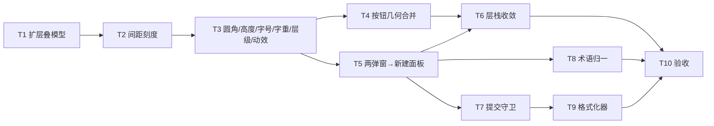

# TerraForge 前端「系统层 + 信息架构」重做实施计划

> **For agentic workers:** REQUIRED SUB-SKILL: Use superpowers:subagent-driven-development (recommended) or superpowers:executing-plans to implement this plan task-by-task. Steps use checkbox (`- [ ]`) syntax for tracking.

> ✅ **Task 1-10 全部执行完毕（2026-08-14 至 08-15）。全量 3184 passed / 3 skipped / 0 failed / 0 xfailed；CI 那条（`--cov=src --cov-fail-under=78`）覆盖率 84.98%。**
> 正文里被执行证伪的每一处都已就地更正，并在旁边写上实测值 —— 找「计划当天怎么想」看 git 历史，找「实际是什么」看这些更正。执行台账（含每一轮的红态、变异检验输出、目测数字）在 `../../../.superpowers/sdd/2026-08-14-frontend-system-ia-redesign/progress.md`。**复选框一个没勾，别照它判进度。**

**Goal:** 把「样式不统一 / 操作不方便 / 不够专业」三个感觉从根上消掉：铸一套间距刻度并让全部离散间距字面量迁入（计划写「31 个」，**实测 37 个** = 14 个离散 px + 23 个离散 rem，另有 4 个负值，口径见 Task 2 节）；把按钮态收成一套几何（审计的「33 个按钮态类」按**高度数字**数是 4 个、按**配方**数是 5 套，见 Task 4 节）；把四条管线的入口从「两个弹窗 + 两个藏起来的入口」变成「一个常驻入口 → 一个面板 → 四选一」；把 12 套显隐机制与 3 份「关最上层」实现收成一套；给 11 处 POST/DELETE 上防重复守卫（顺带把**实测 70 个** `catch` 逐个定策，计划写 46）；让一个概念只有一个名字。**色彩层、i18n 契约层、焦点环层、reduced-motion 层原样不动** —— 这条后来咬了两项目测：审计点名的「快捷键徽章 1.31:1」与「任务行三块饱和色块」都是**色彩层**问题，本计划范围内无人能修，Task 10 实测仍红（详见 Task 10 节）。

**Architecture:** 设计依据 [`../specs/2026-08-14-frontend-system-ia-redesign-design.md`](../specs/2026-08-14-frontend-system-ia-redesign-design.md)；审查依据 [`../../reviews/2026-08-14-frontend-design-audit.md`](../../reviews/2026-08-14-frontend-design-audit.md)（Rams 9/30，裁定 REDESIGN）。改动集中在 `static/css/style.css`（令牌与组件几何）、`templates/index.html`（两弹窗 → 一面板）、`static/js/map.js` + `panels.js` + `ui.js` + `task_center.js` + `config.js`（显隐/守卫/格式化器）、`src/i18n/catalog/*.py`（术语归一），以及**先行**扩展 `tests/test_css_contract.py` 的两个层叠模型。

**Tech Stack:** Flask + Jinja2 + 原生 CSS/JS（无构建工具、无预处理器）· Bootstrap 5.3.0 / CesiumJS 1.143.0 / Vue 3 全局构建 / socket.io，全部 vendored 在 `static/vendor/` · pytest 7.4.3。

## Global Constraints

- **动工顺序是硬的：Task 1（扩层叠模型）必须先落地，之后才允许动 CSS。** 反过来做必然重演 `CHANGELOG.md:32` 那次「为迁就模型把该用子组合符 `>` 的地方写成后代组合符」。
- **零 CDN / 离线 / 无构建步骤**：不引入任何外部资源、npm 包、预处理器或 bundler（`CLAUDE.md:179-181`，且由 `test_no_css_under_static_reaches_out_to_the_network` 机器强制）。
- **`style.css` 必须保持最后一张样式表，子模板一律不许出现 `<link rel="stylesheet">`**（`tests/test_css_contract.py:2597-2653` 扫整个 `templates/`）。
- **不新增断点。** 现有三个：767.98 / 576 / 480（登记在 `style.css:6-16`）。
- **禁 `transition: all`**；新增/删除任何声明 `transition`/`animation` 的选择器分支都要同步 `_MOTION_BRANCH_COUNT` 并在它上方的记账注释里补一行，格式照抄「38 -> 37（删死代码）：…」。⚠️ **计划写的「`tests/test_css_contract.py:6385`，现值 42」两项都过期**：Task 6 收工实测 `_MOTION_BRANCH_COUNT = 45`（在 `:7569`，记账注释在 `:7546-7557`），且**同一个文件里还有第二个锚点**计划漏了 —— `test_reduced_motion_actually_stops_every_animated_element` 的 `assert len(ctxs) == 42`（`:7859`，Task 6 从 39 改上来）。改动效要同步**两个**数字。
- **间距刻度必须是扁平 px 字面量，不许用 `calc()` 或 `var(--x, fallback)`** —— `_resolve_length_px`（`tests/test_css_contract.py:2747-2763`）解析不了这两种就返回 `None`，让约 10 处调用方报「模型已失效」。
- **`!important` 上界 37**（断言在 `tests/test_css_contract.py:534`，现实测 34）。棘轮规则 `:494-501`：清理型必须把上界降到「新实测 + 3」；新增型必须在该 docstring 里逐条登记「新增几处、压的是谁、为什么非它不可」。**悄悄抬升才是失败，抬升本身不是。**
- **改任何期望值之前先读旁边的注释**（`CLAUDE.md:189`）：每个数字记的都是一次实测失败，不是偏好。
- **新 i18n 文案走 `src/i18n/catalog/`，zh/en 双语，键必须以完整引号字面量出现在源码里**（`tests/test_i18n.py:280-326` 按字面量做双向闭合扫描，不许运行时拼 key）。模板与 JS 的 `<script>` 体内不许出现裸中文文案（中文说明写进 script 上方的 Jinja 注释块）。
- **测试命令一律 `uv run pytest`。** 每个 Task 的 Step 4 之后必须跑前端闸门（下方命令），不绿不许进下一个 Task。
- **每个 Task 一个 commit**，中文正文 + conventional 前缀，多行用 `git commit -F - <<'EOF'`。**不 `git push`。**
- **执行进度记在 `.superpowers/sdd/2026-08-14-frontend-system-ia-redesign/progress.md`，不靠本文的复选框**（`docs/superpowers/plans/README.md:10`）。
- **行号会漂移。** 每个 Step 3 开始前先 `read` 目标区间确认构造，禁止按本文行号盲改（`plans/README.md:11`）。
- **本文只对 Task 1 内联完整测试代码**（它是最高风险的一步，且需要变异检验）。其余 Task 的 Step 1 给出测试文件、函数名与逐条断言规格，实现者照规格写。
- **`.superpowers/sdd/` 整个目录被 `.gitignore` 忽略**（`.superpowers/sdd/.gitignore` 内容是 `*`）—— 台账不入库是仓库既有约定，别指望它出现在 `git status` 里。

**⚠️ Task 1 落地后遗留的两个已知模型缺口 —— 第一次写 `>` 或属性选择器之前必须先处置**（2026-08-14 执行 Task 1 时实测发现，当时受「只准动两个测试文件」约束没修）：

| 缺口 | 症状 | 今天为什么打不着 | 什么时候会咬人 |
|---|---|---|---|
| **div 背景模型的 `_branch_matches` 有与文字模型同款的贪心缺陷** | 祖先链走法 `ancestors.pop()` 一遍过、无回溯。`.a > .b .c` 遇到链上重复的 `.b` 会**假阴性**（漏判一条本该命中的规则 → 胜出者算错 → 全绿）。文字模型这一处已在 Task 1 的修复轮里改成三值回溯 `walk(k, i)` | `static/css/style.css` 里选择器**零个 `>`** | Task 2-6 只要把 `>` 写在会被 div 背景模型扫到的选择器上，就重演一次。**动它之前先把 `_branch_matches` 也改成回溯**，改法照抄文字模型那一份 |
| **`_parse_compound` 把属性选择器整段吃掉** | 实测 `_parse_compound('[data-x]')` 返回 tag/classes/ids 全空的 dict —— 等于把 `[data-x]` 当成 `*`，**能命中任何元素**。是**静默多匹配**，不是返回 `None` 响亮失败 | ⚠️ **计划这一栏「`style.css` 现无属性选择器（唯一一个 `[class*="col-md-"]` 在按钮模型那侧）」是错的，写下时就已经错了。**2026-08-15 实测 `style.css` 里有 **19 条**带属性选择器的规则：`:root[data-bs-theme="light"]`、8 条 `[data-accent=...]` 强调色覆盖、`[class*="col-"]`（不是 `col-md-`）、`html[lang="en"] .map-panel-btn`、一条 `:has(#statusBaseUnpack:not([hidden]))`。今天打不着的真实原因是**它们都不在三个模型的普查上下文里**（主题/强调色块只声明令牌，`html[lang]` 那条只动 padding），不是「没有属性选择器」 | 任何 Task 往**模型扫得到的**选择器上写属性选择器都会静默多匹配。三个模型（文字/按钮/动画）共用这一个解析器，blast radius 大，要单独开一步改。**Task 1-9 全程没碰过它，这条缺口原样留着。** |

两条的实测证据在 `.superpowers/sdd/2026-08-14-frontend-system-ia-redesign/progress.md`。

**前端闸门（每个 Task 的 Step 5 都跑这一条）**

```bash
uv run pytest $(grep -rln "style\.css" tests/ --include='*.py' | tr '\n' ' ') \
  tests/test_i18n.py tests/test_map_js_contract.py tests/test_output_format.py \
  tests/test_config_form_submittable.py tests/test_index_has_contour_option.py \
  tests/test_path_browser.py -q
# 2026-08-14 基线：478 passed in 27.36s（Task 1 之前）
# ⚠️ 这条命令会自我扩张 —— `grep -rln "style\.css" tests/` 会把新增的测试文件一起扫进来。
#    Task 1 收工 499（= 478 + test_css_cascade_model 的 21 个节点），
#    Task 10 收工 **599 passed in 45.77s**（2026-08-15 实测，含 T2-T9 新增的 8 个文件里被扫进来的那些）。
#    数字上涨是新增覆盖，不是回归；要拿纯 478 做对比就加 `| grep -v test_css_cascade_model`。
```

**目测闸门（Task 2 起每个 Task 结束都做）**：启开发服务器，1600×900 与 1366×768 两档 × 暗/亮两主题，各截首屏 + 新建面板 + 任务面板，与 `docs/assets/images/design-audit-2026-08-14/` 的改前图逐屏对比。⚠️ **改前图那个目录只读、不许覆盖**（它是审计的改前留档）。Task 10 的改后图另开一个目录：`docs/assets/images/frontend-ia-redesign-2026-08-15/`（48 张 = 6 个场景 × 2 视口 × 2 主题 × 2 语言）。**语言这一维计划漏了** —— 中英文标签宽度不同，rail 与面板都得看两种。

---

### Task 1: 扩两个层叠模型 —— 子组合符 + at-rule 环境判决（先于任何 CSS 改动）

> ✅ **已于 2026-08-14 执行完毕**（含一轮 code review 修复）。四条变异检验（计划 2 条 + 计划外 2 条）的原始输出、`style.css` 字节级还原证明、以及 review 轮修掉的贪心缺陷都在台账里。收工数字：`tests/test_css_cascade_model.py` 21 节点，`test_css_contract.py` 仍 86 passed（Task 5/6 之后是 87），闸门 499。

**Files:**
- Modify: `tests/test_css_contract.py:5233`（`_text_branch_applies(branch, chain)` 换成支持组合符的实现）、`:5334`（`_winning_color_decl(css, chain, label)` 里对 at-rule 的处理）、`:5411-5449`（`test_text_color_model_assumptions_still_hold` 的两条前提改成「模型已支持」的新断言）
- Test: `tests/test_css_cascade_model.py`（新建，模型自身的单元测试 + 变异检验）

**Interfaces:**
- Consumes: 同文件已有的供体代码 —— `_split_branch:7809-7828`（把 `.a > .b .c` 拆成 `[('.a',None),('.b','>'),('.c',' ')]`）、`_branch_matches:7831-7874`（支持后代与 `>`，遇 `+`/`~` 返回 `None`）、`_motion_media_verdict:6209-6220`（at-rule 三值判决 `True/False/None`）、`_btn_media_applies:4091-4108`（同口径）
- Produces: `_text_branch_applies` 支持 `>`；`_winning_color_decl` 能算 `prefers-*` 类 at-rule 内的 color，宽度类断点一律响亮失败

**背景知识：** 三个封锁点都已读源码确认。`:5427` 的 `if re.search(r'[>+~]', branch)` 之所以存在，是因为 `_text_branch_applies:5233` 只做 `branch.split()`；`:5429` 的 at-rule 拦截之所以存在，是因为颜色模型只扫顶层规则。两处都不需要新算法 —— 供体代码就在同一个文件里，且 `_branch_matches` 的 docstring `:7838-7842` 记了一个必须照抄的判定顺序：**先判主体复合项「肯定不命中」，再判形态不支持**，反过来写会被 Bootstrap 里大量打在 `<a>`/`<label>`/伪元素上的规则把模型整个顶成「已失效」。

- [ ] **Step 1: 写失败的测试**

新建 `tests/test_css_cascade_model.py`：

```python
"""层叠模型自身的单元测试 —— 模型扩展（2026-08-14）的看守。

这个文件测的不是产品 CSS，是 tests/test_css_contract.py 里那套「算最终颜色」
的模型本身。理由：模型算错的后果是「静默给出错误的信心」，比没有断言更糟
（test_css_contract.py:5416 用同一句话记过这笔学费）。

为什么不通过 _winning_color_decl 来测：那个函数有两道**对全量 style.css 才成立**
的护栏 —— `assert scanned > 100`（:5365，扫到的 color 规则不足 100 条就判扫描
失效）与 `_bootstrap_color_competitors`（:5372，要跟 Bootstrap 的竞争者比排名）。
拿两条规则的玩具 CSS 喂它只会在护栏上失败，测不到我们要测的东西。所以：
  · 组合符支持 -> 直接测 _text_branch_applies（纯函数，只吃 branch + chain）
  · at-rule 判决 -> 直接测新加的 _color_media_verdict（与 _motion_media_verdict
    同形，可单测），再由 _winning_color_decl 在全量 CSS 上消费它。
"""

import os
import sys

import pytest

sys.path.insert(0, os.path.dirname(os.path.dirname(os.path.abspath(__file__))))

from tests.test_css_contract import (  # noqa: E402
    _TextEl,
    _color_media_verdict,        # Step 3 新增
    _text_branch_applies,
)


def _chain(*specs):
    """`'div.card'` / `'span.detail-v'` -> [_TextEl, ...]，末项是被算的那个元素。

    节点类型必须是 _TextEl（test_css_contract.py:5171）—— _text_branch_applies
    会读 node.pseudos / node.pseudo_element，裸元组喂不进去。
    """
    out = []
    for spec in specs:
        tag, _, rest = spec.partition('.')
        out.append(_TextEl(tag=(tag or 'div'),
                           classes=[c for c in rest.split('.') if c]))
    return out


# ---------------------------------------------------------------- 子组合符

def test_child_combinator_matches_a_direct_parent():
    chain = _chain('div.card', 'div.card-body', 'span.detail-v')
    assert _text_branch_applies('.card-body > .detail-v', chain) is True


def test_child_combinator_rejects_a_skipped_generation():
    """.card 是祖父不是直接父。

    扩展前 `branch.split()` 把 `>` 切成独立 token，`_parse_compound('>')` 读不懂
    → 整支返回 None（**一律拒答，从来没给过错答案**）。本用例锁的是「拒答 → 答对」
    不许退化成「拒答 → 答错」：少一代祖先必须判 False。
    """
    chain = _chain('div.card', 'div.card-body', 'span.detail-v')
    assert _text_branch_applies('.card > .detail-v', chain) is False


def test_descendant_combinator_still_matches_across_generations():
    chain = _chain('div.card', 'div.card-body', 'span.detail-v')
    assert _text_branch_applies('.card .detail-v', chain) is True


def test_mixed_child_and_descendant_chain():
    chain = _chain('section.panel', 'div.card', 'div.card-body', 'span.detail-v')
    assert _text_branch_applies('.panel .card > .detail-v', chain) is False
    assert _text_branch_applies('.panel .card-body > .detail-v', chain) is True


def test_child_combinator_at_the_root_of_the_chain():
    """链首之上没有节点了，`> ` 必须判 False 而不是越界。"""
    chain = _chain('div.card', 'span.detail-v')
    assert _text_branch_applies('.nope > .card > .detail-v', chain) is False


@pytest.mark.parametrize('branch', ('.card + .detail-v', '.card ~ .detail-v'))
def test_sibling_combinators_stay_unsupported(branch):
    """兄弟组合符必须返回 None（响亮失败），不许猜。

    祖先链里没有兄弟节点：当成后代会**多**匹配（可能把管不到的规则算成赢家），
    当成不匹配又会漏。这条锁的是「不猜」这个决定本身。
    """
    chain = _chain('div.card', 'span.detail-v')
    assert _text_branch_applies(branch, chain) is None


def test_subject_miss_is_decided_before_shape_support():
    """主体复合项肯定不命中时先返回 False，别报「形态不支持」。

    判定顺序是承重的 —— _text_branch_applies:5236-5238 与 _branch_matches:7838-7842
    都记过：反过来写会被 Bootstrap 里大量与本元素八竿子打不着的规则
    （`.btn-check:checked+.btn` 这类）把模型整个顶成「已失效」。
    """
    chain = _chain('div.card', 'span.detail-v')
    assert _text_branch_applies('.card + .something-else', chain) is False


# ---------------------------------------------------------------- at-rule 判决

@pytest.mark.parametrize('at_rule, reduced, expected', (
    ('@media (prefers-reduced-motion: reduce)', True, True),
    ('@media (prefers-reduced-motion: reduce)', False, False),
    ('@media (prefers-reduced-motion: no-preference)', False, True),
))
def test_prefers_at_rules_are_evaluated(at_rule, reduced, expected):
    assert _color_media_verdict(at_rule, reduced=reduced) is expected


@pytest.mark.parametrize('at_rule', (
    '@media (max-width: 576px)',
    '@media (min-width: 768px)',
    '@supports not (backdrop-filter: blur(1px))',
))
def test_non_environment_at_rules_stay_unsupported(at_rule):
    """宽度断点与 @supports 必须返回 None —— 模型不建这两种环境。

    与 _motion_media_verdict:6214 同一个决定：「宽度类断点一律返回 None
    （模型不支持）—— 只要有人往里塞声明就响亮失败」。
    """
    assert _color_media_verdict(at_rule, reduced=False) is None
```

- [ ] **Step 2: 运行测试确认它失败**

Run: `uv run pytest tests/test_css_cascade_model.py -q`
Expected: FAIL。**下面这组数字是 2026-08-14 在当前代码上实测出来的**（`uv run python -c` 直接喂 `_text_branch_applies`），不是推测：

```
direct-parent   .card-body > .detail-v : None   ← 期望 True（test_child_combinator_matches_a_direct_parent）
skipped-gen     .card > .detail-v      : None   ← 期望 False（test_child_combinator_rejects_a_skipped_generation）
descendant      .card .detail-v        : True   ← 已对（test_descendant_combinator_still_matches_across_generations）
mixed（含 `>` 的分支）                 : None   ← 期望 False / True 各一条（test_mixed_child_and_descendant_chain）
root-overflow   .nope > .card > .dv    : None   ← 期望 False（test_child_combinator_at_the_root_of_the_chain）
sibling +       .card + .detail-v      : None   ← 期望 None，已对（test_sibling_combinators_stay_unsupported）
sibling ~       .card ~ .detail-v      : None   ← 期望 None，已对（同上）
subject-miss    .card + .something-else: None   ← 期望 False（test_subject_miss_is_decided_before_shape_support）
```

**注意现状不是「静默算错」，是「一律拒答」**：`branch.split()` 把 `>` 切成一个独立 token，`_parse_compound('>')`（`:5194`）读不懂就返回 `None`，`_text_branch_applies` 于是在 `:5249` 提前返回 `None`。上层 `_winning_color_decl:5350` 对 `None` 直接 `assert hit is not None` 报「本测试已失效」—— 这就是 `:5434` 那条前提断言存在的原因。所以本 Task 是**把「拒答」变成「答对」**，不是修一个错误答案。

另外 `_color_media_verdict` 还不存在，那两个 at-rule 参数化用例会先 ImportError。先加一个 `def _color_media_verdict(at_rule, reduced=False): raise NotImplementedError` 占位再跑，能看清组合符那 8 条的红绿分布。

- [ ] **Step 3: 实现**

1. `_text_branch_applies`（`tests/test_css_contract.py:5233` 一带）：把 `parts = branch.split()` 换成 `_split_branch`，祖先侧按每项挂的组合符分派（`>` 只比一格且 `i < 0` 时先 `return False` 不越界，空格才继续向上扫）。
   - **共用的只有 `_split_branch`（纯字符串拆分、零依赖）** —— 把它前移到首个使用者之前，两个模型共用一份。
   - ⚠️ **不要复用 `_compound_matches:7814`**（原计划这么写是错的，2026-08-14 执行时发现）。两个原因：① 它第一行就 `tag, classes, elem_id, attrs = node`，要的是 4 元组，而 `_TextEl` 带 `__slots__`、不可迭代 —— 喂进去直接 `TypeError`；② 它建的是**静止态**模型（`:7825-7826` 任何 `::` 一律判不命中、`:7841-7842` 对 `_INTERACTIVE_PSEUDOS` 里的 `:hover`/`:focus`/`:active` 一律判 False），而文字模型必须算 hover/focus 态（`_TEXT_SUPPORTED_PSEUDOS` 明确列入）、还必须拿 `::placeholder` 跟 `node.pseudo_element` 比（`:5615-5627` 有两条真实上下文靠它）。复用它会同时废掉这两件事。
   - 文字模型继续用自己的 `_parse_compound` 与 `_compound_structurally_matches`。**从 `_branch_matches:7898` 照抄的是「判定顺序与遍历形状」，不是代码本身** —— 那句承重警告指的就是这个：先 `_compound_structurally_matches(subject, chain[-1])` 不中即 `return False`，之后才判 `+`/`~` → `None`。
   - `_branch_matches` / `_compound_matches` 留在原处不动：前移它们还要连 `_LEGACY_PSEUDO_ELEMENTS` / `_INTERACTIVE_PSEUDOS` / `_RESTING_PSEUDOS` 一起搬，而它们在文字模型之前没有任何调用者。
   - 伪类/伪元素那一段（`_TEXT_SUPPORTED_PSEUDOS` 检查 + subject 与祖先两侧的 `pseudos`/`neg_pseudos` 比对）**原样保留在结构匹配之后，一行不动** —— 只给 subject 判、不给祖先判是这里最容易犯的静默回归。
2. 新增 `_color_media_verdict(at_rule, reduced=False)`（放在 `_text_branch_applies` 之前）：**照抄 `_motion_media_verdict:6209-6220`** —— 用同一个 `_PREFERS_REDUCED_MOTION_RE` 匹配，命中则返回 `want_reduce == bool(reduced)`，不命中一律返回 `None`（宽度断点、`@supports` 都走这条）。
3. `_winning_color_decl`（`:5334`，签名 `(css, chain, label)`，`label` 只进失败消息）：把 `:5355-5359` 那段「命中的规则在 at-rule 里 → 直接 `raise AssertionError`」改成：对 `at_ctx` 里的每条 at-rule 走 `_color_media_verdict`；全部 `True` 才把该规则纳入候选；出现 `False` 就跳过这条规则（环境不成立）；出现 `None` 才 `raise AssertionError`，消息里点名那条 at-rule 与 `label`。**注意 `at_ctx` 是元组（可能嵌套多层 at-rule），要逐条判而不是整体判。**
4. `test_text_color_model_assumptions_still_hold`（`:5411-5449`）：
   - 删掉 `combinator_offenders` 里对 `>` 的收集，**只保留 `+` `~`**（它们仍不支持），并把失败消息改成「兄弟组合符仍不支持」。
   - 删掉 `media_offenders` 的整段，替换为「宽度类断点里不许声明 color」的更窄断言（`prefers-*` 现在合法）。
   - `color_branches > 100` 的扫描有效性自检、以及交叉引用 `test_no_stylesheet_can_load_after_style_css` 的第三条前提（`:5443-5449`）**原样保留**。
   - docstring 顶部补一行记账：「2026-08-14：`>` 与 `prefers-*` at-rule 已支持，供体是 `_split_branch`/`_branch_matches`/`_motion_media_verdict`；`+`/`~` 与宽度断点仍不支持，原因见各自失败消息。」

- [ ] **Step 4: 运行测试确认通过 + 变异检验**

Run: `uv run pytest tests/test_css_cascade_model.py tests/test_css_contract.py -q`
Expected: PASS（新文件全绿 + `test_css_contract.py` 86 个节点仍全绿）。

**变异检验（这一步是 Task 1 真正的验收，不是「绿」）：**

```bash
# 变异 1：塞一条子组合符 color 规则，模型必须算出正确赢家而不是判「已失效」
# 变异 2：塞一条宽度断点 color 规则，必须响亮失败
```

逐个手工加进 `static/css/style.css` 末尾、跑下面这条、确认行为符合预期、**然后撤销变异**（撤销后用 `md5sum static/css/style.css` 与改前比对，确认字节级还原）。两次变异的实际输出抄进 `.superpowers/sdd/.../progress.md`。

```bash
uv run pytest tests/test_css_contract.py -k "text_color or text_context or every_text" -q
```

⚠️ **不要用 `-k text_color`**（原计划这么写是错的，2026-08-14 执行时发现）：它只匹配到 `test_text_color_model_assumptions_still_hold` 一条（实测 `1/86 tests collected`），而**这条根本不调用 `_winning_color_decl`** —— 真正的消费者是 `test_every_text_context_meets_wcag_aa`（`:5782`）、徽章那两条（`:5840`、`:6022`）。照原命令跑，变异 A 会给出 `1 passed, 85 deselected`，等于把「模型根本没被触发」记成「变异通过」。

变异选择器要挑**模型上下文清单里真实存在**的元素形态（读 `:5452+` 的文字上下文普查表挑一个），否则模型不会去算它。2026-08-14 实测用的是 `.detail-item > .detail-v`。

**建议再补两条计划外的变异**（3d 的 `True`/`False` 两条路径在真实 CSS 上没有任何测试走过）：把同一条规则分别套进 `@media (prefers-reduced-motion: reduce)`（应当**跳过**该规则、既不算进候选也不报已失效）与 `@media (prefers-reduced-motion: no-preference)`（应当**纳入候选并胜出**）。

- [ ] **Step 5: 契约回归 + 全量**

Run: 前端闸门 + `uv run pytest tests/ -q`
Expected: 全绿（闸门 492 passed —— 见文首闸门命令下的自我扩张说明；全量与基线同数 + 你新增的用例数）。

```bash
git add tests/test_css_contract.py tests/test_css_cascade_model.py
git commit -F - <<'EOF'
test(css): 层叠模型支持子组合符与 prefers-* at-rule

颜色模型此前对 `>` `+` `~` 和任何 at-rule 一律拒答，理由是 _text_branch_applies
只按空白拆分、_winning_color_decl 只算顶层规则。后果是「系统层一动就报模型已
失效」，CHANGELOG.md:32 记录的那次妥协（该用子组合符的地方写成后代组合符）就是
这么来的。

供体代码本来就在同一个文件里：_split_branch / _branch_matches 已经为 div 背景
模型实现了后代 + 子组合符的精确匹配，_motion_media_verdict 已经实现了 at-rule
的 True/False/None 三值判决。这次是把它们移到公共位置两处共用，不是新写算法。

仍然不支持、且必须继续响亮失败的两类：兄弟组合符（祖先链里没有兄弟信息，猜了
就会多匹配或漏匹配）、宽度类断点（模型不建宽度环境）。

新增 tests/test_css_cascade_model.py 是模型自身的单元测试，含两条变异检验。
EOF
```

---

### Task 2: 铸间距刻度，把全部离散间距字面量迁入

> ✅ **已于 2026-08-14 执行完毕**（含收尾轮）。实测红态：**166 条声明 / 210 处裸长度 / 14 个离散 px + 23 个离散 rem + 4 个负值**（从 `git show HEAD:static/css/style.css` 量的）。**本节原先写的「31 个离散字面量（12 px + 19 rem）」是错的**，真实是 37 个离散字面量；另一位开发者未提交的声明会让同一口径量出 170/214，台账里两个基线都记了并附了命令。执行结果与四处发现见 `.superpowers/sdd/2026-08-14-frontend-system-ia-redesign/progress.md`。

**Files:**
- Modify: `static/css/style.css:187-194`（令牌区新增 `--space-*`，`--pad-card`/`--gap-field` 改为指向刻度）、全文所有 `padding`/`margin`/`gap` 字面量声明
- Test: `tests/test_spacing_scale.py`（新建）

**Interfaces:**
- Consumes: 无
- Produces: `--space-hair/-1..-6` 七个令牌；`--pad-card: var(--space-3)`、`--gap-field: var(--space-2)`

**背景知识：** 迁移映射与视觉影响见设计稿 §3.1。**`--ctl-pad-y:3px`/`--ctl-pad-x:8px`/`--ctl-line-h:20px` 这一组不动** —— 它们参与 `2*3+20+2*1=28` 的算术契约（`tests/test_css_contract.py:2811`）。刻度只管容器与组之间的间距。

⚠️ **Task 1 遗留的四处过期注释，Task 2 顺手改掉**（2026-08-14 代码评审发现；Task 1 受「只准动两个测试文件」约束没碰）。它们都声称「层叠模型不支持子组合符 `>`」，而 `_text_branch_applies` 自 Task 1 起已支持：

| 位置 | 现在错在哪 | 怎么改 |
|---|---|---|
| `static/css/style.css:4701-4704` | 「动画层叠模型解析不了子组合符」 | 真正的拦路者变成了 `tests/test_css_contract.py` 里用 `branch.split()` 反解上下文链的那个函数（读 `_motion_contexts_from_stylesheet` 确认当前行号），改成点名它 |
| `static/css/style.css:677-678` | 「按钮/**动画**层叠模型读不懂 `>`」——**只有动画那半句错了** | 只改动画那半句，按钮那半句保留 |
| `static/css/style.css:4845` | 「层叠模型不支持子组合符」 | 同上 |
| `static/js/config.js:276` | 同款过期理由 | 同上 |

**不要动**这两处：`static/css/style.css:704-705` 与 `:2509-2511` 只谈**按钮**模型 —— `_btn_branch_applies` 对 `>` 仍然返回 `None`（Task 1 一个字没动它），所以那两处依然正确，`CHANGELOG.md:32` 也依然准确。

- [ ] **Step 1: 写失败的测试**

新建 `tests/test_spacing_scale.py`，断言规格：
1. `--space-hair/-1/-2/-3/-4/-5/-6` 七个令牌都在 `:root` 有定义，值恰为 `2px/4px/8px/12px/16px/24px/32px`，且**都是扁平 px 字面量**（正则 `^\d+px$`，不许出现 `calc(` 或 `var(`）—— 理由写进 docstring：`_resolve_length_px`（`test_css_contract.py:2747-2763`）不支持 `calc()`。
2. `--pad-card` 的原始值恰为 `var(--space-3)`、`--gap-field` 恰为 `var(--space-2)`（保证 `FIELD_GAP_MAX_PX`（`:2729`）与 `.mb-3` 必须字面含 `var(--gap-field)`（`:2835`）两条断言继续成立）。
3. **主断言**：剥注释后扫全文 `padding` / `padding-*` / `margin` / `margin-*` / `gap` / `row-gap` / `column-gap` 声明，除白名单外，**不允许出现裸 px/rem 长度**。白名单只许三类，每类在测试里写明理由：`0`、`--ctl-pad-*` 那一组、以及组件专有尺寸（`.map-panel-btn` 的固定高、`--statusbar-*`）。失败消息要逐条打印「哪一行、什么值、应该迁到哪一级」。
4. 反向断言：七个令牌每一个都至少被 `var()` 引用一次（不许铸了不用）。

- [ ] **Step 2: 运行测试确认它失败**

Run: `uv run pytest tests/test_spacing_scale.py -q`
Expected: FAIL —— 令牌不存在（第 1、2 条），主断言列出全部裸长度。**2026-08-14 实测是 166 条声明 / 210 处长度（14 个离散 px + 23 个离散 rem + 4 个负值）**，不是本节原先写的 31。

- [ ] **Step 3: 实现**

1. 在 `style.css:194` 之后插入刻度块，注释里写清「扁平字面量，不许 `calc()`，原因见 `tests/test_css_contract.py:2747-2763`」。
2. 按设计稿 §3.1 的映射表逐处替换。**建议分三轮，每轮跑一次闸门**：先 2/4/8/12/16（原位对应、零视觉变化），再 6→8 / 10→12 / 14→16 / 18→16 / 5→4 / 7→8（有视觉变化），最后 19 个 rem 值逐个换算。
3. `--pad-card` / `--gap-field` 改为指向刻度。
4. 每一处有视觉变化的替换在旁边留一条注释：`/* 6px -> --space-2（8px）：间距刻度归一 2026-08-14 */`，**不要写成大段说明**，密度靠刻度自己表达。

- [ ] **Step 4: 运行测试确认通过**

Run: `uv run pytest tests/test_spacing_scale.py tests/test_css_contract.py -q`
Expected: PASS。若 `test_field_gap_*`（`:2835,2839,2843`）或密度算术（`:2811`）变红，**说明动到了 `--ctl-*` 那一组 —— 撤回，不要改测试**。

- [ ] **Step 5: 契约回归 + 全量 + 目测**

Run: 前端闸门 + `uv run pytest tests/ -q` + 目测闸门
Expected: 全绿；目测四张图与改前图对比，密度变化在预期内（卡片内边距 +2px、组间距 +2px）。

```bash
git add static/css/style.css tests/test_spacing_scale.py
git commit -m "refactor(css): 铸七级间距刻度，全部离散间距字面量迁入"
```

---

### Task 3: 圆角收敛 7 → 4，控件高度两级，字号字面量清零，字重令牌化

> ✅ **已于 2026-08-14/15 执行完毕**（含收尾轮 A–F）。`tests/test_geometry_scales.py` 19 节点全绿。**本节被执行证伪的地方**（每条都带实测）：
> - **下面那条「折叠线断言现在是 xfail(strict)」已经作废。** Task 5 落地后它如预言般「意外通过」→ strict xfail 失败 → 标记连同理由一起被删。棘轮也一起改了对象：`_SUBMIT_BOTTOM_RATCHET_PX = 866.00` → `_FORM_CONTENT_HEIGHT_RATCHET_PX = 719.5`（实测表单内容高 719.0）。**866 → 719.5 不是省出了 147px**，是退役的弹窗外框离开了被测量，表单本身没变短。
> - **下面第 2 条那张「每个令牌 +1px 对折叠线的影响」灵敏度表整张作废** —— 它量的是弹窗时代的模型输出，而那个量今天是常量（视口 − 12）。`--space-2` +17.0 / `--font-size-sm` +10.5 / `--ctl-h` +5.0 这些数字今天一个都不成立。要留着看的只有它的方法（用修好的模型逐令牌重测），不是数字。
> - **下面第 3 条那张表里被三处 CSS 注释引用的那个函数根本不存在**，而且它们描述的机制方向是**反的**（收尾轮 C + V-1 实测）。三条注释已就地重写成点名真实拦路者。
> - `--ctl-h-lg` 落地时**只有一个渲染消费者**（台账记为单点风险）；Task 4 把 `.app-confirm__btn` 放进主档、Task 5 把 `#createTaskBtn` 放进面板底条之后，**实测三个**，全部按严格相等钉住。
> - 收尾轮记下**四个结构缺口**（退役圆角断言只查引用不查定义；`_custom_property_raw` 取全文件第一处定义、分不清 `:root` 与主题覆盖块；图标钮方正度断言的 props 里有四条死长写；本仓完全没有 pytest 配置）。**其中第三条已由 Task 4 收尾轮修掉**（`_PADDING_LOGICAL_LONGHANDS` 别名表 + `_btn_decls` 末尾关整条属性名轴的安全网），另外三条原样留着 —— 详见 Task 10 的收尾清单。

**Files:**
- Modify: `static/css/style.css:137-145`（圆角退役三级）、`:2950,2970,3052,3760,1966,2914,4375,2213`（圆角定点修复）、`:187-190`（新增 `--ctl-h-lg`）、`:1905-1913,4236-4246,918,966-968`（控件高度）、`:671,1080,3644,3718,4161`（五个字号字面量）、字重四处
- Modify: `tests/test_css_contract.py:153-197`（选择器→字号对照表）
- Test: `tests/test_geometry_scales.py`（新建）

**Interfaces:**
- Consumes: Task 2 的 `--space-*`
- Produces: `--ctl-h-lg: 36px`；`--weight-normal/-medium/-strong`；`--z-*` 九个令牌；`--dur-fast/-base/-slow` + `--ease`

**背景知识：** 实测三个目标测试文件里**没有任何一条断言 radius / z-index / font-weight 的值**，所以这三项是成本最低的。唯一的 z-index 断言在 `tests/test_fix_terrain_preview_transition.py:94-98`（`.map-transition-veil` 必须低于 `.map-toolbar`），令牌照抄现值即自动成立。`tests/test_concurrency_recommend.py:197-215` 要求 `.btn.concurrency-recommend` 的规则里含 `var(--ctl-h)` —— 保留。

**⚠️ Task 2 执行后新增的三条 Task 3 前置（2026-08-14 三路评审交叉验证）**

**1. 折叠线断言现在是 xfail(strict)，别把它当绿灯，而且它红得有道理。** 模型已在 Task 2 收尾轮修好，修完后**如实变红**：修好的模型算 **865.5px**，真实浏览器实测 **901.5px**（有选区、字段换行的真实态；用 Bootstrap API 强开的无选区态是 835.5），视口 768。残差 36px 已完全归因 —— 两处文案各换行一行（12px 字号 × 1.5 行高 × 2），模型不做文本换行，这是它已知且已登记的边界。

修之前它算 763.5、显示「余 4.5px」，与真实差 72px，来自**四个**盲区（不是三个）：① `_FormStructureParser` 只记 `depth == 0` 的直接子元素，后代在解析期就被丢弃，所以「一个 `.mb-3` 里装两组 label+control」**结构上**表达不了（`#mapStyleField` 实测 122px、模型给 57；输出格式那块 127px、给 57）；② `hidden` **属性**没被识别（只看内联 `style="display:none"`），`#demOptions` 被当成可见字段算进去；③ **两条 vendor 解析 bug**，与「style.css 覆盖」无关 —— `--bs-modal-margin` 在 `bootstrap.min.css` 里出现两次（基础 `0.5rem`，`@media (min-width:576px)` 内 `1.75rem`），旧代码 `re.search` 取了第一个，而 1366px 命中的是第二个；`BS_MODAL_BTN_CLOSE_PX = 22.5`（注释写「1.5em × 15」）是**编造的数**，而且因为 27 > 22.5 从来没生效过，所以谁都没发现；④ `#tileEstimate` 同样是裸 `hidden` 属性，旧模型无条件把它约 30px 算进去 —— 算进去这个结果碰巧对（`map.js` 有选区时会显示它），但理由是错的：旧模型根本没有「状态」这个概念。**两个方向相反的错互相掩护**，总和看起来「差不多对」—— 正是同文件在 `.btn` 内边距那里逐字记过的失败形态。

**责任归属（用修好的模型做 2×2 交叉实测，不是推算）**：Task 2 的间距归一贡献 **+26.80px**；另一位开发者嵌在 `#mapStyleField` 里的「数据源/内置源」字段贡献 **+65px**（嵌在既有 `.mb-3` 内，所以旧模型对它的贡献确实是 0）；**两者都不在时下界已经是 775.30px，本来就超线 7.3px**。所以「把间距刻度回退就能修」是错的 —— 回退只能收回 26.8px，仍差 70.5px。**唯一的结构性修法是 Task 5**（两弹窗并成带 sticky 底条的面板），断言因此标了 `strict=True`：Task 5 落地后它会因「意外通过」而变红，强制自己被删掉。

**2. 字号一改就直接打在折叠线上。** 用**修好的**模型逐令牌 +1px 重测（旧表的符号是反的、数值也不对）：`--space-2` **+17.0**、`--font-size-sm` **+10.5**、`--font-size-xs` **+9.0**、`--ctl-h` **+5.0**、`--space-1` +4.0、`--space-5` +3.0、`--space-3` +2.0、`--space-4` +2.0、`--font-size-lg` +1.5、`--space-hair` 0.0（只喂 `.form-check-input` 的 margin-top，被 24px min-height 吞掉）、`--space-6` 0.0（只走横向）。**最后两个 0 是真的不承重**，与盲区 ③ 那个「模型看不见一条实际胜出的声明」造成的 0 性质不同。Task 3 要动的正是 `--font-size-*` 的消费者与控件高度（`--ctl-h` 每 +1px 就 +5px）—— **每改一处都要重新量真实浏览器，不要只看模型**。

**3. 三条仍然为假的层叠模型注释（Task 2 点名但没授权动的）**，逐条都要先确认再改：

| 位置线索 | 现在的假话 | 动手前必须先确认 | 改成 |
|---|---|---|---|
| `.task-row` 分隔线那段 | 「三个模型都不支持子/兄弟组合符**与结构性伪类**」 | `_parse_compound` 对 `:last-child` 的返回值（注意它谈的是结构性伪类，**不是** `>`） | 若仍不支持：点名 `_parse_compound` + 会红的那条用例。**若已支持：这条 CSS 决策本身该翻案** —— `:last-child { border-bottom: none }` 应该写回去，「最后一行多一条发丝线是可接受代价」那句让步随之作废 |
| `.detail-artifact--sep` | 「几套层叠模型只认后代组合符」 | `_split_branch` 对 `+`/`~` 的实际返回值（Task 1 只加了 `>`） | 若 `+` 仍不支持，保留 `--sep` 方案但把理由从「几套模型」收窄到具体函数。**连带**：`.tif-info__file--sep` 的同款注释已经是按钮模型口径、是对的，别一起改坏 |
| `.hint svg` | 「按钮/**动画**模型只支持后代组合符」+「20 条断言集体失效」 | 该规则块只有 `width/height/display`、**无动画声明**，动画模型根本扫不到它 | 照抄 `.history-layout__fixed` 那条已改对的措辞：拦路者只剩按钮模型；删掉查无出处的「20 条」 |


- [ ] **Step 1: 写失败的测试**

新建 `tests/test_geometry_scales.py`，断言规格：
1. **圆角**：`--radius-sm` / `--radius` / `--radius-lg` 三个令牌**不再被任何 `var()` 引用**（可以留定义也可以删，测试只管零引用）；所有「浮起表面」选择器（`.card`、`.card-header`、`.stat-card`、`.modal-content`、`.app-confirm`、`.cmdk__dialog`、`.app-toast`、`.map-search__panel`、`.workbench-panel__body`、`.tif-info`、`.map-overlay-chip`）的 `border-radius` 都解析成 **12px**；所有控件类（`.btn` 及其派生、`.form-control, .form-select`、`.bounds-edit-input`）解析成 **6px**。用 `_resolve_length_px` 解析，不做字符串比对。
2. **`.btn.btn-icon`（`:2914`）与 `.btn.btn-compact`（`:4375`）必须显式声明 `border-radius`** —— 现在它们不声明、落回 Bootstrap，而 `:2213` 还为其中一个实例单独补过一次。这条同时把那个局部补丁的存在理由消掉。
3. **控件高度**：`--ctl-h-lg` 定义为 `36px`；`.map-search__input`、`.bounds-edit-input`、手动四至面板的两颗按钮，其高度（`height` 或 `min-height`）都解析成 `var(--ctl-h)` 的值；`.map-panel-btn` 有固定 `height`（一个值，不再靠内容撑）。
4. **`.bounds-edit-input` 不许再有无替代的 `outline: none`**（`:4245`）：要么删掉，要么同一规则块里给出 `outline`/`box-shadow` 替代。这条把全仓唯一压掉全局焦点环的地方钉死。
5. **字号**：剥注释后全文 `font-size` 声明**不允许出现裸 px/rem**（全部走 `--font-size-*`）；且 `--font-size-xl` 至少被引用一次（消费掉唯一的零引用令牌）。
6. **字重**：全文 `font-weight` 声明不允许裸整数；`--weight-normal/-medium/-strong` 各至少一次引用。
7. **z-index**：全文 `z-index` 声明不允许裸整数（`0`/`auto` 除外）；九个 `--z-*` 令牌的值与改前实测值逐一相等（把现值写进测试常量，附一行「照抄现值，本次不改层序」）。
8. **动效**：全文 `transition-duration`/`transition` 的时长只允许 `--dur-fast/-base/-slow` 三个值；`--ease` 至少一次引用。

- [ ] **Step 2: 运行测试确认它失败**

Run: `uv run pytest tests/test_geometry_scales.py -q`
Expected: FAIL 8 条 —— 令牌不存在、五个字号字面量在位、四个裸字重、18 条裸 z-index、`.btn-icon`/`.btn-compact` 无圆角声明、`.bounds-edit-input` 的裸 `outline:none` 仍在。

- [ ] **Step 3: 实现**

按设计稿 §3.2–§3.7 逐项改。三处需要额外小心：
- 改 `.workbench-statusbar` 的 `13px → --font-size-xs`（`:671`）时，`:668-670` 那段为 13px 辩护的注释要**改写而不是删除**：记下「2026-08-14 判定统一优先，13px 归到 12px，目测通过」。
- 改字号必须同步 `tests/test_css_contract.py:153-197` 的选择器→字号对照表（20 条精确选择器字符串，分组与顺序是承重的，`:149-152` 明说）。
- `.card-header` 的圆角声明带 `!important`（`:2970`）。改成 12px 时**顺手判断这条 `!important` 还需不需要** —— 若能删，按棘轮规则（`:494-501`）把上界从 37 降到「新实测 + 3」并在 docstring 记账。

- [ ] **Step 4: 运行测试确认通过**

Run: `uv run pytest tests/test_geometry_scales.py tests/test_css_contract.py tests/test_concurrency_recommend.py tests/test_fix_terrain_preview_transition.py -q`
Expected: PASS。若 `test_recommend_button_compact_css_recipe`（`test_concurrency_recommend.py:197-215`）变红，是 `.btn.concurrency-recommend` 丢了 `var(--ctl-h)` —— 补回去，别改测试。

- [ ] **Step 5: 契约回归 + 全量 + 目测**

Run: 前端闸门 + `uv run pytest tests/ -q` + 目测闸门
Expected: 全绿；重点看四张图里的卡片表头圆角是否与外框一致、状态栏字号、splash 字号。

```bash
git add static/css/style.css tests/test_geometry_scales.py tests/test_css_contract.py
git commit -m "refactor(css): 圆角 7→4 级、控件两级高度、字号字面量清零、字重/层级/动效令牌化"
```

---

### Task 4: 按钮态收成一套几何（审计口径「33 个按钮态类」；实测是 4 个高度数字 / 5 套配方）

> ✅ **已于 2026-08-15 执行完毕。**`tests/test_button_geometry.py` 12 节点、四条红探针全部咬住。落地实测：高度 4 个数字（36.5 / 39.0 / 28.0 / 36.0，另加 `.app-confirm__btn` 声明级 39.0）→ **两档**（密 28 / 主 36）；焦点环 3 套 → 1 套（+ `.map-panel-btn` 那个有记录的 −2 例外）；transition 属性表 3 张 → 1 张。折叠线 865.50 → **857.00**（提交钮 36.5 → 28.0），**Task 4 是买回 8.5px，不是花掉** —— 计划「最多持平」的假设错了。**本节被执行证伪的地方**：
> - **「按钮上有 5 套 transition 属性表（1/2/3/4/5 属性）」是错的，实测按钮上只有 3 张（5/2/3 属性）。**1 属性那档是 `.statusbar-pill`（同一个 class 也打在 `<span>` 上），4 属性那档是 `.card` / `.form-control` / `.form-check-input` 一类非按钮。审计把非按钮规则算进了按钮账，计划照抄。
> - **「4 套焦点环配方，offset 有 +2/−2/+1 三种」是错的。**`+1` 那三条全部属于另一位开发者**未提交**的搜索组件。在册按钮态只有 `+2` 与 `.map-panel-btn` 的 `−2`，即 **offset 维度改前就已统一**；真正的分叉只在颜色令牌（`--color-accent` vs `--color-accent-hover`）。按在册范围是 3 套 / 2 个令牌。
> - **Step 3.1 的「密档 = `--ctl-h` + `--space-2` 横向、主档 = `--ctl-h-lg` + `--space-3`」没有采纳。**实测改用 密档 12px（`--space-3`）/ 主档 16px（`--space-4`）：Task 3 落地的紧凑档横向就是 12px 且过了目测，改成 8px 等于把 Task 3 的目测重打一遍；12 与 16 两个值都是改前按钮上已出现过的。
> - **Step 3.2「`.app-confirm__btn` 消费与 `.btn` 相同的几何令牌」按字面读是密档，实际放进了主档。**判据：它与配置页底条的「保存/重置」是同一个角色；按密档会把它从 39px 压到 28px（比现状小 11px），放主档是 39 → 36。
> - **Step 3.5「`ICON_ONLY_BUTTON_COUNT` 本 Task 不动」成立（仍 21）；但计划 Task 5 写的「21 → 22」是错的 —— Task 5 实测改成 19。**
> - 计划预期会动的 `TRANSPARENT_BTN_VARIANTS` **实测不动，仍是 3**。
> - **Files 清单漏了一个硬约束**：`tests/test_geometry_scales.py` 有**两处**硬编码紧凑档五选择器分组的逐字字符串，`tests/test_concurrency_recommend.py` 还钉 `.btn.concurrency-recommend` 规则里必须含 `var(--ctl-h)`。所以「把紧凑档并进 `.btn` 基规则」这条最干净的路走不通，紧凑档必须原样保留 —— 这也是密档横向值必须迁就它的原因。
> - **行号全部大幅过期**：`.app-confirm__btn` 在 4225（计划写 3815）、紧凑档在 4767（写 4375）、`.config-footer .btn` 在 5292（清单里根本没有）、`.btn-info` 四条在 3008/3052/3096/3172（写 2689/2733/2777/2840）。

**Files:**
- Modify: `static/css/style.css:2636-2652,2899-2921,3815-3824,4375-4391,839-852,914-928,2224-2233,1988-1998,3294-3304,4577-4596,4667-4671`
- Modify: `tests/test_css_contract.py:4478,4492,4518,4986`（四个普查常量）、`tests/test_fix_templates_a11y.py:440-472`（双向跨文件锁）
- Test: `tests/test_button_geometry.py`（新建）

**Interfaces:**
- Consumes: Task 2 的 `--space-*`、Task 3 的 `--radius-xs`/`--ctl-h`/`--ctl-h-lg`/`--weight-*`
- Produces: 一套按钮几何（高度、内边距、圆角、字重、focus 环 offset）；`.app-confirm__btn` 不再绕开 `.btn`

**背景知识：** 现状 5 套几何、4 套焦点环配方（offset 有 +2/−2/+1 三种、颜色有 accent 与 accent-hover 两种）、5 套 transition 属性列表。`.app-confirm__btn`（`:3815`）**完全绕开 `.btn`**（`:3844` 明写）。**这是五项改动里最贵的一项**：牵动 8 个硬编码计数与一处双向跨文件锁。

⚠️ **`.btn-info` 是故意留着的零引用类**（`tests/test_fix_templates_a11y.py:440-472` 双向锁：CSS 里少一条规则分支会红，`FILLED_BTN_VARIANTS` 里没有它也会红）。**要么两头都留，要么两头一起删** —— 计划里定的是**两头一起删**，它的唯一存在理由是给模型当被测对象，而模型里有 4 个真实变体够用。

- [ ] **Step 1: 写失败的测试**

新建 `tests/test_button_geometry.py`，断言规格：
1. 用 `_resolve_length_px` 解析每一个按钮态选择器的 `min-height` / `padding` / `border-radius` / `font-weight`，断言全集只有**两种几何**：密（`--ctl-h` + `--space-2` 横向内边距）与主（`--ctl-h-lg` + `--space-3`）。失败消息按选择器逐条打印实际值。
2. 焦点环：所有按钮态的 `:focus-visible` 规则，`outline-offset` 只允许**一个**值，`outline-color` 只允许**一个**令牌。（`.map-panel-btn:focus-visible` 的负 offset 是有理由的例外 —— `:991-997` 记了原因，白名单收录并复述理由。）
3. `.app-confirm__btn` 必须消费与 `.btn` 相同的几何令牌（不再是独立数值），且它的 transition 用 `background-color` 而非 `background`（现状 `:3823` 用的是 `background`）。
4. transition 属性列表：所有按钮态只允许**一份**属性清单（当前 1/2/3/4/5 属性五种写法）。
5. `.btn-info` 的规则分支数为 **0**（与 `test_fix_templates_a11y.py:440-472` 的改动配对）。

- [ ] **Step 2: 运行测试确认它失败**

Run: `uv run pytest tests/test_button_geometry.py -q`
Expected: FAIL 5 条，第 1 条打印出 5 套几何。

- [ ] **Step 3: 实现**

1. 合并几何：`.btn` 基线走密档，底条提交钮（`.config-footer .btn`、新建面板底条）走主档。删掉 `.btn-group-sm .btn`（`:2900`）与 `.btn-sm`（`:2905`）差 0.1rem 的重复。
2. `.app-confirm__btn` 改为消费公共令牌。
3. 焦点环统一到一个 offset + 一个颜色令牌，`.map-panel-btn` 例外照旧并保留理由注释。
4. 删 `.btn-info` 四条规则分支（`:2689-2693,2733-2736,2777-2780,2840-2844`），**同一个 commit** 里：`FILLED_BTN_VARIANTS`（`test_css_contract.py:4478`）去掉 `'btn-info'`、`BUTTON_CONTEXTS`（`:4518`）与 `len(cells)==55` 的期望数同步、`test_fix_templates_a11y.py:440-472` 整条删除并在 `test_zero_reference_bootstrap_overrides_are_deleted`（`:403`）的 survivors 名单里补记「btn-info 已随按钮几何合并删除（2026-08-14）」。
5. `ICON_ONLY_BUTTON_COUNT`（`:4986`）本 Task 不动（rail 新按钮在 Task 5 加）。

- [ ] **Step 4: 运行测试确认通过**

Run: `uv run pytest tests/test_button_geometry.py tests/test_css_contract.py tests/test_fix_templates_a11y.py -q -k 'button or btn or icon or focus_visible or geometry or a11y'`
Expected: PASS。按钮矩阵的小闸门是 `-k 'button or icon or focus_visible'`（12 节点）—— 注意 `-k 'button or btn or icon'` 会**静默漏掉** `test_focus_visible_has_a_visible_outline`。

- [ ] **Step 5: 契约回归 + 全量 + 目测**

Run: 前端闸门 + `uv run pytest tests/ -q` + 目测闸门
Expected: 全绿。

```bash
git add static/css/style.css tests/test_button_geometry.py tests/test_css_contract.py tests/test_fix_templates_a11y.py
git commit -F - <<'EOF'
refactor(css): 按钮态 33 类收成两档几何，删掉 btn-info

改前 5 套几何、4 套焦点环配方、5 种 transition 属性清单，同一种控件上还有
三种字重（.btn 500 / .btn-primary 600 / .btn-compact 400）。.app-confirm__btn
更是完全绕开 .btn 自己写了一套。

收成两档：密档（--ctl-h + --space-2）给输入行内的按钮与图标钮，主档
（--ctl-h-lg + --space-3）给底条主操作。焦点环一个 offset 一个颜色令牌，
.map-panel-btn 的负 offset 是有记录的例外，保留并复述理由。

btn-info 两头一起删：它零引用，唯一存在理由是给按钮层叠模型当被测对象
（tests/test_fix_templates_a11y.py 用一条双向锁把这个理由钉在原地）。模型里
还有 4 个真实变体够用，所以 CSS 规则、FILLED_BTN_VARIANTS 登记、那条双向锁
一并删除，并在零引用覆盖类的名单测试里记一行。
EOF
```

---

### Task 5: 两个弹窗 → 一个「新建任务」面板（IA 核心）

> ✅ **已于 2026-08-15 执行完毕**（IA 核心，最贵的一步）。`tests/test_create_panel.py` 28 节点 + 四条红探针；四条管线在真浏览器里各建了一个真任务并出现在任务面板时间流里。**最重要的结果：1366×768 的折叠线 `xfail(strict=True)` 转绿，标记已删。**提交钮 bottom 现在是常量「视口 − 12」（浏览器实测 **756@768 / 888@900**，四管线 × 双主题 × 双视口 16 组逐组同值，Task 10 复测 8 组仍同值），因为 `#createTaskBtn` 离开了滚动容器、坐在 flex 列第三层的常驻底条里。**本节被执行证伪的地方**：
> - **「底条是 `.config-footer` 形态（`position: sticky`，由 CSS 断言）」是错的 —— `.config-footer` 根本没有 `position` 声明**，它是 flex 列的第三层。断言 sticky 会是一次假绿（sticky 元素仍在滚动流里、会被祖先 overflow 裁掉）。实际断言的是「谁都不许给它加 `position`」。
> - **「`panels.js` 里不再有 `if (current === name) return;` 且同名再点会关闭」两条都成立，但不是计划设想的实现方式。**关不能放进 `openPanel`（`openCreatePanel` / `_afterTaskCreated` 都调它，会把刚要打开的面板关掉）；关落在新的 `togglePanel(name)` 里，由 `[data-panel]` 点击委托调用，`openPanel` 保持幂等打开。断言的是行为，不是那一行的缺席。
> - **`ICON_ONLY_BUTTON_COUNT` 21 → 19，不是计划写的 22**：两个退场的弹窗各带一个 `.btn-close`，面板关闭钮来自 `panel_header` 宏（在宏体里只数一次），新 rail 按钮带可见 `<span>` 所以不算图标钮。
> - **`tests/test_output_format.py` 零耦合**（计划点名 `:209-223`）—— 它是对 `src/models` / `src/services` 的纯枚举/AST 测试。反过来，**计划没点名的 9 个文件是耦合的**，其中几个是 `ValueError` 而不是干净断言失败：`test_plugin_frontend_contract` / `test_panel_resize` / `test_fix_templates_a11y` / `test_records_panel_structure` / `test_command_palette` / `test_button_geometry` / `test_geometry_scales` / `test_config_form_submittable` / `test_i18n`。
> - **`_index_form_vertical_model` 不是「改被测对象」那么简单**：拆成 `_create_panel_form_content_height`（保留整棵子树遍历与每片叶子的测量，只是不再加弹窗外框、也不再回答折叠线问题）+ 新的 `_create_panel_submit_bottom(css, viewport)`（逐条断言五个前提，公式失效就响亮失败）。
> - 顺带修掉一个潜伏缺陷：`_IdAncestorParser` 对带 id 的 void 标签**漏 pop**，每个 `<input id=...>` 永久留在栈上。旧断言全是 `X in ancestors` 所以从来没红过。
> - 计划漏记的行为变更：等高线的 `zoom_max` 因 `#processZoomMax` 合并进 `#zoomMax` 而**从「空 = 自动」变成默认 15**（`#zoomAutoHint` 保留，自动路径仍可发现）。

**Files:**
- Modify: `templates/index.html:42-108`（rail 新增「新建」按钮，第一组）、`:152-283` + `:285-499`（两弹窗整体重写为 `#createPanel`）、`:504-531` 一带（面板并列）
- Modify: `static/js/map.js:1787-1946`（两个 `apply()` 合成一个表驱动）、`:3024-3061`（`openDownloadModal` → `openCreatePanel`）、`:3066-3196`（两个 submit 分派器合一）、`:2434-2456`（`openProcessForDemTask` 预填改指新面板）、`:2661-2750`（选区浮层按钮文案与行为）
- Modify: `static/js/panels.js:31`（`PANELS` 注册 `create`）、`:41`（early-return 改 toggle）
- Modify: `static/js/command_palette.js:36-58`（删形态重复项，`open_process` 改为打开新面板并预选）
- Modify: `static/js/drop_process.js:61-81`（投放改为打开新面板并预选「地形切片」）
- Modify: `static/js/task_list.js:127`（「转成切片任务」→「用它切地形」）
- Modify: `src/i18n/catalog/tpl_index.py` + `js_map.py` + `js_history.py` + `js_commands.py`（新键与改文案）
- Modify: `tests/test_css_contract.py:3209,3475-3535,3537-3693,3695-3736,3738-3765`（折叠线模型改被测对象）、`:4986`（`ICON_ONLY_BUTTON_COUNT` 21→22）
- Modify: `tests/test_map_js_contract.py:77-91,93-113,501-516,591-728,817-834`、`tests/test_terrain_lighting_frontend.py:399-411` 一带、`tests/test_tif_info_frontend.py:65-113,335-338`、`tests/test_output_format.py:209-223`、`tests/test_index_has_contour_option.py:20-25`、`tests/test_drop_process.py:49`、`tests/test_path_browser.py:261-265`、`tests/test_fix_frontend_hardening.py:454-458`
- Test: `tests/test_create_panel.py`（新建）

**Interfaces:**
- Consumes: `panels.js` 的 `openPanel/closePanel`；`.workbench-panel` / `.workbench-panel__body--fill` / `.workbench-panel__resizer` / `.config-footer` 四个既有惯例；`--panel-*-w` 令牌
- Produces: `#createPanel` + `#taskForm` + `#createTaskBtn`；`window.openCreatePanel(pipeline?, prefill?)`

**背景知识：** 面板而非第三个弹窗的理由、四管线字段矩阵、四组同义字段归一、四个假旋钮的处置，全在设计稿 §2.3–§2.5。**必读的现存事实**：
- 12 条显隐谓词现在分散在 `map.js:1809-1833`（一维）与 `:1879-1895`（二维），合并成一张表 + 一个 `apply()`。
- `#processNameRow`（`index.html:301`）是**无任何 JS 引用的死钩子**，删。
- 四条载荷契约**一个字段名都不许改**（后端在消费）：`POST /api/tasks`（`src/routes/api.py:83-146`，必填清单 `:123-124`）、`POST /api/dem/tasks`（`dem_api.py:30-58`）、`POST /api/terrain/local/tasks`（`local_terrain_api.py:34-95`，`quality`/`maxzoom`/`vertex_normals` 三个 FormData 键）、`POST /api/contour/tasks` + `.../start`（`contour_api.py:82-148`，10 个 form 字段）。
- 预检面六处必须原样保留：`#tileEstimate`、服务端多边形估算（`map.js:821-906`，含 `_regionEstimateSeq` 竞态闸门）、选区摘要、两张 TIF 信息卡（`updateTifInfo:2289-2363`）、起切规模预告（`renderTerrainTileEstimate:2135-2242`，档位偏移**只**从 `opt.dataset.offset` 读）。
- **`_index_form_vertical_model`（`test_css_contract.py:3537-3693`）与 `test_submit_button_fits_at_1366x768`（`:3738`）的被测对象会消失。** 不是删测试，是改被测对象（见 Step 3.6）。

- [ ] **Step 1: 写失败的测试**

新建 `tests/test_create_panel.py`，断言规格：
1. **结构**：`#createPanel` 是 `section.workbench-panel`，带 `role="dialog"`、`tabindex="-1"`、`aria-label`、`hidden`，含 `[data-panel-resizer]`；`#taskForm` 与 `#createTaskBtn` 都是它的后代；底条是 `.config-footer` 形态（`position: sticky`，由 CSS 断言）。
2. **rail 入口**：`templates/index.html` 的 `.map-toolbar` 第一组含 `[data-panel="create"]` 按钮，有 `aria-label` + `title` + `aria-expanded`；图标来自 `_macros.html`（不许手写内联 SVG）。
3. **三个触发器都有 `aria-expanded`**：`[data-panel="create"]`、`[data-panel="records"]`、`[data-panel="config"]`（现状三处全缺）。
4. **面板是 toggle**：`panels.js` 里不再有 `if (current === name) return;`，同名再点会关闭。
5. **四条管线段控**：`#taskForm` 里有 4 个 `[data-pipeline]` chip，值恰为 `{map, dem, local_terrain, contour}`，带 `aria-pressed`。
6. **一张显隐表**：`map.js` 里有且只有一个 `apply()` 消费 `[data-pipeline]`；断言表里 9 个字段组 × 4 管线的可见性与设计稿 §2.4 的矩阵逐格一致（把矩阵抄成测试常量）。
7. **载荷不变**：四条管线的 payload 键集合与改前逐字相同（把四组键集合抄成测试常量，从 `src/routes/*` 的必填清单反向核对）。
8. **`#downloadModal` / `#processModal` / `#processOpenBtn` / `#processNameRow` 四个 id 在 `templates/` 与 `static/js/` 全仓零命中。**
9. **入口收敛**：`command_palette.js` 的注册表里不再有 `goto_history` / `goto_config`；`open_process` 的 `run` 不再是 `.click()` 转点。
10. **标签与行为对齐**：选区浮层的主按钮 i18n 值不含「下载」二字（它打开表单）；清除钮的可见文案与 `title` 用同一个动词。

- [ ] **Step 2: 运行测试确认它失败**

Run: `uv run pytest tests/test_create_panel.py -q`
Expected: FAIL 全部 10 组 —— `#createPanel` 不存在，`#downloadModal`/`#processModal` 仍在。

- [ ] **Step 3: 实现**

分六小步，**每小步跑一次 `uv run pytest tests/test_create_panel.py -q` 看红转绿的进度**：

1. **rail 加按钮 + panels.js 注册 `create`**：`PANELS`（`panels.js:31`）加 `create: 'createPanel'`；`:41` 的 early-return 改成 toggle；三个触发器补 `aria-expanded` 同步（`:55-58,114-116` 现在只切 `--active` 类）。`ICON_ONLY_BUTTON_COUNT` 21 → 22 并在注释记一行。
2. **搬骨架**：新建 `#createPanel`（照抄 `index.html:510-520` 的 `#historyPanel` 结构），`.workbench-panel__body--fill` + 内层滚动 + `.config-footer` 常驻底条（照抄 `_config_content.html:450-461` 的 `form=` 再关联写法）。
3. **搬字段**：两张表单的 40 个控件按设计稿 §2.4 矩阵重排；四组同义字段归一；删 `#processNameRow`；`#localTerrainFiles`/`#contourFiles` 合成 `#sourceFiles`（两张 TIF 信息卡合成一张，`updateTifInfo` 的 mode 参数由管线决定）。
4. **合显隐**：把 `:1809-1833` 与 `:1879-1895` 的谓词抄进一张表，写一个表驱动 `applyPipeline()`。**照抄现有的接线清单**（`:1835-1861` / `:1897-1931`）：change 监听、`renderTerrainTileEstimate()`、`loadProcessDemTasks()` 一个都不能漏。
5. **合提交**：`#taskForm` 一个 submit 处理器按管线分派到四条既有装配逻辑（`:3096-3131` map/dem、`submitContour:3249-3269`、`submitLocalTerrain:3757-3783`）。**载荷键一个字都不改。** in-flight 上锁复用现有写法（`:3144-3152` + `finally :3175-3178`）。
6. **改测试的被测对象**（与实现同一个 commit）：
   - `test_submit_button_lives_inside_download_modal`（`:3695-3736`）→ 改名 `test_submit_button_lives_inside_create_panel`，三条断言改为「`#taskForm` 与 `#createTaskBtn` 是 `#createPanel` 后代」「底条 `position: sticky`」「选区浮层里有指向新面板的入口」。
   - `_index_form_vertical_model`（`:3537-3693`）+ `test_submit_button_fits_at_1366x768`（`:3738`）→ 改为对面板建模：面板满高 + 常驻底条 ⇒ 断言「提交钮 bottom ≤ 视口高」**结构上**恒成立。docstring 里记下「弹窗时代的 742px/23px 余量与 1366×720 实测溢出 91px」这两个数字，作为为什么改成面板的凭据。
   - `_FormStructureParser`（`:3475-3515`）的 `#downloadForm` 锚点改 `#taskForm`；「全页只许有一个」的断言保留。
   - `tests/test_map_js_contract.py`：`resetForm({clearBounds:false, formId:'processForm'})` 的逐字断言（`:87`）、`_download_submit_handler` 按 `getElementById('downloadForm')` 定位（`:823`）、`_local_terrain_submit_body`（`:591-601`）四条载荷断言，全部改指新 id/新函数名。**FormData 键名不许改。**
   - `tests/test_terrain_lighting_frontend.py:399-411` 的 `#localTerrainOptions`→`#contourOptions` 区间截取改为新结构锚点（下游 11 条断言依赖它）。
   - `tests/test_tif_info_frontend.py`：`class="tif-info"` 恰好 3 处（`:78`）改为 2 处（两卡合一）；两条 `updateTifInfo(...)` 逐字接线断言改成新调用形态。
   - `tests/test_drop_process.py:49`（`getElementById('processModal')`）、`tests/test_path_browser.py:261-265`、`tests/test_fix_frontend_hardening.py:454-458` 三处 id 依赖同步。

- [ ] **Step 4: 运行测试确认通过**

Run: `uv run pytest tests/test_create_panel.py tests/test_css_contract.py tests/test_map_js_contract.py tests/test_terrain_lighting_frontend.py tests/test_tif_info_frontend.py tests/test_output_format.py tests/test_drop_process.py -q`
Expected: PASS。

**手工验收（这一步不能只靠测试）**：四条管线各建一个真任务跑通 —— 瓦片（框选 → 新建 → 提交）、高程、地形切片（上传 .tif）、等高线（选一个已完成高程任务）。四个都要看到任务出现在任务面板的时间流里。

- [ ] **Step 5: 契约回归 + 全量 + 目测**

Run: 前端闸门 + `uv run pytest tests/ -q` + 目测闸门（**额外**：1366×720 一档，确认提交钮不再落到折叠线下）
Expected: 全绿。

```bash
git add templates/index.html static/js/map.js static/js/panels.js static/js/command_palette.js static/js/drop_process.js static/js/task_list.js src/i18n/catalog/ tests/
git commit -F - <<'EOF'
feat(ui): 四条管线并入一个「新建任务」面板，两个弹窗退场

改前：瓦片/高程在 #downloadModal，地形切片/等高线在 #processModal，后者的入口
藏在任务面板筛选行右端（index.html 的注释自己承认「它是任务入口」），另有命令
面板、任务行、窗口拖放三个隐藏入口。四条管线零条在首屏可达。弹窗还带来一个实测
缺陷：dialog 高 742px、1366×768 余量仅 23px，1366×720 时提交按钮在折叠线下 91px。

改后：左侧工具条第一组新增「新建」，与「任务」「配置」同构，打开 #createPanel。
面板里一个段控四选一，字段按管线切换（12 条显隐谓词从两个函数合成一张表 + 一个
apply）。面板非模态，改选区不必关掉任何东西 —— 这正是弹窗时代要靠「关掉弹窗回
地图」绕开的问题。底条常驻，提交按钮结构上不可能落到折叠线下。

四条载荷契约一个字段名都没动。六个预检面（瓦片数预估、服务端多边形估算、选区
摘要、TIF 信息卡、起切规模预告）原样保留，两张信息卡合成一张。

顺带修掉三个假旋钮与一个死键、删掉死钩子 #processNameRow、把「下载」（其实是
开表单）与「删除」（其实是清选区）两个标签改成与行为一致，并给三个面板触发器
补上 aria-expanded、把工具条按钮改成真 toggle。

折叠线契约测试改的是被测对象不是阈值：弹窗高度模型换成「面板满高 + sticky 底条
⇒ 提交钮恒在视口内」，弹窗时代的两个实测数字写进 docstring 当凭据。
EOF
```

---

### Task 6: 显隐机制 12 套 → 1 套，「关最上层」3 份 → 1 份

> ✅ **已于 2026-08-15 执行完毕。**`tests/test_layer_stack.py` 10 节点；层叠矩阵、焦点行为、Bootstrap 让位全部在真浏览器里按真键验证（Task 10 复测 8 组）。**本节被执行证伪的地方**：
> - **「参与层栈的那 7 个」后面自己列了 8 个，而实测注册数是 10** —— `panels.js` 的 `PANELS` 表有 5 个名字（create/history/records/config/plugins）共用一个 `current` 槽。
> - **「弹层入场动画 7 种 → 1 套」是错的：7 种从来不存在。**层栈里的浮层改前只有 **4 条** transition（`.workbench-panel` transform/`--dur-base`、`.app-confirm-overlay` opacity/`--dur-base`、`.app-confirm` transform/`--dur-base`、`.drop-veil` opacity/**`--dur-fast`**），cmdk 与速查表**完全没有**入场（CSS 注释里写了是刻意的）。真正的异类只有那一个 `--dur-fast`。所以统一是**加了 3 个分支**：`_MOTION_BRANCH_COUNT` **42 → 45**，数字往上走，不是往下。
> - **计划规定的 capture 相位是错的。**`map.js` 的地名搜索下拉与手动四至各有一个元素级 Escape 处理器，靠 `stopPropagation()` + document 监听在它之后跑才成立；document-capture 会把两个都吃掉。实测改用 **bubble**（也是 `panels.js` 原本的相位）。旧三份处理器需要 capture 只是为了在同一个节点上互相抢跑，那场竞争已经不存在。
> - **`panels.js` 改前只被 `index.html` 加载**（`extra_js`），`/config` 与 `/history` 从来没有它。confirm / progress / cmdk / cmdkHelp 四层活在那两页上，照计划字面做会**静默拿掉那两页的 Escape 取消**。已移到 `base.html`（排在 `ui.js` 之后、`command_palette.js` 之前，顺序是承重的，已被测试钉住）。这也是计划「Files」里没有的一处必要改动。
> - **「Files / 可被迫改的测试」清单漏了 `tests/test_fix_frontend_hardening.py`** —— 它把三处理器架构硬编码成断言（要求 `.app-confirm-overlay` 出现在 `onKey` 的 Escape 分支之前），而那正是层栈取代的让位逻辑。
> - 计划只提 `aria-live` 一句，实测**两处不够**：进度对话框唯一会变的文字 `.progress__label` 带着 `aria-hidden=true`，而 `aria-valuenow` 是属性、属性变化不进 live region —— 光加 `aria-live` 播报的是空气。已取消 `aria-hidden` 并只在整数变化时写入。toast 反过来要**删掉**每个节点上的 `role="alert"`，否则与 live 容器双重播报。
> - 非行为问题、原样留着：`--z-cmdk`（13100）高于 `--z-confirm`（12000），所以「confirm 盖在 cmdk 上」时它是 Escape 栈顶但画在下面。令牌是 Task 3 的，`test_command_palette` 把 `.cmdk` 钉在 13100。

**Files:**
- Modify: `static/js/panels.js`（成为唯一的显隐与层栈管理者，导出 `registerLayer`/`closeTopLayer`）
- Modify: `static/js/ui.js:134-253,279-350`（两个自绘对话框接入层栈；补 Tab 拦截或摘掉 `aria-modal`）、`static/js/command_palette.js:288-292`、`static/js/drop_process.js:126-131`
- Modify: `static/css/style.css`（弹层入场动画 7 种 → 1 套，消费 Task 3 的 `--dur-*`）
- Test: `tests/test_layer_stack.py`（新建）

**Interfaces:**
- Consumes: Task 3 的 `--dur-*` / `--z-*`
- Produces: `window.TerraLayers = { register, closeTop, topName }`

**背景知识：** 现状 12 套显隐机制（`hidden` + `--in` 类 + transitionend、Bootstrap Modal JS API、`data-bs-toggle`、裸 `hidden` 翻转、`hidden`+rAF 两步、三种 `createElement`+append、整容器 `innerHTML` 重建、原生 `<details>`、Vue `v-if`、CSS `attr(data-hint)` 气泡、Cesium infoBox），其中 `panels.js` 只知道第 1 套。「关最上层」被独立实现三次、事件相位各不相同：`command_palette.js:288-292`（capture）、`ui.js:227-247`（capture + `stopImmediatePropagation`）、`panels.js:143-146`（bubble，靠 `body.modal-open` 让位）。相互让位的顺序风险 `panels.js:127-142` 有记录。

**收敛边界**（不是全都要收）：`<details>`、Vue `v-if`、CSS 气泡、Cesium infoBox、裸 `hidden` 字段级翻转**保留** —— 它们是局部状态，不参与「最上层」竞争。要收的是**参与层栈的那 7 个**：三个面板、四个 Bootstrap 弹窗（Task 5 后只剩 2 个）、cmdk、cmdk help、confirm、progress、drop-veil。

- [ ] **Step 1: 写失败的测试**

新建 `tests/test_layer_stack.py`，断言规格：
1. `static/js/` 全仓只有**一处** `keydown` 处理器判断 `Escape` 并关闭浮层（现在三处）；另两处改为向层栈注册。
2. `panels.js` 导出 `register`/`closeTop`/`topName` 三个函数；每个参与层栈的浮层都有一处 `register(` 调用（按名字逐个断言：`create`/`records`/`config`/`cmdk`/`cmdkHelp`/`confirm`/`progress`/`dropVeil`）。
3. `ui.js` 的两个自绘对话框：要么有 Tab 拦截（照抄 `command_palette.js:106-121` 的 `trapTab`），要么不声明 `aria-modal="true"`。**当前是「声明了但零拦截」，这条锁的就是不许再有这种状态。**
4. 进度对话框有 `aria-live`（`ui.js:299-338` 现在只有 `role=progressbar`，值变化从不播报）。
5. toast 容器有 `aria-live`（`ui.js:39-41` 现在只在每个 toast 节点上设 `role="alert"`）。
6. CSS：参与层栈的浮层入场动画只有**一套**时长与曲线（现状 7 种）。
7. `_MOTION_BRANCH_COUNT`（`test_css_contract.py:6385`）与实际分支数一致（改完必须同步并记账）。

- [ ] **Step 2: 运行测试确认它失败**

Run: `uv run pytest tests/test_layer_stack.py -q`
Expected: FAIL 7 条 —— 三处 Escape 处理器、无层栈 API、`aria-modal` 无拦截、两处缺 `aria-live`、7 种入场动画。

- [ ] **Step 3: 实现**

1. `panels.js` 增层栈：一个数组 + `register(name, {close, isOpen})` + `closeTop()`；唯一的 `document.addEventListener('keydown', …, true)` 在这里，按栈顶分派。
2. `command_palette.js` / `ui.js` / `drop_process.js` 删掉各自的 Escape 处理器，改为注册。**`ui.js:227-247` 的 300ms 死区与 `e.repeat` 守卫（`:235-242`）要搬进层栈的 confirm 分支，不能丢** —— 它们防的是「回车连击穿透到确认键」。
3. 两个自绘对话框：把 `command_palette.js:106-121` 的 `trapTab` 提成公共函数两处共用。**顺手把 confirm 的 `danger:true` 默认焦点从确认键改到取消键**（`ui.js:250-253`，审查记为暗模式）。
4. 进度对话框补 `aria-live="polite"`；toast 容器补 `aria-live="polite"` + `aria-atomic="false"`。
5. CSS：7 种入场统一为「opacity + transform，`--dur-base`，`--ease`」。同步 `_MOTION_BRANCH_COUNT` 并在 `:6372-6374` 记一行。

- [ ] **Step 4: 运行测试确认通过**

Run: `uv run pytest tests/test_layer_stack.py tests/test_command_palette.py tests/test_panel_resize.py tests/test_drop_process.py tests/test_css_contract.py -q -k 'layer or palette or panel or drop or motion'`
Expected: PASS。

**手工验收**：层叠场景逐个按 Esc —— 面板开着 → Esc 关面板；面板 + confirm → Esc 只关 confirm；cmdk 开着 + 面板开着 → Esc 只关 cmdk；进度对话框跑着 → Esc **不关**（它本来就不该被关，`ui.js:316-320` 现在是「吞掉」，改成层栈里显式声明 `dismissible: false`）。

- [ ] **Step 5: 契约回归 + 全量**

Run: 前端闸门 + `uv run pytest tests/ -q`
Expected: 全绿。

```bash
git add static/js/panels.js static/js/ui.js static/js/command_palette.js static/js/drop_process.js static/css/style.css tests/
git commit -m "refactor(ui): 浮层收进一套层栈，Escape 处理从三份合成一份"
```

---

### Task 7: 提交守卫做成基础设施，静默 catch 定策（计划写「46 处」，实测 **70 个**语句形态 catch）

> ✅ **已于 2026-08-15 执行完毕。**`tests/test_inflight_guards.py` 15 节点；真浏览器 + CDP 拦截把动作端点延迟 1500ms，每颗按钮同一 tick 连点三次 —— 11 个动作**每个只发一次请求**，对照实验（把 `guard` 换成直通）同一颗按钮发 3 次。**本节被执行证伪的地方**：
> - **「46 处静默 catch」实测是 70 个**语句形态 `} catch (...) {`（13 个文件）。定策结果：**A 用户可见 36 / B 仅日志 5 / C 明确忽略 29 / 未分类 0**。Promise `.catch(cb)` 回调按设计不在扫描范围内（数 `.catch(function(){})` 却不数 `.catch(() => ({}))` 的标准没法解释）。
> - **`window.TerraUI.guard` 这个名字不存在** —— 本仓 `ui.js` 导出的是扁平全局，实测是 `window.guard`。（Task 9 的 `window.TerraUI.formatBytes` 同理，实为 `window.formatBytes`。）
> - **两个动作函数名过期**：`exportTaskMbtiles` 现在叫 `exportTask`，`clearCache` 现在叫 `clearCacheCategory`。
> - 顺手发现、没修：`map.js` 的下载提交 spinner 用 `animation: spin`，而**全仓没有任何 `@keyframes spin`** —— 那个 spinner 从来没转过。`guard` 用的是已注册的 `.hint-spin`（补 keyframes 会动到动效分支记账，故不顺手做）。

**Files:**
- Modify: `static/js/ui.js`（新增 `guard(button, fn)` 包装器，放在既有反馈原语旁）
- Modify: `static/js/task_center.js:745,763,777,893,911`、`static/js/config.js:715,752`、`static/js/task_list.js:461-464`
- Modify: `static/js/history.js:48-50,55-57,88-90,153-155`（四处 console-only）+ 其余静默 catch 逐处归档
- Modify: `static/js/path_browser.js`（loading 指示、`.focus()`、Enter 确认）
- Test: `tests/test_inflight_guards.py`（新建）

**Interfaces:**
- Consumes: 无
- Produces: `window.TerraUI.guard(triggerEl, asyncFn)` —— 上锁 → 换 spinner → `finally` 复原

**背景知识：** 11 处 POST/DELETE 零守卫（2026-08-09 评审的 P3#675，至今未修）。**已有的正确写法就在 `map.js:3144-3152` + `finally :3175-3178`** —— 存 `originalText`、`disabled=true`、换 spinner、`finally` 复原并调 `refreshSubmitButtonState()`。把它提成公共函数。

⚠️ **不许给任务加「重试」按钮** —— 两次被否（`plans/2026-07-27-phase2-visual.md:1581`：三个 manager 的 `start_task` 只收 pending/paused，要先改后端状态机；`specs/2026-08-07-task-lifecycle-simplification-design.md:290`：失败就删掉重建）。本 Task 只给**列表加载失败**加「重载」，那是 fetch 失败，与任务状态机无关。

- [ ] **Step 1: 写失败的测试**

新建 `tests/test_inflight_guards.py`，断言规格：
1. `ui.js` 里有 `guard` 函数，且它的实现含 `disabled = true`、`finally`、复原原文案三个要素。
2. 11 个动作函数（按名字逐个断言：`startTask`/`pauseTask`/`resumeTask`/`refillTask`/`acceptTaskGaps`/`saveConfig`/`resetConfig`/`act`/`deleteTask`/`exportTaskMbtiles`/`clearCache`）的函数体里都出现 `guard(`。
3. `static/js/` 全仓不允许出现空 `catch` 块或只有 `console.*` 而无注释的 `catch`：每个 `catch` 必须**或者**调用反馈原语（`showToast`/`showConfirm`/行内错误），**或者**带一行以 `// 仅日志：` 或 `// 明确忽略：` 开头的注释。失败消息逐条打印文件、行号与该 catch 的首行。
4. `path_browser.js` 有 loading 指示（元素或类名）、有 `.focus()`、有 `keydown` 且处理 `Enter`。
5. 任务列表加载失败分支（`task_list.js:44` 一带）含一个重载按钮，且它的 i18n 键**不含** `retry` 语义的任务级词（防止有人把它做成任务重试）。

- [ ] **Step 2: 运行测试确认它失败**

Run: `uv run pytest tests/test_inflight_guards.py -q`
Expected: FAIL 5 条 —— 无 `guard`、11 处无守卫、46 处无注释 catch、`path_browser.js` 三缺、列表失败无重载。

- [ ] **Step 3: 实现**

1. `ui.js` 加 `guard`（照抄 `map.js:3144-3178` 的形态，参数化文案键）。
2. 11 处逐个接入。`task_list.js:461-464` 的 `act(fnName)` 直接派发到 `window[fnName]`，改成把触发按钮一起传下去。
3. 46 处静默 catch 逐处归档到三档（A 用户可见 / B 仅日志 / C 明确忽略），每处补注释。`history.js:48-50,55-57,88-90,153-155` 四处属 A（小地图与统计卡悄悄坏掉是审查点名的），改成用户可见。
4. `path_browser.js` 补 loading / focus / Enter。
5. 任务列表失败分支加「重载」。

- [ ] **Step 4: 运行测试确认通过**

Run: `uv run pytest tests/test_inflight_guards.py tests/test_tasks_js_contract.py tests/test_path_browser.py -q`
Expected: PASS。

**手工验收**：把开发服务器的相关接口人为改慢（或断网），对每个动作按钮**连点三次**，确认只发一次请求、按钮在请求期间不可点。

- [ ] **Step 5: 契约回归 + 全量**

Run: 前端闸门 + `uv run pytest tests/ -q`
Expected: 全绿。

```bash
git add static/js/ tests/test_inflight_guards.py
git commit -m "fix(ui): 11 处 POST/DELETE 上 in-flight 守卫，46 处静默 catch 逐处定策"
```

---

### Task 8: 一个概念一个名字，标签与行为对齐

> ✅ **已于 2026-08-15 执行完毕。**`tests/test_terminology.py` 33 节点；12 组概念 / 135 键 / **111 处改值 / 零改键**；七条外部值级断言全部复核。**本节被执行证伪的地方**：
> - **「6 处值级断言不在 `test_i18n.py` 里」漏了一条，实测是七条**：`tests/test_cache_management.py:74` 按**相等**钉住 `by_key['dem']['label'] == 'DEM 缓存'`。已改成「高程缓存」并留了指向新看守测试的注释。
> - **下面典范表的「路网样式」那一行是错的，Task 8 有意偏离。**它把 路线图 / 道路 / 道路图 / 路网图 当成一个概念的四个变体，它们不是：`lyrs=m`（完整路网底图）与 `lyrs=h`（纯道路叠加层）是两个不同的 Google 图层（`src/services/download_engine.py:1712` 把 roadmap / hybrid / roads / terrain 分开列着）。照表合并会给两个不同图层同一个名字。实测拆成 **路网/Roadmap（7 键）与 道路/Roads（3 键）**，两张禁用词表互相排斥。
> - **「一控件一动词」从概念表里挪出去单独成测** —— 它钉的是同一个控件的两个属性（可见文案与 `title`），不是一个概念的多个名字。挪出去之后净数仍是 12 概念 / 135 键，两个数都锁在测试里。

**Files:**
- Modify: `src/i18n/catalog/js_map.py`、`js_history.py`、`js_region.py`、`js_tasks.py`、`tpl_index.py`、`tpl_config.py`、`tpl_history.py`、`tpl_base.py`、`api.py`
- Modify: 对应的消费端（模板与 JS 里的键字面量，若发生**改键**）
- Test: `tests/test_terminology.py`（新建）

**Interfaces:**
- Consumes: 无
- Produces: 12 组概念各一个典范词

**背景知识：** 12 处同语言术语冲突 + 6 处标签与行为不符 + 15 处 EN 面缺陷，逐条清单在审查报告 §D。**改值 vs 改键的判据**（已验证）：`src/i18n/catalog/__init__.py:50-56` 的两条不变式（键全局唯一、两语言齐全）在 import 期抛异常；`tests/test_i18n.py` 的五道闸门里，**改值只会触发**占位符对等（`:40-47`）、en 不许含汉字（`:50-60`）两道，**改键**会额外触发双向闭合（`:280-326`），必须同时改所有源码里的字面量。

⚠️ **6 处值级断言不在 `test_i18n.py` 里，改文案前先读**：`tests/test_tasks_js_contract.py:1124-1133`（每个状态的 zh 必须含特定词，其中 `completed_with_gaps` 必须含**「缺块」**）、`:2001-2013`（删除确认的关键词表）、`:2306`、`:2372-2376`、`tests/test_terrain_lighting_frontend.py:503-507`、`tests/test_i18n.py:466-476`。

**所以「缺口 vs 缺块」的典范是「缺块」** —— 它是被测试锁住的那一侧，把「缺口」改过去，不是反向。

- [ ] **Step 1: 写失败的测试**

新建 `tests/test_terminology.py`，断言规格：对 12 组概念各写一条断言：把该概念的**所有** catalog 键列成常量，断言它们的 zh 值都含同一个典范词、en 值都含同一个典范词。典范词表：

| 概念 | zh 典范 | en 典范 | 备注 |
|---|---|---|---|
| 路网样式 | 路网 | Roadmap | 现有 4 个 zh 变体 |
| 卫星样式 | 卫星影像 | Satellite imagery | 3 个变体 |
| 地形样式 | 地形 | Terrain | 2 个变体 |
| 缺块 | 缺块 | gap | **被 `test_tasks_js_contract.py:1131` 锁住，以它为准** |
| 任务 | 任务 | task | 现有「作业」/`job` 混入 |
| 缩放级别 | 层级 | zoom level | 4 个变体，「最大级别留空…更高层级」一句里就有两种 |
| 瓦片量词 | 张 | tile(s) | 「块」与「张」现在同现一句 |
| 产物 | 产物 | artifact | 现有 成品/产出/输出 混入 |
| 设置 | 配置 | settings | 保存钮说「配置」、API 错误说「设置」 |
| 高程数据 | 高程 | elevation | DEM 只在数据集名里出现 |
| 导出 | 导出 | export | 现有三种语义，需按语义拆键而非统一 |
| 一控件一动词 | — | — | 选区清除钮的可见文案与 `title` 必须同动词 |

另加：
- **标签与行为对齐** 6 条：逐条断言键的 zh/en 不含与行为矛盾的动词（如打开表单的按钮不许叫「下载」；只填输入框不保存的按钮不许暗示已保存；立即落库的重置钮必须含「立即」或「不可恢复」字样）。
- **EN 面**：`tpl.history.stats.downloaded` 的 en 不许是裸 `Total`（当前与另外三处 `Total` 撞名）；一条管线的 en 名在四处 catalog 里必须一致。

- [ ] **Step 2: 运行测试确认它失败**

Run: `uv run pytest tests/test_terminology.py -q`
Expected: FAIL 约 18 条，逐条打印变体清单与位置。

- [ ] **Step 3: 实现**

按典范表逐个改值。**优先改值不改键**（改键要动所有源码字面量，触发第三道闸门）。只有当键名本身误导时才改键，且同一个 commit 里改完所有字面量。改完必须重跑 `tests/test_i18n.py` 的五道闸门。

- [ ] **Step 4: 运行测试确认通过**

Run: `uv run pytest tests/test_terminology.py tests/test_i18n.py tests/test_tasks_js_contract.py tests/test_terrain_lighting_frontend.py -q`
Expected: PASS。若 `test_tasks_js_contract.py:1131` 变红，是把「缺块」改成了别的词 —— **改回去**，那是典范侧。

- [ ] **Step 5: 契约回归 + 全量 + 目测（含英文界面）**

Run: 前端闸门 + `uv run pytest tests/ -q` + 目测闸门（**额外**：切到英文界面各截一次）
Expected: 全绿。

```bash
git add src/i18n/catalog/ templates/ static/js/ tests/test_terminology.py
git commit -m "fix(i18n): 12 组概念各归一到一个典范词，6 处标签与行为对齐"
```

---

### Task 9: 三个字节格式化器合成一个，坐标精度与时长归一

> ✅ **已于 2026-08-15 执行完毕。**`tests/test_formatters.py` 31 节点；实测证据：`102400 B` 改前在三处分别读作 `100.0 KB` / `100 KB` / `100 KB`，改后统一 `100.0 KiB`（`formatSpeed` 是同一个函数的显式包装，只多一个 `/s` 后缀与 `≥100 取整` 参数）。**本节被执行证伪的地方**：
> - **`window.TerraUI.formatBytes` 不存在**（同 Task 7），实为 `window.formatBytes`。
> - **内联时长不止 `map.js:145` 一处**：大任务确认对话框里有同一个 `(count/10/3600).toFixed(1)`。两处都改走 `formatDuration`，所以需要换占位符的 catalog 键是**两个**而不是一个（`js.map.tile_estimate.over` 与 `js.map.download.confirm_large`，`{hours}` → `{duration}`）。
> - 坐标精度做成**两个具名函数**（`formatCoord` 5 位 / `formatCoordExact` 6 位）而不是「允许两档位数」的白名单：位数只有落在一个地方才拦得住漂移。顺带把「复制选区」从 5 位提到 6 位，两条剪贴板路径这才一致。
> - `(east - west).toFixed(3)` 是**跨度**不是坐标（它回答框有多大，不是在哪），留在 3 位，但按自己的类别钉了 4 个站点的计数锚点。
> - 计划没提的第三处过时注释确实**点错了文件**：`config.js` 说 formatBytes 在 `task_center.js`，而 `/config` 正是把 `base.html` 的 `vendor_task_list_js` 块覆盖成空的那一页 —— 照注释搬函数，缓存卡就是一片 `ReferenceError`。

**Files:**
- Modify: `static/js/map.js:1975-1983`（删 `_fmtBytes`）、`:145`（内联时长）、`:1993-1994,2676,2770,2800,3031,3889-3890,3907,3918`（坐标精度）
- Modify: `static/js/ui.js:12,386-408`（两处过时的「全站唯一一份」声明）、`static/js/config.js:59-62`（第三处过时声明，且**点错了文件**）
- Modify: `static/js/task_center.js:646-657,659-667`（`formatSpeed` 的交叉引用注释补上第三份的下场）
- Test: `tests/test_formatters.py`（新建）

**Interfaces:**
- Consumes: 无
- Produces: `formatBytes` 唯一实现（`ui.js:399`）；坐标精度两档（读数 5 位、详情 6 位）

**背景知识：** 3 个字节格式化器、3 套舍入规则：`ui.js:399-408`（自称「全站唯一一份」，`:12`）、`task_center.js:646-657`（`formatSpeed`，有意分家且写了理由 `:659-667`）、`map.js:1975-1983`（`_fmtBytes`，**第三个、无文档**）。`102400 B` 在前两者是 `100.0 KB`，在第三者是 `100 KB`。坐标 4 种精度、时长 2 套（90 分钟在下载面板读「1.5 小时」，在任务行读「1小时30分钟」）。1024 进制却标 SI 前缀 `KB/MB`，而唯一的真限额标的是 `MiB`（`api.py` 的 `region.too_large`）。

- [ ] **Step 1: 写失败的测试**

新建 `tests/test_formatters.py`，断言规格：
1. `static/js/` 全仓只有**一处** 1024 进制字节格式化实现（按 `1024` + 单位数组的形态匹配），`formatSpeed` 是它的显式包装（不再是独立循环）。
2. 三处「唯一一份」声明的注释与事实一致（断言注释文本里不再出现与实现矛盾的措辞，且 `config.js:59-62` 指向的文件名正确）。
3. 坐标精度只允许两档：读数类 5 位、详情类 6 位。全仓 `toFixed(2)`/`toFixed(4)` 用在经纬度上的地方为 0。
4. 时长只允许走 `formatDuration`（`task_center.js:625-641`，消费 `js.tasks.duration.*`）；`map.js:145` 的 `(count/10/3600).toFixed(1)` 内联换成它。
5. 单位标签自洽：若用 1024 进制，标签必须是 `KiB/MiB/GiB`，或者在 i18n 里明确写「以 1024 计」。**二选一，测试锁其中一种**（计划里定的是**改标签为 KiB/MiB/GiB**，与 `api.py` 的 `MiB` 对齐）。

- [ ] **Step 2: 运行测试确认它失败**

Run: `uv run pytest tests/test_formatters.py -q`
Expected: FAIL 5 条。

- [ ] **Step 3: 实现**

删 `_fmtBytes`，调用点改 `window.TerraUI.formatBytes`；`formatSpeed` 改为包装（保留它「≥100 取整」的显示规则作为参数）；坐标精度归两档；时长走 `formatDuration`；单位标签改 `KiB/MiB/GiB`（i18n 值同步，注意 `ui.js:398` 与 `task_center.js:644` 都写了「单位词不翻译」，这条仍成立）。三处过时注释改写。

- [ ] **Step 4: 运行测试确认通过**

Run: `uv run pytest tests/test_formatters.py tests/test_tasks_js_contract.py tests/test_i18n.py -q`
Expected: PASS。

- [ ] **Step 5: 契约回归 + 全量**

Run: 前端闸门 + `uv run pytest tests/ -q`
Expected: 全绿。

```bash
git add static/js/ src/i18n/catalog/ tests/test_formatters.py
git commit -m "refactor(js): 三个字节格式化器合成一个，坐标精度两档、时长单一实现、单位改 KiB"
```

---

### Task 10: 验收 —— 全量回归、目测清单、文档回写

> ✅ **已于 2026-08-15 执行完毕。**结果与实测值直接写在下面每一步里；截图 48 张在 `docs/assets/images/frontend-ia-redesign-2026-08-15/`；完整台账（含逐组目测表、变更清单、发版草稿）在 `.superpowers/sdd/2026-08-14-frontend-system-ia-redesign/progress.md` 的「Task 10」一节。

**Files:**
- Modify: `CLAUDE.md`（CSS conventions 一节补令牌体系与层栈）
- Modify: `docs/superpowers/plans/README.md`（补本计划的索引行）
- Modify: `.superpowers/sdd/2026-08-14-frontend-system-ia-redesign/progress.md`（追加终章）
- Create: `docs/assets/images/frontend-ia-redesign-2026-08-15/`（改后目测图，**不许覆盖审计的改前目录**）

**Interfaces:**
- Consumes: Task 1-9 全部
- Produces: 可发版的状态（版本号与发版说明仍交发版者，见「收尾」第 5 条）

- [x] **Step 1: 全量回归**

Run: `uv run pytest tests/ -q`
实测：**3184 passed / 3 skipped / 0 failed / 0 xfailed**（202.50s）。轨迹：2863（Task 1 收工）→ 3014（Task 4 开工）→ 3046（Task 4 收工）→ 3173（T1-T5、T7-T9 合并、T6 之前）→ **3184**（T6 + T10）。涨幅里有另一位开发者同期落地的插件/i18n 工作，不全是本计划的。

Run: `uv run pytest tests/ --cov=src --cov-report=term-missing --cov-fail-under=78 -q --junitxml=junit.xml`
实测：**PASS，TOTAL 84.98%**（16075 语句缺 2415），棘轮地板 78 守住，**没有下调地板**。这条就是 CI 用的那条（`.github/workflows/test-build.yml:109` 与 `build.yml:247` 同值同参），后面那段「junit.xml 存在且计数完整」的校验也过了（tests=3187 / failures=0 / errors=0 / skipped=3；3187 是 junit 的节点口径，含 3 个 skipped 与参数化展开差）。

两个被多个 Task 依赖的锚点也复核了：`_MOTION_BRANCH_COUNT = 45`，实测活分支 **45**（相等）；`!important` 剥注释后 **34** 处，上界 37（在界内，**没有抬升**）。

- [x] **Step 2: 目测清单**（自己起服务器、真浏览器、跑完自己停掉）

**2 档视口（1366×768 / 1600×900）× 暗亮 × 中英 = 8 组**，逐项记实测值。计划原写「四档视口」但只列得出三档，且**漏了语言这一维** —— 中英标签宽度不同，rail 与面板必须两种都看。
- [x] 首屏：rail 9 颗按钮**全部 58.00px**，8 组无一例外；标签零裁切（`scrollWidth ≤ clientWidth`）
- [x] 新建面板：四条管线各切一次，9 个字段组 × 4 管线 = 36 格与设计稿 §2.4 矩阵**逐格一致，8 组零失配**
- [x] 新建面板：提交钮 bottom = **756.00 @768 / 888.00 @900**，`.config-scroll` 的 `scrollTop` 恒 0，命中测试（`elementFromPoint`）恒是提交钮本身，钮高恒 36px —— 8 组 × 4 管线 = 32 次全同。其中 11 次表单自身在滚动（`scrollHeight > clientHeight`）而钮仍可达，这正是结构性的证据。计划原写的「1366×720」这一档已无意义：这个值不含内容项，与视口高之外的任何东西无关
- [x] 统计卡与卡片表头圆角：**都是 12px**，8 组一致（`/history` 页复核同值）
- [x] 层叠：面板单开 → Esc 关它（`topName` create → null）；面板+confirm → Esc 只关 confirm（config 存活）；cmdk 盖面板 → Esc 只关 cmdk；confirm 盖 cmdk → Esc#1 关 confirm、Esc#2 关 cmdk、面板存活；进度对话框跑到 37% → Esc **不关**（遮罩仍 1 个、弹出一条「这一步不能中断」toast、`aria-live=polite` 保持）。8 组全同
- [x] 键盘：confirm 里 Tab 只在两颗按钮间循环（4 次 Tab 未越界）；焦点回到打开者（先 focus rail 按钮再打开，Esc 后 `document.activeElement` 就是 `[data-panel=create]`）；`danger: true` 静息焦点在**取消**键（`app-confirm__btn--cancel`），Shift+Tab 仍在框内。cmdk / 速查表各自也只在自己的 dialog 里循环
- [x] 连点三次：`saveConfig` 同一 tick 三连击 → **1 个 `PUT /api/config`**；期间 `disabled=true` + `data-guard-busy=1` + `.hint-spin` 在场，之后全部复原。8 组全同
- [x] 英文 `/history` 统计卡四个标题：`Total tasks` / `Completed` / `Failed` / `Items downloaded`，**零重名**（改前有两个 `Total`）
- [ ] ❌ **任务面板：行动作按钮仍是饱和填充色块。**实测（暗）启动/继续/预览 `btn-success` 填充 `rgb(52,211,153)`、暂停 `btn-warning`、删除 `btn-danger` 填充 `rgb(248,113,113)`；亮主题同形态（`rgb(4,120,87)` / `rgb(185,28,28)`）。导出那颗是 `btn-secondary`（透明），所以一行里是**两块**填充而不是三块，但「不再是饱和色块」这个目标**没有达成**。根因：这是**色彩层**的变体选择，而本计划开篇就声明色彩层不动，Task 1-9 里没有任何一步授权改它 —— 这一项从一开始就不可能在本计划内通过。删除仍读作危险色（`btn-danger`），这半句成立
- [ ] ❌ **快捷键速查：按键徽章仍不可读。**实测对比度 **暗 1.27:1 / 亮 2.05:1**（暗：`#9aa0aa` 压 `#adb5bd`；亮：`#4d5562` 压 `#212529`）。原因是 `.cmdk__help-row kbd` 只声明了 `color: var(--color-text-secondary)`，**背景来自 Bootstrap 自己的 `kbd` 默认值**（两个主题下都是接近反相的那一档），没人写过背景。审计记的 1.31:1 与今天的 1.27:1 是同一个缺陷，**Task 3 的字号/圆角改动没有把它扫到**（只改了 `font-size` 与 `border-radius`）。归「收尾」第 4 条那份独立小改，不在本计划内

- [x] **Step 3: 文档回写**

- `CLAUDE.md` 的 CSS conventions 补了**四条**（不是计划写的三句）：六组几何令牌是唯一来源 + 两档按钮几何/一套焦点环/一张 transition 表；浮层走 `panels.js` 的层栈（含「为什么是 bubble 而不是 capture」「为什么从 `base.html` 加载」）；层叠模型已支持 `>` 与 `prefers-*`、`+`/`~` 与宽度断点仍响亮失败；**第四条是计划没有的** —— 按钮高度模型现在读 padding 简写与逻辑长写，并在属性名这一轴上有安全网（`_PADDING_KNOWN_NAMES`）。
- `docs/superpowers/plans/README.md` 补了本计划那一行的完成态与实测数字。⚠️ **计划这里写的「该索引已停更在 2026-08-04（实有 20 份只登记 11 份）」两个数都过期了**：2026-08-15 实测目录内**实有 21 份、表里登记 12 份**（插件系统那份计划此后加了进来，表头与 `:21` 的警告块也已同步）。缺行的仍是 2026-08-06 到 08-12 之间的 9 份，其余 9 份的「结果」栏未经核实**不代填**。
- `CHANGELOG.md` / `RELEASE_NOTES.md` **本计划不写**（仓库约定：发版时按版本写，`CHANGELOG.md:3`）。已在台账里留了一份**可直接粘贴的草稿**（未定版本号），连同 `APP_VERSION` 一起交发版者。

- [ ] **Step 4: 收尾提交**（本轮 brief 禁止任何 git 写命令，未执行；命令原样留给下一位）

```bash
git add CLAUDE.md docs/superpowers/plans/README.md docs/assets/images/frontend-ia-redesign-2026-08-15/
git commit -m "docs: 前端系统层重做的令牌与层栈约定回写 CLAUDE.md，补计划索引行与改后目测图"
```

---

## 执行期发现、无人认领的跟进项（2026-08-15；Task 10 已逐条复核，状态见每条末尾）

1. **四个催化剂键装着两两相同的值**：`js.history.unit.tile`/`.file`（消费点 `static/js/task_list.js:408`）与 `js.tasks.unit.tile`/`.file`（消费点 `static/js/task_center.js:315,338,352,370,395`）逐字节相同（瓦片/tiles、文件/files）。**这不是术语冲突** —— 词本来就统一，所以 Task 8 的契约与测试都正确地对它保持沉默。实际是「删 2 个键 + 改两个文件的消费点」。T7 与 T8 都以越界为由拒绝了它（它坐在 T9 正在改的那批调用点上）。**目前无人认领。**
2. **值级断言是七条，不是六条。** 计划 Task 8 的 ⚠️ 块漏了 `tests/test_cache_management.py:74` —— 它按**相等**钉住 `by_key['dem']['label'] == 'DEM 缓存'`。Task 8 已把它改成「高程缓存」并留了指向新看守测试的注释。谁在 Task 10 重新推导这张清单，记七条。
3. **计划 Task 8 的「路网」那一行是错的，Task 8 有意偏离了它。** 计划把 路线图 / 道路 / 道路图 / 路网图 列成同一个概念的四个变体。它们不是：`lyrs=m`（完整路网底图）与 `lyrs=h`（纯道路叠加层）是两个不同的 Google 图层，`src/services/download_engine.py:1712` 把 roadmap / hybrid / roads / terrain 分开列着。照计划合并会给两个不同图层同一个名字。Task 8 拆成 路网/Roadmap（7 键）与 道路/Roads（3 键），各自的禁用词表互相排斥；同时把「一控件一动词」从概念表里挪出去单独成测（它钉的是同一个控件的两个属性，不是一个概念的多个名字）。净数仍是 12 概念 / 135 键，两个数字都锁在测试里。**Task 10 若要动这张表，按实测的版本改。**
4. **两项目测未通过，本计划范围内修不了**（Task 10 实测，详见 Task 10 Step 2）：任务行动作按钮仍是饱和填充（`btn-success` / `btn-warning` / `btn-danger`）；快捷键徽章仍是灰压灰，实测 **暗 1.27:1 / 亮 2.05:1**。两条都是**色彩层**问题，而本计划开篇声明色彩层不动 —— 它们属于「收尾」第 4 条那份独立小改。**目前无人认领。**
5. **`_parse_compound` 吃掉属性选择器**这条模型缺口（文首 ⚠️ 表第 2 行）Task 1-9 全程没人碰，原样留着；而它「今天打不着」的理由已被 Task 10 更正（`style.css` 里实测有 19 条属性选择器，只是都不在模型的普查上下文里）。同表第 1 行的 `_branch_matches` 贪心缺陷同样留着（`style.css` 里子组合符实测仍是 **0** 个，所以仍打不着）。**目前无人认领。**
6. **Task 3 收尾轮记下的另外三个结构缺口原样留着**：退役圆角断言只查引用不查定义；`_custom_property_raw` 取全文件第一处定义、分不清 `:root` 与主题覆盖块；**本仓没有任何声明 rootdir / `testpaths` 的 pytest 配置**（2026-08-15 实测：无 `pytest.ini`、无 `setup.cfg`、无 `tox.ini`、**连 `pyproject.toml` 都不存在**、无仓库根 `conftest.py`；只有 `tests/conftest.py`，而 tests 目录内的 conftest 约束不了收集根）。后果：仓库任何位置多出一个 `tests/` 目录都会被收集进来污染全量。第四个（图标钮方正度断言的四条死长写）已由 Task 4 收尾轮修掉。**目前无人认领。**

## 收尾（不是 Task，但别忘）

1. ✅ `uv run pytest tests/ -q` 全绿：**3184 passed / 3 skipped / 0 failed / 0 xfailed**，高于开工前任何一次基线。
2. ✅ 变异检验输出、每个 Task 的目测数字与截图路径、所有「改了期望值」的记账都在 `.superpowers/sdd/2026-08-14-frontend-system-ia-redesign/progress.md`；改后截图 48 张在 `docs/assets/images/frontend-ia-redesign-2026-08-15/`。
3. ✅ 审查报告 `docs/reviews/2026-08-14-frontend-design-audit.md` **正文一个字没回改**（`docs/reviews/README.md:8` 的规矩），结果只写在本文的更正块、progress.md 与将来的 CHANGELOG 里。
4. ⚠️ 审查里那 12 项「一天能修完」的独立小改（`style.css` 压缩、`<script>` 加 `defer`、20Hz 空闲循环、`/history` 白付 5.9MB Cesium、分页禁用态 1.6:1、快捷键徽章 1.31:1 等）**不在本计划内**，另开一份。**计划猜「快捷键徽章与分页禁用态两条会被 Task 3 的字号/圆角改动扫到边」—— 实测没有**：Task 3 只改了 `.cmdk__help-row kbd` 的 `font-size` 与 `border-radius`，颜色对与背景来源一个字没动，Task 10 复测徽章仍是 **暗 1.27:1 / 亮 2.05:1**。两条都**没有被顺手修掉**。
5. ⏭ `APP_VERSION` bump 与发版说明**交发版者**（唯一真源 `src/core/config.py:41`，与 `RELEASE_NOTES.md` 顶部标题必须一致，`tests/test_fix_build_scripts.py` 钉住）。Task 10 **没有**写 `CHANGELOG.md` / `RELEASE_NOTES.md`，也**没有**动 `APP_VERSION`；台账里留了一份此仓 changelog 口吻的**可直接粘贴草稿**（未定版本号），发版者照抄即可。

---

## 附：任务依赖图



**T1 是硬前置，不可并行。** T2→T3 严格顺序（T3 消费 T2 的刻度）。T4 与 T5 在 T3 之后可并行（一个动 CSS 按钮族、一个动模板与 JS），但两者都会碰 `test_css_contract.py` 的普查常量，并行时先约定：**T4 改 `FILLED_BTN_VARIANTS`/`BUTTON_CONTEXTS`，T5 改 `ICON_ONLY_BUTTON_COUNT` 与折叠线模型**，互不越界。T7/T8/T9 相互独立。
