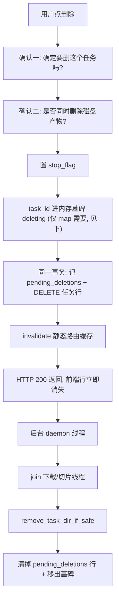

# 砍掉「取消任务」——任务生命周期简化

## 结论

任务只有两个动作：**暂停/继续**（停一下，等会儿接着下）和**删除**（不要了）。
`cancelled` 状态从代码里彻底消失，六态降为五态；任务行上的动作按钮从 7 个降为 5 个。

删除**任何状态**的任务都立即生效：DB 行当场消失、界面当场没有这一行，停线程和删产物在后台收尾。
用户不再需要「先取消一次才能删」。

## 背景：现在为什么复杂

任务行上同时可能出现 7 个按钮（`static/js/task_list.js:69-123`）：

| 按钮 | 图标 | 语义 |
|---|---|---|
| 开始 | ▶ | 启动 pending 任务 |
| 暂停 | ⏸ | 停下，可继续 |
| 恢复 | ▶ | 继续 |
| 取消 | **✕** | 停下，**不可**继续，记录和文件都留着 |
| 预览 | 👁 | 在地图上看 |
| 删除 | 🗑 | 删记录，产物二次确认 |
| 移除 | **✕** | **纯前端**抹掉失败行，后端任务不动，刷新就回来 |

三个具体问题：

1. **两个叉号语义完全不同。** 「取消」改后端，「移除」（`tasks.js:543-549`）只改前端，图标一模一样。
2. **删除按钮无条件渲染**（`task_list.js:108`，没有 `v-if`），运行中点它必定返回
   `Cannot delete running task. Please pause or cancel it first.`（`api.py:377/390`）——一个永远会失败的按钮。
3. **`cancelled` 是个没有价值的中间态。** 取消后任务停了、文件还在、记录还在，但不能恢复
   （`start_task` 只收 `pending`/`paused`）。它唯一的实际用途是给「删除」当前置步骤。

## 改造后

**状态五态**：`pending` / `running` / `paused` / `completed` / `failed`

**按钮五个**：开始 ▶ / 暂停 ⏸ / 恢复 ▶ / 预览 👁 / 删除 🗑

| 你想干什么 | 改造前 | 改造后 |
|---|---|---|
| 停一下，等会儿接着下 | 暂停 | 暂停 |
| 这个任务不要了（运行中） | 取消 → 删除（两步） | 删除 |
| 这个任务不要了（已停止） | 删除 | 删除 |
| 失败行别挡着我 | 移除（假删，刷新回来） | 删除（真删） |

## 决策记录

### D1：删除机制——内存墓碑，不引入 `deleting` 状态

四条管线**都有**一段 GDAL 同步阻塞区，中途完全打不断：

| 管线 | 不可打断段 | 位置 | 量级 |
|---|---|---|---|
| map | `stitch_tiles_with_gdal` 整段（BuildVRT→Warp→Translate） | `download_engine.py:925-1258` | 单 zoom mosaic，可达 GB |
| contour | BuildVRT + Warp + overviews，在**所有** stop_flag 检查点之前 | `contour_engine.py:686-715` | 注释自陈「大区域可能耗时数十秒」，产物可达数十 GB |
| DEM / local_terrain | `build_input_raster` 的多幅 DEM 物化 + 建金字塔 | `cesiumlab_terrain.py:451` → `:523/541/562` | 「6 幅 ASTER 约 92 MB，大任务可到 GB」 |

这三段都不能靠「让 GDAL 回调抛异常」打断——三处独立注释都实测记录过同一个坑：GDAL 把回调抛异常
当成用户中止，`Translate` 返回 None、`Warp` 失败、**产物被删**（`contour_engine.py:674-675`、
`cesiumlab_terrain.py:432-434`、`dem_task_manager.py:484-486`）。现有 GDAL 回调一律 `return 1`。

**因此「HTTP DELETE 里同步 join 线程」直接出局**：请求要挂几十秒到几十分钟，Flask worker 被占死，
用户重复点击还会 double-delete（第一个请求等线程时不能一直持 `_state_lock`，否则连列表查询都被阻塞）。

考虑过的三个方案：

| | 用户看到 | 为什么不选 |
|---|---|---|
| 同步等待 | 转圈几十分钟 | 上面三条硬伤 |
| `deleting` 状态 | 行变「删除中…」 | **砍一个状态又加一个，净收益为零**；还要写重启时的孤儿 `deleting` 恢复 |
| **内存墓碑（选中）** | 行**立即消失** | —— |

内存墓碑：`task_id` 进 manager 的 `self._deleting: set[int]`，DB 行当场删掉，后台 daemon 线程慢慢收尾。
后台收尾是实现细节，不该冒出来变成第六个状态。

### D2：产物删不掉时——记进待删清单，下次启动补删

新增 `pending_deletions` 表。**只有用户在第二步确认里选了「删除产物」时才记一行**（选「保留产物」
就完全不碰磁盘，也不进清单）。记清单与删任务行在**同一事务**里，后台线程删成功后再清掉清单行。
进程在中途被关掉时，下次启动由 `sweep_startup_residue` 走 `remove_task_dir_if_safe` 护栏补删。

### D3：失败任务统一为不可重试

现状口径不一致：`task_manager.py:420` 的 map 管线**接受** `failed`，dem（`:200`）和 contour（`:589`）
只接受 `pending`/`paused`，local_terrain 没有 `start_task`。而前端从来不给「重试」按钮——
map 的这个能力**没有任何入口能用到**，`tasks.js:540-542` 那句「三个 manager 都要求 pending/paused」
的注释对 map 是错的。

统一为四条都不可重试，删掉 map 的 `failed` 白名单，顺手修掉那句错注释。失败了就删掉重建。

## 前置改动：DEM 地形切片必须先能停

**这是方案成立的前提。** 现在 DEM 切片根本停不下来，而「删除自己会停任务」在切片中就是谎言。

好消息是整条链只差调用方：`TileParams.stop_flag` 字段已存在（`dem_task_tiler.py:55`）、
`tile_dem_task_dir` 已透传（`:136`）、`build_terrain` 已实现检查（`cesiumlab_terrain.py:1427` 串行每瓦片、
`:1446` 并行每 512 张批间）。缺的是 `dem_task_manager` 这**六**处：

1. `:376-381` 建线程时造 `stop_flag = threading.Event()`，锁内存进 `self.stop_flags[task_id]`，
   线程存进 `self.active_tasks[task_id]`（与 `start_task:211-214` 同形）
2. `:412` `_run_tiling_job` 签名加 `stop_flag`
3. `:507-509` `TileParams(..., stop_flag=stop_flag)`
4. `:522` 的 `if total > 0 and rendered == 0: raise` 要加 stop 豁免 —— 刚开始切就被停掉时
   `rendered` 本来就是 0，不豁免的话中途停会被误判成「一张瓦片都没切出来」的失败。
   范本逐字对照 `local_terrain_task_manager.py:482` 的
   `and not (stop_flag is not None and stop_flag.is_set())`
5. `:519-540` 收尾分支加 `if stop_flag.is_set(): return` —— **不写任何状态、也不 emit**。
   DEM 切片没有暂停语义，置位的唯一入口是删除，任务行此刻已经不在：`UPDATE` 是静默 no-op，
   `_emit_tiling_finished` 也没有行可更新。注释要写明这一点，否则下一个人会以为漏了状态迁移
6. `_run_tiling_job` 的 `finally` 清 `active_tasks` / `stop_flags`

`local_terrain_task_manager.py:492-502` 现在落 `status='cancelled'` 并
`_emit_tiling_finished(task_id, "cancelled")`，按同一条理由整段收敛成裸 `return`。

范本直接抄 `local_terrain_task_manager.py:375-379 / 469-476 / 492-502 / 545-549`——四条管线里
唯一端到端跑通「切片中途停」的实现。

**副作用（正面）**：切片线程登记进 `active_tasks` 后，`delete_task` 的 `is_alive()` 守卫对它终于有效
（`dem_task_manager.py:388-390` 的注释已经把这个坑写明白了）。`dem_terrain_jobs.status='running'`
那道守卫**仍要保留**——进程重启后的孤儿 job 恢复靠它（`:66-98`）。

### 两张登记表有并发重叠窗口，身份比较是唯一的兜底

切片线程和下载线程共用 `stop_flags` / `active_tasks`。**不要以为「切片只在下载 completed 之后
起，所以两者不会并存」** —— 它们会短暂并存，而且这正是两处清理都必须做身份比较的真正理由。

窗口是这么来的：`_execute` 先 `commit status='completed'`（`:917-918`），再 emit
`task_completed`（`:923`），下载线程要一路退回 `_run_task` 的 `finally`（`:714-719`）才把自己
从两张表里摘掉。`start_tiling` 的任何调用方（用户在详情弹窗点「开始切片」`history.js:515`、
`map.js:1900` 的 `startDemTaskTerrainTiling()`，或任何直接打这个端点的客户端）都可能落在这段
「行已是 completed、线程还登记着」的缝里：状态闸门放行，锁内那两行盖掉下载线程的登记。

两种抢锁顺序都是安全的，靠的都是身份比较：

- 下载线程先拿锁 → 它认出表里就是自己，正常摘干净；`start_tiling` 随后写入全新登记。
- `start_tiling` 先拿锁 → 它盖掉下载线程的登记；下载线程随后在 `:716/:718` 发现
  「表里的已经不是我」，一条都不命中，什么都不摸，切片的登记不会被误删。

**由此得出两条后续实现必须守住的约束：**

1. 两处 `finally`（`_run_task:714-719` 与 `_run_tiling_job` 的）里的身份比较**不能**简化成无
   条件 `pop`。看着像冗余防御，实际是这个窗口唯一的兜底。
2. **`delete_task` 不能假设「拿到 `task_completed` 事件时下载线程已经登出」。** 在这个窗口里
   `active_tasks[task_id]` 可能仍是那个还没退干净的下载线程，`is_alive()` 会是 True；也可能
   已经被切片线程顶替。`delete_task` 只能依赖「锁内读到什么就是什么」，不能依赖事件顺序去
   推断表里现在装的是谁。

## 删除流程

顺序上有两条不能调换：

- **先记 `pending_deletions` 再 `DELETE` 任务行，且同一事务。** 反过来的话，进程在两者之间崩掉就丢了产物线索。
- **`invalidate_output_path_cache` / `invalidate_dem_task` 必须在返回前同步调用**，不能丢给后台——
  否则已删任务的瓦片在缓存失效前仍能被 `/tiles` 访问到（`api.py:404`、`dem_api.py:97` 现有行为）。

两步确认沿用现状（`history.js:616` 与 `:622-627`），不合并成一步——第二步问的是磁盘产物，
那是用户真正需要决定的事。只改第一步的文案：任务处于 `running` 时补一句「任务正在运行，
将会停止并删除」，让用户知道这一下会打断正在跑的东西。

**停止延迟的诚实说明**：置位到线程真正退出，下载阶段是秒级（`dem_download_engine.py:262-264`
每 256KB 查一次，最坏受 `sock_read` 60s 上限约束；map 侧 `download_engine.py:578` 每次 HTTP 尝试前
查，最坏 30s），切片/渲染阶段则要等当前那段 GDAL 调用跑完（见 D1 的表）。这段延迟用户看不到——
行已经消失了——它只体现在「产物什么时候真的从磁盘上没了」。

### 内存墓碑的唯一用途（只有 map 需要）

**其余三条管线不加墓碑集合。** 不要为了对称加没用的字段——contour / DEM / local_terrain 运行期
对数据库只有 `UPDATE ... WHERE id=?`，SQLite 对不存在的行是静默 no-op，天然安全（证据见本节末尾）。
只有 map 有一处运行期 `INSERT`，那才是墓碑存在的理由：
`PRAGMA foreign_keys = ON` 对每条连接生效（`database.py:144`），而 map 下载线程在**失败瓦片**时会
`INSERT OR IGNORE INTO task_tiles`（`task_manager.py:1092-1096`，FK → `tasks(id)`，`database.py:434`）。

**SQLite 的 ON CONFLICT 算法不适用于外键约束**——`OR IGNORE` 不豁免 FK 违反。这一条是墓碑方案
存在的**唯一**理由，所以实测验证过（sqlite3 3.45.1，与本项目 Python 3.12 自带版本一致）：建
`tasks` + `task_tiles(FK → tasks(id) ON DELETE CASCADE)`、开 `PRAGMA foreign_keys = ON`、删掉父行后
`INSERT OR IGNORE` 与 `executemany` 批量插入**都抛** `IntegrityError: FOREIGN KEY constraint failed`；
同一脚本里 `UPDATE ... WHERE id=<不存在>` 不抛异常、`rowcount=0`——这正是其余三条管线不需要墓碑
的依据。父行删掉后：
异常从 `_write_progress_batch` 抛出 → `flush_progress_async` 的 `_restore_progress_batch(batch)`
把这批**退回队列**再 re-raise（`:1155-1157`）→ 被 `progress_callback` 的 `except Exception` 吞掉只记日志
（`:1252-1257`）。结果是每次 flush 刷一行错误日志，且 `pending_tile_inserts` 单调增长直到下载结束——
大任务上是几十万 tuple 的内存泄漏。

而且**只有失败瓦片才走 INSERT**，全成功的任务只走 no-op 的 UPDATE/DELETE——这是个「网络不好时才炸」的
间歇性问题，比稳定复现难发现得多。

修法：`_write_progress_batch` 写库前查墓碑集合，命中就整批丢弃。比「无脑捕获 `IntegrityError`」干净——
后者会把真正的外键 bug 一起吞掉。

另外三条管线运行期只有 `UPDATE ... WHERE id=?`（SQLite 对不存在的行是静默 no-op），emit 全部由
`cur.rowcount` 或 `if not row: return` 把关，行被删后不会崩：
contour `:735/938/981/1081/1098` + `:921-923/941/975/985/1040/1084/1101`；
DEM `:427/534/547/725/736` + `:748-756/792-794/838-841/864/870/887`；
local `:496/503/529` + `:664-669`。

### map 的删除守卫要下沉

四条管线里只有 map 把删除逻辑整段写在路由里（`api.py:340-420`），`TaskManager` 根本没有 `delete_task`。
墓碑集合必须住在 manager 里（`_write_progress_batch` 要查它），所以这次把 `api.py:364-395` 下沉成
`TaskManager.delete_task`，与其余三条对齐。这不是顺手重构——不下沉就得在路由里写第二套约定。

## 逐文件改动

### 后端

| 文件 | 改动 |
|---|---|
| `src/core/database.py` | 新增 `pending_deletions(id, path UNIQUE, created_at)` 表。**四张任务表的 status 是裸 TEXT、无 CHECK/枚举**（`:363/471/551/603`），不需要任何迁移 |
| `src/models/task.py` | `TaskStatus` 删 `CANCELLED = "cancelled"`（`:20`）；`:152` 六态注释、`:197-201` 白名单校验跟着改 |
| `src/services/task_manager.py` | 删 `cancel_task`（`:639-694`）；新增 `delete_task`（从路由下沉）+ `_deleting` 墓碑集合；`_write_progress_batch`（`:1093`）加墓碑短路；`_complete_task` 守卫 `:1576` 去掉 `'cancelled'`；失败兜底 `:1689` 的 `NOT IN` 去掉 `'cancelled'`；**D3 要改两处不是一处** —— 状态门 `:420` 与紧跟其后的 `UPDATE ... WHERE id=? AND status IN ('pending','paused','failed')`（`:432`）都要去掉 `'failed'`，只改前者会让状态门放行、UPDATE 却匹配不到行，抛出「could not be started because its status changed」这种驴唇不对马嘴的错 |
| `src/services/dem_task_manager.py` | 删 `cancel_task`（`:256-274`）；`delete_task` 改为「置 flag + 立即删」（**不加墓碑**）；切片 stop_flag 六处接线（见上）；收尾守卫 `:840`、失败兜底 `:883` 去掉 `'cancelled'` |
| `src/services/contour_task_manager.py` | 删 `cancel_task`（`:643-661`）；`delete_task` 同上（**不加墓碑**）；收尾守卫 `:922`、失败兜底 `:1109` 去掉 `'cancelled'` |
| `src/services/local_terrain_task_manager.py` | 删 `cancel_task`（`:571-600`，含 `:584` 那条只翻 pending 的 UPDATE 与「切片不可中断」的有意折中）；`delete_task` 改为「置 flag + 立即删」（**不加墓碑**）；`:492-502` 切片中途停的 `status='cancelled'` + `_emit_tiling_finished(..., "cancelled")` 整段按前置改动第 5 条收敛成裸 `return`。**顺带的改进**：这条管线此前 running 时既不能取消（`:593-597` 抛「切片不可中断」）也不能删除，改造后终于能删 |
| `src/services/task_cleanup.py` | `sweep_startup_residue` 新增第 7 类：读 `pending_deletions`，逐个走 `remove_task_dir_if_safe`，成功即清行 |
| `src/routes/api.py` | 删 `POST /api/tasks/<id>/cancel`（`:307-337`）；DELETE 端点改为调 `task_manager.delete_task`，去掉 `:377/390` 两句拒删文案；`:519-546` 的 `?status=` 过滤与 `:926-950` 的活动任务扫描确认不含 cancelled |
| `src/routes/dem_api.py` | 删 `POST /api/dem/tasks/<id>/cancel`（`:163-174`）；DELETE 端点（`:83-118`）去掉 `:112-115` 的 400 拒删分支 |
| `src/routes/contour_api.py` | 删 `POST /api/contour/tasks/<id>/cancel`（`:257-270`）；DELETE 同上 |
| `src/routes/local_terrain_api.py` | 删 `POST /api/terrain/local/tasks/<id>/cancel`（`:102-113`）；DELETE 同上 |

**⚠️ 不要碰 `src/services/download_engine.py` 里的 `'cancelled'`**——那是**瓦片级**结果状态
（`DownloadCancelled` 异常 `:104-110`，抛出 `:579/662`，捕获 `:791-798`，批量跳过 `:891`），
不是任务状态。`:902-905` 的注释说明「结果数 == 输入瓦片数」的语义依赖它。它恰恰是
「删除时先停任务」要复用的基础设施。

### 前端

| 文件 | 改动 |
|---|---|
| `static/js/task_list.js` | ROW_TEMPLATE 删「取消」按钮（`:92-99`）与「移除」按钮（`:115-122`）；删除按钮（`:108-114`）**保持无 `v-if`**——A 方案下它终于永远有效；`remove()` 方法保留，`act('cancelTask')` / `act('dismissTask')` 删掉 |
| `static/js/tasks.js` | 删 `cancelTask`（`:726-751`）与 `dismissTask`（`:543-549`）；`getStatusColor:561` / `getStatusText:573` 去掉 cancelled；活动集白名单 `:143-149` 与 `:116/144/539/689` 的注释复核 |
| `static/js/history.js` | `getStatusColor:300-309` / `getStatusStroke:340-350` / `getStatusText:360-371` 去掉 cancelled；`deleteTask:615-674` 不变（已经在调 `closeFailureToast:646` 和 `TaskStore.remove:656`，正好覆盖原「移除」的两件事） |
| `templates/_history_content.html` | 状态筛选 chip 删 `data-status="cancelled"`（`:69`），五枚变四枚 |
| `static/css/style.css` | 删 `status-cancelled` 相关规则 |
| `src/i18n/catalog/js_tasks.py` | 删 `js.tasks.confirm.cancel_title` / `cancel_message`（`:188-195`）、`js.tasks.status.cancelled` |
| `src/i18n/catalog/js_history.py` | 删 `js.history.action.cancel`（`:93`）、`dismiss_title`（`:105`）、`dismiss_label`（`:109`） |
| `src/i18n/catalog/tpl_history.py` | 删 `tpl.history.filter.cancelled`（`:68`） |

i18n 中英两份都要删干净——`tests/test_i18n.py` 强制两个 locale 齐全。

### 文档

| 文件 | 改动 |
|---|---|
| `README.md` | `:39` 功能列表去掉「取消」；`:224/235/245/257` 四条 cancel API 删掉；`:236/258` 的「running 任务需先暂停或取消」改掉；`:310` 的任务取消约定重写 |
| `CLAUDE.md` | `:89` 的 cancel/pause 描述、`:95` 的「Cancel never rewrites terminal states」整条约定重写；`:126` 提到 cancelled 任务保留镜像目录的那句要改 |
| `RELEASE_NOTES.md` | 这是**破坏性变更**（四条公开 API 端点消失），要单开一节说清楚 |

## 测试影响

三个契约测试会大面积打红，它们把状态集合与按钮矩阵当作契约钉死：

| 文件 | 受影响断言 |
|---|---|
| `tests/test_tasks_js_contract.py` | `_ACTION_GUARDS:446-452`、`test_card_actions_are_gated_by_the_right_status:457-492`、`test_dismiss_is_purely_local:495-509`、`test_failure_toasts_are_deduped:512-544`（`:541` 断言 dismissTask 调 closeFailureToast）、`test_dismiss_removes_the_row_purely_on_the_frontend:1630-1644`、六态表断言 `:944-988 / 1140-1180 / 1187+` |
| `tests/test_css_contract.py` | `_STATUS_SEMANTIC_TOKEN:5570-5577`、`test_status_badge_color_matches_the_semantic_token:5595-5640`、`test_task_row_status_dot_covers_every_status:5643-5700`、`_status_color_names` 六档断言 `:5439-5443` 与 `:1713-1718` |
| `tests/test_records_panel_structure.py` | `EXPECTED_CHIP_STATUSES:41` 含 `'cancelled'`、`test_status_filter_chips_render_on_both_pages:95-111` |

另有 `test_task_lifecycle_state.py` 等 11 个文件断言了 cancelled 行为，逐个改。

### 新增测试

| 契约 | 用例 |
|---|---|
| 运行中删除立即返回 | 下载线程还活着时 DELETE 返回 200，任务行当场查不到 |
| 墓碑挡住外键炸弹 | map 任务删除后，下载线程再报失败瓦片，`task_tiles` 不插入、不抛 `IntegrityError`、`pending_tile_inserts` 不增长 |
| 产物延后删除 | 选了删产物时 `pending_deletions` 先落行，后台删成功后行消失 |
| 启动补删 | 造一条 `pending_deletions` + 一个真实目录，`sweep_startup_residue` 后目录没了、行也没了 |
| 护栏仍然生效 | `pending_deletions` 里放一条越界路径（符号链接分量 / 深度不足两级），补删被拒、目录仍在 |
| DEM 切片能停 | 置 stop_flag 后 `tile_dem_task_dir` 在批间退出，job 不落 `completed`、不 emit |
| 切片刚开始就被停 | `rendered == 0` 且 stop_flag 置位时**不得**抛「produced no tiles」判 failed（`dem_task_manager.py:522` 的豁免） |
| cancelled 彻底消失 | 全库 grep：`src/` 与 `static/` 下除 `download_engine.py` 的瓦片级用法外，无任何 `'cancelled'` 字面量 |

## 不做

- **不加「重试」按钮**（D3 已定：失败就删掉重建）
- **不动暂停/恢复**的现有语义
- **不改 GDAL 阻塞段的可中断性**。让回调 `return 0` 表达中止是可行的，但会留下半截产物且四处回调都要改——
  本次靠「后台等 + 待删清单」绕开，不动它
- **不给 `deleting` 状态留后门**。如果将来真的需要向用户暴露「正在收尾」，那是另一个设计

## 实现顺序

1. **DEM 切片 stop_flag 接线**（前置，独立可验证，不改变任何用户可见行为）
2. **`pending_deletions` 表 + 启动补删**（独立可验证）
3. **`TaskManager.delete_task` 下沉 + 四条管线的墓碑式删除**
4. **删 `cancel_task` 与四条 `/cancel` 路由 + 三处状态守卫语义重推导**
5. **前端按钮与状态词表**
6. **测试 + 文档**

前两步不改变任何用户可见行为，可以先落地验证。第 4 步之前，`cancelled` 仍然存在——
这样每一步都能单独跑通全量测试。

## 计划 A 执行完毕 —— 留给计划 B 的输入

第 1、2 步已作为独立分支 `dem-stop-flag` 落地并合入（计划文档：
`docs/superpowers/plans/2026-08-07-deletion-prerequisites.md`）。执行中挖出四件计划 B
必须知道的事，写在这里是因为 SDD 台账是 git-ignored 的，随工作区一起销毁。

### 1. 计划 B 必须处理：完成事件早于登记摘除

`_emit_tiling_finished` 在 `finally` 摘 `active_tasks` **之前**发出。收到完成事件后立刻发起的
`DELETE` 会撞上 `is_alive()` 守卫拿 400。窗口是微秒级、远小于一次 HTTP RTT，而且
`_run_task` 是完全相同的形状（先 emit 后摘）——所以计划 A 没有改它，改成先摘后 emit 反而
制造第二套约定。但 `delete_task` 正是这条链的目的地，计划 B 重写它时必须正面处理。

### 2. 计划 B 必须处理：非绝对路径的根治不在补删这一侧

`remove_task_dir_if_safe` 对非绝对路径以**进程 cwd** 为基准解析（它内部用 `absolute()`）。
冻结 exe 的 cwd 是用户双击时所在的任意目录。实测 `''` 与 `'.'` 会让护栏返回 `True` 并把
整个 cwd rmtree 掉。

计划 A 已在补删侧加了「非绝对路径不进护栏，直接清行丢弃」的拦截，但那是**纵深防御的最后
一道**。根治在写入侧：`delete_task` 往 `pending_deletions` 入队**之前**就必须保证绝对路径、
并过一次护栏判断。计划 B 合入的瞬间这个洞就带电（在那之前没有生产写入方）。

### 3. 计划 B 落地时顺手正过来的三条

- 切片期间 `delete_task` 的错误文案现在是「Please pause or cancel it first.」——对 `completed`
  状态的任务而言那是坏建议（两个操作都必然 400）。守卫命中顺序因 Task 1 登记切片线程而改变；
  用户看不到（前端丢弃后端 `error` 字符串，统一显示「删除失败」），但直连 API 的人会被误导。
  计划 B 重写这三道守卫时一并修正。
- `task_cleanup.py` 的 `_sweep_pending_deletions` docstring 对返回值的口径不准：`removed` 只在
  「护栏放行且目录确已不在」时 +1，而越界与非绝对路径**也会清行销账却不计数**。
- `dem_task_manager.py` 注释里引的按钮文案「开始切片」与 UI 不符，实际是
  `tpl.base.detail.terrain_start` = 「启动」。

### 4. 一条全仓级别的建议（该进计划 B 的 Global Constraints）

**注释里引符号名，不要引行号。** 计划 A 有整整一轮修复是白跑的：一个只交付「注释准确性」的
提交，被它自己插入的 10 行把注释里的四组行号引用整体推移后全部作废。行号在任何插入行的提交
之后都会重新腐烂。若要保留行号，改完必须按**最终文件**机检一遍再落笔。

### 5. 已知的测试债（不阻塞，但计划 B 会碰到这些文件）

- `tests/test_fix_dem_tiling_stoppable.py:107-110` 与 `:144-147` 两个用例在「线程压根没跑起来」
  时会假绿：job 行被 `start_tiling` 写成 `running`，线程若在进入 `_run_tiling_job` 前就死掉，
  断言依然满足。补法是 join 后加 `assert task_id not in mgr.active_tasks`（顺带证明 finally
  执行过）。同文件用例 1 用 Event 握手做了确定性兜底，所以只是债不是洞。
- `dem_task_manager.py` 的 `finally` 拿 `_state_lock` 当「两张登记表存在」的哨兵，成立只因
  `__init__` 的赋值顺序恰好是 `active_tasks` → `stop_flags` → `_state_lock`。
