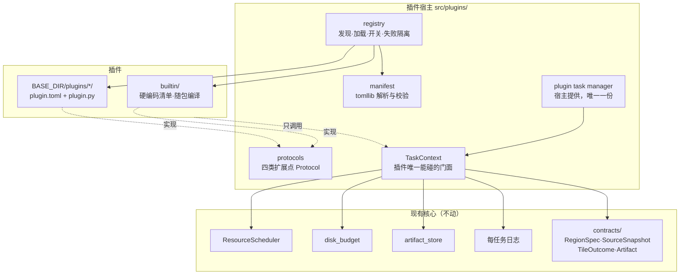

# 插件系统设计规格

> **记录时间**：2026-08-12 ｜ **状态**：**待实施**（设计已定稿，尚未动工）
> **上游依据**：`docs/notes/external-projects-takeaways.md` §13-4（2026-08-11 已决：新数据类型一律保持可选插件；插件契约五条）——本规格是对那份契约的**实现定稿**，并把交付形态从纯 in-tree 扩展为「in-tree + 外部加载」两条腿（产品层 2026-08-12 拍板）。
> **首发插件**：天地图源（数据源）/ MVT 下载（管线）/ GeoPackage 导出（导出器）/ 产物元数据 sidecar（钩子），四类扩展点各一个。

## 1. 背景：为什么现在做、依据什么做

§13-4 已决「新数据类型一律保持可选插件」，并写死了五条插件契约（`docs/notes/external-projects-takeaways.md:520-525`）：

1. 插件 = 一个领域 manager + 一个 Flask blueprint，在组合根注册，**缺省关闭**，由配置开关启用；
2. 必须复用 `RegionSpec`、`SourceSnapshot`、`ResourceScheduler`、`TileOutcome`、每任务日志与 `Artifact`——**不允许自带任务表、自带并发、自带缓存目录**；
3. 禁止为插件修改核心分支逻辑：核心只认合同，不认具体数据源；
4. 插件关闭或缺席时，历史、任务中心与缓存治理必须仍然自洽，包括该插件旧任务的显示与清理；
5. 阶段 4 状态：**一行未写**（`docs/notes/external-projects-takeaways.md:416-419`）。

2026-08-12 对话中产品层追加拍板三项：

| # | 决定 | 后果 |
|---|------|------|
| A | 做**通用插件框架**，四类扩展点都开：数据源 / 数据管线 / 输出格式与后处理 / 生命周期钩子 | 一次设计穿透全部四道硬编码闸门（蓝图、配置键、i18n、前端加载顺序），但每类扩展点**必须**有一个真实首发插件把协议逼出来 |
| B | **两条腿**：官方插件 in-tree 随版本编译；第三方插件放 exe 旁 `plugins/` 目录外部加载；两者实现同一组 Protocol，宿主不区分 | 多一个加载器，不多一套抽象 |
| C | 协议**宿主先行**：从「新插件真正需要什么」定义，不从现有四条管线归纳；四条现有管线（7348 行在跑代码）不动 | 零回归风险；代价是一段时间内插件管线与核心管线是两套机制 |

**为什么不是「先抽协议、重构四条管线」**：四条管线没有任何公共基类、ABC 或 Protocol（`TaskManager` `src/services/task_manager.py:110`、`DemTaskManager` `dem_task_manager.py:79`、`LocalTerrainTaskManager` `local_terrain_task_manager.py:90`、`ContourTaskManager` `contour_task_manager.py:348` 全是裸声明），且语义本来就不齐——`local_terrain` 没有 start/pause/resume，map 独有 refill/accept_gaps。从它们归纳只会得到最小公分母，而且要先动全部在跑代码。重构收益为零、风险为正。

**`src/contracts/` 的现状**（`CLAUDE.md`「Shared contracts」节）：六个文件只冻结**数据形状**（RegionSpec、SourceSnapshot、Artifact、TileOutcome+TaskState、ResourceReservation、瓦片枚举），**没有任何行为协议**。插件契约要求「复用全部核心合同」，本规格把缺的那一半（行为协议）补在 `src/plugins/protocols.py`，**不**进 `src/contracts/`——contracts 的不变量是「零 Flask、零 GDAL、零 SQLite import，测试与估算器可以脱离 app 使用」，行为协议恰恰要依赖这三者。

## 2. 技术可行性：外部加载的实测结论

Nuitka `--standalone`（`nuitka_build.py:418`）产物能否运行时加载未参与编译的 `.py`？**实测：能**，且比预期宽松一档。证据全部来自 Nuitka 源码 + 本机实测（librarian 验证，2026-08-12）：

1. **PathFinder 被保留。** `nuitka/build/static_src/MetaPathBasedLoader.c:2620-2630` 把自有 loader 插到 `sys.meta_path` 索引 **2**（Builtin/Frozen 之后、PathFinder 之前），PathFinder 被顺推保留；表里查不到的模块走 `:2077-2084` 的 "denied responsibility" 交还标准机制。实测外部 `import extplugin` 成功，`__loader__` 为 `SourceFileLoader`。
2. **外部插件可以反向 import 已编译的核心模块**（如 `src.contracts.region`），实测返回 `compiled_function`、`__loader__` 为 `nuitka_module_loader`。
3. **`sys.path` 运行时追加有效。** `MainProgram.c:1244-1258` 把 `module_search_paths` 硬设为仅二进制目录，但 `:1849-1854` 的清空仅在 `--python-flag=isolated` 下生效，本项目未用。实测 `sys.path.append` 后连含 `.so` 的 `PIL._imaging` 都能导入。
4. **但 dist 里没有 pip、没有 site-packages，`sys.executable` 就是 app 本体**（`src/core/process_entry.py:43-50` 拦截 `-c`）。所以依赖规则是：**插件自己 vendor 依赖进自己目录；纯 Python 依赖无限制；带二进制扩展的必须匹配 CPython 3.12 + 目标平台 ABI**。

**先例对齐**：i18n catalog 刻意不用 `pkgutil` 自动发现（`src/i18n/catalog/__init__.py:4-5`，原因：Nuitka 静态分析扫不到动态 import）。本设计照搬——in-tree 插件清单是**硬编码名单**，外部插件走文件系统扫描（不经过 import 系统，Nuitka 无所谓）。

**目录先例**：`Config.BASE_DIR` 打包态解析为 exe 所在目录（`src/core/config.py:56-57`），`data/`、`cache/`、`assets/terrain`（`src/services/terrain_tiling/base_terrain.py:72-91` 运行期解压 224 MB）都已在 exe 旁运行期读写。`plugins/` 是同一个位置。

## 3. 架构总览



**支点是 `TaskContext`。** §13-4 契约第 2 条（复用核心合同、不许自带任务表/并发/缓存目录）如果只靠文档约束，第一个第三方插件就会违反。让插件**只能**拿到 `TaskContext`、拿不到任何 manager，这条要求就从纪律变成物理约束。

## 4. 模块清单（宿主侧新增）

全部新代码在 `src/plugins/` 下，一个不碰现有文件的原则例外见 §10：

| 模块 | 职责 |
|---|---|
| `src/plugins/protocols.py` | 四类扩展点的 `Protocol` 定义 + `TaskContext` / `ExportContext` / `TaskEvent` 数据类 |
| `src/plugins/manifest.py` | `plugin.toml` 解析与校验（`tomllib`，标准库） |
| `src/plugins/registry.py` | 发现、加载、启停、失败隔离、API 版本闸 |
| `src/plugins/params.py` | `ParamSpec` / `ParamSchema` / 校验器（前后端同一份 schema，后端权威） |
| `src/plugins/task_manager.py` | 宿主提供的**唯一一份**插件任务管理器：生命周期、调度接入、进度广播 |
| `src/plugins/task_context.py` | `TaskContext` 实现（对核心服务的 facade） |
| `src/plugins/i18n.py` | 插件文案目录运行时合并 |
| `src/plugins/builtin/__init__.py` | in-tree 插件**硬编码清单**（对齐 i18n catalog 先例） |
| `src/plugins/builtin/<四个首发插件>/` | 见 §12 |
| `src/routes/plugins_api.py` | 新蓝图：列表/启用/禁用/配置/上传禁用提示 |
| `templates/_plugins_content.html` + `static/js/plugins.js` | 管理页（右侧滑出面板，复用 `panels.js` 面板机制） |

`src/app_factory.py` 的 Nuitka 可达性清单（`:27-40`）按既有规矩为每个 in-tree 插件加一行。

## 5. `TaskContext`：插件唯一的门面

```python
@dataclass(frozen=True)
class TaskContext:
    task_id: int
    region: RegionSpec            # 已校验，含反经线处理
    params: Mapping[str, Any]     # 已过 schema 校验
    output_dir: Path              # 宿主预创建：DOWNLOADS_DIR/plugins/<plugin_id>/task_<id>/
    cache_dir: Callable[[str], Path]   # 命名空间缓存子目录，归 cache 治理管
    stop_requested: Callable[[], bool]
    progress: Callable[[int, int, str], None]   # done,total,phase；宿主节流后经 socketio 广播
    log: Callable[[str, str], None]             # 每任务日志（tlog 同款）
    reserve: Callable[[ResourceKind, int], ResourceReservation | None]  # None = 等，不是失败
    http: aiohttp.ClientSession                        # 已挂代理、UA、超时、url_guard SSRF 闸
    record_tile_outcome: Callable[[int, int, int, TileOutcome], None]   # z,x,y,outcome
    register_artifact: Callable[[Path, ArtifactKind, bool], None]       # path,kind,has_gaps
```

设计要点：

- **`record_tile_outcome` 是白送的价值**。插件按 `TileOutcome` 记账后，`no_data` 与真实失败的区分、`completed_with_gaps`、`pending_decision`、补漏、产物永久缺块标记——§13-3 整套语义免费继承，插件一行不用写。
- **`http` 必须从 context 拿**：代理配置（`proxy_url` / `proxy_auto_detect`）、UA、`url_guard` 的 SSRF 闸（`src/services/url_guard.py`，§8.1-3/4 降级后保留的廉价防护）全部继承。插件自己 `aiohttp.ClientSession()` 等于绕过这三样。
- **`reserve` 返回 `None` 是「等」不是「失败」**——与 `ResourceScheduler` 语义一致（`src/services/resource_scheduler.py`，`get_scheduler().reserve` 的合同）。
- **`stop_requested` 轮询**：对齐现有管线（删除即取消，`stop_flags` 置位，无 cancel 语义，`CLAUDE.md`「Task lifecycle」节）。

## 6. 四类扩展点协议

```python
class SourceProvider(Protocol):
    def list_sources(self) -> Sequence[SourceDescriptor]: ...
    def snapshot(self, source_id: str, cfg: Mapping[str, str]) -> SourceSnapshot: ...
    def authorize(self, headers: MutableMapping[str, str], cfg: Mapping[str, str]) -> None: ...

class PipelinePlugin(Protocol):
    def params_schema(self) -> ParamSchema: ...
    def estimate(self, params: Mapping[str, Any], region: RegionSpec) -> DiskEstimate: ...
    def run(self, ctx: TaskContext) -> PluginOutcome: ...

class Exporter(Protocol):
    def format_id(self) -> str: ...
    def accepts(self, kind: ArtifactKind) -> bool: ...
    def export(self, artifact: Artifact, dest: Path, ctx: ExportContext) -> Artifact: ...

class TaskHook(Protocol):
    def on_event(self, event: TaskEvent) -> None: ...   # 旁路：抛异常只记日志，不影响任务
```

**数据源优先走数据，代码是逃生口。** 绝大多数新瓦片源只是「URL 模板 + 子域 + 最大层级 + attribution」，manifest 里一段 TOML 就够，不需要 `plugin.py`：

```toml
# plugin.toml 片段：纯数据型数据源，零代码
[[sources]]
id = "tianditu-img"
name = "天地图影像"
url_template = "https://t{s}.tianditu.gov.cn/img_w/wmts?...&x={x}&y={y}&z={z}"
subdomains = ["0","1","2","3"]
max_zoom = 18
attribution = "天地图"
auth = { kind = "query_token", credential_key = "tianditu_token" }
```

只有需要特殊鉴权拼接（Ion token 换 endpoint 这类）才实现 `SourceProvider`。现有地基已备好：`SourceSnapshot` 已有 `subdomains` / `header_names` / `credential_reference` / `attribution` 字段（`src/contracts/source.py:98-108`）但无持久化入口；`source_wizard.snapshot_from_wizard`（`src/services/source_wizard.py:573`）已写好、零调用者。本设计补上缺的那块：插件源注册进宿主 source registry，经 SourceSnapshot 指纹进缓存命名空间（`source_registry.tile_cache_path`，缓存契约不动）。

**导出器走注册表，不走 if/elif。** 现状：`output_format` 分发散在 `task_manager.py:2672` 与 `:2874` 两处 `in [列表]`，MBTiles 走 `artifact_export.py:48` 的 `_PIPELINE_TILE_LAYOUT` 查找表（其注释明写这是「§13-4 插件契约允许的形态」），`_EXPORT_FORMATS=('mbtiles',)`（`src/routes/api.py:1844`）。插件 `Exporter` 注册进同一张表——查找表加行是契约允许的形态，散落的 `if pipeline == ...` 不是。

**钩子是旁路。** `on_event` 抛异常只记日志，绝不影响任务状态流转。事件源：插件任务管理器（首发）+ 后续把四条核心管线的状态迁移点接上来（现状是 `socketio.emit` 散在各 manager，无统一事件源，见 §14 开放问题）。

## 7. 插件任务存储：宿主一张表，不是每个插件一张

```sql
CREATE TABLE IF NOT EXISTS plugin_tasks (
    id INTEGER PRIMARY KEY AUTOINCREMENT,
    plugin_id TEXT NOT NULL,
    name TEXT DEFAULT '',
    status TEXT NOT NULL DEFAULT 'pending',   -- contracts.outcome.TaskState 取值
    region_json TEXT DEFAULT '',
    params_json TEXT DEFAULT '{}',
    output_path TEXT DEFAULT '',
    gap_tiles INTEGER DEFAULT 0,
    gap_decision TEXT DEFAULT '',
    error_message TEXT DEFAULT '',
    created_at TIMESTAMP DEFAULT CURRENT_TIMESTAMP,
    started_at TIMESTAMP,
    completed_at TIMESTAMP
);
```

- **§13-4 契约第 2 条的落法**：插件不许自带任务表——宿主给一张通用的。`plugin_id` 区分来源。
- `src/routes/api.py:619-694` 的四段 `UNION ALL` 变五段（`task_type` 列输出 `plugin:<plugin_id>`），插件任务自动出现在统一任务中心与 `/history`。
- **§13-4 契约第 4 条的落法**：插件被删除或禁用后，`plugin_tasks` 行、状态、`plugin_id` 都在，UI 显示「插件 X（未安装）」，允许删除与清理产物（走 `src/services/task_deletion.py:322` `delete_task_row` 同款约定）。历史不会因为少了一个插件出现空洞。
- **产物登记零迁移**：`artifacts.pipeline` 是裸 `TEXT NOT NULL`，无 CHECK 约束、无外键（`src/core/database.py:1083-1099`），`record_artifact`（`src/services/artifact_store.py:70`）不校验取值。插件任务登记 `pipeline = 'plugin:<id>'` 即可。「产物行必须比任务行活得久」「`INSERT OR REPLACE` 幂等」两条硬约定（`artifact_store.py:1-16`）自动继承。

## 8. 声明式参数与 UI 逃生口

```python
@dataclass(frozen=True)
class ParamSpec:
    key: str
    type: str            # region | zoom_range | path | int | float | str | bool | enum | credential
    label_key: str       # i18n key
    default: Any = None
    required: bool = True
    min: float | None = None
    max: float | None = None
    choices: Sequence[str] = ()
    depends_on: Mapping[str, Any] = field(default_factory=dict)
```

- 宿主**一个渲染器**吃 schema 出表单，复用 `templates/_macros.html` 控件与 `--color-*` token；校验两端跑同一份 schema，后端权威。
- 任务出现在统一任务中心，进度事件进 `task_center.js` 现有监听（全广播模式，无 room/namespace——与核心管线一致）。
- **自定义资产逃生口**：manifest 写 `[ui] assets = ["panel.js", "panel.css"]`。四条约束：资产必须在插件目录内（离线不变量，`CLAUDE.md`「Offline invariant」）；只在插件启用时注入；固定排在核心脚本之后；由宿主在服务端渲染时生成 `<script>`/`<link>` 标签，**不进** `templates/base.html:256-341` 的硬编码清单。挂载点是插件自己的面板容器，全局作用域污染由插件作者自负（`window.*` 命名空间前缀 `TFPlugin_<id>` 约定）。
- 面板注册走 `static/js/panels.js:24` `PANELS` 同款机制，宿主为每个带 UI 的插件在服务端渲染期生成注册项——不改成运行时 JS 动态注册，因为那要动 `panels.js` 的契约测试。

## 9. 配置与开关：不碰 `DEFAULT_CONFIGS`

新建 `plugins` 表：

```sql
CREATE TABLE IF NOT EXISTS plugins (
    id TEXT PRIMARY KEY,              -- manifest 里的插件 id
    enabled INTEGER NOT NULL DEFAULT 0,   -- 缺省关闭（§13-4 契约第 1 条）
    version TEXT DEFAULT '',
    origin TEXT DEFAULT 'external',   -- builtin | external
    config_json TEXT DEFAULT '{}',
    load_error TEXT DEFAULT '',
    installed_at TIMESTAMP DEFAULT CURRENT_TIMESTAMP
);
```

插件配置走 `PUT /api/plugins/<id>/config`，用插件自己的 schema 校验。

**为什么不让插件往 `DEFAULT_CONFIGS` 塞键**：`src/routes/api.py:904-916` 的 `known_keys` 闸门是保护核心配置键的（未知键静默写入会读不到——注释原话「用户以为设置生效了」）。撑破这道闸等于取消保护，而且会让 `reset_to_defaults`（`config_manager.py:583`，DELETE + 重播 `DEFAULT_CONFIGS`）的语义变得不可预测。插件配置有自己的表，各管各的。

## 10. 发现与加载

- **in-tree**：`src/plugins/builtin/__init__.py` 硬编码清单，理由与 `src/i18n/catalog/__init__.py:13-40` 逐字相同。同时在 `src/app_factory.py:27-40` 可达性清单登记，在 `nuitka_build.py:43-52` 的 `APP_DATA_SENTINELS` 登记随包数据。
- **external**：扫 `Config.BASE_DIR/plugins/*/plugin.toml`；`importlib.util.spec_from_file_location` 载入 `plugin.py`；存在 `vendor/` 子目录就 `sys.path.insert(0, ...)`。
- **ABI 闸**：manifest 声明 `requires_abi = "cp312-linux-x86_64"`（仅带二进制 vendor 时需要），不匹配拒载并报明确原因——否则用户拿到的是一段看不懂的 `ImportError`。
- **API 版本闸**：宿主导出 `PLUGIN_API_VERSION = "1.0"`；manifest 必填 `api_version = "1"`；major 不匹配拒载，UI 显示「该插件需要更新 / 应用需要更新」。第三方插件在宿主升级后**明确坏掉**，而不是静默行为错乱。
- **失败隔离**：任一插件 import/实例化抛异常 → 写 `plugins.load_error`，UI 红条显示原因，宿主与其他插件不受影响。
- **加载顺序**：`_build_task_managers` 之后、`_register_blueprints` 期间，由 `src/routes/plugins_api.py` 蓝图统一挂载各插件路由（插件路由前缀强制 `/api/plugins/<id>/...`，蓝图对象由宿主构造后挂到 Flask——插件不直接拿 Flask app，理由同 §5：拿不到，就没法绕过调度器）。

## 11. 错误处理与隔离

| 故障点 | 行为 |
|---|---|
| manifest 解析失败 | 拒载，`load_error` 记原因，UI 红条 |
| import 抛异常 | 同上；`traceback` 进主日志 |
| 任务运行期抛异常 | 该任务 `failed` + `error_message`；reservation 经 `with` 归还（`contracts/reservation.py` 上下文管理器约定）；其他任务不受影响 |
| 插件拖垮进程（死循环、内存爆炸） | **不防护**。与核心代码同权是两条已决（§13-5 可信部署 + 本规格 §13 无沙箱）的直接推论 |
| 插件任务运行中应用重启 | 孤儿恢复走 `plugin_tasks.status='running'` 启动扫描，与现有 `_recover_orphan_running_tasks` 同款语义：无法续跑的插件管线判 `failed`，可续跑的由插件 `run` 自身从 `record_tile_outcome` 记账断点续传 |

## 12. 首发插件（四类各一个）

| 插件 | 扩展点 | 为什么是它 |
|---|---|---|
| **天地图源** | 数据源 | 验证 `credential_reference`（token 存 `plugins.config_json`）与子域轮换——`SourceSnapshot` 的字段第一次被真正消费。国内用户真实需求。零代码路径（TOML）+ 一条 `authorize` 逃生口同时被验证。 |
| **MVT 下载** | 管线 | §7.2 边界已写定：自定义 PBF/MVT URL、TileJSON 探测、PBF 目录与 MBTiles、图层发现与预览；**不承诺** Mapbox Style、字体/sprite 抓取、解码导出完整矢量数据集。产物直接落 MBTiles 矢量路径（`metadata.format=pbf`，§13-2 容器已预留），不另造容器。`aiohttp` 已在产物里，零新依赖。 |
| **GeoPackage 栅格导出** | 导出器 | GDAL 已在产物里；走 `ogr`/`gdal.Translate` 无新依赖。验证 `accepts(ArtifactKind)` 过滤与 `ExportContext` 进度回调。 |
| **产物元数据 sidecar** | 钩子 | 任务完成后在产物旁写 `<artifact>.tfmeta.json`（四至、层级、源指纹、`has_gaps`、生成时间）。零依赖，验证「钩子异常不影响任务」。 |

**Wayback 推迟到第二批**：§13 末尾把「Wayback 对 Esri 外部服务与其 ToS 的依赖是否接受」明确列为未决（`docs/notes/external-projects-takeaways.md:529`）。首版不该卡在一个产品决定上；等它拍板后按 §7.1 清单（release/capture date 区分、元数据扫描可中断可缓存有限流、版本时间轴 UI 验证自定义资产逃生口）单独立项。

## 13. 安全立场

§13-5 已决只面向可信本机/LAN。外部插件 = 任意代码执行，与用户自己跑一个 Python 脚本等价。

- **不做沙箱**：Python 沙箱是伪命题，做一个假的比不做更坏。
- 实做三件：缺省关闭且启用需显式操作；UI 明写「插件以完整权限运行」；manifest `permissions` 字段（`network` / `filesystem` / `subprocess`）**仅作知情展示，不做强制**。
- 插件 HTTP 走 `ctx.http`，继承 `url_guard` SSRF 闸。
- 不做签名、不做插件市场（离线不变量 + §13-6 已决暂不做安装器与自动更新）。

## 14. 非目标

- 不做插件市场 / 在线安装 / 自动更新；
- 不做沙箱 / 签名 / 权限强制；
- **不重构现有四条管线**（决定 C）；
- 不做插件间依赖；
- 不做热重载（改了插件重启应用）；
- 首版钩子事件源只接插件任务管理器；把四条核心管线的状态迁移点统一成事件源（现状：`socketio.emit` 散在四个 manager，无集中定义处）是**后续独立工作**，不进本规格范围——否则「顺手统一核心事件」会把首版拖进决定 C 明确避开的重构区。

## 15. 验收标准

1. 四个首发插件端到端跑通，产物落盘且登记进 `artifacts`（`pipeline='plugin:<id>'`）；
2. 关掉全部插件 → 系统行为与今天逐字一致（由现有测试套件 + 新增「全插件关闭」契约测试守着）；
3. 删掉某插件目录 → 其历史任务仍能显示、能删、能清产物；
4. 一个 import 期故意抛异常的插件 → 宿主正常启动、其他插件正常、UI 显示失败原因；
5. Nuitka 打包产物里 in-tree 插件可用，external 插件可从 exe 旁 `plugins/` 加载（含一个带纯 Python vendor 依赖的冒烟用例）；
6. `api_version` major 不匹配的插件被拒载且原因可见。

## 16. 风险与开放问题

| # | 风险 / 开放问题 | 处置 |
|---|---|---|
| 1 | 插件任务进 `task_center.js` 需要前端认识 `plugin:<id>` 这个 `task_type`（现有五值含 `dem_terrain` socket 载荷与四值 UNION ALL 并存） | 实施期在 `tasks.js` / `task_list.js` 加通配分支，契约测试钉住 |
| 2 | i18n：插件文案自带 `i18n.toml`（`plugin.<id>.*` 前缀），宿主运行时合并进 `window.__I18N__`；主 catalog 的双向钉死测试（`tests/test_i18n.py:280,301`）只扫 src/，不受影响；in-tree 插件同样自带文案文件，不进 `src/i18n/catalog/` | 合并期校验前缀，冲突拒载 |
| 3 | `plugins.enabled` 默认值在新老库上的播种语义（升级库 vs 新建库） | 实施期在 `init_database()` 的幂等迁移区处理，与 `user_version` 机制对齐 |
| 4 | MVT 插件的 TileJSON 探测要过 `url_guard`——用户自填 URL 正是 §13-5 里那个「用户自己粘贴的 URL」威胁模型的本体 | 强制走 `ctx.http`，不得绕过 |
| 5 | 外部插件作者在源码运行模式（有完整 uv/pip）开发，到打包环境缺库——两种环境的可见依赖集不同 | 文档写明「以打包产物为验收环境」；宿主启动时把可用模块清单写进日志便于排查 |
